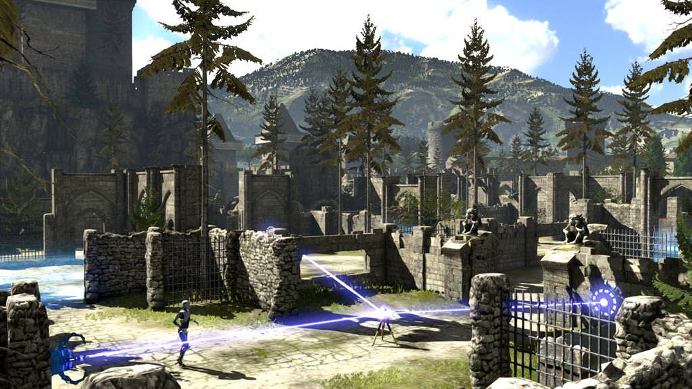
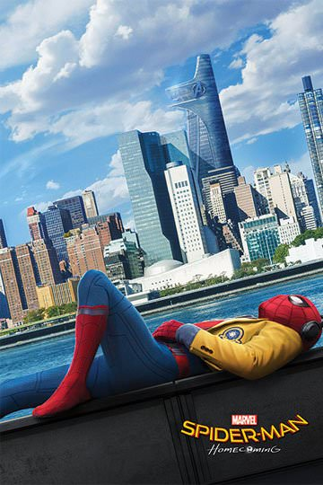
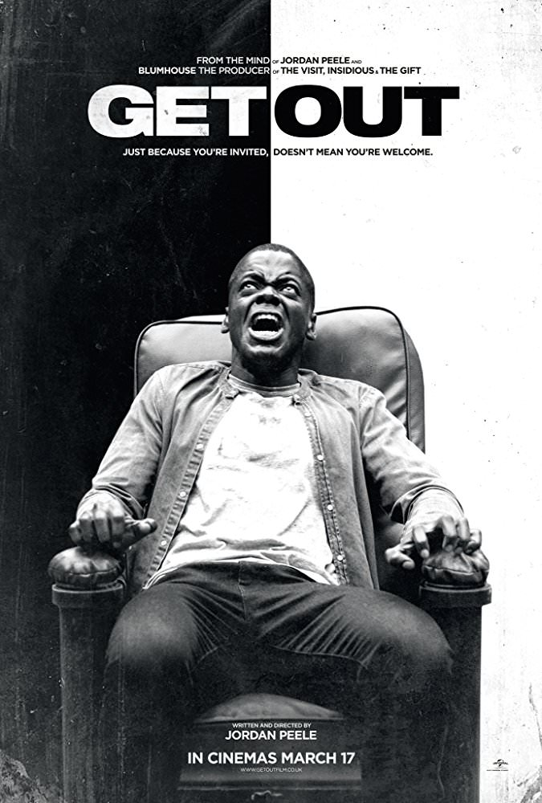

In my advanced age, I've found myself with the time and inclination to consume a lot of media. As part of that, I feel like I have am obligation to share the best things I experienced in the past year with you, the loyal reader. I wrote a similar article [last year](/blog/post/a-few-of-my-favorite-things/), but in case this is your first time (welcome!), I'll run through the rules for how media qualifies for the coveted "Davy" award:

- media qualifies for the list for the calendar year during which I finish it for the first time
- winners are picked based on what I enjoyed most, not what is objectively "the best". You probably wouldn't rank stuff the same way, but that's okay. This is my list, not yours
- if something is critically acclaimed and I'm just getting around to watching it, it probably won't win. Sorry, _The West Wing_

With that under our belts, let's dive in!

<!-- START doctoc generated TOC please keep comment here to allow auto update -->
<!-- DON'T EDIT THIS SECTION, INSTEAD RE-RUN doctoc TO UPDATE -->

- [Board Games](#board-games)
- [Videogames](#videogames)
  - [Home](#home)
  - [Mobile](#mobile)
- [Movies](#movies)
- [Television](#television)
  - [Newly Aired](#newly-aired)
  - [Ended](#ended)
- [Books](#books)
- [A Look Back](#a-look-back)
- [That's all!](#thats-all)

<!-- END doctoc generated TOC please keep comment here to allow auto update -->

## Board Games

Though I love my remote job dearly, without a doubt the biggest downside is the inability to play games in the office. I've got some local friends I meet up with infrequently, but nothing beats a regularly-scheduled Tuesday evening at the office. That said, I've still had time to squeeze in some games and try out some new ones.

 

Winner: **Secret Hitler**

In college, I lived in an amazing [house](https://www.google.com/search?ei=KXZYWoj4Ls_OjwOxw4LoAQ&q=the%20burrow%20ann%20arbor&npsic=0&rflfq=1&rlha=0&rllag=42292958,-83707167,3202&tbm=lcl&rldimm=9798493477036629649) with 7 other friends. Our social nature lead to us playing a lot of [The Resistance](<https://en.wikipedia.org/wiki/The_Resistance_(game)>), a simple game that leans heavily on being able to deceive your close friends. For years I considered it my favorite game- it was fast to play, high tension, and lead to really memorable endings. It was my favorite right up until I had the chance to play _Secret Hitler_.

The game pits two teams against each other: the liberals and the fascists (the latter of whom have all of the info). They take turns nominating a government, which in turn lays a tile on the board that grants a point to one of the two teams. There's a little luck involved with which tiles are drawn (the deck is heavily stacked for the fascists), but members of both teams can pass legislation (tiles) belonging to each side of government. This uncertainty paired with a good bit of bluffing makes for a very compelling 45 minutes of gameplay.

The lying, betrayal, and explosive resolution really sell this game for me. It's been an absolute hit at my remote company (when we see each other in person). The components are high quality and travel well. The theme is well-executed, but also easy to rework should it make you uncomfortable. On each level _Secret Hitler_ succeeds.

 

Runner-up: **Fugitive**

Ever since I moved in with my SO, I've been looking for straightforward two-player games that I can get to our (card) table. I like asymmetric games, so the [Kickstarter](https://www.kickstarter.com/projects/fowers/fugitive) for _[Fugitive](https://boardgamegeek.com/boardgame/197443/fugitive)_ from [Tim Fowers](https://www.fowers.games/) (who previously made _Burgle Bros_) was a no brainer.

The game is straightforward - both players stockpile cards from a segmented deck. The more the fugitive has, the more options they can employ when laying cards to escape. The more cards the agent collects, the more information they have about the possible hideouts the fugitive could be escaping via. There's also a mechanic of event cards, but we've had so much fun with the base game that we haven't even used them yet.

If you're looking for something with a bit of bluffing, great art, compact size and very few "bits", I can't recommend this enough.

## Videogames

This was an interesting year for me as far as videogames were concerned. I made a bet last December (2016) that I would be able to resist the siren call of the Steam sale and forgo all game purchases in the 2017 year. Not one to lose a bet, I stuck with it.

### Home

In the absence of a stream of new games I wasn't going to play, I turned my eyes towards my oft-neglected Steam backlog. There's a great set of games I had never touched (thanks, Humble Bundle), and I'm glad I had the opportunity to get into them this year.

 

Winner: **Talos Principle**

I had seen a lot of talk about*The Talos Principle* and heard it described as "portal-like". That's a fair comparison, but there's a lot more going on here. It's a more serious game. Instead of a snarky computer, you've got an omniscient voice directing you through pristine levels. Similar to _The Witness_ (a favorite game from last year), the game has a lot of exploration and emergent narrative. The biggest (and best) difference is that _The Talos Principle_ actually has a story when it's all said and done. It explains who you are and why you're solving, which provides much needed closure. The story is delivered in a series of text files and audio recordings that you find, which is really cool. It's centered around some event that happened in the past and the role of autonomy/life in robots (which is immediately relevant, given that you play as a robot).

There are distinct named puzzles that involve manipulating an increasingly complex set of objects (fan, cube, etc) to reach your goal (a tetris piece).Though some of the later puzzles are pretty tough (especially when they throw in time manipulation), the game feels rewarding. There's a good sense of progression as the puzzle elements become more connected.

The game looks great and the atmosphere is enjoyable. If you want a solid puzzle experience, look no further than _The Talos Principle_.

 

Runner-up: **Else Heart.break()**

_Else Heart.break()_ takes some time to get rolling, but once it does it's a pretty cool experience. The story is largely forgettable, but the standout feature is that there's an entire programming language embedded in the game and every object is "hackable". While a door's default behavior is to take you to what's on the other side, they can be modified to take you anywhere if you know the memory address.

The biggest thing holding this back is the lack of a compelling story (it gets neat towards the end, but it takes ages to get there) and the unused potential. For such a cool idea, the practical uses of the hacking is fairly limited. Maybe that's for accessibility sake (non-programmers can still play this), but it limits what this game could have achieved.

 

Honorable mention: **Recettear, an Item Shop's Tale** for cute writing and an original concept and **Little Big Planet** for some truly stylized levels and a "whoa dude" moment on the [large rotating wheel](https://youtu.be/aNRPH3-h6yQ?t=4m24s).

### Mobile

This section is different from the others in two important ways: it's harder to track playtime on mobile games and as far as I can tell, I didn't play a lot of mobile games this year. When I'm on the go and have time to kill I'm usually reading. I play some tablet board games, but not much like my gaming experience home. That isn't to say I don't have anything to recommend, but take it with a grain of salt. I think these are the only two mobile games I played through this year.

 

Winner: **Pokémon: Sun**

I've been catching _most of 'em_ since elementary school. I haven't played every single [generation](<https://en.wikipedia.org/wiki/Pok%C3%A9mon_(video_game_series)#Generations>) (I missed the past few), but I'm glad I got back into the series in time for _[Pokémon: Sun](https://www.pokemon-sunmoon.com/en-us/)_. It was the first game I played on my new 3DS (I'm very [patient](https://www.reddit.com/r/patientgamers/)) and it made a statement right away that it was _different_. Most notably, it removed HMs, the unforgettable moves your Pokémon had to know to explore new areas. No longer do I have to base my team on where I'm going to explore. That's right, I get 6 Pokémon, all ready for battle. They also tweaked battle experience distribution it so everyone in your party gets some, meaning no one Pokémon falls too far behind; a welcome boon. The graphics took a big step up and the world felt dynamic and explorable. Not being locked onto a grid helped with that, as did the multitude of biomes and Pokémon available to find.

Improvements aside, the game wasn't perfect. For a story-focused outing, the story is on the weaker side. It's a little hokey and the talking Pokédex gets old quickly. The cities are fairly forgettable. The inconsistent nature of the island trials (the replacement for the gym system) was frustrating. The battle trials were cool, but the "wander around and pick up item" trials were not.

When it came down to it, for all its faults, _Pokémon Sun_ felt new and improved, an impressive feat after 20 years of games.

 

Runner-up: **Klocki**

It's a tough balancing act to present a puzzle concept and build on it on a good curve. Impressively, _[Klocki](http://klockigame.com/)_ does just that. The puzzles have clear objectives and the tactile-ness of their presentation feels great. Tiles spin, swap, shift, and rotate performantly and the sound effects pair nicely. It's short and sweet and well worth a few stints-before-bed of your time.

 

Honorable Mention to _[Alto's Adventure](http://altosadventure.com/)_, which has beautiful graphics and music. Gameplay is pretty good and generally non-frustrating for an endless runner. The snowboarding theme is delivered well and its a pleasure to zoom down a mountain in search of llamas.

## Movies

What a year for movies. Of all the sections, I had the most trouble picking the winners for this one.

Winner(s): **Spider-Man: Homecoming**, **Get Out**

Let's get the biases out of the way- I love Spider-Man and I've enjoyed nearly every modern modern Marvel movie. Even before seeing any trailers, I knew I would enjoy Peter Parker's first solo outing in the MCU. Never in my cautious optimism did I think it would be _this_ good.

I was most impressed by the pacing and balance of humor against drama. Peter Parker is finally a high school student (played by someone very near that age). His friends feel realistic, and his funny friend has great lines without trying to steal the show. The rest of the supporting cast complements him perfectly. Since this incarnation was introduced in Civil War, We got a full movie without them having to re-kill Uncle Ben. Nevertheless, we got a great character arc as Parker comes into his own as an avenger. They feature Robert Downey Jr well, but he doesn't overshadow anyone.

This movie excelled on every level and I hope we see more films like this in the MCU.

_Get Out_, on the other hand, is outside of my comfort zone. I don't frequently watch horror movies and probably would have skipped this entirely if not for my love for Jordan Peele and how good everyone said this was.

What made the most lasting impression on me was how uncomfortable this made me feel. The way they communicated Daniel Kaluuya's feeling of being an outsider and an object were unsettlingly impressive. Every line in this movie was deliberate and purposeful, something that really sinks in the more times you see it. The rest of the cast, is great as well. The movie is just funny enough to not be terrifying the whole time. It delivers on every level and is most deserving of this (very prestigious) honor.

 
Runner-up: **Hidden Figures**

I've been making an effort to see more movies by and about people of color. Their experiences can differ so greatly from my own. Plus, I'm a sucker for sure triumphant space movie. This also showed some cool computing history, so it checked a lot of boxes for me.

 

Honorable mention for **Logan**, for showing that superhero movies can be so much more that just that; this was a standout drama.

## Television

This was the toughest section to write purely because it's unclear what exactly belongs in it. TV is changing and while some shoes air through the school year, others run over the summer or are released in a batch online. In the effort of simplicity, here's some shows that are online or completed an entire season in 2017. If you want new network shows, check out AV CLUB.

### Newly Aired

 

Winner: **The Guest Book S1**

Having been a frequent visitor of a [small mountain town](https://en.wikipedia.org/wiki/Estes_Park,_Colorado) much like the setting of _The Guest Book_ in my youth, I was excited to see it explored in a comedy. I haven't watched Garcia's other popular show (_My Name is Earl_), but his reputation precedes him and I was excited for limited run. The show is framed around a consistent set of characters (the residents of fictional Mount Trace) and their interactions with the curious cast of folks that rent the vacation cabin each week. What follows is a delightful mix of thing-a-week, blackmail, misunderstandings, and a cute love story. Not needing to develop the weekly characters for more than 15 minutes leads to some really wonderful and light plots (that all interweave well with the local, ongoing plot lines). It's a taste of summer and the first season was an enjoyable run.

 

Runner-up: **The Orville S1**

If you had told me the network sci-fi series I would be most excited about when the fall rolled around wasn't the triumphant return of Star Trek (to be honest, I haven't started it yet), but the Seth MacFarlane semi-parody? I don't even like him that much. Well, spoiler, past-me. _The Orville_ hits a really good balance between seriousness and fun. It's got a lot of the same campy humor as TNG (unsurprising, given MacFarlane's history), but with some great plot lines. It took a couple of episodes to get rolling and not every episode was the best, but there were absolutely some standouts. I enjoyed the serial format, where each episode was mostly standalone. I'm excited to see where they take the show when it returns in the fall!

 
Honorable mention to **Powerless**, for being a breath of fresh air in the superhero genre. Great to see the world from "our" side. Like many beloved shows, it was canceled.

### Ended

 

Winner: **Galavant**

> Will all the singing kill our Nielsen ratings?

What if you took the musical genius behind some of the best Disney movies and instead had them write a bawdy medieval musical? You get Galavant.

I fell in love with the show from the pilot. The music is phenomenal and the lyrics are clever as heck (related, I recommend you watch with the subtitles on). The show does a great job of subverting expectations at every turn. It does away with tired tropes like the damsel in distress and the evil king.

The second season does a great job expanding on the plot set out by the first. Even though the show was canceled after the second season, it still manages to build to a great climax. In classic "we're probably canceled so let's mostly wrap up except for some lose ends to build next season on just in case" fashion, there's some cool potential for growth if it ever returns (hello, Netflix!). Add all that to the stream of delightful guest stars (Weird Al and John Stamos to name a few), and you've got the read deal.

Even after months, I still listen to the [soundtrack](https://open.spotify.com/user/1286017453/playlist/4TPdCE51zxM4QA8pzuf1SQ) weekly. There's something about a self-aware musical that just does it for me, and hopefully it'll do it for you too.

  <iframe src="https://open.spotify.com/embed/user/1286017453/playlist/4TPdCE51zxM4QA8pzuf1SQ" width="300" height="380" frameborder="0" allowtransparency="true"></iframe>

 

Runner-up: **Scooby-Doo Mystery Inc**

Let me start with this preface: _Mystery Inc_ is super weird. They've made some interesting character choices, namely Fred's near-sexual level of attraction to traps and how Shaggy and Velma start out dating. The show follows a monster-a-week blueprint, but also has an overreaching ark that ties the whole show together. It rises to a significant scale, especially for something that, on the surface, is a kid's show. There's a lot of jokes aimed at adults that keeps audiences of all ages on their toes. Consider me pleasantly surprised.

## Books

 

Winner: **Mistborn 1: The Final Empire**

There is something to be said for reading a thick fantasy paperback in a cabin in the wilderness. Whether its childhood memories or just the whole _vibe_, this is my ideal way to take in a new fantasy series. I won't pretend the environment didn't influence how much I enjoyed the first installment of _[Mistborn](https://brandonsanderson.com/books/mistborn/the-final-empire/)_, but to do so would devalue how great the book actually is. Though the book's size (and that of the huge world that all of Sanderson's novels inhabit) was intimidating, it flies by. The tone strikes a really good balance description an action, so no part of it really drags. The world he paints feels vibrant, the magic well-thought out (an easy thing for a fantasy author to mess up), and the city alive. There's a great sense of scale, both in the seriousness of the plot locally (in the capital city in which it mostly occurs) and how it affects the world around it (that we don't see much of). To my friends that recommended this so heartily: thank you, and I'm sorry it took so long.

 

Runner-up: **Artemis**

I really enjoyed Weir's previous book, _The Martian_. My biggest complaints were that it was a little drawn out, repetitive, and mathy (I appreciate explanation, but don't need an entire proof on the subject). _[Artemis](http://www.andyweirauthor.com/books/artemis-hc)_ addressed each of these complaints and wrapped the whole thing in a moon heist. I really enjoyed the way Weir expanded on the day-to-day challenges of living on a moon base and how Earth culture might adapt. Characters were fun, diverse, and expressive. It was paced well with good suspense. Characters were likable and the conclusions was satisfying. Overall, highly recommend.

Honorable mention to _Shadow of the Wind_ because it was both good and very different from what I've read before. A change of pace, but an enjoyable one!

## A Look Back

A year (ish) out from [last year's post](/blog/post/a-few-of-my-favorite-things/), here's a quick look back to much I'm enjoying some of the media that was awarded a coveted "Davy" award last year.

_Factorio_ is still awesome. The devs put out a weekly [blog](https://www.factorio.com/blog/) detailing their progress for the week. I follow the game, but have to play it only once in a while, lest I get sucked in and lose all other productivity. _The Witness_ received an iOS port, opening it up to a whole new audience. My SO is a prime example of someone without the inclination to sit down in front of her computer for a long game, but is never without her with. Due to this port, she's been able to play through one of my favorite games from last year. The game looks great on her phone, and the island is a pleasure to explore.

I got the expansion for _7 Wonders: Duel_ which, impossibly, improves on a really fun game. It incentivizes some of the tiles that were previously less desirable and opens up new avenues for points if you're crafty with your card selection. If you enjoyed the base game, this complements it well. Lastly, _The Good Place_ is halfway through its second season (and has been [renewed](https://www.avclub.com/shrimp-for-everyone-the-good-place-is-forking-renewed-1820650663) for a third). It's still forkin' great and I'm excited to see what's coming next.

## That's all!

Putting together this article every year has encouraged me to track everything I read/watch/play more dutifully, a hobby I've put an embarrassing amount of time into. [Airtable](https://airtable.com/invite/r/7A1YRa26) is key for this, and I'll be detailing my use of it in an upcoming post.

Until then, enjoy what you watch and let me know if you've got any recommendations!
