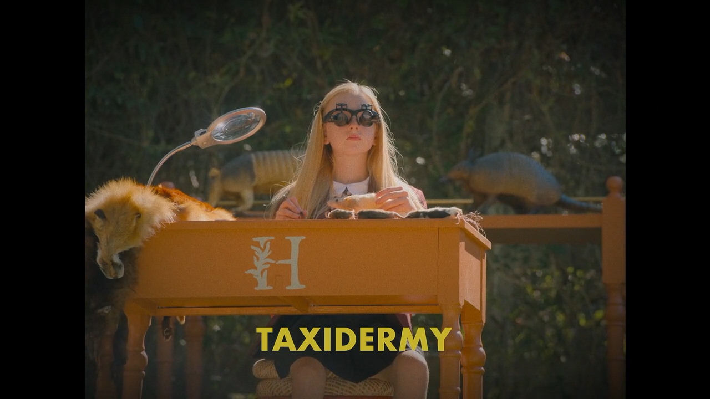

> Note: all spoilers are hidden, even inside puzzle explanations

> Also, "we" throughout this post refers to myself and my stalwart editor / puzzle guide / partner extraordinaire, [Vicky](https://vickystein.media/), without whom this would not be possible.

<details>
<summary>Table of Contents</summary>

- [Welcome to the Party](#welcome-to-the-party)
- [How to Use this Guide](#how-to-use-this-guide)
  - [Hint Format](#hint-format)
- [Episode 1 - Aniq](#episode-1---aniq)
  - [Aniq's Not the...](#aniqs-not-the)
  - [Aniq's Flower](#aniqs-flower)
  - [Aniq's Registry Puzzle](#aniqs-registry-puzzle)
- [Episode 2 - Grace](#episode-2---grace)
  - [Grace's Not The...](#graces-not-the)
  - [Grace's Flower](#graces-flower)
  - [Grace's Registry Puzzle](#graces-registry-puzzle)
- [Episode 3 - Travis](#episode-3---travis)
  - [Travis' Not The...](#travis-not-the)
  - [Travis' Flower](#travis-flower)
  - [Travis' Registry Puzzle](#travis-registry-puzzle)
- [Episode 4 - Hannah](#episode-4---hannah)
  - [Hannah's Not The...](#hannahs-not-the)
  - [A Note About Cybersecurity](#a-note-about-cybersecurity)
  - [Hannah's Flower](#hannahs-flower)
  - [Hannah's Registry Puzzle](#hannahs-registry-puzzle)
- [Episode 5 - Sebastian](#episode-5---sebastian)
  - [Sebastian's Not The...](#sebastians-not-the)
  - [Sebastian's Flower](#sebastians-flower)
  - [Sebastian's Registry Puzzle](#sebastians-registry-puzzle)
- [Episode 6 - Danner's Fire](#episode-6---danners-fire)
  - [Danner's Not The...](#danners-not-the)
  - [Danner's Flower](#danners-flower)
  - [Danner's Registry Puzzle](#danners-registry-puzzle)
- [Episode 7 - Ulysses](#episode-7---ulysses)
  - [Ulysses' Not The...](#ulysses-not-the)
  - [Ulysses' Flower](#ulysses-flower)
  - [Ulysses' Registry Puzzle](#ulysses-registry-puzzle)
- [Episode 8 - Feng](#episode-8---feng)
  - [Feng's Not The...](#fengs-not-the)
  - [Feng's Flower](#fengs-flower)
  - [Feng's Registry Puzzle](#fengs-registry-puzzle)
- [Episode 9 - Isabel](#episode-9---isabel)
  - [Isabel's Not The...](#isabels-not-the)
  - [Isabel's Flower](#isabels-flower)
  - [Isabel's Registry Puzzle](#isabels-registry-puzzle)
- [Conclusion](#conclusion)

</details>

## Welcome to the Party


_The Afterparty_ was one of my [favorite shows of 2022](/blog/post/favorite-media-2022/#the-afterparty). I loved its ensemble cast and genre-bending presentation as it detailed the events of a murderous high school reunion, but its intricate puzzles are what really put it over the top for me. Unbeknownst to us at the time of our first watch-through, each episode had a visual clue as to who _didn't_ commit the murder (each with the pattern `NOT ___`).

For season 2, puzzle creators [Dave Shukan](https://davespuzzles.com) and [David Kwong](https://www.davidkwongmagic.com/) stepped up their game. This season chronicled the mystery of a murder at the wedding of Grace and Edgar, with a couple of returning cast members and a bunch of kooky new characters. Each episode has two tricky puzzles hidden in the background (or sometimes foreground!), and one of those puzzles leads the solver to yet a third. If you solve _that_ one (the hardest/most involved of the 3), you get a word or short phrase that eventually fed into a meta-puzzle. Truly, they outdid themselves. If you want to jump straight to the hardest puzzles and aren't interested in the show, they've posted [the entire puzzle hunt](https://drive.google.com/file/d/1b07sB1Y133fUNRmkxIFZ29DrHAsVFoEf/view), which can be solved without any knowledge of The Afterparty. But, watching is more fun, so I recommend that.

Vicky and I solved most of these on our own, but we also collaborated with the folks on [/r/TheAfterPartyTV](https://old.reddit.com/r/TheAfterPartyTV/) and occasionally turned to them for hints and help. Our personal strengths lent themselves to some of these puzzles and left us a little stumped on others. There were a ton of them! And some were super hard!

It ended up being more enjoyable overall for us to make judicious use of the subreddit when things got frustrating – and we returned the favor by explaining a few bits and pieces to our fellow puzzled solvers online. That’s why we decided to write up this guide: as a gift to future watchers who may not be able to navigate the now-buried Reddit threads, but who could still use the support of riddle-driven friends.

This post provides hints for each puzzle in each episode, plus full explanations if you ever get stuck.

## How to Use this Guide

We encourage you to solve as much as you can! The puzzles are fun and will play to different strengths, so just because a prior one stumped you doesn’t mean you won’t have a stroke of brilliance on the next one. That said, we appreciated hints when we needed them and the goal here is to alleviate gatekeeping and frustration. We have done our best to lead a solver through several layers of hints. That way, you can choose your own difficulty level. Click through just a few hints that prompt your own “aha” moments and independent solutions, or go all the way to the solution to admire the puzzle-makers’ cleverness and trickery if you just can’t (or don’t want to) get there on your own.

### Hint Format

As mentioned above, episodes 1-9 each had two puzzles hidden within the action: One solved to a clue about who didn’t commit the murder in the form of a `Not...` or `Not the...` statement, and the other gave the name of a `flower`. That flower name could be typed in to the `Registry` page of Grace and Edgar’s [wedding website](https://edgarandgracewedding.com) (spotted in an episode, on an invitation) for a third, more involved puzzle.

The hints use the following format for each `Not the...`, and `Flower` puzzle:

1. A vague window of timestamps to check between to find the puzzle on screen (e.g. "between 5:00 and 15:00")
2. A hint to the delivery mechanism (e.g. "goes by fast / pay close attention to letters / have to decode shapes", etc)
3. A pretty good hint about what the puzzle itself consists of (e.g. "pay special attention to cereal boxes")

Followed by:

<details>
<summary>4. Screen w/ puzzle visible</summary>


</details>

And finally, a block that explains every step of the puzzle and includes the final answer in a spoiler tag:

<details>
<summary>Explanation</summary>

To solve the puzzle, do A, then B, then C. You get the code to my luggage: <Spoiler text="Fake spoiler">12345!</Spoiler>.

</details>

The Registry puzzles are each very unique, so the hints for those are a little more freeform.

With that out of the way, grab your pencil, notebook, and thinking cap. Let's get to it.

## Episode 1 - Aniq

### Aniq's Not the...

1. 10 minute time window to see puzzle: <Spoiler>30:00 - 40:00</Spoiler>
2. Delivery mechanism: <Spoiler>This clue is spelled out one letter at a time over ~ 90 seconds.</Spoiler>
3. What exactly to look at: <Spoiler>Look somewhere you'd expect to find numbers, not letters.</Spoiler>

<details>
<summary>4. Screen w/ puzzle visible</summary>


</details>

<details>
<summary>Explanation</summary>

Look at each “table number,” or in this case, table letter, shown in each shot of this scene (even when it’s the same table you saw before – they change). They spell out <Spoiler>NOT THE SNORER</Spoiler>. This eliminates <Spoiler>Aunt Ruth, who notably snores in Feng’s episode.</Spoiler>

</details>

### Aniq's Flower

1. 10 minute time window to see puzzle: <Spoiler>20:00 - 30:00</Spoiler>
2. Delivery mechanism: <Spoiler>Pay special attention to set pieces that are visible for long periods of time while characters move around them.</Spoiler>
3. What exactly to look at: <Spoiler>Aniq is doing a lot of pacing in front of a fireplace. What groups of things are unmoving and in view for quite a while?</Spoiler>

<details>
<summary> 4. Screen w/ puzzle visible</summary>


</details>

<details>
<summary>Explanation</summary>

Look at the little vases on the mantle behind Aniq while Ulysses is taking a shower. There are 5 sets of 3 vases each. Each vase is either short, medium, or tall. If we assign each height with the number (`0`, `1`, or `2` respectively), the vases represent the following [base-3](https://en.m.wikipedia.org/wiki/Ternary_numeral_system) numbers (and their base-10 counterparts):

| base-3 | base-10 |
| ------ | ------- |
| `202`  | `20`    |
| `210`  | `21`    |
| `110`  | `12`    |
| `100`  | `9`     |
| `120`  | `16`    |

The right column corresponds to letters of the alphabet if numbered in alphabetical order, which then spell out <Spoiler>`TULIP`</Spoiler>.

</details>

### Aniq's Registry Puzzle

<!-- Download [this PDF](/after-party/aniq.pdf) -->

1. Decoded instructions: <Spoiler>Add a letter to turn a known movie title into a pun</Spoiler>.
2. First answer: <Spoiler>Clash of the Titans + `I` -> Clash of the Titians</Spoiler>

<details>
<summary>Answers (individually spoilered)</summary>

1. <Spoiler>Clash of t<u>h</u>e Titi<u>a</u>ns</Spoiler>
2. <Spoiler>Gro<u>w</u><u>n</u>pups</Spoiler>
3. <Spoiler>Doctor Stran<u>g</u>l<u>e</u>​</Spoiler>
4. <Spoiler>S<u>t</u>arewar<u>s</u></Spoiler>
5. <Spoiler>Cor<u>a</u>l <u>M</u>iner's Daughter</Spoiler>
6. <Spoiler><u>N</u>o Time to Div<u>e</u></Spoiler>
7. <Spoiler>The <u>S</u>ixth Sense<u>i</u></Spoiler>
8. <Spoiler>Ch<u>a</u>riots of <u>F</u>ibre</Spoiler>
9. <Spoiler>H<u>a</u>ppy F<u>l</u>eet</Spoiler>
10. <Spoiler><u>L</u>ife of P<u>i</u>g</Spoiler>
11. <Spoiler>O<u>n</u> <u>G</u>olden Pound</Spoiler>
12. <Spoiler>C<u>o</u>n <u>F</u>air</Spoiler>
13. <Spoiler><u>F</u>antastic <u>F</u>lour</Spoiler>
14. <Spoiler>Miser<u>l</u><u>y</u></Spoiler>
15. <Spoiler>A Star <u>i</u>s Boro<u>n</u></Spoiler>
16. <Spoiler>Kinder<u>g</u>arten Co<u>p</u>y</Spoiler>
17. <Spoiler>P<u>l</u>anet of the C<u>a</u>pes</Spoiler>
18. <Spoiler>Menu i<u>n</u> Blac<u>k</u></Spoiler>

</details>

The starred letters in the puzzle (underlined above) combine for a final clue when read in order:

<Spoiler>Hawn gets amnesia falling off flying plank</Spoiler>

Which solves to <Spoiler>HOVERBOARD</Spoiler>. Save this answer for later.

## Episode 2 - Grace

### Grace's Not The...

1. 10 minute time window to see puzzle: <Spoiler>10:00 - 20:00</Spoiler>
2. Delivery mechanism: <Spoiler>Make sure to take a good squint at all paperwork.</Spoiler>
3. What exactly to look at: <Spoiler>Edgar’s itinerary sure is interesting. I wonder what all those locations have in common?</Spoiler>

<details>
<summary> 4. Screen w/ puzzle visible</summary>


</details>

<details>
<summary>Explanation</summary>

Edgar’s itinerary lists a bunch of airports that he planned to fly into. They’re not listed explicitly on the paper, but we know airports each have a three-letter [IATA code](https://en.wikipedia.org/wiki/IATA_airport_code) associated with them:

1. Gnoss Field in Marin, California: `NOT`
2. Senador Petronio Portella Airport in Teresina, Brazil: `THE`
3. Fairchild Air Force Base in Spokane, Washington: `SKA`
4. Lajes Praia da Vitória in Portugal: `TER`

The phrase <Spoiler>Not the Skater</Spoiler> eliminates <Spoiler>Kyler, who is shown skateboarding in Feng's episode</Spoiler>.

</details>

### Grace's Flower

1. 10 minute time window to see puzzle: <Spoiler>0:00 - 10:00</Spoiler>
2. Delivery mechanism: <Spoiler> Look for a familiar pattern that’s a bit wrong. </Spoiler>
3. What exactly to look at: <Spoiler>The typewriter Grace is selling is pretty odd, don’t you think?</Spoiler>

<details>
<summary> 4. Screen w/ puzzle visible</summary>


</details>

<details>
<summary>Explanation</summary>

The typewriter that Grace sells Edger has its letters all mixed up. To find the answer, go alphabetically through where you know the keys should be.


Where there should be an `A`, there's instead an `N`. Where there should be a `B`, there's an `I`. Do that through the whole alphabet to get the message <Spoiler>Nice, you have found a sunflower</Spoiler>, meaning our flower is <Spoiler>SUNFLOWER</Spoiler>.

</details>

### Grace's Registry Puzzle

Decoded instructions: <Spoiler>The bolded boxes in each word contain the same two letters.</Spoiler>
First answer: <Spoiler>F<u>la</u>gel<u>la</u></Spoiler>

Each answer

1. <Spoiler>F<u>la</u>gel<u>la</u></Spoiler>
2. <Spoiler><u>Me</u>trono<u>me</u></Spoiler>
3. <Spoiler><u>De</u>fen<u>de</u>r</Spoiler>
4. <Spoiler>Pi<u>ne</u>co<u>ne</u></Spoiler>
5. <Spoiler><u>Wi</u>thdra<u>wi</u>ng</Spoiler>
6. <Spoiler>Sto<u>wa</u><u>wa</u>y</Spoiler>
7. <Spoiler>Co<u>ok</u>bo<u>ok</u></Spoiler>
8. <Spoiler>Br<u>id</u>esma<u>id</u></Spoiler>
9. <Spoiler><u>Ca</u>s<u>ca</u>de</Spoiler>
10. <Spoiler><u>Co</u>rn<u>co</u>b</Spoiler>

then:

1. Hint for part 2: The words <Spoiler>"state"</Spoiler> and <Spoiler>"words count"</Spoiler> in the instructions are there for a reason.
2. Second hint: <Spoiler>The position of the bolded words in the clues also matters</Spoiler>.

<details>
<summary>Part 2 Explanation</summary>

Count the number of words in each clue and note the position of the bolded word. For example, the first clue has 9 words and the 8th word is bolded. Also, note that the bolded pairs of letters are each US state abbreviation (`LA` is Louisiana, `ME` is Maine, etc).

The state that corresponds with the first clue (`Louisiana`) has exactly 9 letters and the 8th word of that clue is bolded, so you take the 8th of 9 letters (`N`). Repeat that for each clue & state combo and you have our answer: <Spoiler>New England</Spoiler>. Tuck that away for now.

</details>

## Episode 3 - Travis

### Travis' Not The...

1. 10 minute time window to see puzzle: <Spoiler>10:00 - 20:00</Spoiler>
2. Delivery mechanism: <Spoiler>Paperwork is always interesting.</Spoiler>
3. What exactly to look at: <Spoiler>Potential names and their potential ratings? How fun!</Spoiler>

<details>
<summary>4. Screen w/ puzzle visible</summary>


</details>

<details>
<summary>Explanation</summary>

The last names of all the people on Edgar’s list each have ten letters and they’re each rated between 1-10 stars.

In each row, count the number of stars and then note the corresponding letter in the last name (if 3 stars, check the 3rd letter, for example) to spell <Spoiler>`NOT EY SUICIDE`</Spoiler>. Think about that one for a sec, and then be relieved – the creators confirmed in a sort of [sideways response to a Redditor](https://nitter.net/chrizmillr/status/1681763074729181185#m) that there was a typo, and the puzzle solution rightly reads <Spoiler>`NOT BY SUICIDE`</Spoiler>.

</details>

### Travis' Flower

1. 10 minute time window to see puzzle: <Spoiler>10:00 - 20:00</Spoiler>
2. Delivery mechanism: <Spoiler>There sure are a lot of things behind Travis in this office.</Spoiler>
3. What exactly to look at: <Spoiler>Read any good titles lately?</Spoiler>

<details>
<summary>4. Screen w/ puzzle visible</summary>


</details>

<details>
<summary>Explanation</summary>

One of the books on the shelf is entitled `Doves And Hankerchief Lessons: Ira Anderson` (sic). The capital letters spell out <Spoiler>`DAHLIA`</Spoiler>.

</details>

### Travis' Registry Puzzle

1. Instructions hint: <Spoiler>There are a few specific words in the instructions that hint how to solve it: At the afterparty, Travis sometimes understood what <u>a couple</u> meant by <u>definition</u> and sometimes got <u>the rest mostly mixed up</u>.</Spoiler>
2. Decoded instructions: <Spoiler>Two of the words in each group form a phrase. That phrase describes a word formed by jumbling all but one of the letters that make up the remaining 2 words. You’ve got to pull out that extra letter, because it becomes important later on.</Spoiler>
3. Second answer (because it makes for a better example than the first answer): <Spoiler>`VISION AID`: `BINOCULARS` (`O`). `VISION` and `AID` are the clue and the answer is `BINOCULARS` (which help you see things), formed out of the letters of `COUSIN LABOR`. `COUSIN LABOR` has an `O` that's not used to form `BINOCULARS`, which is saved for later.</Spoiler>

<details>
<summary>Answers (individually spoilered)</summary>

1. <Spoiler>TRITE SAW: PLATITUDE (L)</Spoiler>
2. <Spoiler>VISION AID: BINOCULARS (O)</Spoiler>
3. <Spoiler>TOP BOOK: BESTSELLER (O)</Spoiler>
4. <Spoiler>CURRENT DIRECTION: DOWNSTREAM (K)</Spoiler>
5. <Spoiler>LONG HURLER: TREBUCHET (A)</Spoiler>
6. <Spoiler>MORSELS BOWL: CORNFLAKES (T)</Spoiler>
7. <Spoiler>ANCIENT REPTILE: TRICERATOPS (T)</Spoiler>
8. <Spoiler>LOWEST STORY: BASEMENT (H)</Spoiler>
9. <Spoiler>WASH SITE: LAUNDROMAT (I)</Spoiler>
10. <Spoiler>NEARLY LAST: PENULTIMATE (R)</Spoiler>
11. <Spoiler>VEHICLE GUEST: PASSENGER (D)</Spoiler>
12. <Spoiler>ENSEMBLE PIT: ORCHESTRA (L)</Spoiler>
13. <Spoiler>SKIN DOC: DERMATOLOGIST (E)</Spoiler>
14. <Spoiler>GREEN BUG: GRASSHOPPER (T)</Spoiler>
15. <Spoiler>CAFE ORDER: DEMITASSE (T)</Spoiler>
16. <Spoiler>BELOW GROUND: SUBTERRANEAN (E)</Spoiler>
17. <Spoiler>FAIR ORGAN: CALLIOPE (R)</Spoiler>
18. <Spoiler>WIRING PRO: ELECTRICIAN (S)</Spoiler>

</details>

<details>
<summary>Explanation</summary>

Reading all of the “extra” letters down the page, you get the phrase `look at third letters`. Then, taking the third letter of each unscrambled word, you get the phrase `ANSWER IS UNSCRAMBLE`. Tuck `UNSCRAMBLE` away for the future!

</details>

## Episode 4 - Hannah

### Hannah's Not The...

1. 10 minute time window to see puzzle: <Spoiler>00:00 - 10:00</Spoiler>
2. Delivery mechanism: <Spoiler>A grid is not always what it appears to be.</Spoiler>
3. What exactly to look at: <Spoiler>Hannah’s calendar has a very specific layout and set of labels, but doesn’t seem like it’d work well as a calendar.</Spoiler>

<details>
<summary>4. Screen w/ puzzle visible</summary>


</details>

<details>
<summary>Explanation</summary>

Hannah’s calendar forms a [Playfair cipher](https://en.wikipedia.org/wiki/Playfair_cipher), an antiquated way to encrypt messages using a cipher phrase and a grid. This may be familiar to you if you like puzzles like this or have seen [National Treasure 2](https://en.wikipedia.org/wiki/National_Treasure:_Book_of_Secrets). Otherwise, hopefully the words “play” and “fair” are enough to clue you in. Our starter phrase is there at the top: `WANDERLUST`. We start the grid with that and then fill the rest of the grid alphabetically, skipping the letters that already appeared in the starter phrase. That gives us:

```
W A N D E
R L U S T
B C F G H
I K M O P
Q V X Y Z
```

From there, match the different shapes scrawled on the calendar's days, and use those coordinates to form the corners of a box. Then read the opposite corners of that box as your encoded message. Go in order of the number of points on the shape (teardrop, football, triangle, square, pentagram).

1. `DM` -> <Spoiler>`NO`</Spoiler>
2. `LH` -> <Spoiler>`TC`</Spoiler>
3. `KS` -> <Spoiler>`OL`</Spoiler>
4. `MD` -> <Spoiler>`ON`</Spoiler>
5. `AT` -> <Spoiler>`EL`</Spoiler>

This reveals that it's <Spoiler>`NOT COLONEL`</Spoiler>, eliminating the dog.

</details>

### A Note About Cybersecurity

You'll soon find out that starting this episode, you need both the flower name _and_ a location rather than just the flower name. Early in the season, I was doing some digging on the wedding site. I found a hashed (a sort of 1-way encryption) version of all of the flower names. With a bit of Python I was able to decode the hashes and get all the flower answers weeks before the episodes aired. I [posted about it on Reddit](https://old.reddit.com/r/TheAfterPartyTV/comments/154dah8/spoilers_ive_found_8_of_the_first_9_flower_answers/), and clearly... someone in production saw. The next week, the website required you to know both the flower and how you arrived at that answer. So uh, sorry!

### Hannah's Flower

1. 10 minute time window to see puzzle: <Spoiler>00:00 - 10:00</Spoiler>
2. Delivery mechanism: <Spoiler>You’ll be doing a little counting for this one.</Spoiler>
3. What exactly to look at: <Spoiler>How many of each item is on a background shelf while young Hannah displays her hobbies?</Spoiler>

<details>
<summary>4. Screen w/ puzzle visible</summary>




</details>

<details>
<summary>Explanation</summary>

There are 2 armadillos on the shelf when Hannah is doing taxidermy, so take the second letter in `ARMADILLO` (`R`) as an answer. Repeat with the other objects on her subsequent three shelves of hobbies:

- 5 anchors (`O`)
- 4 bows (`S`)
- 4 typewriters (`E`)

and you get `ROSE` (found on a `shelf`).

Because of my investigative work getting the flowers, we knew the answer this week was `ROSE` and someone on Reddit guessed that the shelf was the location, but no one quite put together why that was the case. It took so long, in fact, that the creator of the show had to [post on Reddit himself](https://old.reddit.com/r/TheAfterPartyTV/comments/15c9t25/this_is_a_shelf/) and give us a hint.

</details>

### Hannah's Registry Puzzle

1. First hint: <Spoiler>There are a few phrases we needed to pull out of the instructions in order to understand what to do here: `head in the clouds` and `flash in the pan`. What do they have in common? They’ll help us with `putting  everything in its proper place`.</Spoiler>
2. Second hint: <Spoiler>"Downshifting" implies we’re going to be moving the letters from the grid above into the table below, but we’ll have to determine the order. Perhaps there are some types of phrases that might help us get our “heads in the game,” so to speak.</Spoiler>
3. First answer: <Spoiler>Working with one letter in each column from left to right, cross out the letters in the phrase `ELEPHANT (IN THE) ROOM` and drop them into the squares below (treat `in the` as one letter). You should have circles around an E and an A, and the phrase will conclude just before the vertical bar in the second row of empty boxes.</Spoiler>

<details>
<summary>Part 1</summary>

1. <Spoiler>ELEPHANT IN THE ROOM</Spoiler>
2. <Spoiler>SKELETON IN THE CLOSET</Spoiler>
3. <Spoiler>GHOST IN THE MACHINE</Spoiler>
4. <Spoiler>DIAMOND IN THE ROUGH</Spoiler>
5. <Spoiler>BATS IN THE BELFRY</Spoiler>
6. <Spoiler>WHISTLE IN THE DARK</Spoiler>
7. <Spoiler>JEWEL IN THE CROWN</Spoiler>

</details>

<details>
<summary>Metapuzzle</summary>


Now it gets even screwier. Each column has one circled letter, and one letter that remains un-crossed-out. The circled letters are all letters from A through K, so if you associate each circled letter with its corresponding unused letter (or phrase) from the column above it and then unscramble to put the circled letters in alphabetical order... you get the phrase <Spoiler>`DROP IN THE BUCKET`</Spoiler>. Save that phrase for later.

</details>

## Episode 5 - Sebastian

### Sebastian's Not The...

1. 10 minute time window to see puzzle: <Spoiler>0:00 - 10:00</Spoiler>
2. Delivery mechanism: <Spoiler>Anything interesting in the paper today?</Spoiler>
3. What exactly to look at: <Spoiler>Travis’ crossword needs solving. [Here is a blank copy](https://drive.google.com/file/d/1fZDfLnSN9bsZdftcGLbe1tMoWavWY7Cb/view?usp=drive_link) of the grid and the clues, which I transcribed from the image</Spoiler>

<details>
<summary>4. Screen w/ puzzle visible</summary>


But don't try and read that, print out [this version instead](https://drive.google.com/file/d/1fZDfLnSN9bsZdftcGLbe1tMoWavWY7Cb/view?usp=drive_link)

</details>

<details>
<summary>Explanation</summary>

No real secret this week. Break out your pencil and get crosswording!

---

Here's the [filled version of the crossword](https://drive.google.com/file/d/17ejqHXhwSR97HFouT5K9HBm4tqsmNtm0/view?usp=sharing)

When complete, reading bottom-left to top-right, the letters in that diagonal read <Spoiler>`NOT BY CAMELS MILK`</Spoiler>, eliminating <Spoiler>Ulysses' weird milk as the murder weapon</Spoiler>.

</details>

### Sebastian's Flower

1. 10 minute time window to see puzzle: <Spoiler>10:00 - 20:00</Spoiler>
2. Delivery mechanism: <Spoiler>Careful planning is very important.</Spoiler>
3. What exactly to look at: <Spoiler>Weird tools arranged on that blueprint, huh?</Spoiler>

<details>
<summary>4. Screen w/ puzzle visible</summary>


</details>

<details>
<summary>Explanation</summary>


The tools on the table spell out `DAISY` (found on `blueprint`).

</details>

### Sebastian's Registry Puzzle

1. Decoded Instructions: <Spoiler>There are two sets of clues. The "Greenish Words" clue their entire line while the "Colorless Words" refer to _only_ the white squares on their corresponding line (the exact pairing of which you have to figure out)</Spoiler>
2. For simplicity's sake: <Spoiler>You don't actually need to pair the colorless clue with its green line. Those answers are just useful for figuring out green clues if you're stuck.</Spoiler>
3. First answer: <Spoiler><u>S</u>E<u>QU</u>EL</Spoiler>

<details>
<summary>Answers (individually spoilered)</summary>

Green squares are underlined

1. <Spoiler><u>S</u>E<u>QU</u>EL</Spoiler>
2. <Spoiler>CAP<u>O</u>E<u>I</u>R<u>A</u></Spoiler>
3. <Spoiler>DE<u>BU</u>N<u>K</u></Spoiler>
4. <Spoiler>K<u>EY</u>NOT<u>E</u></Spoiler>
5. <Spoiler><u>H</u>ERO<u>IC</u>S</Spoiler>
6. <Spoiler>TRIC<u>K</u>E<u>RY</u></Spoiler>
7. <Spoiler><u>R</u>EAR<u>E</u>N<u>D</u></Spoiler>
8. <Spoiler>CAN<u>OO</u>DLE<u>D</u></Spoiler>
9. <Spoiler><u>S</u>CRO<u>U</u>N<u>G</u>E</Spoiler>
10. <Spoiler>C<u>AR</u>O<u>M</u>ED</Spoiler>
11. <Spoiler><u>P</u>O<u>L</u>Y<u>E</u>STER</Spoiler>
12. <Spoiler><u>J</u>O<u>U</u>R<u>N</u>AL</Spoiler>
13. <Spoiler>CH<u>I</u>R<u>P</u>I<u>E</u>ST</Spoiler>
14. <Spoiler><u>CY</u>BER<u>P</u>ET</Spoiler>
15. <Spoiler>M<u>E</u>A<u>S</u>LE<u>S</u></Spoiler>
16. <Spoiler>S<u>L</u>O<u>VE</u>NIA</Spoiler>
17. <Spoiler><u>O</u>S<u>AK</u>AN</Spoiler>
18. <Spoiler>P<u>H</u>ON<u>EM</u>E</Spoiler>
19. <Spoiler>P<u>L</u>AN<u>CK</u></Spoiler>
20. <Spoiler>HI<u>D</u>E<u>OU</u>S</Spoiler>
21. <Spoiler>AN<u>G</u>O<u>LA</u>N</Spoiler>
22. <Spoiler><u>S</u>IMPLI<u>FI</u>ED</Spoiler>

</details>

<details>
<summary>Metapuzzle</summary>

The green (or underlined) letters _almost_ form the names of trees, but each is missing a letter. For example, lines 1 & 2 have the green letters `SQUOIA`, which is `SEQUOIA` without the `E`. Note down the missing letter and then repeat that tree-finding process with each pair (or trio) of lines. This gives the following trees; missing letter is underlined:

1. <Spoiler>S<u>E</u>QUOIA</Spoiler>
2. <Spoiler>BU<u>C</u>KEYE</Spoiler>
3. <Spoiler>HICK<u>O</u>RY</Spoiler>
4. <Spoiler>RED<u>W</u>OOD</Spoiler>
5. <Spoiler>SUGARM<u>A</u>​​PLE</Spoiler>
6. <Spoiler>JUNIPE<u>R</u></Spoiler>
7. <Spoiler>CYP<u>R</u>ESS</Spoiler>
8. <Spoiler>L<u>I</u>VE OAK</Spoiler>
9. <Spoiler>HEML<u>O</u>CK</Spoiler>
10. <Spoiler>DOUGLAS FI<u>R</u></Spoiler>

When you combine all the missing letters, you get <Spoiler>`ECOWARRIOR`</Spoiler>; stash that away.

</details>

## Episode 6 - Danner's Fire

### Danner's Not The...

1. 10 minute time window to see puzzle: <Spoiler>Between 10:00 and 20:00</Spoiler>
2. Delivery mechanism: <Spoiler>We don’t want to judge anyone but there are some peculiar choices made in the food sex scenes.</Spoiler>
3. What exactly to look at: <Spoiler>This goes by so fast, but the food laid out on the psychologist’s chest is arranged very specifically.</Spoiler>

<details>
<summary>4. Screen w/ puzzle visible</summary>


</details>

<details>
<summary>Explanation</summary>

The marshmallows and other foods on the therapist's chest are laid out in [Braille](https://en.wikipedia.org/wiki/Braille#Derivation). They spell out <Spoiler>`NOT BY A TEAM`</Spoiler>.

</details>

### Danner's Flower

1. 10 minute time window to see puzzle: <Spoiler>Between 20:00 and 30:00</Spoiler>
2. Delivery mechanism: <Spoiler>Keep an eye on the set in the bar that Danner runs through.</Spoiler>
3. What exactly to look at: <Spoiler>There are some odd looking flags in that karaoke bar.</Spoiler>

<details>
<summary>4. Screen w/ puzzle visible</summary>


</details>

<details>
<summary>Explanation</summary>

The flags in the bar use [International Maritime Signal Flags](<https://en.wikipedia.org/wiki/International_maritime_signal_flags#Letter_flags_(with_ICS_meaning)>) to spell out <Spoiler>`MARIGOLD`</Spoiler> (found in `bar`).

This one was actually spotted in a [behind-the-scenes image](https://old.reddit.com/r/TheAfterPartyTV/comments/1503nkz/future_password) before the season aired, but we didn’t have context at the time.

</details>

### Danner's Registry Puzzle

The clues for this part aren't especially cryptic - there are sets of words that form 10 nonsensical palindromes, which will eventually form paths through a grid. Here are the palindromic phrases (and their character lengths not including spaces):

<details>
<summary>Answers (individually spoilered)</summary>

- 1A -> 1B: <Spoiler>SMILER / PELOSI / MACRO / NEST EGG / UNRAVEL (31)</Spoiler>
- 1B -> 1A: <Spoiler>LEVAR / NUGGET / SENOR / CAMISOLE / PRELIMS</Spoiler>
- 2A -> 2B: <Spoiler>NAMETAGS / ALLUDE / MASSED / OREGANO (27)</Spoiler>
- 2B -> 2A: <Spoiler>ONAGER / ODESSA / MEDULLAS / GATEMAN</Spoiler>
- 3A -> 3B: <Spoiler>DESALTS / OCTANES / BENOIT / ONE NOTE / CASUAL / CRANED (39)</Spoiler>
- 3B -> 3A: <Spoiler>DENAR / CLAUS / ACETONE / NOTION / EBSEN / AT COST / LASED</Spoiler>
- 4A -> 4B: <Spoiler>WALESA / COLLECT / NAILER (19)</Spoiler>
- 4B -> 4A: <Spoiler>RELIANT / CELLO / CASE LAW</Spoiler>
- 5A -> 5B: <Spoiler>DROWSY / STAPH / CROWS (16)</Spoiler>
- 5B -> 5A: <Spoiler>SCORCH / PATSY / SWORD</Spoiler>
- 6A -> 6B: <Spoiler>SPACE / CILIA / TERSER / BASSETT / ELAPSE / ILIADS / REGAL (40)</Spoiler>
- 6B -> 6A: <Spoiler>LAGERS / DAILIES / PALETTES / SABRES / RETAIL / ICE CAPS</Spoiler>
- 7A -> 7B: <Spoiler>BALSA / MALL (9)</Spoiler>
- 7B -> 7A: <Spoiler>LLAMA / SLAB</Spoiler>
- 8A -> 8B: <Spoiler>ANITA / PENNY LANE / LEHRER / RAT TRAP / MISLAID (34)</Spoiler>
- 8B -> 8A: <Spoiler>DIALS / IMPART / TARRER / HELENA / LYNNE / PATINA</Spoiler>
- 9A -> 9B: <Spoiler>DEEP SET / ACID BATH / GILDER (21)</Spoiler>
- 9B -> 9A: <Spoiler>RED LIGHT / ABDICATE / SPEED</Spoiler>
- 10A -> 10B: <Spoiler>LEVERAGE / MOLES / DEPARTS (20)</Spoiler>
- 10B -> 10A: <Spoiler>STRAP / EDSEL / OMEGA / REVEL</Spoiler>

</details>

With the lengths in hand, you can try laying each clue out on the grid to connect its points. We didn't have the patience for this, so we turned to Reddit. [/u/hacker6284 came in clutch](https://old.reddit.com/r/TheAfterPartyTV/comments/15m1jbl/wedding_site_puzzles/jved1d3/) and provided a filled grid:

<details>
<summary>Filled Grid</summary>


</details>

The circled letters in the grid correspond to the "Data compression" clues, each missing a letter (underlined below).

<details>
<summary>Metapuzzle</summary>

1. <Spoiler>S<u>C</u>ALP</Spoiler>
2. <Spoiler>SCAR<u>Y</u></Spoiler>
3. <Spoiler><u>B</u>LISS</Spoiler>
4. <Spoiler>BL<u>E</u>AT</Spoiler>
5. <Spoiler>LITE<u>R</u></Spoiler>
6. <Spoiler><u>B</u>LADE</Spoiler>
7. <Spoiler>SA<u>U</u>CE</Spoiler>
8. <Spoiler>ME<u>L</u>BA</Spoiler>
9. <Spoiler>REPE<u>L</u></Spoiler>
10. <Spoiler>PATT<u>Y</u></Spoiler>

Those give us our next "stash this for now" answer: <Spoiler>`CYBERBULLY`</Spoiler>.

</details>

## Episode 7 - Ulysses

### Ulysses' Not The...

1. 10 minute time window to see puzzle: <Spoiler>12:00 - 22:00</Spoiler>
2. Delivery mechanism: <Spoiler>This is the only puzzle you could solve with your eyes closed.</Spoiler>
3. What exactly to look at: <Spoiler>Scope out the subtitles for words that seem shoehorned into the dialogue.</Spoiler>

<details>
<summary>4. Screen w/ puzzle visible</summary>


</details>

<details>
<summary>Explanation</summary>

Answer: This clue reminds me of one of my [favorite-ever Archer scenes](https://www.youtube.com/watch?v=dNYMQpcqscA) - it's all about the [NATO Phonetic Alphabet](https://en.wikipedia.org/wiki/NATO_phonetic_alphabet#Tables). There are a few lines that include words that feel out of place:

1. <Spoiler> All the way to the world championships in **November** </Spoiler>
2. <Spoiler> You're gonna look like you're at the **Oscars** </Spoiler>
3. <Spoiler> It literally takes two to **tango** </Spoiler>
4. <Spoiler> And you will find another **tango** partner </Spoiler>
5. <Spoiler> The **hotel** is booked, it's non-refundable! </Spoiler>
6. <Spoiler> So I used my **Delta** miles and set out to travel the world again </Spoiler>
7. <Spoiler> Leave me, **Juliet** </Spoiler>

Together, these spell out <Spoiler>`NOT THE DJ`</Spoiler>

</details>

### Ulysses' Flower

1. 10 minute time window to see puzzle: <Spoiler>00:00 - 10:00</Spoiler>
2. Delivery mechanism: <Spoiler>A familiar object that looks broken (or at least, not like it should).</Spoiler>
3. What exactly to look at: <Spoiler>Ulysses' clock looks pretty odd.</Spoiler>

<details>
<summary>4. Screen w/ puzzle visible</summary>

<!-- manual HTML because gatsby image processing made the clock really hard to read -->


Here's a better look:


</details>

<details>
<summary>Explanation</summary>

His clock is a standard [7-segment display](https://en.wikipedia.org/wiki/Seven-segment_display), but it's not showing numbers. Instead, it's a series of segments that don't really mean anything:


If you invert the display by swapping the red and gray segments above, you get our word:


So the flower is `POSY` (found on the `clock`).

</details>

### Ulysses' Registry Puzzle

1. Decoded instructions: <Spoiler>Each group of flags has a theme. Start by matching the 12 flags at the bottom of the file into their corresponding groups.</Spoiler>
2. Time saving hint: <Spoiler>You don't need to identify the country for every flag, just the 12 at the bottom.</Spoiler>

<details>
<summary>Answer for each box</summary>

1. <Spoiler>diagonal lines</Spoiler>
2. <Spoiler>vertical symmetry</Spoiler>
3. <Spoiler>box in the top-left corner</Spoiler>
4. <Spoiler>black stripe</Spoiler>
5. <Spoiler>exactly 4 colors</Spoiler>
6. <Spoiler>wheat</Spoiler>
7. <Spoiler>star</Spoiler>
8. <Spoiler>text</Spoiler>
9. <Spoiler>moon</Spoiler>
10. <Spoiler>triangle on left</Spoiler>
11. <Spoiler>bird</Spoiler>
12. <Spoiler>weapon</Spoiler>

</details>

Then:

3. What to do next: <Spoiler>Add the flag from the bottom section that matches each theme above. Then, take the Nth letter of the country whose flag you added, where N is the number of flags originally in that group</Spoiler>.
4. First answer: <Spoiler>There are `4` diagonal flags and you add the flag for Nam<u>i</u>bia. The 4th letter is an `I`, which is the first letter of this puzzle's meta answer</Spoiler>.

<details>
<summary>Ordered flag answers</summary>

1. <Spoiler>Nam<u>i</u>bia</Spoiler>
2. <Spoiler>Japa<u>n</u></Spoiler>
3. <Spoiler>Unite<u>d</u> States</Spoiler>
4. <Spoiler>Est<u>o</u>nia</Spoiler>
5. <Spoiler>Arg<u>e</u>ntina</Spoiler>
6. <Spoiler>Cypr<u>u</u>s</Spoiler>
7. <Spoiler>Came<u>r</u>oon</Spoiler>
8. <Spoiler>And<u>o</u>rra</Spoiler>
9. <Spoiler>Singa<u>p</u>ore</Spoiler>
10. <Spoiler>Cz<u>e</u>ch Republic</Spoiler>
11. <Spoiler>Kaz<u>a</u>khstan</Spoiler>
12. <Spoiler>Oma<u>n</u></Spoiler>

</details>

Which gives us <Spoiler>`INDOEUROPEAN`</Spoiler>.

## Episode 8 - Feng

### Feng's Not The...

1. 10 minute time window to see puzzle: <Spoiler>00:00 - 10:00</Spoiler>
2. Delivery mechanism: <Spoiler>Many very small numbers, gone in a flash.</Spoiler>
3. What exactly to look at: <Spoiler>The videos in Zoe’s camera roll have some very specific timestamps.</Spoiler>

<details>
<summary> 4. Screen w/ puzzle visible</summary>


</details>

<details>
<summary>Explanation</summary>

When Danner is looking at all of the videos in the gallery, they each have a duration (like `1:23` or `3:16`). If you order each one by the number before the colon and translate the number after the colon into a letter, you get:

- `1:14 -> N`
- `2:15 -> O`
- `3:20 -> T`
- `4:20 -> T`
- `5:08 -> H`
- `6:05 -> E`
- `7:19 -> S`
- `8:16 -> P`
- `9:09 -> I`
- `10:20 -> T`
- `11:20 -> T`
- `12:05 -> E`
- `13:18 -> R`

This is <Spoiler>`NOT THE SPITTER</Spoiler>, ruling out <Spoiler>Aniq, who spat the fermented camel's milk all over Vivian</Spoiler>.

</details>

### Feng's Flower

1. 10 minute time window to see puzzle: <Spoiler>00:00 - 10:00</Spoiler>
2. Delivery mechanism: <Spoiler>Look for especially rainbow-y items.</Spoiler>
3. What exactly to look at: <Spoiler>Check out the dartboard.</Spoiler>

<details>
<summary> 4. Screen w/ puzzle visible</summary>

<!-- manual HTML because gatsby image processing sucked the color out of the image, which is important -->


</details>

<details>
<summary>Explanation</summary>

Bullseye! It's the dartboard. Follow the darts in rainbow order and pay attention to the point value of the pie slice they're in. Ignore the bonuses/multiplier given in actual darts scoring:

1. Red: 15
2. Orange: 18
3. Yellow: 3
4. Green: 8
5. Blue: 9
6. Violet: 4

Associate those numbers with their corresponding letter of the alphabet to spell out <Spoiler>`ORCHID`</Spoiler> (found on the `darts`).

</details>

### Feng's Registry Puzzle

This may seem very complicated, but it's not quite as bad as it looks. Also, we found two sheets of [this graph paper](/after-party/feng-graph-paper.pdf) extremely useful for putting our answers together.

1. Walkthrough (part 1): <Spoiler>You need to figure out each clue and guess the flavor name based on all the letters in a column. Start by figuring out all the 7-letter clues (since those go in the grid unambiguously)</Spoiler>.
2. Walkthrough (part 2): <Spoiler>Once you have enough letters in a column, you can try to unscramble those letters into a baobing flavor (bearing in mind that one is "spicy" and another is 2 words, per the instructions). I'd recommend starting with column 6 because there aren't many letters</Spoiler>.
3. Column 6 flavor name: <Spoiler>Once you've filled the 7-letter clues, the unique letters in column 6 are `EILM`, which jumbles to `LIME`</Spoiler>
4. Walkthrough (part 3 & spoilers for above hints): <Spoiler>You know that column 6 takes 5 minutes to get through a full rotation (4 letters + a reset), so you need to figure out where it in its rotation it is at the first clued row (`88681`)</Spoiler>.
5. First clue answer: <Spoiler>`CHESNEY`</Spoiler>
6. Column 6 flavor position + explanation: <Spoiler>The 6th letter in `CHESNEY` is `E` and it shows up at time `88681`. We know that `LIME_` (with the trailing space) loops every 5 minutes, so you can do some remainder division to see where in its rotation it was at time `1`. Because a full rotation doesn't change our letter, we can remove all of the full rotations and only focus on the remainder. We can use [modulo math](https://en.wikipedia.org/wiki/Modulo), aka "remainder division", denoted with a `%`. For instance, `15 % 4` is `3` because `4 * 3 + 3 == 15` and `4 * 4` is larger than `15`. So, for the puzzle, doing `timestamp % cycle length` gives us the position in the rotation we are at that timestamp. For column 6, `88681 % 5 == 1`, so `E` is the 1st letter in the rotation!</Spoiler>
7. Walkthrough (part 4, spoilers for above hints): <Spoiler> Now we can fill in (and validate) every row for column 6 because we know the pattern it's on. It also means that any rows for which column 6 is blank _and_ are a 6-letter answer, we can fill in the position of the other letters. This will give you more letters for columns, which give you more ammo with which to unscramble a flavor. Guess flavors (and their lengths) to fill in </Spoiler>

<details>
<summary>Answers (individually spoilered)</summary>

- 88681: <Spoiler>`CHESNEY`</Spoiler>
- 109706: <Spoiler>`HAN_GER`</Spoiler>
- 141772: <Spoiler>`SHEIL_A`</Spoiler>
- 349076: <Spoiler>`_TABLET`</Spoiler>
- 421521: <Spoiler>`OZO_NES`</Spoiler>
- 456463: <Spoiler>`SU_BTLE`</Spoiler>
- 605441: <Spoiler>`ETHANES`</Spoiler>
- 617123: <Spoiler>`_TOWELS`</Spoiler>
- 659363: <Spoiler>`TASSELS`</Spoiler>
- 666783: <Spoiler>`_NESTLE`</Spoiler>
- 772511: <Spoiler>`HAMSTER`</Spoiler>
- 776524: <Spoiler>`CHABLIS`</Spoiler>
- 826631: <Spoiler>`_LOITER`</Spoiler>
- 838476: <Spoiler>`UNC_LES`</Spoiler>
- 933258: <Spoiler>`B_EAGLE`</Spoiler>
- 1102071: <Spoiler>`O_YSTER`</Spoiler>
- 1271106: <Spoiler>`ENRAGES`</Spoiler>
- 1548516: <Spoiler>`C_HALET`</Spoiler>
- 1659991: <Spoiler>`CHEATER`</Spoiler>
- 1692841: <Spoiler>`SHAWNEE`</Spoiler>
- 1764711: <Spoiler>`_NEATER`</Spoiler>
- 1777636: <Spoiler>`TUMBLER`</Spoiler>
- 2013485: <Spoiler>`RANSOMS`</Spoiler>
- 2049152: <Spoiler>`BAOBA_B`</Spoiler>
- 2174908: <Spoiler>`CH_ILLY`</Spoiler>
- 2303152: <Spoiler>`SEESA_W`</Spoiler>
- 2348130: <Spoiler>`E_NIGMA`</Spoiler>
- 2399045: <Spoiler>`HANSOM_`</Spoiler>
- 2418528: <Spoiler>`C_OBALT`</Spoiler>
- 2448468: <Spoiler>`ONEILL_`</Spoiler>
- 2615561: <Spoiler>`_LEANER`</Spoiler>
- 2724996: <Spoiler>`B_AILEY`</Spoiler>
- 3140023: <Spoiler>`THISTLE`</Spoiler>
- 3191356: <Spoiler>`HUMBLER`</Spoiler>
- 3257443: <Spoiler>`SUNBELT`</Spoiler>
- 3339428: <Spoiler>`BARILLA`</Spoiler>
- 3513106: <Spoiler>`HUN_GER`</Spoiler>
- 3606836: <Spoiler>`HAM_LET`</Spoiler>
- 3729311: <Spoiler>`BLISTER`</Spoiler>
- 3898611: <Spoiler>`UNSWEET`</Spoiler>
- 4043306: <Spoiler>`STEIGER`</Spoiler>
- 4055128: <Spoiler>`HERBAL_`</Spoiler>
- 4213774: <Spoiler>`RUSS_IA`</Spoiler>
- 4429512: <Spoiler>`ONEWA_Y`</Spoiler>
- 4650213: <Spoiler>`O_RIOLE`</Spoiler>
- 4958671: <Spoiler>`THEATER`</Spoiler>
- 4973631: <Spoiler>`_ZESTER`</Spoiler>
- 4975796: <Spoiler>`STABLES`</Spoiler>
- 5172928: <Spoiler>`SEASALT`</Spoiler>
- 5293951: <Spoiler>`_EASTER`</Spoiler>
- 5415964: <Spoiler>`CECILIA`</Spoiler>
- 5542849: <Spoiler>`_URANIA`</Spoiler>
- 5647143: <Spoiler>`C_ASTLE`</Spoiler>
- 5652764: <Spoiler>`_LESLIE`</Spoiler>
- 5663991: <Spoiler>`C_RATER`</Spoiler>
- 5764325: <Spoiler>`CARBOMB`</Spoiler>
- 5872791: <Spoiler>`U_NITES`</Spoiler>
- 6114868: <Spoiler>`RECALLS`</Spoiler>

</details>

<details>
<summary>Metapuzzle</summary>

We were aided in this with another Python script which made use of [itertools.cycle](https://docs.python.org/3/library/itertools.html#itertools.cycle) and the modulo operator. It's not really useful to share (since it just spit out answers, which I've already done above), but is useful for validating all of the timestamps.

Anyway, knowing the cycles for each flavor give you their positions in the first and last rows, which when read together, reveal <Spoiler>`BUSINESS OWNER`</Spoiler>, another clue for later.

</details>

## Episode 9 - Isabel

### Isabel's Not The...

1. 10 minute time window to see puzzle: <Spoiler>00:00 - 10:00</Spoiler>
2. Delivery mechanism: <Spoiler>This season is all about games and this clue is no different.</Spoiler>
3. What exactly to look at: <Spoiler>Edgar and Vivian sure are playing a lot of scrabble!</Spoiler>

<details>
<summary>4. Screen w/ puzzle visible</summary>


</details>

<details>
<summary>Explanation</summary>

Check out the intersections of words in their scrabble game. When read, they spell out <Spoiler>`NOT WITHOUT PLANNING`</Spoiler>

</details>

### Isabel's Flower

1. 10 minute time window to see puzzle: <Spoiler>00:00 - 10:00</Spoiler>
2. Delivery mechanism: <Spoiler>This clue is one of the spiciest of them all.</Spoiler>
3. What exactly to look at: <Spoiler>Compare names of the spice jars that Vivian is organizing.</Spoiler>

<details>
<summary>4. Screen w/ puzzle visible</summary>


</details>

<details>
<summary>Explanation</summary>

Though there are a lot of spices on the screen, we only care about the 5x2 column on the left. In each row, the two spice names share exactly one letter. For instance, `BASIL` and `GROUND CLOVE` share only a single letter: `L`. Do this for each of the 5 rows to get the flower: <Spoiler>`LILAC`</Spoiler> (found on `spices`).

</details>

### Isabel's Registry Puzzle

Finally, we’ve got a use for the mysterious words the rest of the Registry puzzles have been giving us!

1. Decoded instructions: <Spoiler>The words/phrases need to be grouped into 4 pairs. Then certain letters will form a phrase.</Spoiler>
2. First hint: <Spoiler>To pair the previous puzzles' answers, look for short words hidden inside the answer phrases.</Spoiler>
3. Second hint: <Spoiler>These matching words describing pairs of something will act as the intersection point of a pair of answer phrases. You'll have to squeeze multiple letters into one box, rebus-style.</Spoiler>

<details>
<summary>Full Explanation</summary>

Each of the registry puzzle answers has had a sex-specific animal name in it:

1. <Spoiler>HOVER<u>BOAR</u>D</Spoiler>
2. <Spoiler>N<u>EW E</u>NGLAND</Spoiler>
3. <Spoiler>UNSC<u>RAM</u>BLE</Spoiler>
4. <Spoiler>DROP IN THE <u>BUCK</u>ET</Spoiler>
5. <Spoiler>E<u>COW</u> WARRIOR</Spoiler>
6. <Spoiler>CYBER<u>BULL</u>Y</Spoiler>
7. <Spoiler>IN<u>DOE</u>UROPEAN</Spoiler>
8. <Spoiler>BUSINES<u>S OW</u>NER</Spoiler>

Those are the intersection points of the answer pairs, which then fit nicely into the blanks.

With your letters in place you can use the numbered boxes to read out the final, flowery answer: <Spoiler>`HAPPILY EVER ASTER`</Spoiler>.

</details>

## Episode 10 - Vivian and Zoë

### Vivian and Zoë's Not The...

1. 10 minute time window to see puzzle: <Spoiler>00:00 - 10:00</Spoiler>
2. Delivery mechanism: <Spoiler>You can normally scan these, but it won't work this time</Spoiler>
3. What exactly to look at: <Spoiler>The barcode on the box in the closet.</Spoiler>

<details>
<summary>4. Screen w/ puzzle visible</summary>

<!-- manual HTML because gatsby image processing pulled too much detail out of the image -->


</details>

<details>
<summary>Explanation</summary>

The barcode in the closet is some stretched out letters in disguise. It's hard to read as it goes by, but if you crop and stretch the image, it's a little more clear:


If you squint, it says <Spoiler>`NOT THE WAITER`</Spoiler>.

We absolutely did not catch this one- it was the final episode and the killer was about to be revealed, so we had stopped looking for puzzles. Joke's on us! I believe credit goes to `/u/aleatorial` in [this post](https://www.reddit.com/r/TheAfterPartyTV/comments/16cn5ky/ep_10_not_the/) for finding this.

</details>

There are no flower or registry puzzles in episode 10, so that's it!

## Conclusion

And there you have it. An extremely detailed writeup of every puzzle from The Afterparty Season 2. We had a blast watching, solving, and making this guide. Thank you for reading and we hope to see you again for season 3!
