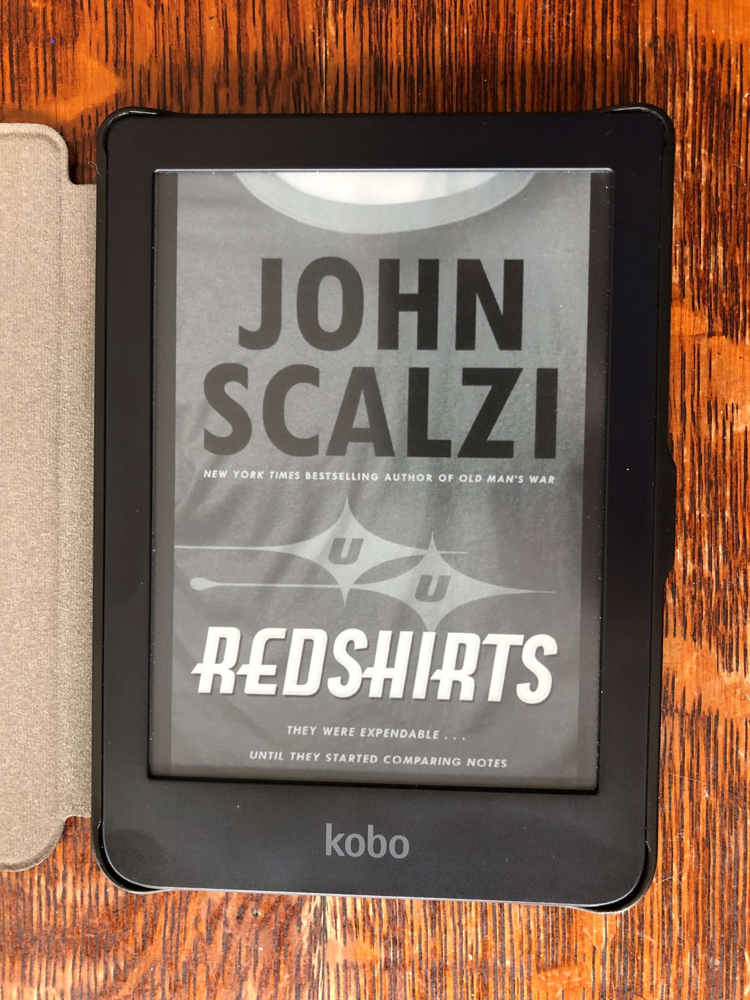
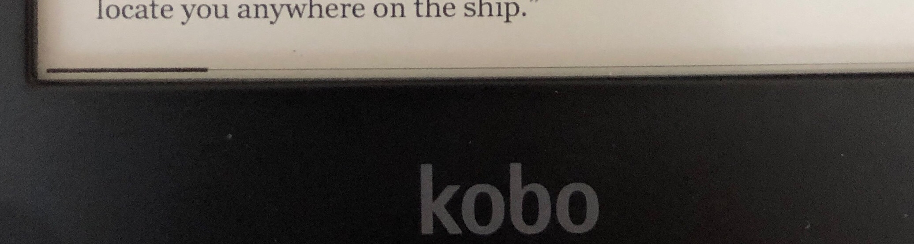
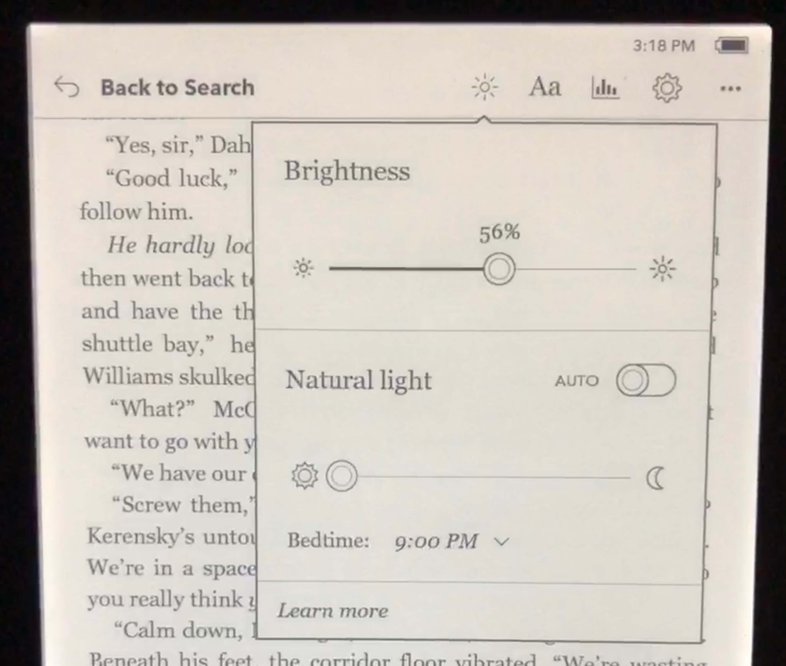
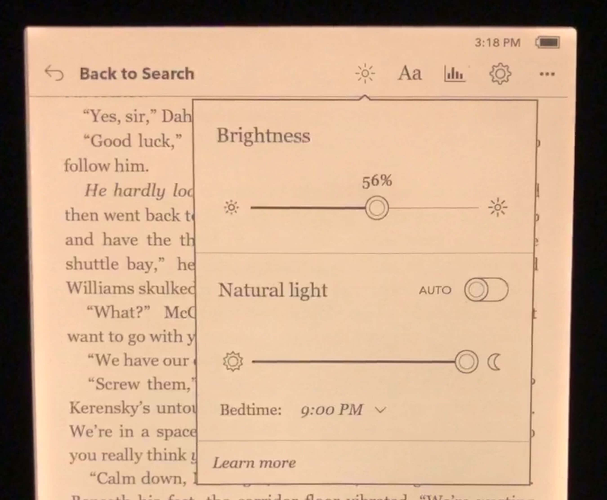
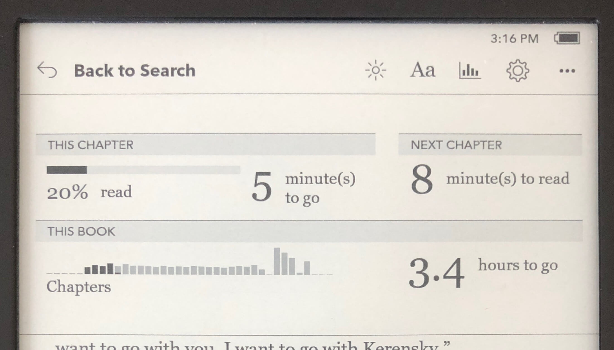

I was on the fence for a while when it came to ebook readers. First as a physical book holdout, then as a "well, my iPad is good enough". I didn't understand the magic of e-ink screens until I read a whole book using one (courtesy of my very patient girlfriend and a beach vacation). After that, I knew I needed one of my own.

My tech purchasing journey started, as it usually does, at the [Wirecutter](https://thewirecutter.com/reviews/amazon-kindle-is-the-best-ebook-reader/). I imagined that I'd get a Kindle, as it's far and away the most popular device. Popular is good - it means there'll be lots of cases and better community support.[^1] But, I had some reservations.

Firstly, kindles can't read `epub` files.[^2] Instead, they deal with Amazon's proprietary `mobi` and `azw` file types. I've amassed a significant collection of DRM-free `epub` books (though publishers like [TOR](https://www.tor.com/), who don't apply DRM to any of their titles) and didn't want to go through the hassle of converting them.[^3] That was strike one.

<!-- prettier-ignore -->
Secondly, there's no looking past the fact that ads are a huge part of Amazon's business. I don't mind product suggestions when I'm shopping around, but I don't need that for books. I also didn't love how the device's lock screen is an ad (unless you shell out an extra $20 to have something more neutral). It rubbed me the wrong way. Strike two.

Lastly, the tracking. The amount of user tracking that happens on Kindle is [well documented](https://www.theverge.com/2020/1/31/21117217/amazon-kindle-tracking-page-turn-taps-e-reader-privacy-policy-security-whispersync). While it might enable some nifty features, it still skeeved me out. I like to think of my eBook reader as a more convenient book, so I'd prefer it be as "dumb" as possible.[^4] Strike three and it's out of here.

Given a reasonable alternative, I was going to look elsewhere for my e-reader needs. Luckily, Wirecutter had a non-Amazon suggestion.

The **Kobo Clara HD**, on the other hand, ticks all the boxes. It can read my `epub` collection out of the box, no conversion needed. The lock screen is always the cover of the book I'm reading. Based on my reading habits (10-20 minutes per day), the battery lasts at least two months. I also love how customizable the the reading UI is. Besides basic font and sizing options, it lets me choose what info (if any) is shown at the header and footer of the page. One of the options is a pixel-high line at the very bottom of the screen that indicates how far through the book I am. Never in my face, but constantly informative.

Maybe my favorite feature is blue-light level controls for reading at night (which I almost always am). This sort of thing should be familiar if you've used tools like [f.lux](https://justgetflux.com/) or similar.

Looking up unfamiliar words is breeze via an onboard dictionary, plus dedicated google and Wikipedia buttons. I even found out while writing this post that it will handle slight structural issues in files gracefully.[^5]

Most importantly, I'm in control of the device. It's a tool I use to read books, nothing more. I use it almost entirely offline, and it's totally fine with that. I get on wifi periodically to download library books or do a firmware update, but that's it. I add new books by plugging the Kobo into my computer and using [Calibre](https://calibre-ebook.com/) to transfer files.[^6] I thought having to plug the device in to transfer books would be annoying (that's so iTunes circa 2008), but it hasn't been an issue. Would I use an official Dropbox integration if there was one? Totally. This isn't much of a burden though.

I've had my Kobo since January 2019 and it's invigorated my lifelong love of reading. It contributed to an [uptick in reading that year](/blog/post/my-favorite-media-of-the-year-2019-edition/#books). It's been a stalwart companion during this quarantine too, let me tell you.

[^1]: If I do run into an issue, it's likely another Kindle owner has has had the same problem and posted about it online
[^2]: `epub` is open standard for digital books, much like `mp3` is the standard for music
[^3]: Though the software works _pretty_ well, I'm a stickler for good-looking ebooks. I don't like to spend my reading time fussing with formatting inconsistencies.
[^4]: I feel the same way about TVs - just give me a fancy screen I'll bring the rest
[^5]: In my specific case, I had a [tool](https://github.com/xavdid/epub-wordcount) that was choking over a slightly malformed XML table of contents. Apple Books didn't parse it correctly, nor did my CLI tool. Kobo did though!
[^6]: It's still not great, but it's better than anything else. Community support and the [Kobo plugin](https://www.mobileread.com/forums/showthread.php?t=211135) are invaluable though
