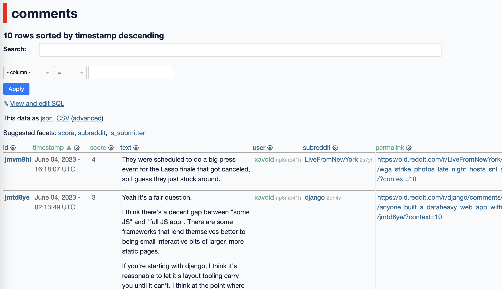

_tl;dr: I [wrote a tool](https://github.com/xavdid/reddit-user-to-sqlite/) to make a searchable archive of your Reddit data. I'd suggest downloading and running it before **June 30th, 2023**._

---

If you're an active Reddit user, you may have heard about impending [changes to its public API](https://www.reddit.com/r/reddit/comments/12qwagm/an_update_regarding_reddits_api/). This move will have widespread impact on Redditors, including [the death of beloved](https://old.reddit.com/r/apolloapp/comments/144f6xm/apollo_will_close_down_on_june_30th_reddits/) 3rd party clients and some subreddits even [going dark indefinitely](https://old.reddit.com/r/ProgrammerHumor/comments/141qwy8/programmer_humor_will_be_shutting_down/). These changes mark the beginning of the (apparently) [inevitable enshittification](https://pluralistic.net/2023/01/21/potemkin-ai/#hey-guys) of Reddit as a platform. Realizing this bummed me out more than I expected the death of a website might.[^1]

I've been a fairly active Redditor for more than 11 years. Until now, it's been the website with the best mix of community, popularity, developer ecosystem, and web-search-ability.[^2] The non-monetary value Reddit as a knowledge store is literally priceless; it's a modern-day Library of Alexandria. So when I saw the writing on the wall, I became worried about the most valuable thing I'd contributed to Reddit: my posts and comments.

I've posted many stories, jokes, and (dare I say) insightful comments on Reddit over the years. When I heard the news, I realized I'd be upset if I wasn't able to access my contributions anymore. I'll occasionally want to go back and find specific comments I made years ago, a task which the web UI doesn't make simple (there's a lot of clicking "next page" involved).

Reddit _does_ have a feature to [export your data into a GDPR archive](https://www.reddit.com/settings/data-request), but it's pretty barebones - only the plaintext of the comment, the subreddit name, the timestamp, and weirdly, the number of awards. Unfortunately, the highest fidelity data comes from the API, which is exactly what's going to be changing/worsening soon. So it felt urgent to create an archive of my personal API data.

The venerable [SQLite project](https://www.sqlite.org/about.html) allows storing structured, searchable data in a single file. This leads us to my project, `reddit-user-to-sqlite`. It's a small Python tool which builds an archive of all of your posts and comments. You can read all about it here: https://github.com/xavdid/reddit-user-to-sqlite/

Running it requires a bit of comfort with the command line, but being able to paste 3 commands into a terminal will get you what you need:

1. [install pipx](https://pypa.github.io/pipx/installation/)
2. run `pipx install reddit-user-to-sqlite`
3. run `reddit-user-to-sqlite user YOUR_USERNAME_HERE`

After running, you'll get a database file that you can use with [Datasette](https://datasette.io/):

Each column is sortable and you can perform full-text search on your comments (and posts):

Your content being in a database means it's easy to get insights about your usage. For instance, I can see the amount of karma I've gotten from each subreddit, or where I comment the most.

The tool also supports reading data from a GDPR archive, which will continue working after the API is shut down (albeit with some data missing, like `score`). See [the docs](https://github.com/xavdid/reddit-user-to-sqlite/#archive) for more info.

Best of all, your content is yours again. Once it's archived, it's in a file that they can never take away from you. (No matter what stupid things they keep doing to the platform.) The `reddit-user-to-sqlite` will update an existing database with new data if you run it again, so feel free to run it periodically to keep your archive up-to-date.

I've got no clue what will happen after the API terms have changed. If you're going to create an archive, make sure to do it **before June 30th, 2023**.

Let me know if you have any questions or come across any issues. I'll try to get them fixed before the deadline. Until then, happy archiving!

[^1]: I wasn't actively rooting for Twitter's downfall (at first), but I was certainly mourning what it was (and could have been)
[^2]: Sorry Discord; I just wish you were a public-facing website and I could google your messages
