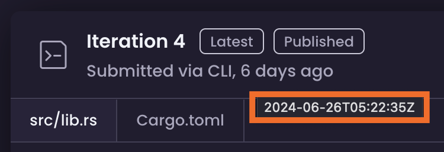
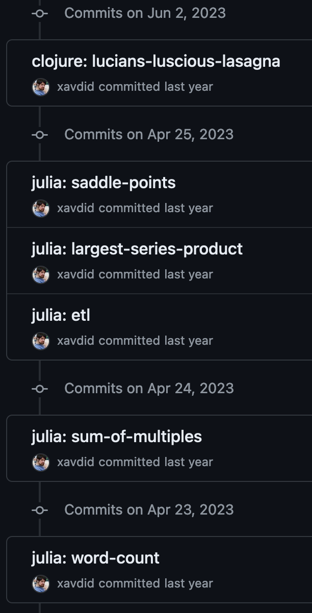

Though I'd been solving Exercism puzzles for well over a year, I hadn't taken the time to put my solutions in a git repo (publicly accessible or otherwise). Once I realized, I considered running `git init`, committing everything, and calling it a day.

But because I use Exercism to learn new programming languages, it was important to me to see how my code changed over time. If I had dumped everything into an `initial commit`, my entire [`12in23` journey](/blog/post/12-languages-in-12-months/) and current [`48in24` progress](https://exercism.org/challenges/48in24) would be compressed into a single day's work.

I was vaguely aware that you could arbitrarily declare when a commit was written (which enables [fun contribution graph art](https://github.com/gelstudios/gitfiti)), but I had never tried it. Assuming it wasn't complicated, I still needed to know when each of my solutions had been submitted to Exercism (that information is visible when you hover `N days ago`, so it definitely exists):



Building a nicely-committed repo after the fact (which, spoilers, [totally worked](https://github.com/xavdid/exercism/commits/main/)) ended up being more interesting than expected, so I thought I'd talk a bit about the process. Let's get to it!

## Pulling Data

Though the entirety of the Exercism platform is [open source](https://github.com/exercism/website), there are no public API docs (since there's not really a user-facing API). Unfortunately, the API that powers [my profile page](https://exercism.org/profiles/xavdid/solutions) didn't have the exact data I needed. Luckily for me, Discord user `@clechasseur` saved me a ton of time and [pointed me towards](https://discord.com/channels/854117591135027261/1231408735604445234/1231430369757106246) the (authenticated) `https://exercism.org/api/v2/solutions` endpoint.

I had a feeling this script would take a lot of iteration to get right. Rather than hit Exercism repeatedly while I worked, I cached all of the API responses locally using a simple `zsh` loop:

```sh
for p in {1..5}; do
    curl "https://exercism.org/api/v2/solutions?page=$p" \
    -H 'authorization: Bearer <YOUR TOKEN HERE>' > "solutions/$p.json"
done
```

Note that:

- I hardcoded the total of 5 pages, which came from the `meta.total_pages` property in the response. I could have done this dynamically, but I don't like shell scripting and this was simple.
- Your token can be found on [this settings page](https://exercism.org/settings/api_cli) or in the output of the `exercism configure` command if you've set up the CLI locally.

Running this produces a folder of 5 `.json` files, which is markedly less useful than a single file with the exact data we need; let's bridge that gap.

## Data Transformation

Exercism supports many programming languages, each of which has a unique slug to identify it across the site (like `python` or `rust`). Individual exercises, which can be written in most languages also have slugs (like [scrabble-score](https://exercism.org/exercises/scrabble-score) or [luhn](https://exercism.org/exercises/luhn)).

The combination of language & exercise slug uniquely identifies a solution. So to create a repo with all of my solutions committed, I needed both slugs, plus the submission date for every exercise. The solution data we downloaded before has all that info:

```json
// 1.json
{
  "results": [
    {
      "uuid": "29232df08b2046a791bdfeaa34d1bb85",
      "private_url": "https://exercism.org/tracks/elixir/exercises/log-level",
      "public_url": "https://exercism.org/tracks/elixir/exercises/log-level/solutions/xavdid",
      "status": "published",
      "mentoring_status": "none",
      "published_iteration_head_tests_status": "passed",
      "has_notifications": false,
      "num_views": 0,
      "num_stars": 0,
      "num_comments": 0,
      "num_iterations": 1,
      "num_loc": 30,
      "is_out_of_date": false,
      "published_at": "2023-02-06T02:16:51Z",
      "completed_at": "2023-02-06T02:16:51Z",
      "updated_at": "2024-01-06T14:55:37Z",
      "last_iterated_at": "2023-02-06T02:16:44Z",
      "exercise": {
        "slug": "log-level",
        "title": "Log Level",
        "icon_url": "https://assets.exercism.org/exercises/log-levels.svg"
      },
      "track": {
        "slug": "elixir",
        "title": "Elixir",
        "icon_url": "https://assets.exercism.org/tracks/elixir.svg"
      }
    }
    // ...
  ],
  "meta": {
    "current_page": 1,
    "total_count": 97,
    "total_pages": 5
  }
}
```

Unfortunately, it's split across 5 files and unsorted. I also got some duplicate solutions from the API. So before proceeding, I needed to combine, sort, and deduplicate all of this JSON. Sounds like a job for perennial favorite `jq`. It's a simpleish 1-liner:

```sh
jq --slurp '[.[] | .results[] | {uuid, last_iterated_at, track: .track.slug, exercise: .exercise.slug, status}] | map(select(.status != "started"))| unique | sort_by(.last_iterated_at)' solutions/* > all_solutions.json
```

The `--slurp` flag combined separate JSON objects (sourced from multiple [lines](https://jsonlines.org/) or files) into a single big array, which was perfect here.

The `jq` filter itself is dense, but understandable:

```jq
[ # wrap the result of this filter into an array
  .[] # for each response in the array
  | .results[] # for each item in "response.results"
  | { # return an object of this shape
      uuid, # uses shorthand to pluck out a key and give it the same name
      last_iterated_at, # equivalent to `last_iterated_at: .last_iterated_at`
      track: .track.slug, # can also explicitly rename or extract subfields
      exercise: .exercise.slug,
      status
    }
] # now, using that array...
| map( # return a new array where each element has the following applies
    select( # return input if condition is true, otherwise skip
      .status != "started" # ignore started, but unfinished solutions
    )
  )
| unique # remove duplicates
| sort_by(.last_iterated_at) # order resulting objects
```

You can also [explore this filter interactively](https://jqplay.org/s/TB14TBWLP9bB0Hz).

> If you want to get better at `jq`, Exercism actually has [a jq track](https://exercism.org/tracks/jq) for just that purpose!

Running this on my collection of response files produced `all_solutions.json` which has exactly the data I need to build a repo:

```json
// all_solutions.json
[
  {
    "uuid": "29232df08b2046a791bdfeaa34d1bb85",
    "last_iterated_at": "2023-02-06T02:16:44Z",
    "track": "elixir",
    "exercise": "log-level",
    "status": "published"
  }
  // ...
]
```

Now we were cooking! This path to this file would act as input to the next step.

## Building a Repo

Next it was time to put it all together. For each solution in my big list, I needed a program that:

1. ensured the solution files existed locally
2. parsed the UTC date into a Pacific one (accounting for daylight savings time)
3. `git add`ed the relevant folder and backdated a commit

Normally this is something I'd use Python for, but [my goal](/blog/post/12-languages-in-12-months/#wrapping-it-up) of getting comfortable with Rust meant I wanted to give that a try first.

### Parsing Solution Info

> Bear in mind that, in contrast to my other programming tutorials, I'm writing in a language I'm medium-familiar with at best. The code works, but it may not be the best or most efficient approach.

The shell of my script was simple. I passed the path to my big solution file as the only arg and used [serde-json](https://github.com/serde-rs/json) to parse out the solution info:

```rust
use std::env;
use std::fs;

use serde::Deserialize;

#[derive(Deserialize, Debug)]
struct Solution {
    // uuid: String, // unused
    last_iterated_at: String,
    track: String,
    exercise: String,
    // status: String, // unused
}

fn main() {
    let args: Vec<String> = env::args().collect();

    if args.len() != 2 {
        panic!(
            "Expected exactly 1 argument (a path to a bunch of JSON), got {} instead",
            args.len() - 1
        );
    }

    let solutions_path = &args[1];
    let json_str = fs::read_to_string(solutions_path)
        .unwrap_or_else(|_| panic!("failed to read file at path {solutions_path}"));
    let solutions: Vec<Solution> =
        serde_json::from_str(&json_str).unwrap_or_else(|err| panic!("Unable to parse JSON: {err}"));
}
```

The program did some basic input validation and panicking with nice messages, but nothing too fancy.

### Preparing the Filesystem

Conveniently, the working directory created by the Exercism CLI is well-formed. Exercise files live in sub-folders matching their track and exercise slugs: `path/to/exercism/<TRACK>/<EXERCISE>`. When iterating over the solution, verifying it exists locally is as simple as checking if the matching folder exists. If it doesn't, we can shell out to the Exercism CLI to download it.

Rust made that pretty easy to do:

```rust
// ...
use std::path::Path;
use std::process::Command;

// helper for shelling out & handling errors
fn run_command(cmd: &mut Command) {
    let result = cmd.output().expect("unable to execute command");

    if !result.status.success() {
        panic!(
            "\ncommand `{:?}` exited unsuccessfully: {}",
            cmd,
            String::from_utf8(result.stderr).unwrap()
        );
    }
}

fn main() {
    // ...

    for solution in solutions {
        // don't need to back up these
        if solution.exercise == "hello-world" {
            continue;
        }

        let exercise_path = format!("./{}/{}", solution.track, solution.exercise);
        let path = Path::new(&exercise_path);
        if !path.exists() {
            println!(
                "!! missing {}.{}, downloading...",
                solution.track, solution.exercise
            );

            // exercism download --track=go --exercise=luhn
            run_command(
                Command::new("exercism")
                    .arg("download")
                    .arg("--track")
                    .arg(&solution.track)
                    .arg("--exercise")
                    .arg(&solution.exercise),
            );
        }
    }
}
```

Separate from anything `git` related, this program archived all of my solutions locally. Pretty useful already!

### Datetime Parsing

Exercism's timestamps were in UTC, but I mostly work in Pacific time [^1]. I was surprised to learn that `git` was very accepting of not-quite-valid timestamps. For instance, using PDT in January (which should be PST) didn't bother it at all.

In the interest of accuracy, I wanted all of the timestamps to be well-formed, so it was time to learn the ins-and-outs of time zones in Rust. This ended up being the trickiest part of the whole thing (because of course it did).

> I would have ordinarily preferred to do this in `jq` directly, but [jqlang/jq#1912](https://github.com/jqlang/jq/issues/1912) prevented me from getting the output I wanted. So, Rust it is.

I ended up using the [chrono](https://github.com/chronotope/chrono) crate, which was very full-featured (if a little overwhelming):

```rust
// ...
use chrono::NaiveDateTime;
use chrono::TimeZone;
use chrono_tz::US::Pacific;

// ...
fn main() {
    for solution in solutions {
        // ...
        let naive_time =
            NaiveDateTime::parse_from_str(&solution.last_iterated_at, "%Y-%m-%dT%H:%M:%SZ")
                .unwrap();
        let local_time = Pacific.from_utc_datetime(&naive_time);
    }
}
```

### Backdating Commits

All that remained was to make the actual commits themselves. While I thought this would be hard, it turns out it's only a [couple of environment variables](https://stackoverflow.com/a/68764314/1825390) and a standard `git` invocation:

```rust
// ...

fn main() {
    // ...

    run_command(Command::new("git").arg("init"));

    for solution in solutions {
        // ...

        run_command(Command::new("git").arg("add").arg(exercise_path));

        run_command(
            Command::new("git")
                .env("GIT_COMMITTER_DATE", local_time.to_string())
                .env("GIT_AUTHOR_DATE", local_time.to_string())
                .arg("commit")
                .arg("-m")
                .arg(format!("{}: {}", solution.track, solution.exercise)),
        );
        println!("committed {}.{}", solution.track, solution.exercise)
    }
}
```

You can see [the completed script here](https://github.com/xavdid/exercism/blob/main/_meta/repo-builder/src/main.rs).

## Conclusion

I put that all together and got a [nicely committed repo](https://github.com/xavdid/exercism/commits/main/) which shows commits over time for my trouble:



While Rust's speed and memory safety footprint weren't especially important for this project, it felt good to write practical Rust code (instead of toy examples). I've had an enlightening 6 months with the language and am looking forward to more!

[^1]: an assumption that continued throughout this script; it wasn't worth trying to cross reference my calendar to see when I was traveling when writing specific solutions.
