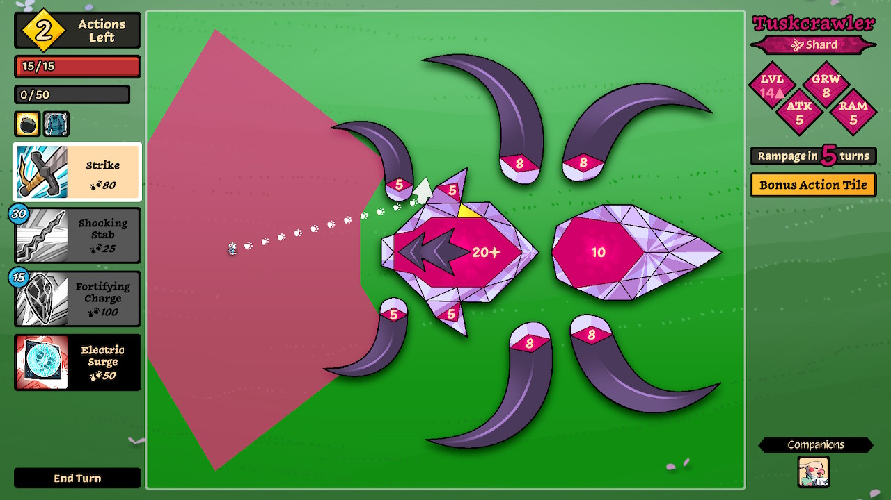
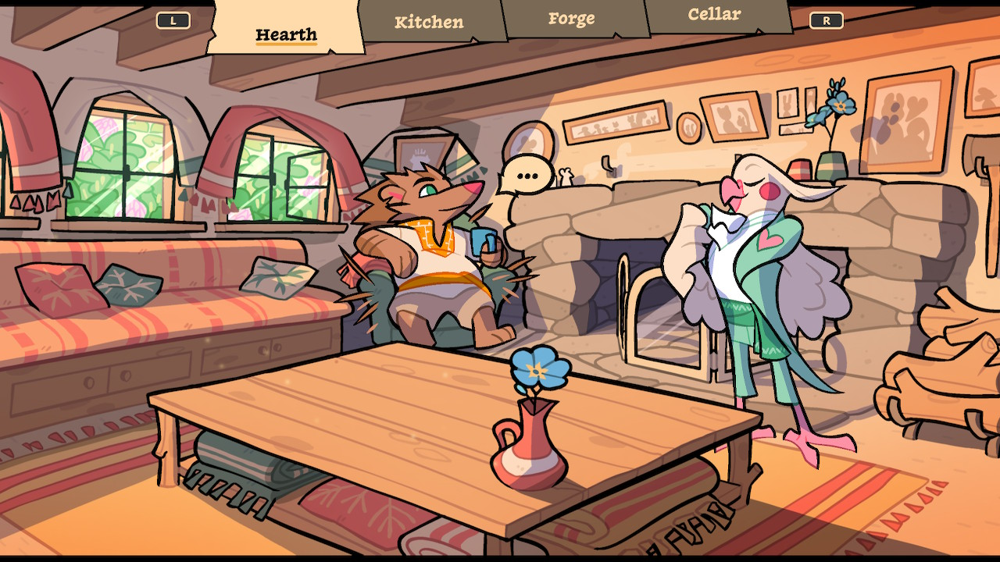
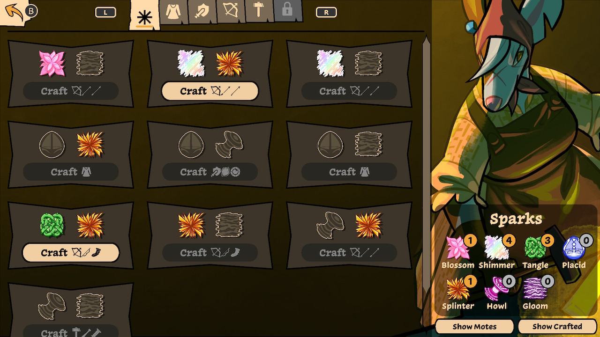
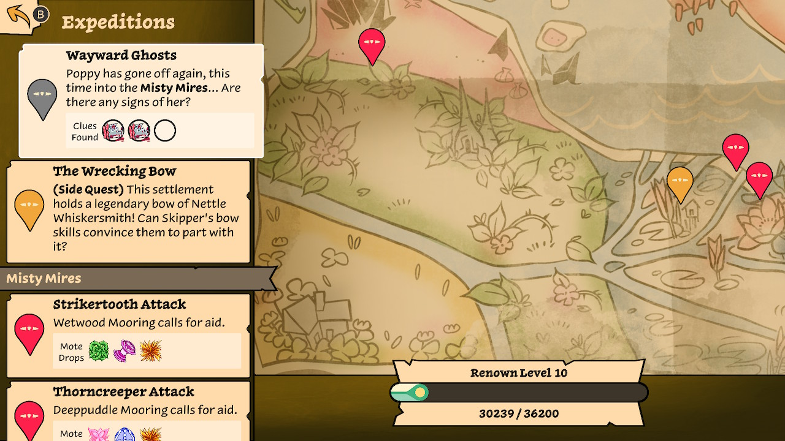
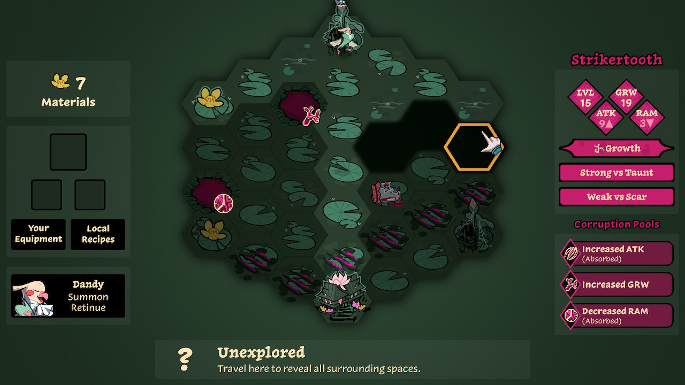

[Beast Breaker](https://vodeo.games/bb) is a newly released game from [Asher Vollmer](https://twitter.com/ashervo) [^1] and studio [Vodeo Games](https://vodeo.games). The basic pitch is:

<BlockquoteTitle>
  What if you were playing a billiards RPG, but your cue ball was you, an
  adorable warrior mouse armed with a variety of pointy objects?
</BlockquoteTitle>
 
<YoutubeEmbed youtubeId="SZhqedzllLE" />

You are Skipper, an intrepid field mouse venturing out from your cozy home farm to save your land from vicious beasts. Most of your playtime is spent battling said beasts, armed with your weapon of choice, a couple of potions, and a companion by your side.

## The Heat of Battle

The main gameplay in _Beast Breaker_ consists of a series of turn-based battles against the eponymous beasts. The beasts consist of a few pink targets known as "cores" surrounded by protective “scales,” plus all manner of nasty claws/teeth/tails/etc. To win, you must destroy the vital core, denoted below with a ✨sparkle.

Each turn, you use one of your abilities to fling yourself in a given direction, much like the cue ball on a pool table. The basic sword attack, for example, sends you 80 paces and you deal 1 damage to a core each time you ricochet off. Each bounce also generates "charge," which you can spend on one of your other three abilities. Which abilities you have available depends on which equipment you brought (more on that below). Each round, there's also a randomly placed special yellow scale. If you can pop it, you get a big bonus for the turn (exactly what, again, depends on your equipment). The choice between aiming to damage a beast now (by hitting a core), setting up for damage later (by destroying scales) or scoring a bonus prompts compelling decision making with every action.

Once you've used two actions, the beast has a chance to attack. Its target zones are clearly marked while you plan, but it can be tricky to end your turn in a safe zone. Movement isn't _random_, but it's unpredictable; your long travel paths make it tough to know where you'll stop. This hint of the unexpected was appreciated. It's an elegant way to bring variety into battles that could otherwise become repetitive.

Though battles are turn based, they don't last forever. The beast wins after the number of turns on its "rampage" counter, which decreases every turn. The countdown can be reset by killing _any_ core, providing a further strategic decision making: should you focus on a weak core to reset the rampage, or focus your efforts on the main core that actually wins you the battle? This mechanic was frustrating at first, but I ended up appreciating the pressure. You're a small mouse against a giant beast -- you don't want to feel like you've got all the time in the world. The hopelessness I felt watching the counter drop to zero after I had wasted a turn on a missed shot was a great motivator for better planning in the future.

## Taking a Breather

After your victory, you head back to the family farm. It consists of a few screens:

- The hearth and kitchen, where you can chat with a colorful cast of anthropomorphic animals
- The forge, where you can spend your hard-won resources on new gear
- The mission selection screen, where you can choose your loadout and next mission

The little chats with friends are a good way to take a break from the action. The characters are colorful and likable. Though you can't gift to or court them, the whole chatting system feels very _Fire Emblem_: you mostly hear about their backstory or what's on their mind. The real excitement at the farm comes from the other rooms.

### Choosing the Right Tool

Within the farm is the forge, your one-stop-shop for crafting new equipment. Each weapon has 4 unique abilities with a range of effects. Some inflict status ailments while others deal big damage at the expense of mobility.

In addition to the sword & shield described above, you can wield a bow & arrow, a big hammer, and more. Each class dramatically changes your ability set and battle style. While the sword is all about calculated bouncing strikes, the bow & arrow are all about ranged attacks that require careful preparation. The hammer, on the other hand, requires you to get close to the beast and stay there; your bravery is rewarded with tons of damage. Each weapon also has its own resource system (actions, ammo, and inertia, respectively). The weapon sets drastically affect how battles play out, which I thought was another superb way to introduce battle variation.

Once you've picked your kit, you proceed to the mission selection process.

### On the Road Again

Missions are separated into gold "main" missions and red side quests. You're mostly free to choose your own adventure, but there are certain sections where the game forces you to pick up some side quests before continuing. It's probably for the best; doing quests yields valuable resources for the forge.

Ultimately, each outing is justified with a "this town is under attack! Please stop the beast before it's too late!". It would have been nice to get some variety in motivation, even if they all _do_ end in a battle. There are a couple of quests where you're restricted to using a particular weapon type (in order to "show off" for the locals in exchange for a new weapon), but those are few and far between.

Once you've picked a destination, it's time to scout the beast.

## On the Hunt

You're dropped into a [hex grid](https://www.youtube.com/watch?v=thOifuHs6eY) covered in [fog of war](https://en.wikipedia.org/wiki/Fog_of_war#In_video_games); the beast lurks somewhere nearby. You and the beast alternate turns; your time is spent exploring the grid and picking up resources to purchase single-use items at a local shop.

Along the way, you'll come across the beast's tracks (or the beast itself). Once you spot it, you learn about its weaknesses and elemental type, which in turn informs your item purchasing decisions. You can't take too long though -- the beast spends its turns seeking out and absorbing powerful corruption pools. The more pools it finds, the harder the ensuing fight becomes. You thus have to balance your time carefully. Should you explore more thoroughly to stock up on items? Or try to find the beast while it's still weak and risk going in unprepared?
One of the strengths of this game is the way it presents so many decision-making opportunities, rarely with an easy “right” answer. The hunt is one such example.

Once you feel prepared (or the beast catches you unawares), it's back into [battle](#the-heat-of-battle) and the gameplay loop begins anew.

## The Verdict

_Beast Breaker_ nails every inch of its design. The [self-described](https://vodeo.games/about) "cozy-crunchy" aesthetic totally landed for me. I enjoyed getting to know the game’s colorful cast and what brought them to our farm.

The core game design is _strong_, constantly presenting the player with interesting and impactful choices. The core gameplay loop is similarly compelling. There's very little randomness at play here -- your success depends on your ability to line up shots in an optimal way. I also loved how much variety there was between the battles themselves. The enemy type, your weapon choice, and items all change over time, keeping battles fresh. What seems simple on the surface has much to master.

For improvements, I would have liked to see a bit more mission diversity; there are only so many towns that can be under attack _right now_. I would have also enjoyed voice acting during cutscenes. The art and music in this game is _so_ lovely that the silent characters really stick out. I realize it's a small studio and choices have to be made (good VA is expensive!), but it was definitely a noticeable omission. Lastly, it's never made explicit what "renown" is for. It _may_ be a factor in unlocking new levels, but there's never an explicit "reach renown level X to unlock this level!". Lastly, I played on Switch. Performance was mostly great except for some very noticeable frame drops (especially when using the Bow & Arrow).

Bottom line, _Beast Breaker_ is an absolute delight in my book. It combines turn-based RPGs and billiards in a new, exciting, and unexpected way.

<BlockquoteTitle>
  ⭐️⭐️⭐️⭐️
   
   
  Superb turn-based gameplay, chock-full of interesting decision making.
</BlockquoteTitle>

---

_Beast Breaker is available on [Nintendo Switch](https://www.nintendo.com/games/detail/beast-breaker-switch/) and on PC/Mac via the [Epic Games Store](https://www.epicgames.com/store/en-US/p/beast-breaker)._

_This review was written using a free Switch code provided by the developer. The free nature of that code didn't influence the conclusions of this review in any way._

_[Read more](/blog/post/on-the-rating-of-media/) about my 4-point rating scale._

[^1]: Most widely known as the co-creator of iOS hit [Threes!](https://apps.apple.com/us/app/threes/id779157948)
