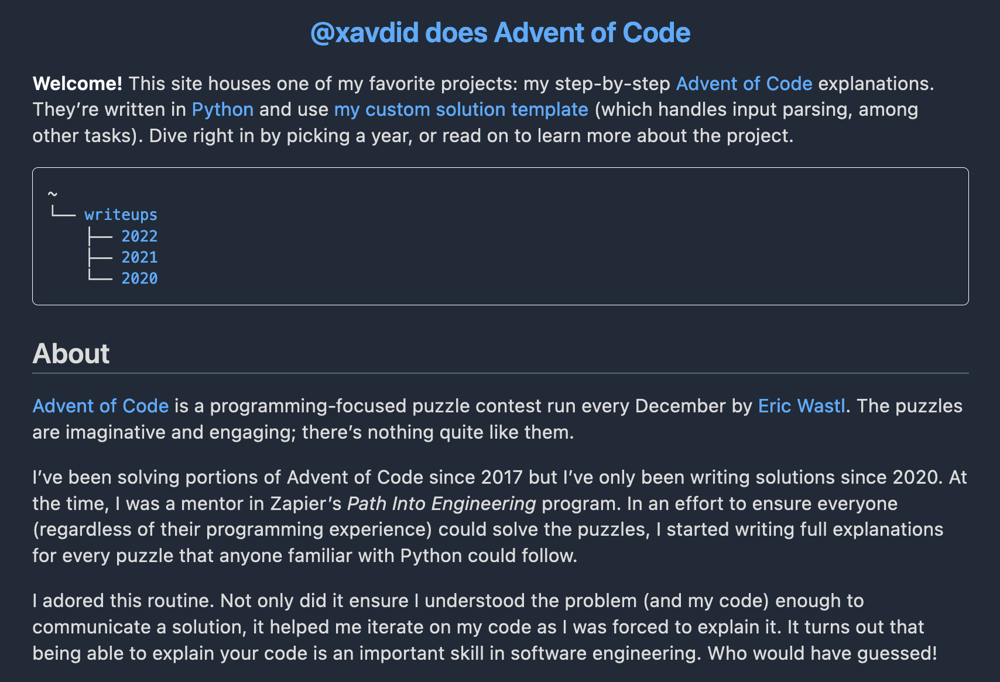
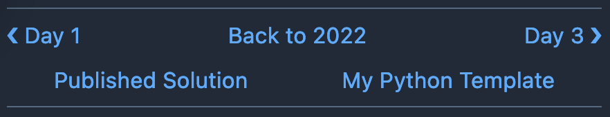

It's no secret: [Advent of Code](https://adventofcode.com/) is one of my favorite events of the year. They're great puzzles and it's fun to have a big community working on the same thing at the same(ish) time. The puzzles get pretty hard though, especially towards the end of the month. AoC is a great way to be exposed to new concepts, but it's hard to know what you don't know when faced with something you've never seen before. So, in an effort to ensure that anyone (regardless of skill level) can complete every puzzle, I started documenting my solutions, step-by-step.

This turned out to be a great exercise. Talking through my solution helped me see them with fresh eyes and improve them as I went. Also, doing that much writing was helpful for my development as a writer. Having to turn out a post a day meant I didn't have time to edit (much), so I had to focus on a clear explanation on the pass to get something out the door. This also helped me be less precious about my writing; I used to agonize over producing a perfect post. Now I'm much more willing to not let perfect be the enemy of published.

Over the last 3 years, I wrote 75 of these solutions. I'd link people to them directly on GitHub, [like this](https://github.com/xavdid/advent-of-code/tree/7a661a36d1cfe03f513937b9ebbee323c07ed27e/solutions/2022/day_01). It was a pretty good system and made it easy to see my published solution, but it lacked any customizability. I was proud enough of my writeups that I wanted to give them more of a showcase. Thus, a new site was born. Check it out:

    <b>
        <Link href="https://advent-of-code.xavd.id/">advent-of-code.xavd.id</Link>
    </b>

I think it turned out great! Let's talk about what tech I used to build it (and why).

## Static Site Generator

When I started planning this site in earnest, I wanted to do it as simply as possible. I had already written all the content so I just needed a nice way to render the markdown. Should be simple enough. Plus, I had a larger project I wanted to get to before I hit my busy season.[^1] This site is (currently) built with [Gatsby](https://www.gatsbyjs.com/), but its GraphQL layer was overkill. I had tried [Eleventy](https://www.11ty.dev/) before, but didn't love their templating system. I settled on [Astro](https://astro.build/), a newish generator I had heard some good buzz about.

First and foremost, Astro impressed me with its great DX. It had a CLI, VSCode extension (to handle its custom `.astro` files) and its templates made it easy to scaffold a generic blog that I could tweak to my liking. It handled markdown out of the box and it generated plain, un-mangled HTML. It has [great docs](https://docs.astro.build/en/getting-started/) and seems very well thought out. So, a slam dunk!

For the site structure itself, I knew I wanted to make the urls simple; things people could type off the top of their head. I settled on `/writeups/<YEAR>/day/<DAY>`, which follows the structure of Advent of Code. `/writeups/2022/day/1` felt more readable than `/writeups/2022/1`, so I followed their lead. This also leaves an option for other top-level pages (maybe coming soon 😉).

## Writeup Migrations

Now that I knew where the files would live, I needed to actually move all my existing solutions (all 75 of them!) into the places Astro expected them. This was easy enough to do in a Python script, since I had [some prior art](https://github.com/xavdid/advent-of-code/blob/878fa5cd04d16b415c2d026e3b0950e66a6e4dcf/misc/pad_day_migration.py) from when I had renamed a bunch of folders before.

You can see the [full script here](https://github.com/xavdid/advent-of-code/blob/bbb3b834531c9eda8f753fbcb316688aea4ef598/misc/move_readmes.py), but the `tl;dr` is that I broke it into 3 steps:

1. (`git`) move the `README.md` files from `solutions/<YEAR>/day<2-DIGIT-DAY>/README.md` to `blog/src/content/writeups/<YEAR>/<DAY>/README.md`, creating any destination subfolders as needed
2. Leave a placeholder at the old path, pointing to the new one ([like this](https://github.com/xavdid/advent-of-code/blob/main/solutions/2022/day_01/README.md)). It was important to me that I not break any existing links to GitHub READMEs. If I were clever, I would have done this as part of step 1, but it didn't occur to me when I was writing that code
3. Add frontmatter (little bits of `yaml`) to the top of each README, providing necessary metadata for the writeup (such as its published date, the year/day of the puzzle, and the puzzle's thematic title).[^2] This was important so I write code to find and handle the writeups.

With those tasks out of the way, I had actual data getting built! I also took this opportunity to make the [All Writeups page](https://advent-of-code.xavd.id/writeups/) and the [year-specific pages](https://advent-of-code.xavd.id/writeups/2022/), which Astro's [Content Collections](https://docs.astro.build/en/guides/content-collections/) made very simple.

## Styles

Generating the HTML was well and good, but making it look nice was a whole different ball game. This is my personal Achilles Heel in web development. I'm handy enough with CSS, but it's tough to make In the spirit of trying new things, I kicked the tires on the extremely popular HTML-only styling framework, [Tailwind](https://tailwindcss.com/). You add its CSS file and then, by the magic of adding a bunch of specifically-named classes to your HTML elements, styles happen! Which is a very slick concept (albeit not a new one).

Despite being very powerful, Tailwind's default experience of stripping every user-agent style and leaving me with unstyled content put me off of it. I appreciated the simplicity and power of being able to design everything from scratch with little fuss, but I wanted something that would minimize the amount of styles I had to write myself. Plus, by just starting with it, I had to learn all of its shorthand (`px` is `padding-x`, etc). This pain presumably lessens once you've worked with it a lot, but that didn't help me here. Plus, my UI was so simple that it felt like overkill. I did like its approach to responsive and darkmode-specific styles (prepending `dark:` or `m:` to other directives) so it's something I'll keep in mind for future projects with more complex UI requirements.

In the end, I went with [water.css](https://watercss.kognise.dev/), a drop-in stylesheet that I didn't have to touch at all. I did some manual layout tweaking, but basically all of the presentational styles came for free. Kevin Lee Drum kindly [let me know on Mastodon](https://hachyderm.io/@kevinleedrum/111223152852956282) that these are known as "classless CSS frameworks" and pointed me to a [big list of them](https://github.com/dbohdan/classless-css). They'll definitely be something I'll use in the future.

## Layout

As mentioned, my UI requirements for this project were intentionally barebones. Mostly text, headings, and code, centered on the page. I had some minimal navigation UI, but otherwise kept the project fairly svelte. My one exception was the navigation links at the bottom of the page, which were the last thing I did before writing this post. I wanted back/forward buttons, plus some other links (to [my template](https://github.com/xavdid/advent-of-code-python-template) and the finished solution). I got these in a nice row on desktop views, but I expected folks would read these on mobile as well. Unfortunately, flexbox was failing me when I shrunk that UI down, so I decided to learn one final thing: [CSS Grid](https://css-tricks.com/snippets/css/complete-guide-grid/). I'd heard of it, but never actually tried it.

I'm largely pleased with the result. I could do one big bar on desktop and have it nicely split into two rows on mobile:

There are some minor visual balance issues, but it's close enough to what I pictured that I'll stick with it for now.

I mostly followed [this guide from MDN](https://developer.mozilla.org/en-US/docs/Web/CSS/CSS_grid_layout/Realizing_common_layouts_using_grids) to define individual buttons and their two layouts. Best of all, nothing moved when I neglected to render an element (such as on Day 1, when there was no previous day to go back to). Despite some [brief, humorous hiccups](https://mastodon.social/@xavdid/111248994613780189), it was a largely painless experience. CSS Grid is clearly a powerful layout tool and one I'll likely want to learn more about when future projects demand it. You can see the full nav button setup [in this component](https://github.com/xavdid/advent-of-code/blob/main/blog/src/components/NavControls.astro).

---

And that did it! The [whole thing](https://github.com/xavdid/advent-of-code/pull/2) took about 5 days all told (mostly evenings, but some time during my weekend as well). I'm very pleased with how it turned out and am more excited than ever to dive into Advent of Code 2023.

Please [let me know](/contact) what you think of the site, if you've read or learned from my solutions, or if you're an educator interested in using them in a pedagogical setting.

Take care!

---

_note: the social media image for this post is from the [Python Discord](https://github.com/python-discord/branding/blob/cd0eedc98ffdaa1d0d8689e6e1205fe2969b3c5f/events/christmas/banners/banner.png) and used under `CC BY-NC-SA 4.0`_

[^1]: December will be full of Advent of Code itself, writing my [end-of-year review](/blog/tags/yearly-review), and another post I have planned for December, not to mention the normal slate of family activities
[^2]: A bit of regex could pull the title out of the existing README, but I had to go and add the date published to every post manually (since I couldn't reliably infer it from the commit information). This was annoying, but didn't take too long.
