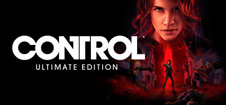
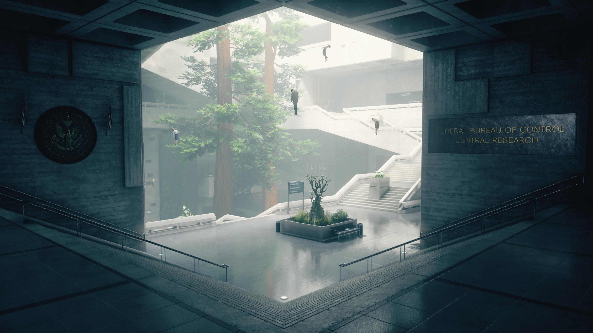
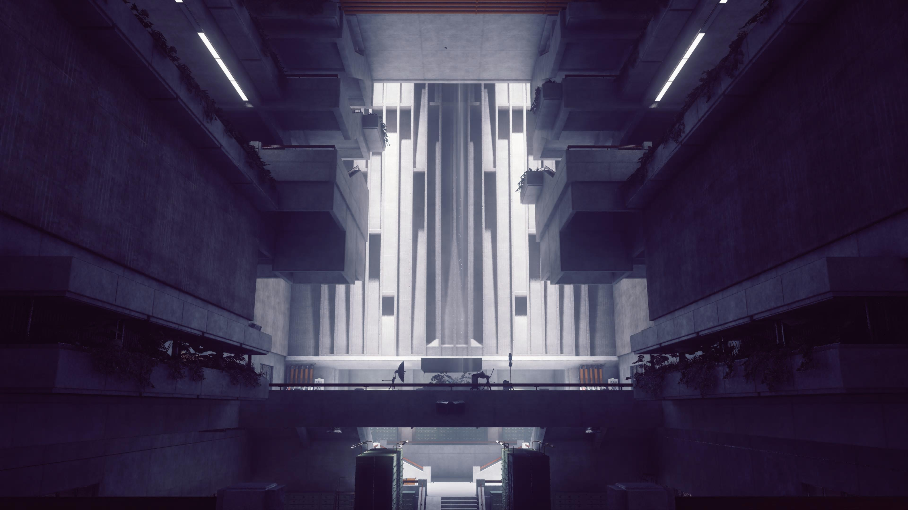
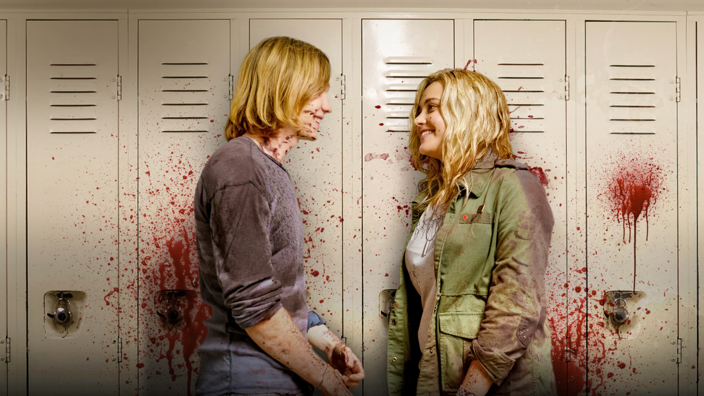
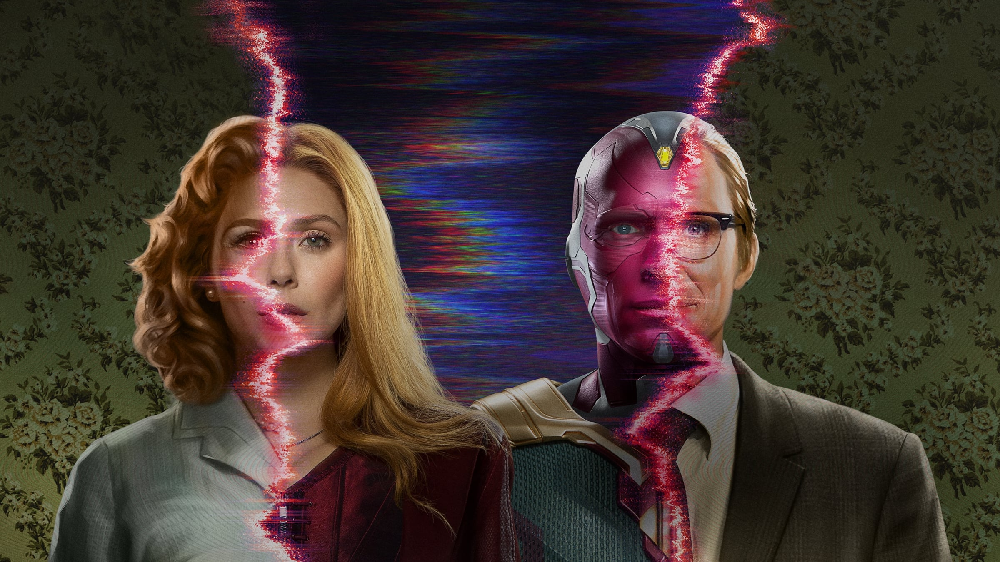
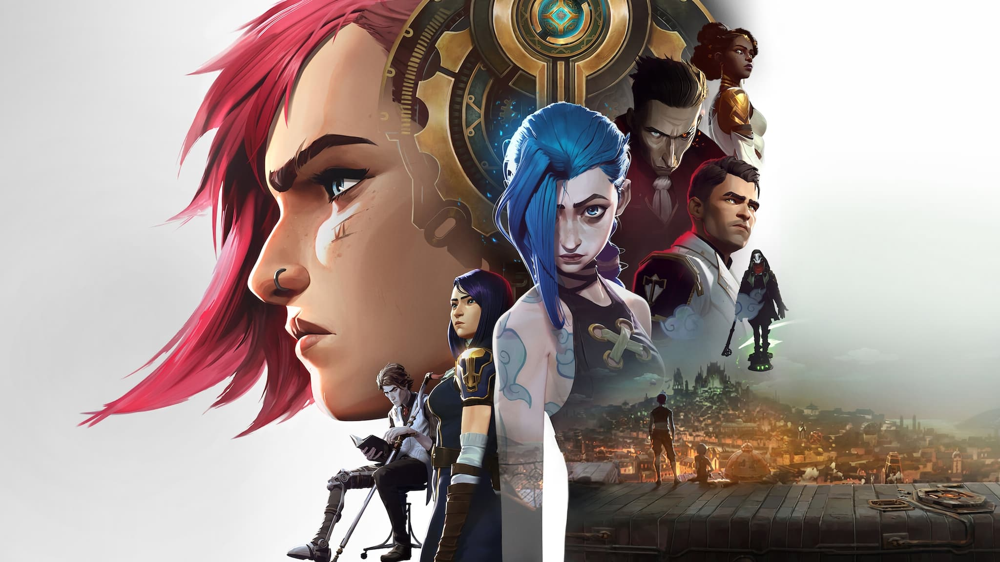
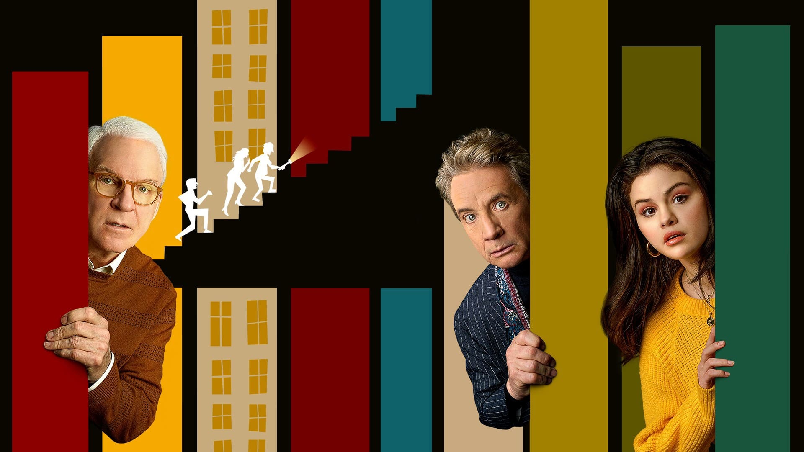
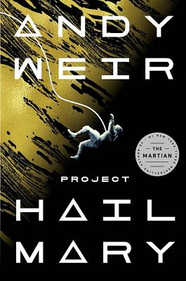
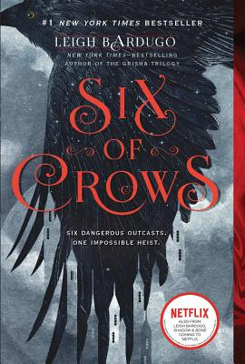

Welcome one and all to my 6th annual "favorite media of the year" post! This year has been one of many changes, so I've enjoyed the stability that coming back to this yearly ritual brings. I've had ample time to enjoy media this year (_thanks_, infinitely ongoing pandemic); this is the cream of that crop.

My selection process is unique. Winners follow a strict set of rules:

1. To qualify, media must be new to _me_ during the calendar year 2021.
2. Winners aren't necessarily the "best" of the year (that's hard to quantify). Instead, they're the items I _enjoyed_ the most.
3. Typically, a winner earned 4 stars on [my media rating system](/blog/post/on-the-rating-of-media/).

Each category includes a link to the entire list of eligible items. Feel free to click through to see micro-reviews and ratings for everything that didn't make the cut.

Finally, this post was edited expertly and patiently by my now-wife (!!!) [Vicky Stein](https://vickystein.media/). Her thoughts are added as _Editor's Notes_ where relevant.

Without further ado, let's get to it!

<h6 id="TOC" />

#### Table of Contents

<!-- START doctoc generated TOC please keep comment here to allow auto update -->
<!-- DON'T EDIT THIS SECTION, INSTEAD RE-RUN doctoc TO UPDATE -->

- [Videogames](#videogames)
- [Movies](#movies)
- [TV Shows](#tv-shows)
- [Books](#books)
- [Updates on Previous Picks](#updates-on-previous-picks)
- [tl;dr](#tldr)
- [Fin](#fin)

<!-- END doctoc generated TOC please keep comment here to allow auto update -->

## Videogames

This year, I finished 55 games in ~537 hours (down from 58 in 674h in 2020). Of the 53 that were beatable, I saw credits roll for 40 of them. That's a lower completion rate than normal, largely because I tried out Apple Arcade, a Netflix-style game subscription service. I tried a bunch of games I might not otherwise have taken a chance on, but many didn't land for me. Past that, I've been enjoying the Switch, PC, and PS5 (!!; great hardware, games haven't quite caught up yet). So many games, so little time!

This year was also the first time I reviewed a game using a free code provided by the developer. It was a learning experience, and I appreciate the team at [Vodeo Games](https://vodeo.games/bb) for taking a chance on me. If you like what you read below, check out my full [review of Beast Breaker](/blog/post/beast-breaker-review/).

Each of the games I've called out below does something special, surprising, or unique. They're each worth your time in one way or another.

---

### Thronebreaker: The Witcher Tales

_Thronebreaker_ wowed me with its commitment to its theme: a long story told over many games of cards (specifically, Gwent, the card game from _The Witcher_'s universe). Everything in this game happens by way of your in-game card collection or a match of Gwent. Get a new party member? You just earned yourself a hero card to add to your deck. Make allies with the dwarves? A host of dwarven units are now available. Someone died? Say goodbye to their card. Your collection grows as you play, allowing you to experiment with new combos and strategies. But, it's 100% single-player and offline, so you get the fun of one of those free-to-play card games with none of the in-game purchases.

A remarkable amount of storytelling is told via Gwent matches. It's easy to imagine a skirmish with bandits being told through a battle, but it doesn't stop there. There's a mission where you have to protect a supply wagon- it exists as a card on your field. You have to kill enemy units before they manage to destroy your wagon. Another mission finds your party caught in a rockslide. Instead of _telling_ the player "oh no, a rockslide!", the game _shows_ you what happens: you're cast into a battle where "Rock" cards slowly make their way across the field at your vulnerable hero. You have to escape or destroy them before you run out of time. These sorts of puzzles show up all over the map. There are many side missions that consist of a single turn during which you have to manage your resources perfectly. These feel like a big departure from a standard battle where anything can happen. Instead, they're meticulously designed puzzles. Many RPGs have puzzles, but rarely are they this intricate or interesting. It almost felt like doing little crosswords.

Lastly, I'd be remiss if I didn't mention the story. The plot was pretty good, but what really stood out was how impactful my choices were. Characters come, go, live, and die based on how you treat each situation. Thinking back, I think some of my most excruciating in-game choices came from _Thronebreaker_. You're a nationless monarch in a war -- you have to make tough decisions re: supplies and the fate of your once-subjects at every turn. How you diffuse (or exacerbate) each situation affects the world and your party around you in a remarkably _real_ way. It goes a long way towards making the world feel real and reactive. All 30 hours are fully voice-acted, too.

Ultimately, the game feels both familiar and unique. Minute to minute, it's really just games of Gwent and exploring the overworld, but its beauty lies in its depth and attention to detail.

_[Thronebreaker: The Witcher Tales](https://thewitcher.com/en/thronebreaker-witchertales) is available on most platforms; I played it on Switch without complaint._

---

### Control

_Control_ really landed for me in two main areas: gameplay and presentation. First off, it's fun. You play as Jesse, the newly minted (and deeply bewildered) director of the "Federal Bureau of Control" (the secretive 3-letter agency that investigates supernatural activity). You're thrust into this role unexpectedly (you just came to this building to get info about your brother), so you spend a lot of time getting the lay of the land and meeting your subordinates. To do so, you explore an ever-changing 80s-style office building/industrial factory fighting ghost zombies with your paranormal powers in order to unravel the mystery of why this agency you run even exists. Yeah.

To accomplish this, you're given a growing arsenal of standard video game guns (pistol, sniper rifle, shotgun, etc), which you can upgrade over time. I played _Control_ on PS5 and this is one of the few games I've played so far that uses the adaptive controls in the DualSense controller to great effect. Each gun has a unique trigger feel and vibration pattern, which feels very next-gen and definitely helped with the immersion. You also develop psychokinetic powers, like throwing objects and dashing in midair. These powers _feel_ great and succeed in a place where many other games don't. You feel powerful and otherworldly, and not like you've just been gifted a standard-issue ability. The very destructible environment helps support this: when you throw a desk, papers go scattering and the chair you hit explodes into wood shards.

Speaking of the environment, it's a _v i b e_. Every inch of this ethereal office building is meticulously designed. It mixes marble, wood paneling, brutalism, industrial factories, and cubicle farms, and wallpaper into this fascinating monolith of a building. I honestly don't know enough about architecture to name all of the bits, but _Control_ does a miraculous job designing a style and implementing it impeccably. See also: the retro-futurism in _Loki_, [below](#honorable-mentions-1).

From top to bottom, _Control_ felt fresh and interesting. They do a good job making sure the gameplay elements are supported by the setting and ultimately, it's just fun as heck.

_[Control](https://controlgame.com/) is available on most platforms; I played on PS5 and enjoyed the console-specific features_

---

### What the Golf

_What The Golf_ is a zany collection of physics-based micro-puzzles. Each one only takes about 30 seconds, but there's a huge variety of them. Sometimes you're trying to get the ball in the hole; other times, you putt the hole into the ball. Many of the levels have only the barest resemblance to the game of "golf".

<YoutubeEmbed youtubeId="NyNpPWvw1eU" />

There's arrow shooting, rocket-flying, canoe paddling, a first-person section, an anti-gravity level, and every variety of golf ball you can imagine. I was in constant stitches as I played. Whatever I expected to happen invariably didn't; it was a masterclass in subverting my expectations. If you've ever played anything like the _Warioware_ series, you'll feel right at home here. I savored every minute of _What the Golf_.

_[What the Golf](https://whatthegolf.com/) is available on PC, Switch, and Apple Arcade; I played on iPad and enjoyed the touch controls_

---

### Runner(s) Up

#### It Takes Two

The gameplay is the star of the show here. _It Takes Two_ is a puzzle-platformer designed to require two players. The puzzles aren't _playable_ with two players, they're specifically _designed_ for it. I especially liked the asymmetric nature of many puzzles. For example, Player 1 gets a gun while Player 2 gets sticky explosives that need to be shot by said gun. It's only by working together that the characters can progress. Best of all, the new puzzle mechanics don't overstay their welcome. There's new gear for each level and around the time you feel like you've mastered them, it's time for something new. The level variety is great as well -- being tiny allowed us to explore the world from a new perspective. Many games have done "small character in a big world", but none have done it half as well. I also liked the mini-games you find along the journey. Being able to play an inconsequential competitive game in the midst of a very co-op experience was a great little break. (_Editor's note: David found these games very fun in part because he could very easily trounce me, a non-controller-fluent person, at basically 100% of them. For me, the loser in each game, they were less thrilling._) The overarching story is trite, but there's a specific scene that really affected us emotionally in a way that games can struggle to pull off. (_Editor's interjection: I also didn't find this scene as compelling as David did - in fact, it almost lost me entirely and if they'd pulled anything like that again I'd have stopped playing. To each their own!_) The platforming is top tier, but that scene (you'll know it when you see it) really cements _It Takes Two_ as a memorable experience for me.

_[It Takes Two](https://www.ea.com/games/it-takes-two) is available on PS, Xbox, and PC. I played it on PS5; it looked great, but didn't take advantage of the DualSense_

---

#### Monster Boy and the Cursed Kingdom

I almost skipped buying _Monster Boy_, even on sale. It looked cartoonish and simplistic, the kind of game that could have come from a CD you found in a cereal box. Well dang, I'm glad I took a shot on it. It's a [metroidvania](https://en.wikipedia.org/wiki/Metroidvania) where you can transform into many animal forms: a pig, snake, frog, etc. Their unique abilities grant you new combat abilities and traversal opportunities. Each new form feels unique enough to justify its inclusion in the game. They even power up over time! Coupled with an equipment system and many secrets to find and revist, there's much to enjoy as you explore the magical, hand-animated kingdom. _MB_ also wins the title of "Game With the Single Catchiest Soundtrack Song I Heard All Year": give [Village Theme](https://www.youtube.com/watch?v=OGbD3XdYlJY) a listen to see why I visited the town so often (there's also a [banjo cover](https://www.youtube.com/watch?v=0i7XNpQEtik) included in-game as an easter egg)! _Monster Boy_ was a blast to play and is far more than the sum of its parts.

_[Monster Boy and the Cursed Kingdom](https://www.monsterboy.com/) is available on most platforms; I played on the Swtich and it ran flawlessly_

---

### Honorable Mention(s)

- _[Ape Out](https://www.apeout.com/)_: You're a gorilla escaping an office building; this does not bode well for the guards. Great physicality, visual, and audio design. Short but sweet. The dynamic jazz soundtrack that matches your pace and attacks is novel and unique. (_Editor's note: This one hurt my eyeballs._)
- _[Assemble With Care](https://www.assemblegame.com/)_: A cozy, meditative game where you repair items for folks. Typically this involves re-wiring or replacing components. It's simple, but fun and tactile. I liked the way they interwove the story with the gameplay (each item you work on is emotionally important to a character and you find out why).
- _[Bugsnax](https://bugsnax.com/)_: It's a weird, _Pokémon Snap_-style game where you try to capture a collection of animal / snack hybrids that populate an island. You're also unraveling the mystery of where the local biologist went. The cast of characters grows on you, and the emergent gameplay is interesting. There's many ways to corral each "bugsnack" and you have to use your tools (and the environment) together effectively. I played on a PS5, and each usable item had a unique trigger feel, my first real experience with the new controllers. It added a surprising depth to the game! (_Editor's note: I loved that there were very cute queer relationships in this game, and the story got real weird in mostly a good way. I enjoyed this one for sure._)

<AirtableLinkAndReturn
  items="games"
  verbed="played"
  year="2021"
  link="https://airtable.com/shr485AcU9b5IIGr8"
/>

## Movies

This year, I saw 167 movies total; 93 new ones (down from 227 & 102 in 2020; we're now living in our own house, so we aren't doing as many family movies as we were last year in group lockdown). 2 of those were in theaters (up from 0 the year before): _Shang-Chi_ (great!) and _Eternals_ (yikes!). With any luck, that'll be even higher during 2022.

---

### The Gentlemen

_The Gentlemen_ felt like a return to form for director Guy Ritchie; an energy I've been missing since I watched _Snatch_ in high school. It was a well-paced journey through a great frame story. The cast is stacked and the characters are appropriately eccentric. It manages to equal parts hysterical and brutal. It's got the hallmark gangs of fast-talking British gangsters we've come to enjoy from a Ritchie flick, and I'm grateful for it.

_[The Gentlemen](https://www.justwatch.com/us/movie/the-gentlemen) is available for purchase on major digital platforms_

---

### Luca

Pixar's 2021 offering, _Luca_, is a delightful tale set in a cute Italian seaside town. It follows a pair of sea monsters that try to blend into a human town and get sucked into a bike race to help their new friend. It captures the carefree vibe of a summer vacation and the effortless hopefulness of young folks on an adventure. I had fairly medium expectations and came away from the film deeply charmed. The characters were fun and the whole thing warmed my dang heart.

_[Luca](https://www.disneyplus.com/movies/luca/7K1HyQ6Hl16P) is available on Disney+_

---

### Runner(s) Up

#### Spontaneous

_Spontaneous_ is sort of an odd movie, but one that stuck with me. It's a rom-com about high school kids (who spontaneously explode). It becomes apparent that the premise is a metaphor for school shootings- sometimes your peers are gone in an instant and there's really [no way to prevent it](https://en.wikipedia.org/wiki/%27No_Way_To_Prevent_This,%27_Says_Only_Nation_Where_This_Regularly_Happens). The movie is sort of fun; there's a certain gory excitement when you know another one of these kids is about to pop like a blood-filled balloon. But it also follows their search for meaning and purpose in a world where life can disappear in an instant. I was impressed with its ability to walk that line gracefully. Definitely glad I saw it.

_[Spontaneous](https://www.hulu.com/movie/spontaneous-01d095fc-b08b-4fe0-b5ca-dbe1636336b7) is available on Hulu_

---

### Honorable Mention(s)

- _[Red Notice](https://www.netflix.com/title/81161626)_: This will win no awards and challenge you in no ways, but dang if it wasn't fun to watch. High octane action heist with a stunningly charming cast.
- _[Spider-Man: No Way Home](https://itunes.apple.com/us/movie/spider-man-no-way-home/id1598961641)_: Long-time readers might be surprised to find this so low on my list. In many ways, this is the Spider-Man movie I've waited my whole life for. But, it only came out in theaters during the upswing of a pandemic, and I was disappointed there wasn't a safe way to watch it.

<AirtableLinkAndReturn
  items="movies"
  verbed="saw"
  year="2021"
  link="https://airtable.com/shr4iViLJWgwS7pxZ"
/>

## TV Shows

This year, I finished 39 new seasons of TV, spanning 425 episodes in roughly 184 hours (plus a few re-watches); up from 30 seasons in 2020. We are truly living in a golden age of television.

---

### WandaVision Season 1

_WandaVision_ succeeds in many ways. Most importantly, it succeeds as a love letter to the history of TV sitcoms. As someone who watched a lot of the shows that inspired this one, the crew absolutely nailed the tone. The cast is good and the new (and returning) characters crush it. Throughout the run, you knew _something_ was up, but the slow burn to finding out exactly what was behind that creepy feeling was a rush. The initial WandaVision watching experience also felt unique because it felt like _everyone_ was watching as it aired. It had been a while since there was a true "water cooler show"- maybe the last season of _Game of Thrones_. It's unfair to other shows for WV to get points for this, but it really helped enhance the experience. Some Marvel works struggle to stand alone, but this stuck the landing.

Once you've watched it, be sure to check out the Disney+ series _Assembled_- it's a making-of series about all the Marvel content they've made recently. Many great interviews and behind-the-scenes footage. The WandaVision episode is especially fascinating.

_[WandaVision](https://www.disneyplus.com/series/wandavision/4SrN28ZjDLwH) is available on Disney+_

### Arcane Season 1

Even as a longtime League of Legends player, I had low expectations here. I've never played LoL for the lore and wasn't sure how they'd adapt the world to a purely narrative format. I've never been so happy to be proven wrong. Arcane is simply divine. It tells a story about a pair of sisters struggling in an undercity beneath an otherwise prosperous metropolis; there's a big upstairs/downstairs vibe. The plot follows competing factions, each vying for power and control over the future of emerging technology. They each have their own motivations and it's a blast seeing how and why they each fight.

<YoutubeEmbed youtubeId="fXmAurh012s" />

Each frame is impeccably designed. The story was compelling in a way I wouldn't have thought possible. Unsurprisingly, the fight choreography was chaotic and exciting. Riot Games and animation studio Fortiche brought so much life to characters both familiar and new. They created a living, breathing city out of a place we'd only heard of occasionally. Most of all, it was accessible. You don't need to know anything about the existing world to enjoy this as a work of standalone fiction. The character drama is gripping and heartfelt; it's easy to get sucked right in.

So please. _Please_. Sit down and give this triumph the attention it deserves.

_[Arcane](https://www.netflix.com/title/81435684) is available on Netflix_

### Only Murders in the Building (Season 1)

_Only Murders in the Building_ follows a trio of true-crime enthusiasts (Steve Martin, Martin Short, and Selena Gomez) investigating the murder of a fellow tenant in their apartment building. Naturally, they start a podcast documenting their progress. I loved the way the story unfolded - there's much more going on than meets the eye. It hit the genre of true crime podcasts the same way that classics like _Galaxy Quest_ lampooned and exemplified sci-fi movies. It pokes a lot of fun at podcasts like _Serial_, but it also delivers a similarly satisfying experience. The supporting cast is stellar, too. Plus, it's a murder mystery! Who doesn't love those. We were glued to the screen throughout its run and we're ready for more!

_[Only Murders in the Building](https://www.hulu.com/series/only-murders-in-the-building-ef31c7e1-cd0f-4e07-848d-1cbfedb50ddf) is available on Hulu_

### Honorable Mention(s)

- _Hilda_ is a cartoon about a precocious girl's weekly adventures in the town of Trollburg. It's beutifully animated and chamring throughout. I'd consider it magical realism- there are all manner of magical creature, but everything else is normal- cars, apartment buildings, etc. The plots are great and the cast engaging. Good for all ages!

- _Loki_'s plot was fine and the characters were enjoyable, but the production design really sold me, of all things. I've always enjoyed [brutalist](https://en.wikipedia.org/wiki/Brutalist_architecture) architecture and it's on _full_ display in the Time Variance Authority. All of their other fixtures and backgrounds had this [retrofuturism](https://en.wikipedia.org/wiki/Retrofuturism) vibe to them- a lot of neat angles, colors, and materials. The cast was good and the mysteriousness of the plot was fun, but I don't think it'll stand on its own well. It's got the [Age of Ultron](https://en.wikipedia.org/wiki/Avengers:_Age_of_Ultron) problem -- it's fun in the moment, but ultimately exists to set up other stories in the [MCU](https://en.wikipedia.org/wiki/Marvel_Cinematic_Universe). Tom Hiddleston's charm goes a long way though, and I enjoyed the time I spent with it. (_Editor's note: I love Owen Wilson in this too._)

<AirtableLinkAndReturn
  items="shows"
  verbed="saw"
  year="2021"
  link="https://airtable.com/shrpWmkvsy40368aO"
/>

## Books

I read 20 books this year, (up from 19 the year before). 4 of this year's "reads" were audiobooks. I had the chance to get back into the (home) gym this year, so I was able to recover some podcast/audiobook time I had lost the year before. The rest were digital books, read on my [Kobo](/blog/post/an-ode-to-kobo/).

---

### Project Hail Mary

Andy Weir (of _The Martian_ fame) has a new book out, and it's a blast. It's basically another iteration of "[Space Mistakes](https://www.youtube.com/watch?v=FBFuiHZRylY), the book", but it's done well. It treads familiar ground but expands on his previous stories by adding linguistics into his tried-and-true mix of chemistry, engineering, and physics. I liked the way the story jumps between the present (where our hero is confined to a mysterious ship with no memories of how he got there) and the past (figuring out how/why he got there). It's a fun, sci-fi romp throughout and I love the directions the story went. Weir does it again!

### Runner(s) Up

#### Six of Crows & Crooked Kingdom

As longtime readers will know, I am an absolute sucker for a good heist and/or con. So, it's little surprise that Leigh Bardugo's heist duology landed for me. _Six of Crows_ and _Crooked Kingdom_ are a pair of books that comprise parts 1 and 2 of a single story. It takes place in a fantasy world (which the author had set up in a previous series that I haven’t read) where a small percentage of the population has magical abilities. The story focuses on the members of a street gang planning the ultimate heist against an impenetrable fortress. Sounds fun, right? I found myself really enjoying the characters; they mix together into an eclectic stew, but one that goes down easy. They're all there for different reasons, but they're forced to work together toward their myriad goals. I loved the twists and turns standard in any good heist and enjoyed the way the magic was important to the plot, but not overpowering. Bits of the first book (along with other stories in the universe) have recently been adapted into a [Netflix show](https://www.netflix.com/title/80236319), which we also generally enjoyed.

### Honorable Mention(s)

- _The Long Way to a Small, Angry Planet_: I had sort of a love/hate thing going with Becky Chambers' debut novel. There was a bit of eye-rolling when it came to unnecessary romantic pairings - I didn't expect the romance in a book I assumed was about space politics. But, at its core, it does what sci-fi does best: it imagines a world reminiscent of, but distinct from, our own. A lot of time and effort is spent explaining each character's elaborate gender journey, which didn't feel relevant to the story. But it makes sense that other planets wouldn't have a gender setup like ours and learning to navigate that would be a very real need for an intergalactic society. Given that, it helps the reader re-examine how we interact in our own society. And dang it if that's not what sci-fi is all about.
- _Dark Run_: Another heist-y space romp that wears its _Firefly_ inspiration on its sleeve. It doesn't do anything revolutionary, but it executes well and kept me engaged throughout. It's the first in a series by Mike Brooks and I look forward to reading the rest. Incidentally, there's now a licensed _Firefly_ book series that I haven't gotten around to. I'm curious to (eventually) see how it compares.

<AirtableLinkAndReturn
  items="books"
  verbed="read"
  year="2021"
  link="https://airtable.com/shrzjaehk9OTeJYQC"
/>

## Updates on Previous Picks

A rapid-fire list of updates on picks from [last year](http://localhost:1234/blog/post/favorite-media-2020/). In no particular order:

- _Death Stranding_ got a PS5 "director's cut", which added, among other things, a kart-racing mode and a catapult.
- _Ted Lasso_ had a second season, darker than the first. Had some filler, but told a mature, enjoyable story. Still worth watching.
- I read the sequel to _Senlin Ascends_ and loved it. The final book (of 4) came out, so I can now safely start the penultimate book.
- _Central Park_ aired the first half of its second season. It lacked much of a through-line and wasn't as good as the first. Hopefully they turn it around in the back half!

## tl;dr

- Games
  - [Thronebreaker: The Witcher Tales](https://thewitcher.com/en/thronebreaker-witchertales)
  - [Control](https://controlgame.com/)
  - [What the Golf](https://whatthegolf.com/)
  - Runner Up: [It Takes Two](https://www.ea.com/games/it-takes-two)
  - RU: [Monster Boy and the Cursed Kingdom](https://www.monsterboy.com/)
  - Honorable Mention(s):
    - [Ape Out](https://www.apeout.com/)
    - [Assemble With Care](https://www.assemblegame.com/)
    - [Bugsnax](https://bugsnax.com/)
- Movies
  - [The Gentlemen](https://www.justwatch.com/us/movie/the-gentlemen)
  - [Luca](https://www.disneyplus.com/movies/luca/7K1HyQ6Hl16P)
  - RU: [Spontaneous](https://www.hulu.com/movie/spontaneous-01d095fc-b08b-4fe0-b5ca-dbe1636336b7)
  - Honorable Mention(s):
    - [Red Notice](https://www.netflix.com/title/81161626)
    - [Spider-Man: No Way Home](https://itunes.apple.com/us/movie/spider-man-no-way-home/id1598961641)
- TV
  - [WandaVision](https://www.disneyplus.com/series/wandavision/4SrN28ZjDLwH)
  - [Arcane](https://www.netflix.com/title/81435684)
  - RU: [Only Murders in the Building](https://www.hulu.com/series/only-murders-in-the-building-ef31c7e1-cd0f-4e07-848d-1cbfedb50ddf)
  - Honorable Mention(s):
    - [Hilda](https://www.netflix.com/title/80115346)
    - [Loki](https://www.disneyplus.com/series/loki/6pARMvILBGzF)
- Books
  - [Project Hail Mary](https://www.andyweirauthor.com/books/project-hail-mary-hc/project-hail-mary-el)
  - RU: [Six of Crows](https://www.leighbardugo.com/book/six-of-crows/)
  - Honorable Mention(s):
    - [The Long Way to a Small, Angry Planet](https://www.otherscribbles.com/#/thelongway/)

## Fin

That should do it! I genuinely appreciate you reading this far. If you're looking for further recommendations in any of these categories, please don't hesitate to [get in touch](/contact)! Until next time!
