> Hello and welcome to the 7th annual summary of the games, movies, and books I consumed over the past year! This year has been a bit different for me with some big life changes, including starting a new job at [Stripe](https://stripe.com/), but I've still managed to find time to enjoy some great entertainment. In putting together this list, I included any games, movies, or books that I finished within the calendar year, regardless of their release date. I hope that this list will give you some ideas for things to check out and maybe even spark some interesting discussions.

...is how ChatGPT decided to open this blog post. Seriously, that thing is uncanny.[^1]

It is right though- I've been at this for 7(!!) years. Whether you've read every prior post or this is your first, welcome; I think we're in for some fun. This year was loaded with fierce competition in every category, so we've got a truly excellent list to go through.

My list is unique because only things I finish for the first time qualify for inclusion. This leads to slates you won't find elsewhere and "X-of-the-year" lists like no other. Furthermore, my [4-point rating scale](/blog/post/on-the-rating-of-media/) measures my personal enjoyment, not what is objectively the "best". If we have similar media tastes, you should find many gems in this list. If we don't, uh, thanks for reading anyway! I hope we overlap somewhere.

Lastly, I can't produce this alone. Much of this media was selected in compromise with my ever-wonderful editor/partner-in-crime, [Vicky Stein](https://vickystein.media/). She also did a bang-up job editing this post for clarity and spelling errors. Her thoughts are added as (_Editor's Notes_) where relevant.

That should cover it as far as intros go. Buckle in!

---

#### Table of Contents

<!-- START doctoc generated TOC please keep comment here to allow auto update -->
<!-- DON'T EDIT THIS SECTION, INSTEAD RE-RUN doctoc TO UPDATE -->

- [Videogames](#videogames)
- [Movies](#movies)
- [TV Shows](#tv-shows)
- [Books](#books)
- [Updates on Previous Picks](#updates-on-previous-picks)
- [Just the List](#just-the-list)
- [Ta Ta For Now](#ta-ta-for-now)

<!-- END doctoc generated TOC please keep comment here to allow auto update -->

## Videogames

This year, I finished 60 games over 784 hours (up from 55 in 537h last year). I saw credits roll in 44/59 of the beatable ones. Microsoft's Gamepass continues to be an incredible value, and the Switch and PS5 continue to be great. On a personal level, I've done some great [deal hunting](/blog/post/gaming-on-a-budget/) this year and am just about at to-play queue capacity (which has now been nicely re-categorized in Airtable). As a result, I'm pledging not to buy any additional games during 2023. I've done it once before (on a $20 bet), and I think I can do it again (for my own sanity, if nothing else).

As you can tell by the size of this list, I played some great games this year. They each wowed me in a different way and are well worth your time.

### Triangle Strategy

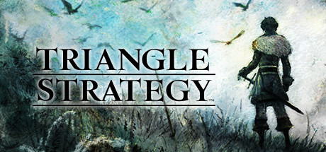

In [a genre](https://en.wikipedia.org/wiki/Tactical_role-playing_game) that prides itself on limitless customization, _Triangle Strategy_ takes the opposite approach. Rather than staffing your army with countless generic units, the game provides a modest roster of named characters, each with a predefined class (that you can't change). This trades customizability for a more streamlined experience, which I enjoyed more than I expected to (I’m someone who usually loves fiddling with an entire army's class assignments; see [below](#fell-seal-arbiters-mark)). Luckily, characters still level up, and I could allocate their limited pool of ability points to specialize them.

Having every character be named allowed _Triangle Strategy_ a richer story than many of its peers. While most tactical role-playing games conspicuously hide your generic units during cutscenes, _TS_ is able to use its entire cast during its (numerous and lengthy) story moments. This setup also enables a unique way to navigate story branches - instead of the player choosing the path outright, you have to convince your trusted advisors to vote on the outcome you want. You have an opportunity to sway each of them, but the decision is ultimately up to your council. Each character has their own motivations and preferences, meaning the story can occasionally go in unexpected directions if you're not convincing enough.

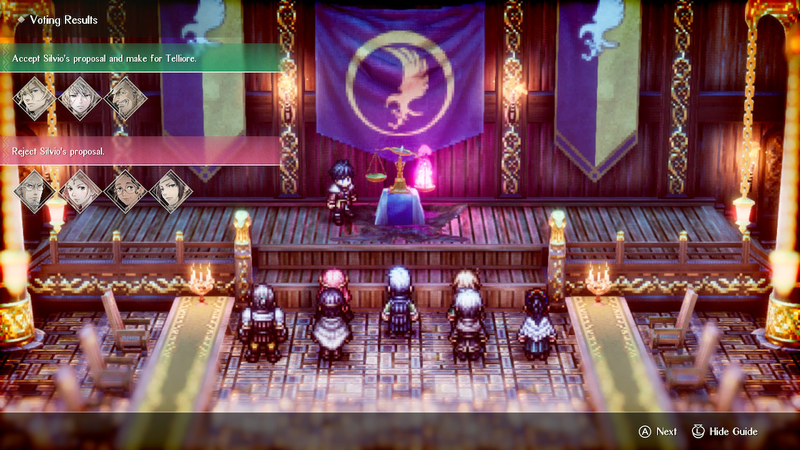

The worst thing I can say about it is that there are a _lot_ of cutscenes, but the political drama kept me engaged despite the length. I'm looking forward to replaying it eventually to see the ending(s) I missed out on.

The maps were unique, largely eschewing the standard "kill all the enemies on this mostly-flat grid" missions found elsewhere. This, coupled with the wide range of abilities available to you left each mission feeling more like a puzzle to be solved than a war that could be brute-forced.

_Triangle Strategy_ was one of the few games that I have ever finished and immediately considered starting right over again. It made the right tradeoffs with regards to: complexity vs customization and was an immensely satisfying experience.

_[Triangle Strategy](https://www.square-enix-games.com/en_US/games/triangle-strategy) is available for Steam & Switch. I played on the Switch and it ran great._

---

### Last Call BBS

It caught many fans by surprise when ([frequent](/blog/post/my-favorite-media-2018-edition/#videogames) [honoree](/blog/post/favorite-media-2020/#exapunks)) _Zachtronics_ [announced](https://unofficialbird.com/zachtronics/status/1537167003768655872) that _Last Call BBS_ would be their final game. But, if they have to be done, what a game to go out on.

Rather than a single game with lots of puzzles, Last Call BBS is a collection of 8 smaller-scale games in a variety of genres. It's got a few programming puzzles, a couple of solitaires, an arcade game, a [nonogram-style](https://en.wikipedia.org/wiki/Nonogram) game, and a sandbox in which the player can laboriously assemble and paint little [Gundam model kits](https://finescale.com/how-to/articles/2022/12/anyone-can-learn-how-to-build-great-looking-gundam-model-kits). I was apprehensive about this approach, but quickly came around when I realized how fun each game was. Rather than coming up with a cool idea and having to generate a whole standalone game's worth of content for it, this approach enabled the devs to ship more snack-sized experiences.

Theme and story-wise, Zachtronics delivers as always. Each game is software that you're pirating onto your 90's era desktop, complete with a "downloading" progress bar on first launch and [scene notices](https://archive.org/details/scenenotices) on every boot. The "computer" has a boot up whirr and plays satisfying sounds as you click and type. I also enjoyed the light backstory you get via text memos upon hitting milestones in each game, which tell the tale of each game's developer. They're an interesting meta-commentary on the wide variety of outcomes in the world of indie development. Most poignant is the thinly-veiled story of "Zachmatics", a studio who likes to make programming puzzle games.[^2]

Where _Last Call BBS_ really innovates over past Zachtronics games is in its variety. Normally, when you're stuck on a puzzle, there's not much else to do until you've finished it. Here, you can be stumped and swap to another sub-game while you mull the first one over. Not being pinned into the corner makes for a more forgiving experience, even though these puzzles are as hard as they've ever been.[^3] Though I'm sad to see (this iteration) of my favorite studio wind down, this was a heck of a swan song.

_[Last Call BBS](https://www.zachtronics.com/last-call-bbs/) is available on PC Game Pass, Steam, and other PC retailers._

---

### TOEM

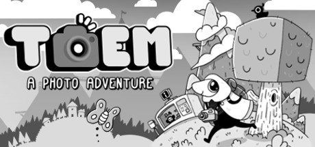

If I picked one word to describe _TOEM_, it would be _pleasant_. Your task is to explore the world and take pictures of everything you can find: animals, townspeople, legendary cryptids, nice vistas, and one very adventurous fly named Tato. There's no combat and no falling off the edge; heck, there's not even color. Just you, your camera, and a charming Scandinavian landscape to experience.

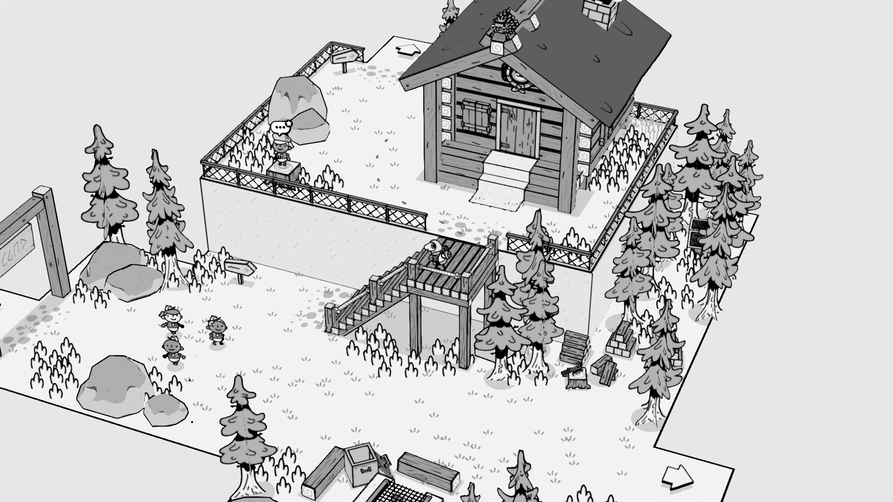

You progress in the game by completing missions and unlocking gear. New gear enables new types of photographs; there's a bike horn to startle your subjects, for one example, and a selfie stick for another. Past that, the gameplay feels a lot like [Pokémon Snap](https://en.wikipedia.org/wiki/Pok%C3%A9mon_Snap) (without rails). There's a good (but not overwhelming) list of animals to find and photograph throughout the game's 5 levels.

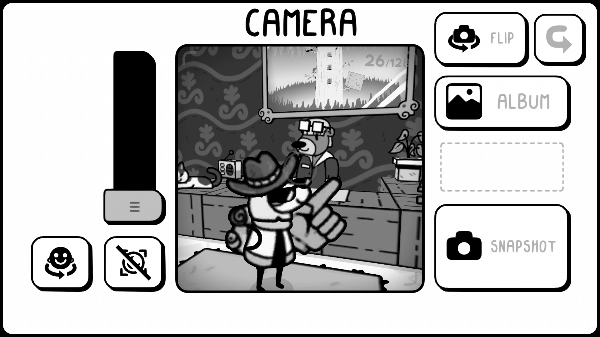

The puzzles are straightforward, but not simple, which is a great line to straddle. There are lots of fun easter eggs and rare animals to find. Everyone you meet along the way is exceptionally charming. Plus, having _your_ in-game photos as the mementos of your journey to see the eponymous TOEM gave the game a great vacation vibe, unmatched in any other game.[^4] Run, don't walk, to play _TOEM_.

_[TOEM](https://www.somethingwemade.se/toem/) is available on Switch, PS5, and PC. I played on PS5 and enjoyed the use of the adaptive triggers for clicking the shutter._

---

### Runner(s) Up

#### Fell Seal: Arbiter's Mark

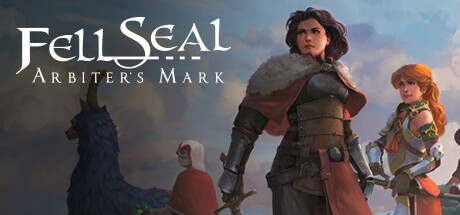

I'm a sucker for tactics games where you build a large army and can customize each of them to your liking. It's a high I've been chasing ever since _Final Fantasy Tactics: Advance_ and _Fell Seal_ absolutely scratches that itch.[^5]

Like its predecessors, each member of your army has a wide range of jobs to choose from. I liked the ability system (which is straight out of FFT:A), where characters learn abilities for a class, but can still use those abilities after they've changed classes. Theorycrafting the perfect ability loadout eats up a lot of very engaging hours.

The story is only decent and the art took a bit of getting used to, but neither stopped me from being glued to the game for the mechanics alone. I'd recommend getting the DLC if you're going to play - it adds monster capturing and bonuses to areas of the map.

_[Fell Seal: Arbiters Mark](https://www.fellseal.com/) is available on PC and consoles. I played it on Switch and it was a great option for the portability._

---

#### Unpacking

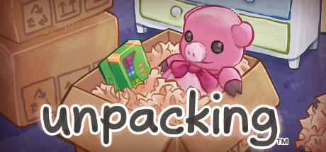

Though the gameplay itself is simple, I was wowed by the subtle storytelling that _Unpacking_ delivered so effortlessly. It is told exclusively via unpacking the moving boxes of an unseen protagonist. She starts as a child in her family's new home, and we follow her life through college and beyond.

<YoutubeEmbed youtubeId="pcN_5wJWbYk" />

Your task is to find a spot for all of her possessions in each new home. There's not a lot of challenge -- mostly it enforces that items are put away in a _roughly_ appropriate spot (no kitchen items in the bathroom, for example). It gets a little trickier when you get a roommate; suddenly there's two of everything and you need a way to store a second blender.

Seeing her childhood toys resurface move after move was unexpectedly poignant. Our things define so much of who we are that seeing only them (not their owner) was oddly intimate. Following the protagonist's major life events was an exciting and nostalgia-inducing experience that didn't overstay its welcome.

_[Unpacking](https://www.unpackinggame.com/) is available on Gamepass, PC and consoles. It probably plays a little better with a mouse, but was fine with a controller._

---

#### Exo One

In _Exo One_, you're a little orb that can drastically increase its personal gravity. Do so on a hill and you can gather dramatic speed before launching yourself into the sky. Couple that with the ability to soar, and you can explore desolate planets with absolute joy.

<YoutubeEmbed youtubeId="BDWNDdmwzAs" />

There's no story to speak of and the gameplay itself is pretty minimal, but I wanted to give props to _Exo One_ for creating a game with a breathtaking sense of scale. The draw distances are immense and you can zoom and zip around them without limits. I spent the entirety of its two hour runtime in a state of awe. It's something I haven't experienced before, even in other games that boast about their map size.

_[Exo One](https://exo-one-game.com/) is available on Gamepass and Steam; it's coming soon to Playstation. I'd recommend playing on whichever platform gives you the best graphics._

---

### Honorable Mention(s)

- _[Sable](https://www.shed-works.co.uk/sable)_: For succeeding where other open world games have failed.[^6] Gameplay is totally self directed, so follow your heart. Sable doesn’t get bogged down with combat or weapons, either. It's just you, your bike, and the open road (or unmarked trail, as it were). The soundtrack by [Japanese Breakfast](http://japanesebreakfast.rocks/) sets the tone well and the people you meet on your journey provide color to an otherwise desolate (yet beautiful) world. Your adventure is exactly as short (or long) as you make it, and that's awesome.
- _[Tunic](https://tunicgame.com/)_: For the best use of an instruction manual, maybe ever. It hearkens back to thick paper manuals that used to come with boxed games, but it's written in an incomprehensible language. Oh, and did I mention you don't get the pages in order? You'll be assembling this digital booklet haphazardly, which serves to heighten the mystery of how to play the game and where to go. It's an extremely charming way to progress. As an example, check out the first page [here](https://tunic.wiki/uploads/images/gallery/2022-03/image-1647766290471.jpg). That said, the combat isn't satisfying. If you play it, I recommend turning on "invincible mode" in settings and just enjoying the ride. It also features some truly _wild_ endgame puzzles if you really want to strain your brain.
- _[The Pedestrian](https://www.skookum-arts.com/)_: For doing a lot with a little. The premise is simple: you're a stick figure navigating the signs of a city. But, being able to reorganize the individual panels of a puzzle and reconnect the doors between them brings a shocking amount of depth. It's best experienced in motion rather than text, so check out a few minutes of [this video](https://youtu.be/3ESpiZRiQsQ?t=538).
- [Astral Chain](https://www.platinumgames.com/games/astral-chain): For great cyberpunk vibes and a unique battle system where you control two characters connected by an (astral) chain. I haven't seen a battle system this innovative since _The World Ends with You_.
- _[Persona 5: Royal](https://persona.atlus.com/p5r/)_: For being extremely stylish and fun. I never thought a game that I'd clocked more than 100 hours into could be described as having "flown by", but here we are. _P5:R_ kept me wanting more despite its gargantuan runtime. The combination of high-school life sim and dungeon crawler brings a lot to the table, especially when paired with its superb UI design. I won't say that the story never dragged (hard not to, with that much to cover), but it certainly earned its runtime.
- _[God of War: Ragnarok](https://www.playstation.com/en-us/games/god-of-war-ragnarok/)_: For sticking the landing. Developer _Santa Monica Studio_ has basically perfected cinematic heartstring-tugging AAA storytelling. The combat feels great and allows for a lot of skill expression. Unfortunately, a collect-a-thon map and bloated equipment system kept me from rating it higher.[^7] They are ultimately minor gripes against a very good game, so don't let that stop you.

<AirtableLinkAndReturn
  items="games"
  verbed="played"
  year="2022"
  link="https://airtable.com/shrYZM7XAMbqMTSrI"
/>

## Movies

This year, I watched 144 movies total; 76 new ones (down from 167/93 last year). As the pandemic has dragged on, we've tended to watch old favorites over new ones. Nevertheless, I had the chance to find some new favorites (again, way too many).

### The Unbearable Weight of Massive Talent

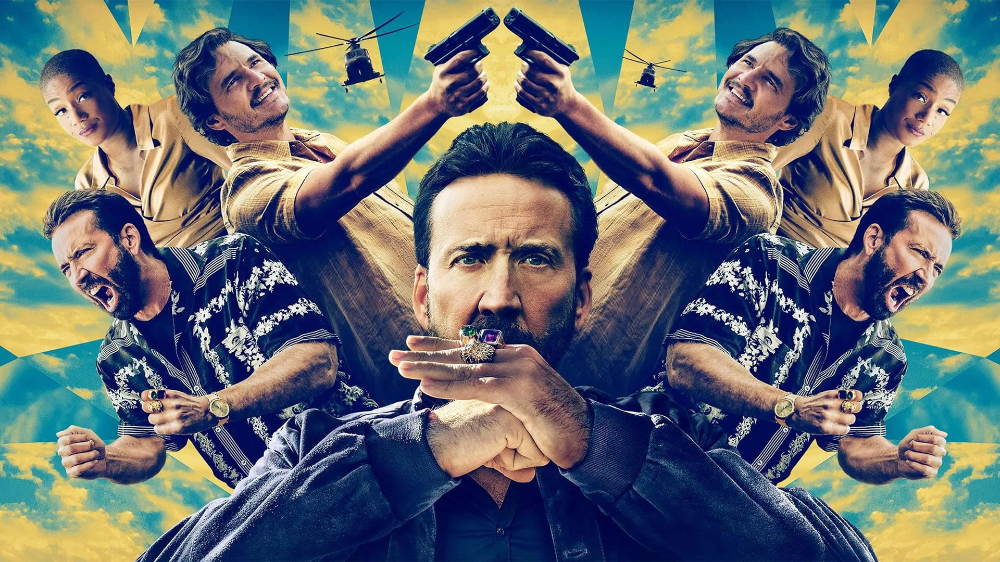

This film was way better than it had any right to be. Nic Cage plays "Nick Cage", a fictionalized version of himself. Hard up for cash, he accepts an invitation for a paid appearance at the birthday party of a rich super fan (Pedro Pascal). Thus begins a wild buddy-cop-style adventure for the ages, co-starring Cage and Pascal.

The humor is great and the action is exciting without being overbearing. There's a knockout supporting cast, including Tiffany Haddish, Sharon Horgan, Neil Patrick Harris, and Cage as a younger version of himself. Cage being in on the joke concerning his weird movie roles definitely enhances this outing. File it under "oddly touching comedy action movie that doesn't take itself too seriously".

_[The Unbearable Weight of Massive Talent](https://www.justwatch.com/us/movie/the-unbearable-weight-of-massive-talent) is available for purchase._

---

### Turning Red

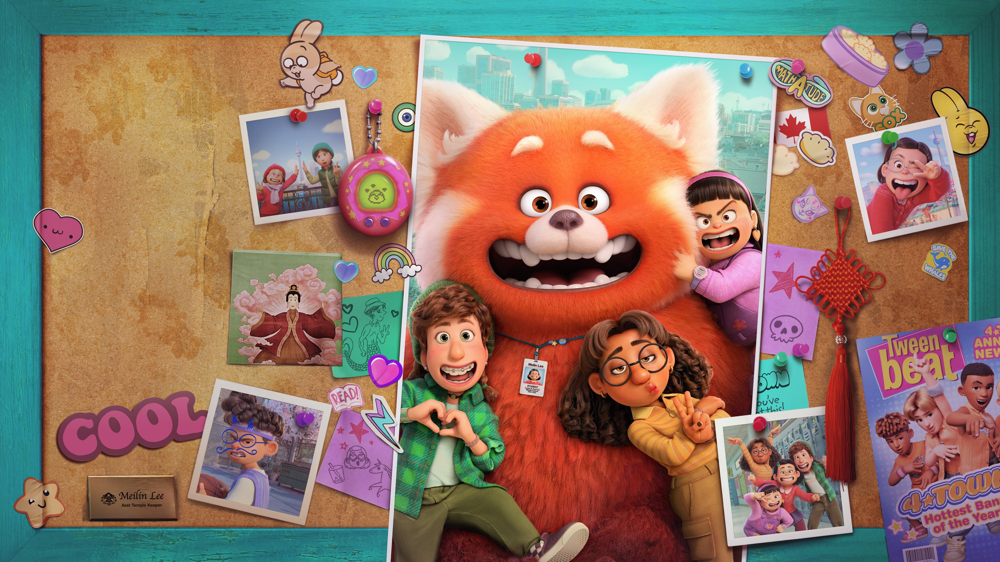

Like most Pixar movies, _Turning Red_ takes a simple concept and breathes life into it. This time around, puberty is the star of the show. Main character Mei, upon reaching a certain age, abruptly and uncontrollably turns into a giant red panda when stressed. Learning how to deal with this, her social life, and her overbearing family sets her and her friends on the path to hijinks.

More than anything else I've seen, it captures the absolute _weirdness_ of teenage girls. They're each goofy, heartfelt characters and the movie really captures the vibes of being in middle school circa 2002, which I definitely vibed with. Honestly, I think that's what carried a lot of the recommendation for me here -- the vibes are great.

_[Turning Red](https://www.disneyplus.com/movies/turning-red/4mFPCXJi7N2m) is available to stream on Disney+ and is available for purchase._

---

### The Harder They Fall

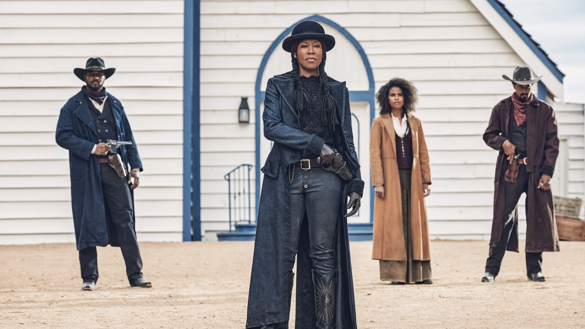

I came into _The Harder They Fall_ without any expectations and it blew me away.[^8] It had been a while since I'd watched a gritty, violent, heartfelt western so I was glad to find this one. It's part heist, part prison break, and part tale of old-fashioned vengeance.

Its principal cast is all Black, including Jonathan Majors, Idris Elba, Regina King, and Lakeith Stanfield. They all play characters based on real figures from the American west, but not ones who have shown up in much other media. It has beautiful cinematography, with many slow, deliberate shots. It also used tension and music well, never letting the audience get too comfortable. If you like westerns, this one's for you.

_[The Harder They Fall](https://www.netflix.com/title/81077494) is available to stream on Netflix._

---

### Runner(s) Up

#### Vengeance

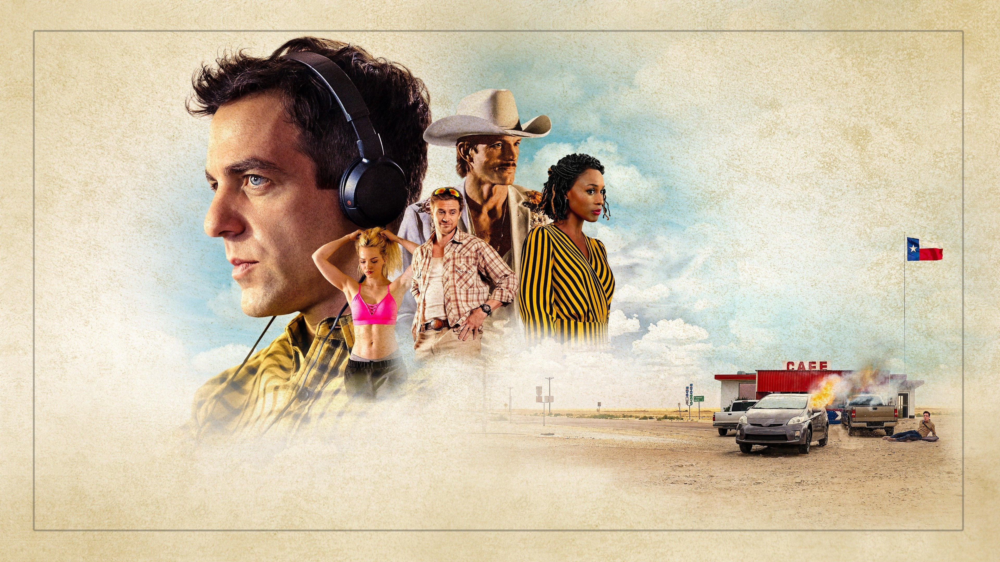

_Vengeance_ told a shockingly human story through the eyes of a callous, big city podcaster. It captured small-town Texas without entirely ridiculing it, no small feat. A fish out of water never landed so well. Side note: If podcasting + murder sounds appealing, check out the Onion's [A Very Fatal Murder](https://www.theonion.com/episode-1-a-perfect-murder-1822346450).

_[Vengeance](https://www.justwatch.com/us/movie/vengeance-2022) is available to stream on Peacock and is available for purchase._

---

#### Weird: The Al Yankovic Story

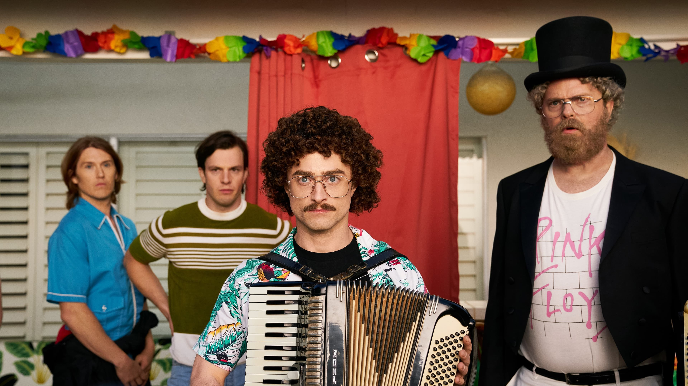

_Weird_ was 90 minutes of unadulterated energy and I enjoyed the hell out of it. It's dripping with celebrity cameos and doesn't take itself seriously in the slightest, both important features for a movie like this. Radcliffe rocks and seeing a story to tie together my [close personal friend](https://www.instagram.com/p/yxI17tHV2F/) Weird Al's career was a great premise. I assure you, it doesn't go where you expect it to.

_[Weird: The Al Yankovic Story](https://therokuchannel.roku.com/lp/weird) is available to stream on the Roku channel._

---

#### Glass Onion

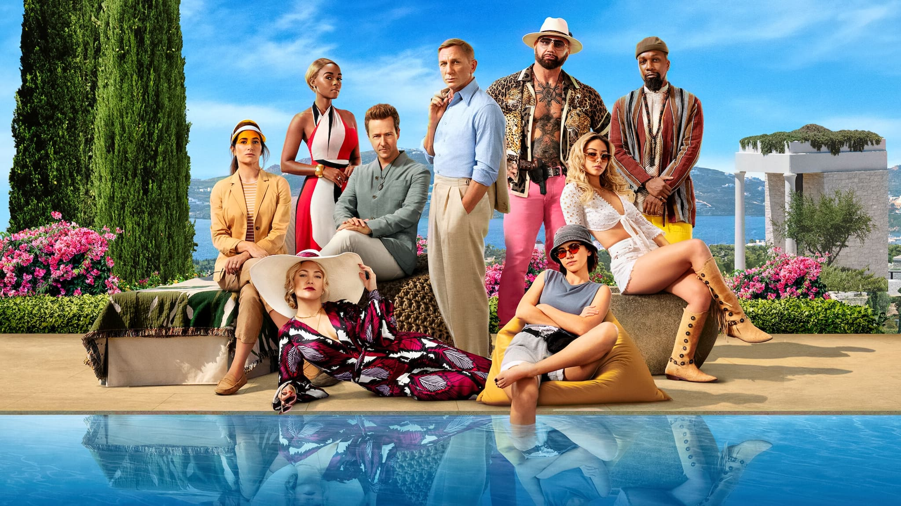

_Glass Onion_ was a worthwhile follow up to [previous winner](/blog/post/my-favorite-media-of-the-year-2019-edition/#movies) _Knives Out_. Rather than focusing as much on the ensemble cast as its predecessor did, Daniel Craig's smash-hit portrayal of Benoit Blanc is placed front and center. Like the Agatha Christie stories it draws inspiration from, it keeps you on your toes by obscuring the exact mystery you're solving until it falls in your lap.

Director Rian Johnson wrangles yet another killer cast and modern plot (as far as I know, this is the first movie I saw that acknowledges the COVID-19 pandemic directly). A delight top to bottom. And, if you're looking for more like this, check out _[The Last of Sheila](https://www.justwatch.com/us/movie/the-last-of-sheila)_, which Johnson was clearly ([and publicly](https://unofficialbird.com/rianjohnson/status/1416441756422377476)) inspired by.

_[Glass Onion](https://www.netflix.com/watch/81458416) is available to stream on Netflix._

### Honorable Mention(s)

- _[RRR](https://www.netflix.com/title/81476453)_: For being so over the top in all the best ways. It's a 3 hour Bollywood epic set in 1920 following a fictional friendship between two real Indian revolutionaries. It's over the top in all the best ways. I promise that in any given scene, you'll never know what's going to happen in the next one.
- _[Violent Night](https://www.justwatch.com/us/movie/violent-night)_: For finally representing the people who love ultra-violent action movies _and_ Christmas. It's oddly touching and never stops finding increasingly inventive ways to kill baddies using common Christmas accessories.
- _[Everything Everywhere All at Once](https://www.justwatch.com/us/movie/everything-everywhere-all-at-once)_: For outstanding visual presentation and casting. It's both a small story about a family and a large one about the universe. I didn't get quite the resolution I wanted from the story, but the cast (welcome back to the screen, Ke Huy Quan!), performances, and variety of visual effects were absolutely unmatched this year (and maybe ever). (_Editor’s note: This movie became an instant favorite for me. Like all-time. Why aren’t all movies like this. Michelle Yeoh could ask me to walk off a pier and I would._)
- _[See How They Run](https://www.justwatch.com/us/movie/see-how-they-run-2022)_: For being "a murder mystery as if directed by Wes Anderson" (see also: this [SNL sketch](https://www.youtube.com/watch?v=gfDIAZCwHQE)). The story was good, the cast was stacked, but the style was really what sold it for me.

<AirtableLinkAndReturn
  items="movies"
  verbed="watched"
  year="2022"
  link="https://airtable.com/shrmC4rmL2yxfAWGI"
/>

## TV Shows

In 2022, I finished 36 new seasons of TV, comprising 373 episodes across ~173 hours (a slight decrease from 2021). I know I keep saying it, but this was one of the strongest slates I can remember.

### The Resort

From the mind of Andy Siara (writer of [previous time-travel-related honoree](/blog/post/favorite-media-2020/#honorable-mentions-1) _Palm Springs_), _The Resort_ tells a twisted tale about two couples connected across time. In the present day, William Jackson Harper and Cristin Milioti star as a married couple celebrating their 10th anniversary at a swanky Mexican resort. Their vacation is derailed when Milioti's character finds – and subsequently becomes obsessed with – a cell phone belonging to a teen who went missing during a hurricane 15 years prior. The show splits its time between their present day investigation of the past and showing us the events leading up to the fateful hurricane.

Ultimately, the show feels like _The Goonies_ crossed with Indiana Jones. The characters uncover clues in each timeline that illuminate plot threads in the other, allowing the two sets of characters to build the story together, despite their separation. The supporting cast is stellar (including a memorable Nick Offerman) and the story will keep you guessing right up until the end (and beyond!). Few shows left me wanting more quite as much as _The Resort_ did. Once you've watched it, check out this spoilerful interview with the writer: <Spoiler text="link contains spoilers">click here: [interview](https://deadline.com/2022/09/the-resort-season-finale-creator-andy-siara-on-potential-second-season-more-1235103277/)</Spoiler>!

_[The Resort](https://www.peacocktv.com/watch/asset/tv/the-resort/9134762941287131112) is available to stream on Peacock._

---

### Severance

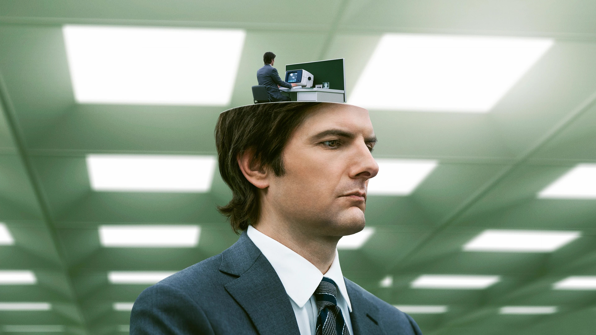

After watching the first 15 minutes of _Severance_, I knew it would be showing up here. It follows employees of the mysterious Lumon Industries who have undergone the eponymous "severance" procedure. The procedure separates their work and home lives into essentially two entirely different people. Each version of them knows nothing of the other despite both living in the same body.

<YoutubeEmbed youtubeId="xEQP4VVuyrY" />

Somehow, the show is both a slow burn _and_ constantly tense. Each shot is cinematically immaculate and the stark brutalism of Lumon Industries drew me in immediately.[^9] Even though Season 1 is only the first part of a larger story, this is must-watch television.

_[Severance](https://tv.apple.com/us/show/severance/umc.cmc.1srk2goyh2q2zdxcx605w8vtx) is available to stream on Apple TV+._

---

### Runner(s) Up

#### The Afterparty

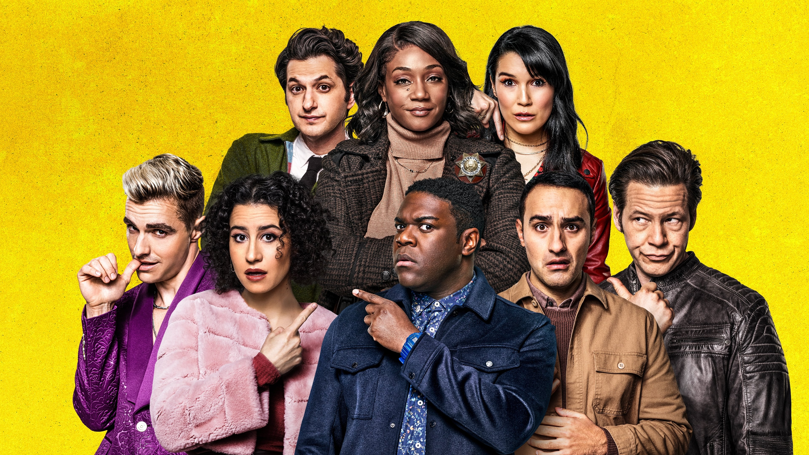

_The Afterparty_ hails from accomplished producer/showrunner [Christopher Miller](https://en.wikipedia.org/wiki/Phil_Lord_and_Christopher_Miller) (of Into the Spider-Verse, 21 Jump Street, and The Lego Movie fame, among others). It's a [Rashomon](https://en.wikipedia.org/wiki/Rashomon_effect)-style murder mystery that takes place at the after party of a high school reunion. Each of its 8 episodes presents the events of the evening from the perspective of a different character. Even better, each episode is a distinct genre: one is a rom-com, another is a _Fast & the Furious_-esque action movie, and of course, there's a musical episode.

The cast is stellar and it's an absolute joy finding out "[whodunit](https://en.wikipedia.org/wiki/Whodunit)" as the story unfolds. Rarest of all, eagle-eyed watchers _will_ be able to solve the mystery if they're paying close attention (though neither Vicky nor I were able to guess with any evidence until the big reveal).[^10] The show truly is more than the sum of its parts, and it's an easy recommendation.

_[The Afterparty](https://tv.apple.com/us/episode/aniq/umc.cmc.51tmuok8wq8vjhj7aqo32elxp) is available to stream on Apple TV+._

---

#### Ghosts

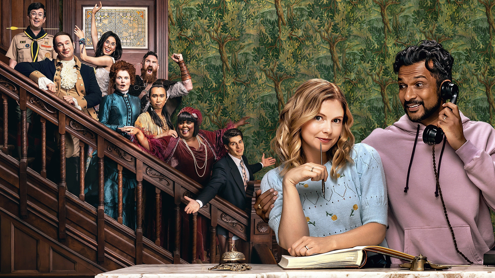

_Ghosts_ is a US adaptation of a UK show,[^11] wherein a young couple (Rose McIver and Utkarsh Ambudkar) inherits an old mansion that is chock-full of ghosts. While renovating it in the hopes of opening a B&B, a bump to the head allows her (but not her husband) to see and talk to those ghosts. What really sold me here was the undead ensemble. It's a diverse group of spirits who died throughout history, including a Lenape man, the wealthy wife of a robber baron (a personal favorite), a closeted American Revolutionary (a role which Brandon Scott Jones _kills_), a 20's jazz singer, and an 80's era wall street trader who died pantsless (and will stay that way for eternity).

Most of the plots are standard enough sitcom fare, but they veer towards unexpectedly touching as we explore backstories of each of the ghosts, their regrets in life, and the context around their deaths. There are great running gags, including one in episode 13 which was maybe my single favorite gag of any show this year. Well into its second season now, _Ghosts_ continues to be extremely charming.

_[Ghosts](https://www.paramountplus.com/shows/ghosts/) is available to stream on Paramount+, CBS online, and is available for purchase._

---

### Honorable Mention(s)

- [Our Flag Means Death](https://play.hbomax.com/page/urn:hbo:page:GYf3LzwJV98JifQEAAAAO:type:series): for being hands down the best gay pirate adventure I watched all year. It stars Rhys Darby and Taika Waititi (Blackbeard!) as they explore life on the high seas, what it means to be a pirate, and their relationship with each other. Equal parts hysterical and heartfelt, I enjoyed my time with the crew of the _Revenge_ immensely.

<AirtableLinkAndReturn
  items="shows"
  verbed="watched"
  year="2022"
  link="https://airtable.com/shrFUAi6JaF83KKre"
/>

## Books

I read 13 books this year, down from 20 last year. As you can imagine from the numbers in each other category, one of these categories had to give and this year, it was books. It doesn't help that I frequently read right before bed and some nights, I'm just too tired for it. I'll hope to do better next year!

### Hench

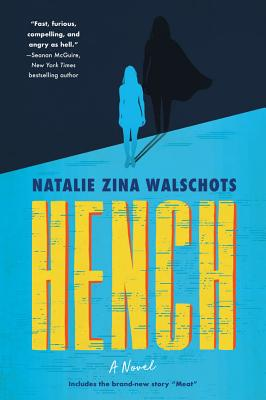

I've always loved superheroes, and _Hench_, by Natalie Zina Walschots, breathes new life into that world by exploring the nitty-gritty of how an evil lair is run. The book follows Anna, a low-level henchperson who is injured when famed hero "Supercollider" arrives to foil her (temporary) employer's plan. Now unemployed, she spirals into depression and spends all her time documenting the harm heroes cause the world around them.

It explores themes found also in _The Incredibles_ and _Watchmen_ about the role of heroism in society. Couple that with the narrator’s acerbic wit and the most realistic description of running a supervillain business I've ever seen (she covers building maintenance and tax structure; it's awesome) and you've got the best book I read this year.

---

### Runner(s) Up

#### How to be Perfect

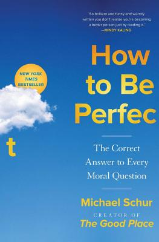

Written by Mike Schur to collect his moral philosophy learnings from creating _The Good Place_. I promise, it's better than it sounds.

The book's subtitle promises "The Correct Answer to Every Moral Question," and I think – shockingly – it does a decent job delivering on that. Schur explores different schools of thought and how _they_ think you should go about being a good person. He does a great job using relatable examples, like whether it's worth walking your shopping cart back to the little collection area (and what about if it's raining? Is it ok not to then?). It accomplishes this without being preachy, and with the patented Schur humor we've come to know and love. It's got a whole section on the trolley problem (and its variations, most of which I wasn't familiar with). It's a surprisingly light read given its topic, an impressive feat. I especially recommend the audiobook version, which features the cast of _The Good Place_ reading quotes and blurbs throughout.

<AirtableLinkAndReturn
  items="books"
  verbed="read"
  year="2022"
  link="https://airtable.com/shraWhM1lONgMZzdX"
/>

## Updates on Previous Picks

Here are some quick updates on picks from previous years. In no particular order:

- _Barry S3_ While Season 1 was a pick from all the way back in [2018](/blog/post/my-favorite-media-2018-edition/#television), I'd be remiss if I didn't mention how good Barry _still_ is. Season 3 is maybe the best yet, where we get emotional payoffs they've been building for years. It's still funny, but they really amped up the drama this year and the show's all the better for it.
- _Only Murders in the Building S2_ continued strong where S1 left off, adding new cast members and of course, a new victim (whose death provided the cliffhanger ending of S1). The show continued to deliver, but I wanted to call out episode 3 specifically for walking us through the day of an unlikable character and bringing great perspective to how the audience feels about her.
- _Books of Babel_ (the "Senlin Ascends" series): Great finish, awesome worldbuilding, thrilling conclusion.
- _Six of Crows_ got a Netflix adaptation under the title "Shadow and Bone," which was pretty decent.
- _Enola Holmes_ got a pretty good sequel (also on Netflix).
- _Tuca & Bertie_ was re-cancelled after its renewal, but it got another good season or two in the meantime.
- _Hades_ is getting a sequel, and _Horizon: Zero Dawn_ got one! (_Editor’s note: I don’t really play video games but I’m excited to hang around for the Horizon sequel when we get around to playing it._)

## Just the List

Click to expand

<ul className="tight-list">

- Games
  - [Triangle Strategy](https://www.square-enix-games.com/en_US/games/triangle-strategy)
  - [Last Call BBS](https://www.zachtronics.com/last-call-bbs/)
  - [TOEM](https://www.somethingwemade.se/toem/)
  - Runner(s) Up:
    - [Fell Seal: Arbiters Mark](https://www.fellseal.com/)
    - [Unpacking](https://www.unpackinggame.com/)
    - [Exo One](https://exo-one-game.com/)
  - Honorable Mention(s):
    - [Sable](https://www.shed-works.co.uk/sable)
    - [Tunic](https://tunicgame.com/)
    - [The Pedestrian](https://www.skookum-arts.com/)
    - [Astral Chain](https://www.platinumgames.com/games/astral-chain)
    - [Persona 5: Royal](https://persona.atlus.com/p5r/)
    - [God of War: Ragnarok](https://www.playstation.com/en-us/games/god-of-war-ragnarok/)
- Movies
  - [The Unbearable Weight of Massive Talent](https://www.justwatch.com/us/movie/the-unbearable-weight-of-massive-talent)
  - [Turning Red](https://www.disneyplus.com/movies/turning-red/4mFPCXJi7N2m)
  - [The Harder They Fall](https://www.netflix.com/title/81077494)
  - Runner(s) Up:
    - [Vengeance](https://www.justwatch.com/us/movie/vengeance-2022)
    - [Weird: The Al Yankovic Story](https://therokuchannel.roku.com/lp/weird)
    - [Glass Onion](https://www.netflix.com/watch/81458416)
  - Honorable Mention(s):
    - [RRR](https://www.netflix.com/title/81476453)
    - [Violent Night](https://www.justwatch.com/us/movie/violent-night)
    - [Everything Everywhere All at Once](https://www.justwatch.com/us/movie/everything-everywhere-all-at-once)
    - [See How They Run](https://www.justwatch.com/us/movie/see-how-they-run-2022)
- TV
  - [The Resort](https://www.peacocktv.com/watch/asset/tv/the-resort/9134762941287131112)
  - [Severance](https://tv.apple.com/us/show/severance/umc.cmc.1srk2goyh2q2zdxcx605w8vtx)
  - Runner(s) Up:
    - [The Afterparty](https://tv.apple.com/us/episode/aniq/umc.cmc.51tmuok8wq8vjhj7aqo32elxp)
    - [Ghosts](https://www.paramountplus.com/shows/ghosts/)
  - Honorable Mention(s):
    - [Our Flag Means Death](https://play.hbomax.com/page/urn:hbo:page:GYf3LzwJV98JifQEAAAAO:type:series)
- Books
  - [Hench](https://www.harpercollins.com/products/hench-natalie-zina-walschots?variant=33021717381154)
  - Runner(s) Up: - [How to be Perfect](https://www.simonandschuster.com/books/How-to-Be-Perfect/Michael-Schur/9781982159313)

</ul>

## Ta Ta For Now

If you've gotten this far, thank you for reading! I put a lot of energy into this project throughout the year and I hope you've enjoyed the fruits of that labor. Please [get in touch](/contact) if you have feedback or suggestions for what I should watch/play/read next.

Until next year!

[^1]: Seriously, all I gave it was "Write me the intro for a blog post I publish yearly summarizing the videogames i've played, movies i've watched, and books i've read in a calendar year. It should welcome readers and clarify the criteria for inclusion in the list". The only revision was to let it know where I started my job and how many years I've been doing this list.
[^2]: This part gave me serious [Con Man](<https://en.wikipedia.org/wiki/Con_Man_(web_series)>) vibes, in a bittersweet way.
[^3]: My understanding is that this is also something that really clicked for players of _Elden Ring_. It doesn't matter how hard something is if you can wander off and come back later.
[^4]: Only _Final Fantasy XV_ comes close, and it had a lot of other issues
[^5]: I know the _Tactics Ogre_ remake came out, but I haven't had a chance to play it yet; I'd be surprised if it's not somewhere on this list next year.
[^6]: Sorry, _Breath of the Wild_
[^7]: Don't feel too bad, it (and Elden Ring) are sweeping most of the big awards this year.
[^8]: I've come to realize leaving expectations at the door is the key to really enjoying things; ask me about _Widows_ sometime. Stop watching trailers! Go in blind!
[^9]: Check out [last year](/blog/post/favorite-media-2021/#control) for more brutalism picks, and this [interview with the production designer](https://variety.com/2022/artisans/news/severance-production-design-apple-1235220628/) to learn more about how they built the world of Lumon; very light spoilers for the first episode, but more appreciated after you watch it anyway.
[^10]: If you're really in the mood for puzzles, each episode contains a visual easter egg that hints as to who the killer _isn't_. There's a ‼️VERY SPOILERFUL WRITEUP‼️ [here](https://www.cbr.com/afterparty-xavier-killer-clues/) to reference, once you've watched the show.
[^11]: I've heard it said that "the UK version is better", which is not uncommon with other across-the-pond adaptations. I haven't watched the original, but the US version lands so well with its America-specific storylines that I'd be surprised if I connected as closely with the UK version. That said, we like this show enough that it's not unlikely we'll watch the other one sometime.
