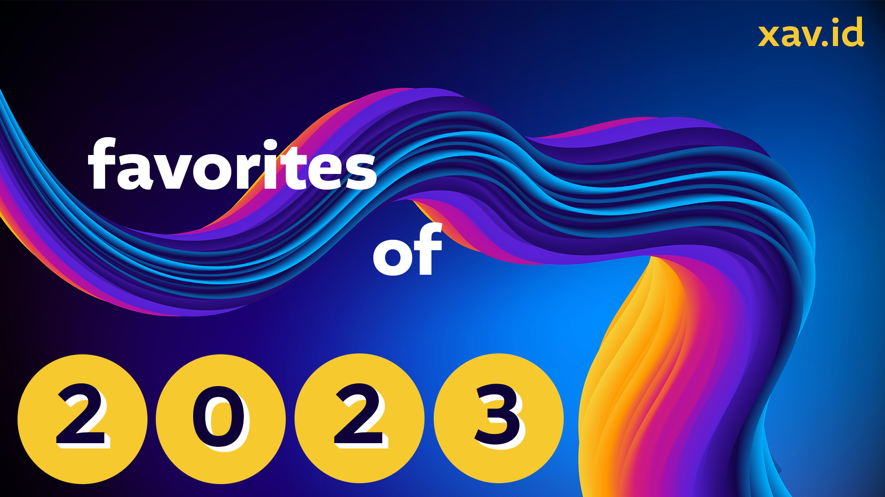

Welcome one and all to the 8th annual compilation of my favorite media of the year! This post is my favorite way to reflect on the year that was and share a bit of what made it good.

Although this year had its rough patches, there were bright spots too. We finally threw our big wedding party after 2 years of legal marriage! Gathering so many of our favorite people into one place truly rocked. I also completed my first full year at Stripe and wrote more blog posts than I ever have before. When things were less certain, we took a lot of comfort in silly movies and cozy TV.

My other big news is the release of [david.reviews](https://david.reviews/). It's your destination for every piece of media I've ever reviewed. You can search, skim, or browse by genre. It doesn't include reviews for TV shows right now, but it's got everything else. I'll mostly be linking out to that site rather than Airtable because I have more control over the UI. Reading the site is also a good way to snack on my reviews throughout the year instead of having to wait for a formal sit-down dinner in January. Let me know if there's features you wish the site had.

In case this is your first year reading my yearly media wrap-up, here’s a run-down on what makes this list. My list is unique in the world of "best of" because it _only_ covers new-to-me media. Each game, show, book, or movie may have come out this year or may be super old. It also means everything has a chance of being featured - nothing gets left to the wayside just because it came out the same year as Baldur's Gate 3 (which I haven't even played yet, so everything below is safe from its awards dominance). I also rate things on a 4-point [personal enjoyment scale](/blog/post/on-the-rating-of-media/) which specifically measures how much I liked it, not how good it objectively is (i.e. there are plenty of "good" games I don't enjoy). The good news is, if we have similar media taste, you're likely to find something you'll love.

Joining me once again is my stalwart editor/wife [Vicky](https://vickystein.media/) who makes me sound more eloquent than I am. She'll be offering occasional commentary as the frequent co-experiencer of this media.

Let's get to it!

---

#### Table of Contents

<!-- START doctoc generated TOC please keep comment here to allow auto update -->
<!-- DON'T EDIT THIS SECTION, INSTEAD RE-RUN doctoc TO UPDATE -->

- [Videogames](#videogames)
- [Movies](#movies)
- [TV Shows](#tv-shows)
- [Books](#books)
- [Updates to Previous Picks](#updates-to-previous-picks)
- [Just the List](#just-the-list)
- [That'll Do it](#thatll-do-it)

<!-- END doctoc generated TOC please keep comment here to allow auto update -->

## Videogames

This was a big year in gaming for me. I played 67 games for a total of 651 hours (more games, but fewer hours than the 60g / 784h I did last year). Part of this difference comes from me buying my first-ever Xbox (a series S!) in March on a deep discount. Having a more convenient way to play my existing GamePass subscription was too good to pass up. So I've gotten to try many more games than in previous years. Plus, I noticed how many of my [Play Soon](https://airtable.com/appLZQMgewaSP7Gg3/shrMB1f0PQcfg1tnM) games were quite short, so I made a light effort to get through more of those. I'll likely repeat that in 2024.

### Horizon: Forbidden West

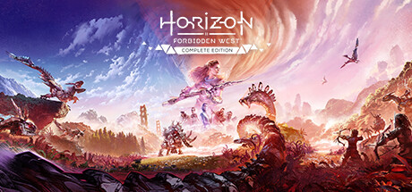

_Horizon: Forbidden West_ accomplishes a rare feat for a sequel: it takes everything I loved about the first game and improves upon it. Basically every complaint I had when I featured _Zero Dawn_ back in [2018](/blog/post/my-favorite-media-2018-edition/#pc--console) has been fixed and what's left is a streamlined, delightful experience.

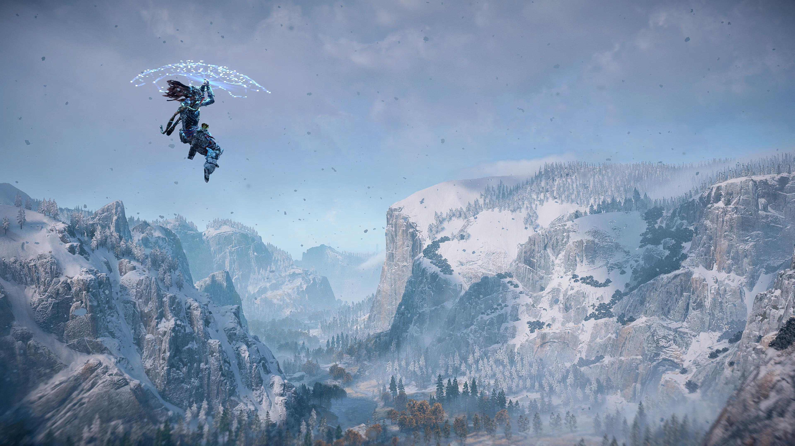

We once again play as Aloy, tribal-outcast-turned-hero, as she journeys west. There's a big cast of characters hailing from many tribes and it's fun hearing about everyone's weird disagreements, quirks, or needs. The story acts as a suitable continuation of the first game; the overall plot itself is a little weaker than before, but it artfully sets us up for a third entry.[^1] We also get a nice emotional payoff of reuniting with friends from the past.

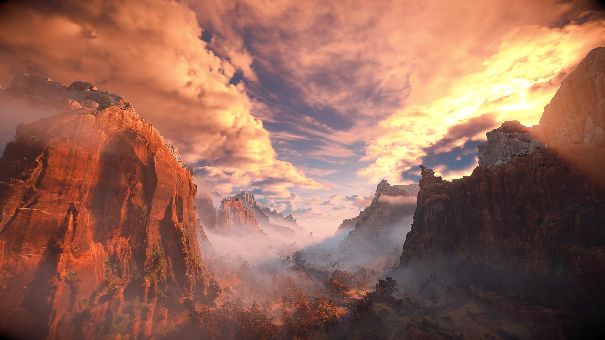

The open world is superb. It's drop-dead gorgeous, really putting the PS5 through its paces. In contrast to _Zero Dawn_ where only predefined routes could be climbed, nearly all rocks are climbable now. The biomes are more diverse than ever, which keeps exploration fresh. The addition of a _Breath of the Wild_-style glider makes cruising around that much more fun.[^2] The ability to swim and dive adds to a game that already used its vertical space well. There are fewer collectables to find overall, but each is more interesting.

> Editor’s note: Someone was really paying attention to the in-game ecology! So many gorgeous landscapes plus relevant – and recognizable, for nature nerds – flora and fauna. H:FW was interesting, beautiful, and fun to watch even though I didn’t care to play myself. Big thumbs up from the non-gamer side of the couch.

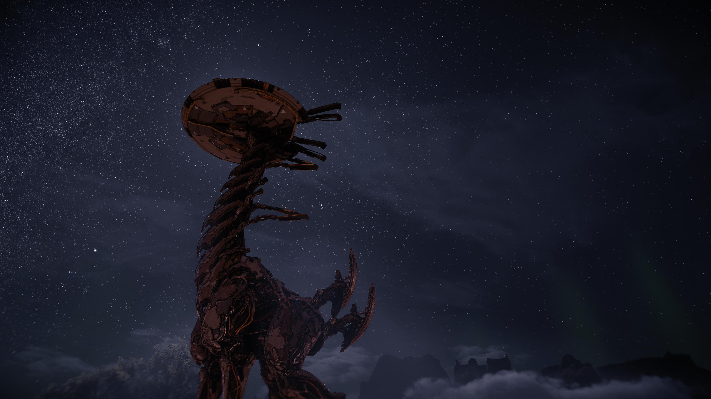

Gameplay wise, everything has improved. Greatly increased weapon variety means you aren't tempted to stick with a single "best bow" the whole time. There's also more of the series' trademark robot creatures, so there's always something new to ~~run from~~ fight bravely. The inventory system is refined so you're _never_ managing inventory space (maybe my single biggest complaint from before). Last but not least, they added an entire chess-esque mini-game which I couldn't stop playing. Challenging the player in each town and outpost always gave me something extra to look forward to, like a Pokémon trainer on a quest to pick fights with literally anyone that walks by.

_H:FW_ clearly shows that developer Guerrilla Games knows how to iterate and improve on a proven formula, and I'm more excited than ever to see what else they have in store.

_[Horizon: Forbidden West](https://www.playstation.com/en-us/games/horizon-forbidden-west/) is available for PS4 + PS5 now and [Steam](https://store.steampowered.com/app/2420110/Horizon_Forbidden_West_Complete_Edition/) later this year._

---

### Chained Echoes

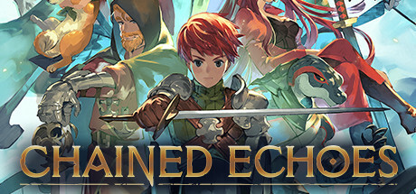

Though its animation and [killer soundtrack](https://album.link/b/695373355) scream "classic SNES-style RPG", great care is taken to differentiate _Chained Echoes_ from its predecessors.

Nowhere is this more noticeable than the combat.

First off, you fully heal at the end of each battle. This simple change turns the endurance challenges common to this genre into a series of individual mini-puzzles to overcome. Also, there's no grinding. In most RPGs, you can keep fighting monsters to get stronger indefinitely. In _Chained Echoes_, stat growth and new abilities only come from defeating the game's many bosses. This means the developers know exactly how strong you can possibly be when entering any dungeon, allowing them to precisely set monster strength within. Now, every encounter is a potentially deadly one, a stark contrast to the hordes of low-level wolves you typically run through in games like this.

The other tweak solves a pervasive problem in turn-based games: every non-boss combat follows an identical script. You use basic attacks, cast "fire" if they're weak to it, and heal occasionally; repeat indefinitely. _CE_ solves this with the introduction of the "overdrive" bar. The beginning of every battle resets the bar to 0; every attack and most abilities fill the bar. You can drain the bar with the use of a randomized ability type. If you choose your moves wisely and stay near the center of the bar, you hit harder, take less damage, and enjoy cheaper abilities. But if you’re overly aggressive and the bar fills up, you’ll start taking extra damage and suffer increased ability costs. As a result, you can't reliably take the same actions in the same order across battles without blowing up your bar. And the problem is solved: no two battles are the same.

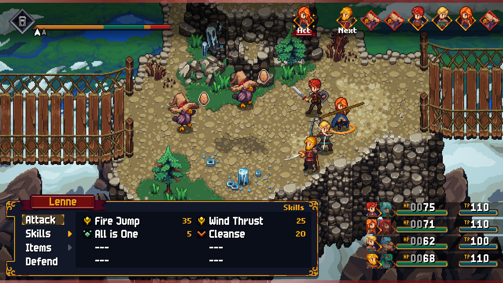

These small changes to a classic formula come together to build an experience that feels both familiar and modern. Attack animations are snappy, something I didn't realize I'd been missing in other turn-based games. Everything flows quickly, like _Final Fantasy X_.

Outside combat, there's a beautiful world to explore. I never tired of running around investigating every nook and cranny. There were collectibles, sidequests, gear, and legendary monsters aplenty. A colorful cast and an interesting story make for an incredibly satisfying package. Also, the pacing is incredible. There are plenty of cutscenes, but they're mostly brief and to the point; a rarity in the RPG genre. The worst thing you can say about the game is that there are a _lot_ of competing gameplay systems (I didn't even cover everything here). But they're individually well thought out and they mostly stay out of each other's ways.

It's been a long time since I've played a game that I vibed with as much as this one. Like, I'd wake up early to play 30 minutes before work. Everything was so fluid and fun that I actually slowed down as I neared the end. I simply didn't want the journey to be over.

_[Chained Echoes](https://www.chainedechoes.com/) is available on Steam and all consoles._

---

### Hi-Fi Rush

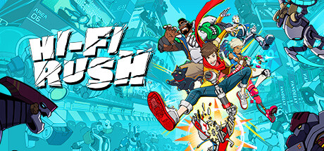

_Hi-Fi Rush_ felt like an action platformer straight from the PS2, which is just about the highest praise I can give it. You run around, you jam, and you fight to the beat of its awesome original soundtrack. That's not a metaphor- every attack needs to happen in time with the music. Fail to do so and you [throw off your groove](https://www.youtube.com/watch?v=m-eS-6CWpFo), costing you points and potentially earning a lower letter grade for the skirmish. Luckily, every other animation in the game is _also_ tied to the beat, so it's easy to get into the rhythm. It's easiest to explain if you see it in motion:

<YoutubeEmbed youtubeId="O2i1Vq3Odbg" />

_HFR's_ saturday-morning-cartoon slapstick humor and vibrant color palette just ooze joy. It's also one of the funniest games I've played in a long time and one of the few that literally made me laugh out loud. It was a [passion project](https://news.xbox.com/en-us/2023/10/04/hi-fi-rush-exclusive-oral-history/) inside Bethesda and you can tell - it's just not the sort of game that gets made anymore. It's got a fun, concise story, just enough exploration/collectibles, and nary a microtransaction in sight. I can only hope this style of game inspires other developers because it's an absolute slam dunk.

_[Hi-Fi Rush](https://bethesda.net/en-US/game/hifirush) is available on GamePass or for purchase on PC and Xbox._

---

### Runner(s) Up

#### Case of the Golden Idol

Ever since _Return of the Obra Dinn_ crushed my [2019 year in review](/blog/post/my-favorite-media-of-the-year-2019-edition/#videogames), Vicky and I have been chasing the high of extremely satisfying detective games. As you can guess by its position in the "runner(s) up" category, _Case of the Golden Idol_ doesn't _quite_ scratch the itch, but it sure comes close. It's a series of logic puzzles presented over a series of cases. They each stand on their own, but also combine to tell the tale of a cursed idol as it makes its way through a cast of unlucky owners. The art style takes a little getting used to, but the puzzles are solid and left us wanting more. We just got the DLC and are already looking forward to the [recently announced sequel](https://www.youtube.com/watch?v=DJ2rRV2oXH0).

_[Case of the Golden Idol](https://www.thegoldenidol.com/) is available on Steam and Switch._

---

#### Tinykin

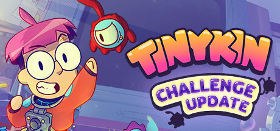

You'd think the Pikmin-like genre of one character directing a small army of differently colored aliens would be pretty well satiated with well, _Pikmin_. Luckily for us, there's still space to explore, which is exactly what _Tinykin_ does. Instead of any combat, it doubles down on puzzles, platforming, and exploration, and traversal.

<YoutubeEmbed youtubeId="txq8fJ7v0PI" />

The game is set in a suburban house, so you're exploring dense, interconnected versions of common household rooms (kitchen, bedroom, etc). Each room is populated with its own genre of cute bug people; it's up to you to use the eponymous Tinykin to solve their problems. Like Pikmin, there are multiple varieties of Tinykin, each with unique properties for solving different puzzles (strong, waterproof, etc). Though your battalion starts from scratch in every room and certain Tinykin disappear after use, I didn't feel the sense of loss that I get when hurling Pikmin into a dangerous fight they may not be able to win.

> Editor’s note: Much prefer this game to Pikmin – I find myself too distressed at the fate of the little guys in the first, while this one feels less perilous and more fun.

_Tinykin's_ odd pseudo-religious story didn't do much for me, but its vibe and gameplay more than made up for it. Its puzzle design borrows from the best of 3D platformers, especially the _Banjo-Kazooie_ franchise. Each level is one big area, but there are multiple objectives and side-puzzles squirreled away throughout. Exploration is well-rewarded -- there's always something fun to find.

In the interest of maximizing fun, you start the game with a little bar of soap that acts as a skateboard you can zip around on. There's no real _point_ to it, it's just cool.[^3]

Much like _Hi-Fi Rush_ [above](#hi-fi-rush), Tinykin evokes a joy and simplicity that feels rare in games today. I'm optimistic that the pendulum might be starting to swing back in this direction.

_[Tinykin](https://www.tinykingame.com/) is available on consoles and Steam._

---

### Honorable Mention(s)

- _[Trash the Planet](https://thisgameishaunted.itch.io/trash-the-planet)_, for telling a bite-sized, interactive tale of the dangers of modern capitalism, but with raccoons. Also, it's totally free and can be played in a single sitting right in the browser.[^4]
- _[The Frog Detective Trilogy](https://frogdetective.net/)_, for hands down the cutest writing of the year. What they lack in gameplay they make up for in charm. (_Editor’s note: I adored this game. Big thumbs up. I’ve never taken as many screenshots of perfect one-liners as I did playing this, and I immediately recommended it to a bunch of friends._)
- _[Monster Sanctuary](https://monster-sanctuary.com/)_, for being a fascinating crossover of the monster taming and metroidvania genres. The countless abilities allow for satisfying theorycrafting.
- _[INSIDE](https://playdead.com/games/inside/)_, purely for its creepy vibes and absolutely bonkers ending.

<MediaYearLink items="games" verbed="played" year="2023" />

## Movies

Though I watched 149 movies in 2023, only 74 of them were new-to-me (changed from 144/76 last year). I find that when things are tumultuous in our personal life, we tend to stick to movies we've seen before or those that won't challenge us much. It's also worth noting that 16 of those new movies were in December and are all squarely in the genre of dumb Netflix Christmas movies.[^5] Nevertheless, we did get some absolute bangers.

### Bullet Train

I don't know that I have a single favorite movie genre, but hyper-violent comedies are often winners in my book.So it should come as no surprise that _Bullet Train_, an ensemble action comedy with gratuitous blood, was a movie that really spoke to me.

It stars Brad Pitt as a down-on-his-luck assassin tasked with stealing a briefcase from a Japanese high speed train. Unfortunately, numerous other assassins are also on board, each with their own agenda. Everyone's missions get messy, but never stop being fun. Its interwoven plots and extreme acts of cartoonish gore support a surprisingly heartfelt tale of family and revenge. I was laughing non stop throughout and loved seeing plotlines build on themselves, getting more and more ridiculous as the movie unspools.

_[Bullet Train](https://www.justwatch.com/us/movie/bullet-train) is available to stream on Netflix and for purchase._

---

### Barbie

Before seeing _Barbie_, I would ask friends what the movie was about and was perplexed that everyone basically said "uhh, the patriarchy?". Now having seen it, I can’t actually come up with a significantly better answer. But, boiling it down to its most polarizing description does the movie a disservice. Director Greta Gerwig delivers a tongue-in-cheek comedy about modern society as the Barbies and human characters experience existential crises, love, pain, oppression, and liberation. The dialogue is crammed with jokes and many frames have fun little visual gags (like how the Barbies can walk on their pools because the “water” is just a sticker on plastic). The vibes are good and the music is great; there's very little not to like.

_[Barbie](https://www.justwatch.com/us/movie/barbie-2023) is available to stream on HBO Max and for purchase._

---

### Runner(s) Up

#### Ready or Not

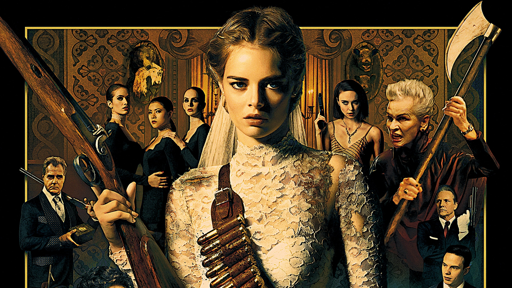

Continuing my theme of comical hyper-violence, _Ready or Not_ takes a run at my perennial favorite Halloween movie, _Cabin in the Woods_.

The film opens on Samara Weaving marrying into the wealthy Le Domas family. As the collective owner of a classic board game company, the family has a tradition: new members must play a randomly selected game on their wedding night. Most folks get "Monopoly" or "Uno", but naturally, Weaving draws "hide and seek, to the death". She thinks it's a joke at first, but a panicked reaction from her new husband makes it clear that's not the case. The night that follows is silly, tense, twisty, brutal, and satisfying all at once.

There's a good ensemble of family members and in-laws who hurt and help her on her journey to stay hidden until dawn. All the while, the family grapples with what their fortune is really worth to them, adding an emotional and philosophical twist you wouldn't expect for a movie like this. All told, I'm glad to welcome _Ready or Not_ to the hallowed halls of "movies I'll definitely watch over and over again".

_[Ready or Not](https://www.justwatch.com/us/movie/ready-or-not-2019) is available for purchase._

---

#### Magic Mike XXL

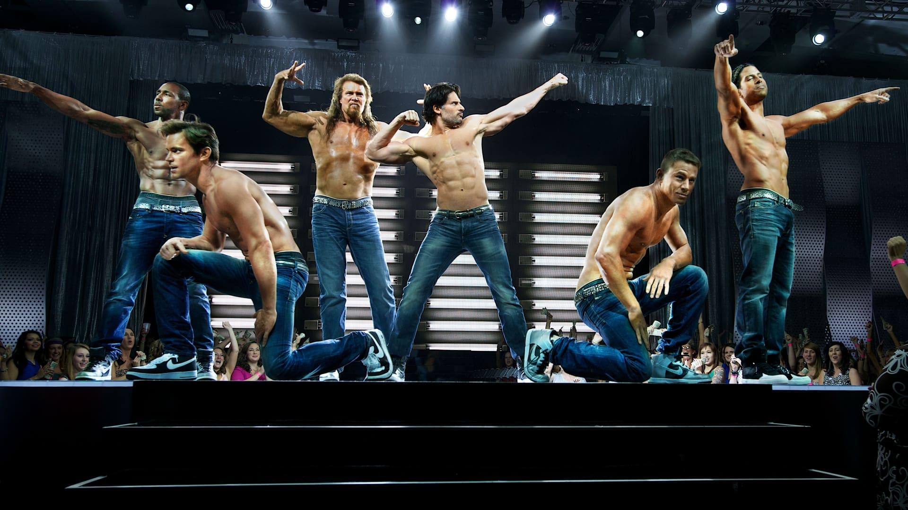

We watched the entire trilogy of Magic Mikes (Magics Mike?) this year and found there was a big disconnect between the movie we wanted to watch and the film Soderbergh wanted to make. Before watching, I was under the impression that this was a trilogy of lighthearted comedies starring male strippers. We were understandably disappointed to find out that the first is instead an occasionally funny drama about the rough life these strippers lead. It was effective in its own way, but wasn't what we set out to watch. Luckily, this is remedied in the sequel.

_Magic Magic XXL_ realizes that we're here for fun, not awards bait. It pitched itself as a fun, often-nude, male version of Pitch Perfect, which was exactly what we wanted. The guys basically go on a road trip to compete at Stripper Nationals – it's goofy, bawdy, fun, and adventurous all at once. And don't worry: you can watch this one without seeing the first.[^6]

_[Magic Mike XXL](https://www.justwatch.com/us/movie/magic-mike-xxl) is available to stream on Hulu and for purchase._

---

### Honorable Mentions

- _[Spider-Man: Across the Spider-Verse](https://www.justwatch.com/us/movie/spider-man-into-the-spider-verse-2)_ for being more of the superb animation and worldbuilding we saw from the original film. Unfortunately, it's only half a story! They committed the same sin that _Infinity War_ did: not subtitling the movie "part 1" (and surprising us with it instead).[^7]
- _[Sneakers](https://www.justwatch.com/us/movie/sneakers)_ for its superb ensemble cast, heist story that holds up, and impeccable vibes (despite having come out in 1992).

<MediaYearLink items="movies" verbed="watched" year="2023" />

## TV Shows

In 2022, I finished 37 new-to-me seasons of TV, comprising 356 episodes across ~187 hours (a slight increase from last year, but remarkably consistent year-to-year). We've been in a golden age of prestige TV for years now and I have been _feasting_. I'm a little nostalgic for the classic Sept-May 22-episode TV seasons, but the quality we get now is so much higher that it's a worthwhile trade. In the future, it'll be interesting to see how this year's successful [writer](https://en.wikipedia.org/wiki/2023_Writers_Guild_of_America_strike) and [actor](https://en.wikipedia.org/wiki/2023_SAG-AFTRA_strike) strikes affect releases (something we probably won't see the full effects of for a while).

### Poker Face

Rian Johnson is [no](/post/my-favorite-media-of-the-year-2019-edition/#movies) [stranger](/blog/post/favorite-media-2022/#glass-onion) to these roundups, returning once again with a Columbo-style [inverted mystery](https://en.wikipedia.org/wiki/Inverted_detective_story); each episode starts by showing the audience exactly who commits the crime (and how). The rest of the episode follows Natasha Lyone's Charlie Cale blundering to the bottom of things with her uncanny ability to always know when someone is lying.

All the while, she's on the run from her past across the southwestern US. Despite being just 10 episodes, _Poker Face_ punches way above its weight with a nonstop stream of A-list guest stars and clever plots, all while making us care about every character (even the murderers). Johnson masterfully weaves the crime-of-the-week into a larger story about Charlie. It's the sort of thing that has legs and I'm excited for at least a couple more seasons of this show.

_[Poker Face](https://www.justwatch.com/us/tv-show/poker-face) is available to stream on Peacock._

---

### The Last of Us

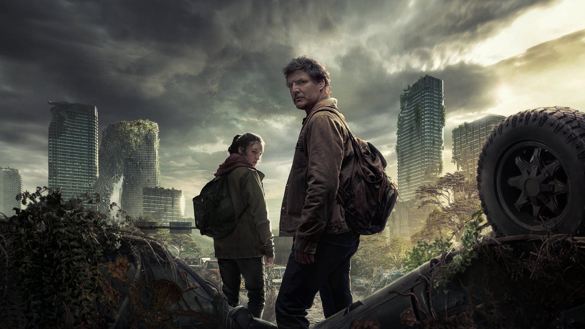

There are startlingly few video game adaptations that are worth anything, but _The Last of Us_ bucks the trend. It's not just a good adaptation, it's phenomenal television. Showrunners Craig Mazin and Neil Druckmann craft big stories out of heartfelt tiny ones.

You might think the show's about zombies, but it's not, really. It's about the people who live in a world with zombies. About how they survive, how they love, and how they die. _The Last of Us_ showcases some of TVs best love stories (romantic and platonic) in the way you'd least expect.

Each episode stands on its own but comes together for a larger, satisfying season-long arc. It covers roughly the plot of the first game (of two) and I can't wait for more.

_[The Last of Us](https://www.justwatch.com/us/tv-show/the-last-of-us) is available to stream on HBO Max and for purchase_.

---

### Runner(s) Up

#### Star Trek: Strange New Worlds

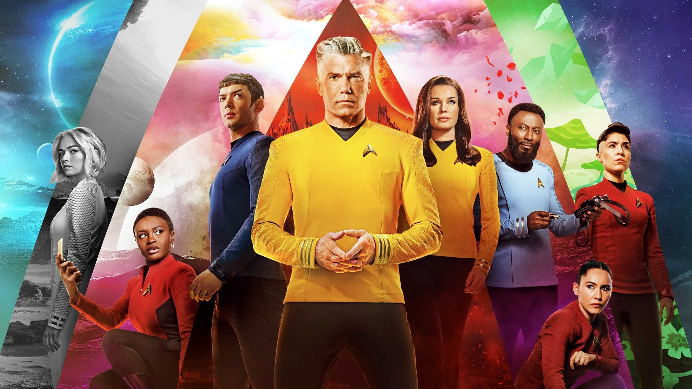

There's a lot of new Trek being made today (thanks, in part, to investment from Paramount and its easy availability on their streaming service). The shows range from "fine" to "great" (_Lower Decks_ is our other current favorite), but nothing comes close to the consistent bar of quality that _Strange New Worlds_ puts out.

I watched both currently-aired seasons this calendar year and was wowed by the mix of drama, silliness, and low-action sci-fi.[^8] Anson Mount is a superb captain and is well-supported by those who play the rest of the crew. In contrast to _Discovery's_ nonstop high-stakes universe-ending action, we get things like body swaps, musical episodes, and new planets who have problems besides the planet-destroying kind. It feels like Star Trek the way it's meant to be. Here's hoping they can keep it up.

_[Strange New Worlds](https://www.justwatch.com/us/tv-show/star-trek-strange-new-worlds) is available to stream on Paramount+ and for purchase._

---

### Honorable Mention(s)

- [Archer](https://www.justwatch.com/us/tv-show/archer), for remaining good and sticking the landing after 14 seasons. Folks will say it dropped off in quality, but in my opinion it maintained its high bar and [went out with a bang](https://www.youtube.com/watch?v=Qs8Gohi1e04).
- [Crazy Ex-Girlfriend](https://www.justwatch.com/us/tv-show/crazy-ex-girlfriend), for really coming into its own. It started as a quirky musical comedy, but really evolved into a show about mental health and love, which is a tricky thing to do on network TV.
- [Taskmaster](https://www.youtube.com/@Taskmaster), for being a concept so fun I based my birthday party around it. It's light watching and Greg Davies plays the perfect harsh-but-fair points authoritarian. (_Editor’s note: Alex Horne as the put-upon straight man assistant is both adorable and funny. Especially when we remember he’s actually the mastermind behind the show._) Plus it's all on YouTube!

<AirtableLinkAndReturn
  items="shows"
  verbed="watched"
  year="2023"
  link="https://airtable.com/appgycccClQwN0zHz/shrZQQpgNma32Bx4z"
/>

## Books

I read 17 books in 2023 (up from 13 last year). I'm fairly picky with my selection, so competition was stiff. I'm still loving my [Kobo](/blog/post/an-ode-to-kobo/) setup and the local library continues to be a great place to get books. I also listened to some audiobooks for the first time in a while thanks to a generous Audible free trial (but I still need to find a good balance between audiobooks and podcasts).

### Everyone in My Family Has Killed Someone

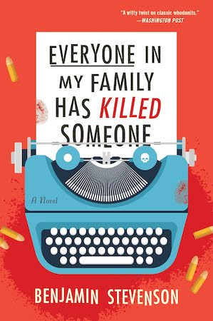

In grade school, our teachers would always tell us to start stories with a "hook", the interesting bit that brings a reader in. Author Benjamin Stevenson _really_ took this advice to heart. As soon as I read _Everyone in My Family Has Killed Someone_'s intro, I knew I'd love the book. Here it is:

> Everyone in my family has killed someone. Some of us, the high achievers, have killed more than once.

> I’m not trying to be dramatic, but it is the truth, and when I was faced with writing this down, difficult as it is with one hand, I realized that telling the truth was the only way to do it. It sounds obvious, but modern mystery novels forget that sometimes. They’ve become more about the tricks the author can deploy: what’s up their sleeve instead of what’s in their hand. Honesty is what sets apart what we call “Golden Age” mysteries: the Christies, the Chestertons. I know this because I write books about how to write books. There are rules, is the thing. A bloke named Ronald Knox was part of the gang and wrote down a set once, though he called them his “commandments.” They’re in the first part of this book in the epigraph that everyone always skips but, trust me, it’s worth going back to. Actually, you should dog-ear it. I won’t bore you with the details here but it boils down to this: the Golden Rule of the Golden Age is play fair.

> Of course, this isn’t a novel. All of this happened to me. But I do, after all, wind up with a murder to solve. Several, actually. Though I’m getting ahead of myself.

He then proceeds to tell us during exactly which chapters people are killed. Amazing, right?

Stevenson, true to his word, presents a detailed, coy, and fair mystery at a ski resort where no one is truly innocent (per the book's title). Its many-layered plot continues to surprise until literally the last sentence of the book. I really liked how upfront Stevenson was about the rules he was going to follow as an author. He sat down and challenged us to a game of mysteries and murder. What a delight.

---

### Recursion

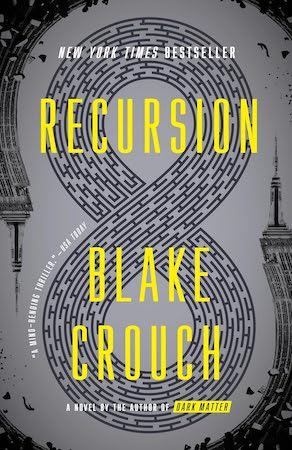

I've liked Blake Crouch's work in the [past](/blog/post/favorite-media-2020/#dark-matter) and _Recursion_ didn't disappoint. The characters are embroiled in a sci-fi thriller/time loop mystery that I won't spoil here, but it hits on some deep themes of love and memory. There's a good cast and the last 3rd of the book is a real page turner as everything comes to a head. Crouch manages to weave a heartfelt story through the chaos. It's a blast, top to bottom.

---

### Foundryside

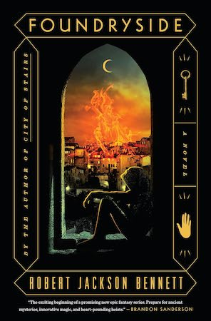

Robert Jackson Bennett's latest novel follows Sancia, a young thief who gets in _way_ over her head. She's hired to steal a priceless magical artifact by infiltrating the local dockyard, which she promptly burns down. On the run, she works against the clock to figure out why it's so valuable, who's after it, and who she can trust.

There's a lot to like, but my favorite thing about the book was the design of the magic system that enables controlled flight, mystically picking locks, and all manner of tricks and traps. It's a cross between physics and programming where skilled practitioners inscribe runes onto objects to "convince" them to violate the laws of physics. For instance, crossbow bolts can be convinced that they're pointed down and that the force of gravity has been greatly increased, so they fire much faster (and cause more destruction) than they should otherwise. Naturally, these instructions are susceptible to further "creative convincing" for those with the right talents (the magical equivalent of hackers).

This is the world in which Sancia and her motley crew pull off a series of daring heists (heists!!) to unravel the political intrigue between the four great merchant houses. There's a lot packed in (and it's only the first book in a trilogy), but I absolutely tore through it.

---

### Runner(s) Up

#### The Frugal Wizard's Handbook for Surviving Medieval England

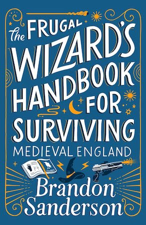

Though I didn't back his [record setting Kickstarter](https://www.kickstarter.com/projects/dragonsteel/surprise-four-secret-novels-by-brandon-sanderson/), his [introduction of Secret Project #2](https://www.brandonsanderson.com/first-look-at-secret-project-2/) (as it was then known) sold me on the concept. I typically enjoy amnesia stories, and I was tickled by Sanderson's tongue-in-cheek interdimensional travel guide serving as the baffled narrator's only point of reference. Sanderson's breezy storytelling and wit provided a delightful romp through time and space as we learn about the world along with our unnamed protagonist. His incremental approach to understanding himself and the world around him is fun. The book develops its characters emotionally without getting _too_ heavy. Great as a one-off outing!

---

### Honorable Mention(s)

- _The Dark Forest_, the second book in Cixin Liu's "Three Body Problem" trilogy,[^9] I thought it delivered much more on the engrossing sci-fi promise of the first one. It was a much more interesting meditation on the human condition and how everyone reacts when they know aliens are coming. That's really what I wanted from the highly-regarded first one (which I [also read this year](https://david.reviews/books/the-three-body-problem/), but scored lower). Bring on the third!
- _Jove Brand is Near Death_ - J.A. Crawford's debut novel is a fun romp about a washed up actor who played ~~James Bond~~ Jove Brand in the character's worst outing. He finds himself framed for a series of killings done in the style of stunts from the movies, sending him on a race to avoid the press and save other ex-Brand actors from a grisly fate. It's a fun mix of spy thriller and meta-commentary on the James Bond film franchise that moves along at a brisk pace. I'm excited to read the rest of the series.

<MediaYearLink items="books" verbed="read" year="2023" />

## Updates to Previous Picks

- _The Afterparty_ S2 - The season itself was good (and, per usual, had a stellar cast), but what really sold us on this season was its elaborate puzzle hunt. We enjoyed watching the show, but we _really_ enjoyed [solving all the puzzles](/blog/post/afterparty-s2-puzzle-guide/) and collaborating with other folks on Reddit. The show's been canceled, but each season stands alone, so don't let that deter you.
- _Barry_ concluded with its 4th season. It kept up its wild ride until the very end. Satisfying finales are tricky, but they nailed the tone and story resolution.
- _Factorio_ is getting an [official expansion](https://factorio.com/blog/post/fff-373)!
- _Hilda_ got a lovely final season.
- _Only Murders in The Building_ had a great and musical season 3.
- _Ted Lasso_ aired its third and final season. You might hear that "it went downhill after season 1" or "it was a weird ending"; that is incorrect. Watch the whole thing, it's great.

## Just the List

Click to expand

<ul className="tight-list">

- Games
  - [Horizon: Forbidden West](https://www.playstation.com/en-us/games/horizon-forbidden-west/)
  - [Chained Echoes](https://www.chainedechoes.com/)
  - [Hi-Fi Rush](https://bethesda.net/en-US/game/hifirush)
  - Runner(s) Up
    - [Case of the Golden Idol](https://www.thegoldenidol.com/)
    - [Tinykin](https://www.tinykingame.com/)
  - Honorable Mention(s)
    - [Trash the Planet](https://thisgameishaunted.itch.io/trash-the-planet)
    - [The Frog Detective Trilogy](https://frogdetective.net/)
    - [Monster Sanctuary](https://monster-sanctuary.com/)
    - [INSIDE](https://playdead.com/games/inside/)
- Movies
  - [Bullet Train](https://www.justwatch.com/us/movie/bullet-train)
  - [Barbie](https://www.justwatch.com/us/movie/barbie-2023)
  - Runner(s) Up
    - [Ready or Not](https://www.justwatch.com/us/movie/ready-or-not-2019)
    - [Magic Mike XXL](https://www.justwatch.com/us/movie/magic-mike-xxl)
  - Honorable Mention(s)
    - [Spider-Man: Across the Spider-Verse](https://www.justwatch.com/us/movie/spider-man-into-the-spider-verse-2)
    - [Sneakers](https://www.justwatch.com/us/movie/sneakers)
- TV Shows
  - [Poker Face](https://www.justwatch.com/us/tv-show/poker-face)
  - [The Last of Us](https://www.justwatch.com/us/tv-show/the-last-of-us)
  - Runner(s) Up
    - [Strange New Worlds](https://www.justwatch.com/us/tv-show/star-trek-strange-new-worlds)
  - Honorable Mention(s)
    - [Archer](https://www.justwatch.com/us/tv-show/archer)
    - [Crazy Ex-Girlfriend](https://www.justwatch.com/us/tv-show/crazy-ex-girlfriend)
    - [Taskmaster](https://www.youtube.com/@Taskmaster)
- Books
  - [Everyone in My Family Has Killed Someone](https://benjaminstevensonauthor.com/everybody-in-my-family-has-killed-someone)
  - [Recursion](https://blakecrouch.com/books/recursion/)
  - [Foundryside](https://www.robertjacksonbennett.com/the-founders-trilogy)
  - Runner(s) Up
    - [The Frugal Wizard's Handbook for Surviving Medieval England](https://www.brandonsanderson.com/standalones-non-cosmere/#frugalwizard)
  - Honorable Mention(s)
    - [The Dark Forest](https://us.macmillan.com/books/9780765386694/thedarkforest)
    - [Jove Brand is Near Death](https://camcatbooks.com/Books/J/Jove-Brand-Is-Near-Death)

</ul>

## That'll Do it

Another review in the books! Thanks for sticking with me. I hope you had as much fun reading this as I did writing it.

Thanks again to [Vicky](https://vickystein.media/) for her editing prowess (and tireless support) and to my sister [Karen](https://www.karenbrownman.com/) for her stellar header image.

If you've got recommendations for me, don't hesitate to [reach out](/contact); I always love hearing from you.

Until next time!

[^1]: This is one of my pet peeves in series, where a movie mostly serves to set up future entries in the series. _Avengers: Age of Ultron_ is guilty of this
[^2]: The devs clearly played BotW and adapted its best ideas (to our benefit)
[^3]: Tinykin joins the exclusive club of "Games that Add a Skateboard for Purely Cool/Fun Reasons", along with _Kindgom Hearts 2_
[^4]: Fun fact: while Vicky was editing this piece, she sat down and played the whole thing. She really enjoyed the story and writing, especially
[^5]: Which I love dearly and Vicky is a good sport about
[^6]: Unfortunately, Soderbergh is back for the third one and it gets boring again. So really, just stick with this outing.
[^7]: Apparently the fact that this was only the first part of a movie was made clear in the trailers? But I don't watch trailers, since they spoil too much of the movie for me.
[^8]: sorry JJ Abrams
[^9]: Technically speaking it's the "Remembrance of Earth's Past" trilogy, but apparently no one calls it that
