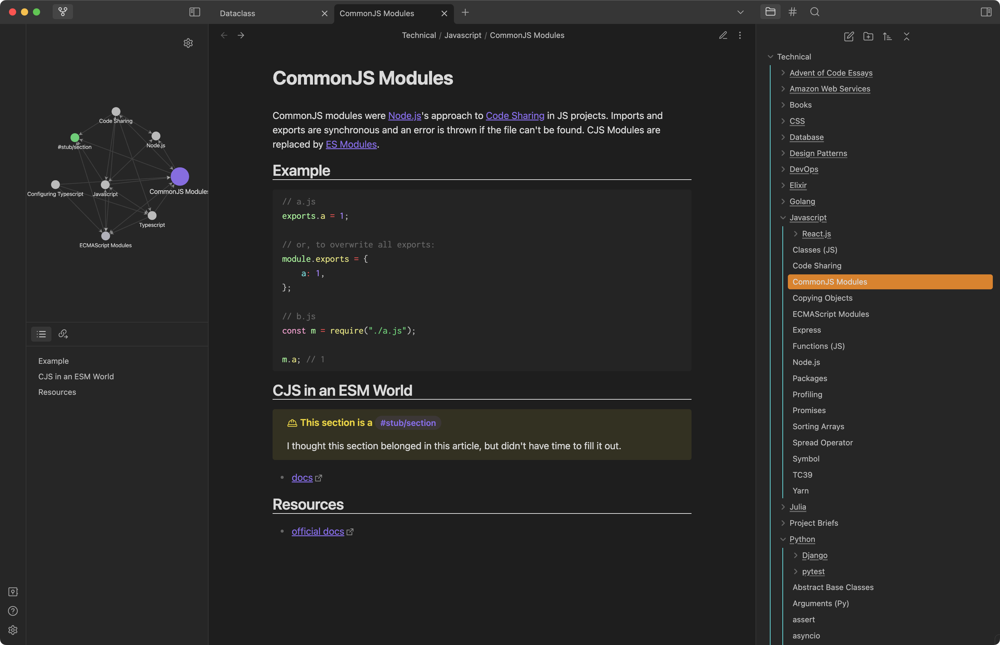
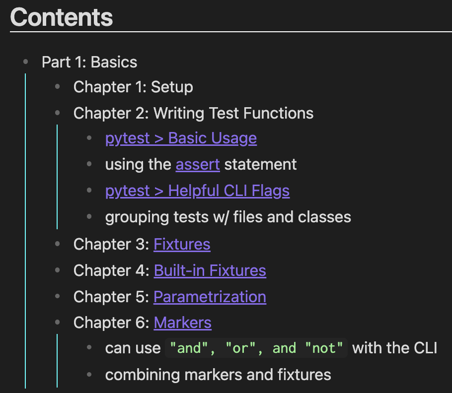
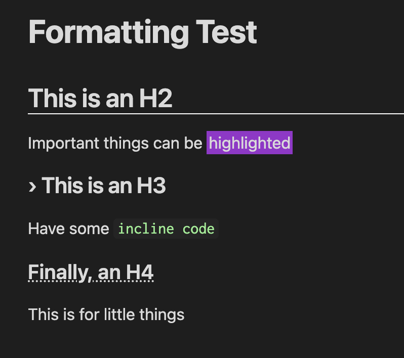

<!-- (mostly chatgpt) -->

[Obsidian](https://obsidian.md/) is a powerful note-taking app that has gained popularity among knowledge workers, writers, and students. What sets it apart from other note-taking apps is its unique approach to organizing information through the concept of a "digital garden" that grows over time. In Obsidian, notes are interconnected through a web of links, creating a network of ideas that can be easily navigated and explored.

While it can be tempting to start building your digital garden by replicating someone else's, it's important to remember that everyone's brain works differently. Your digital garden should reflect the way you think and organize information, and the best way to achieve this is by starting from scratch. That said, it _is_ useful to see how more experienced users use the app, so I thought I'd outline my approach here.

<!-- (/mostly chatgpt) -->

## Table of Contents

- [What's My Obsidian For?](#whats-my-obsidian-for)
- [Goals](#goals)
  - [Non-Goals](#non-goals)
- [Organization](#organization)
  - [File Location](#file-location)
  - [File Name](#file-name)
  - [Headings](#headings)
  - [Tagging](#tagging)
- [UI Layout](#ui-layout)
  - [Custom CSS](#custom-css)
- [Plugins](#plugins)
  - [Core Plugins](#core-plugins)
  - [Third Party](#third-party)
- [My Graph / Stats](#my-graph--stats)
- [Tips](#tips)

## What's My Obsidian For?

I treat my Obsidian vault as a personal Wikipedia. That particular writing style comes naturally to me as someone who has used Wikipedia heavily for many years. Like, member of my [college Wikipedians club](https://www.michigandaily.com/uncategorized/1wikipedia-secondar31/), player of [Redactle](https://pteredactle.com/) kind of heavy. Each note that I write in Obsidian summarizes "everything important I know about X."

I use Obsidian (almost) exclusively to write about technical topics.[^1] I found that I was mostly looking up the same things over and over in documentation (e.g. "how do I simulate Python-style `kwargs` in Typescript?" or "what are the 3 CSS flexbox properties I always need?"). By storing those answers in Obsidian, I build a corpus of the technical information I use most often. In that way, it's like my own personal knowledge cache.

Obsidian works especially well to store the notes I take while reading technical books. I keep a file on each book, and build an index of the technical topics that the book references in each chapter. Here's what my page for Josh Goldberg's [Learning Typescript](https://www.learningtypescript.com/) looks like:


<ViewFullSize href="https://cdn.zappy.app/b4c94d526d1dd6b18fd6b6ffde7f34f8.png" />

## Goals

I use this list as a guide for my writing style and what topics I choose to include in Obsidian:

- Only take notes that are useful enough to be worth reading later.
- Notes are meant to be read, so format them for smooth consumption. Make liberal use of aliases when referring to other notes.
- I want to see how topics are connected, so backlinks are especially important to me. It's great for technical notes, but it's also useful for things like my Advent of Code essays (to see all the days on which I've used a particular feature, like recursion), or which book(s) I can reference to learn more about async data processing.
- Notes should _summarize_ only non-obvious things (or bits that I reference frequently) in external documentation. For example, I shouldn't list "how to get string length" in each language - that's an easy google away. Instead, I could summarize intricacies of a language's module system (looking at you, JS) or the in what ways relative imports are different from absolute imports in Python (and which approach I personally should use).
- All notes within my vault should stand on their own. If you need to read another note to understand this one, they should be merged.

### Non-Goals

- I don't take meeting notes; I don't meet with enough people for that to be worthwhile.
- Some people swear by daily notes, but it's not for me. That seems like the sort of system you'll spend more time writing than reading. Sure, it helps you find all the days on which you worked on a project or talked to a specific person, but is that really important info?
- I don't do any task management in Obsidian. That's reserved for [Things](/blog/post/my-perfect-task-app/) (and at work, Jira). I get the appeal of combining everything, but to me, a knowledge base isn't the right place to do project planning.

## Organization

I do my best to ensure every note maintains a predictable location and internal structure. These aren't _rules_, per se. More like a [set of guidelines](https://youtu.be/k9ojK9Q_ARE?t=41). I have a summary of these collected into a note at `Meta/How I Obsidian`. I treat it as a personal version of the [Heroku voice guidelines](https://devcenter.heroku.com/articles/heroku-dev-center-voice-and-tone-guidelines).

### File Location

How to organize your files on disk (or not!) is a _contentious_ topic in the Obsidian community. I went back and forth with it for a while before settling on my current system. I considered emulating Wikipedia's very flat system (where every article is at the top level and names must be unique). But I find hierarchies useful for grouping related info, so I stuck to nested folders.

To that end, I took a page out of competitor [Dendron](https://www.dendron.so/)'s book and consider each note's title to be its full path ([read more](https://wiki.dendron.so/notes/683740e3-70ce-4a47-a1f4-1f140e80b558/#why-hierarchies)). So, `Technical/Python/Classes` is distinct from `Technical/Javascript/Classes` and I know right where to find each. If a note could conceivably be in more than one place, I put it as shallow as possible. A note should only be nested if that path is the only place it could reasonably be found.

Ultimately, I don't fret too much about file location. Notes are extremely easy to move, so I put them _somewhere_ and can re-adjust later if needed.

### File Name

The name of each file should be short and specific. Don't include data in parens unless failing to do so would result in a lot of unintentional unlinked mentions. For example, `C` wouldn't be a good file name for the language. Use `C (Programming Language)` or `Users (Django)` instead. Additionally, try to avoid including the name of the parent topic, since a file's location in a hierarchy should give it meaning. For example, `Django/Models` should be preferred to `Django/Django Models`.

Filenames don't need to be unique. If two pages with duplicate names link to each other, they should add parens to differentiate them from each other (making them more readable in the local graph). If it's a specific application of a more general term, then parens are appropriate: `Django/Security` should be `Security (Django)`.

### Headings

I don't have hard and fast rules for headings. The text in a page is pretty free-form, but it's helpful to have some go-to headers so I always know where to look on a page. This isn't an exhaustive list, but I prefer the following headers over anything similar:

- `Resources`: web links, such as docs or cheat sheets
- `Learning`: Tutorials and guides that I found helpful and/or want to go through
- `Examples`: code snippets that illustrate a topic

All top-level headers should be `H2` elements. `H3` and `H4` are encouraged for building hierarchy.

### Tagging

I'm a little unusual in that I use tags to describe the temporary state of a note rather than using tags to group topics. In theory, if my vault was complete and perfected, all of my tag counts would show `0` since there are no issues left to resolve. As it is, I have the following hierarchy:

- `#stub`
  - `#section`
  - `#learn`
    - `#section`
- `#merge`
- `#split`
- `#fix-taxonomy`
- `#deletion`

These mirror warnings you get on Wikipedia pages and help me keep my notes in tip-top shape.

## UI Layout



<ViewFullSize href="https://cdn.zappy.app/1a97c74784e2673805ce9e2686f87db8.png"/>

I typically use Obsidian in full screen with 3 panes visible:

- top left: the local graph, which shows all connected notes
- bottom left: the local headings to give an overview of the current note
- the main editing area is in the middle
- right: the folder structure lets me quickly visualize the hierarchy if I need to. This panel is usually closed.

### Custom CSS

I love that Obsidian lets you customize the UI down to the very CSS. Though I use the default theme, I have a few custom tweaks.

Add vertical guides to show indentation level:



Nice decorations for header elements



You can see all of my customizations [in this gist](https://gist.github.com/xavdid/fa5d83068a1bd5645641d995d1d008a3).

## Plugins

I typically recommend folks don't go overboard with plugins, especially when they're starting out. They're powerful, but it's better solve specific problems with plugins than to "go shopping" for new functionality.

### Core Plugins

A lot of core plugins can also be described as basic features ("search", "files", "outline", etc) so I won't go into those here. That said, a few do offer significant functionality so I'll call them out

The core **Template** plugin is the one I use the most. Given that I have a fairly repetitive file structure, being able to start with the outline I want is great. I also use the template plugin to insert [callouts](https://help.obsidian.md/Editing+and+formatting/Callouts), because I like how they look (remember, optimize for readability). They're especially powerful together, allowing me to add a template which includes a status header:

```md
> [!learn] This article is a #stub/learn
> I thought the article was worth having, but didn't know enough to fill it in on `{{date}}`.
```

The **Command Palette** (and by extension, the **Quick Switcher**) are invaluable for navigating my vault quickly. Because I know where a note will be, it lets me pull up information quickly.

### Third Party

These are the 3rd party plugins I use, sorted roughly in order of importance:

- [Folder Note](https://github.com/aidenlx/alx-folder-note), for abstracting the ability to have a folder that is also a note. For example, `Technical/Python` exists as a descriptive note, but `Technical/Python/Dataclass` exists too.
- [Pipe Tricks](https://github.com/marcusolsson/obsidian-pipe-tricks), which helps make notes with complex titles bearable to read. Unmaintained, so I may fork it at some point so I can have it do exactly what I need.
- [Waypoint](https://github.com/IdreesInc/Waypoint), for auto-generating links to all sub-notes (effectively showing folder hierarchy in the graphs). Pairs well with Folder Notes.
- [Editor Syntax Highlighting](https://github.com/deathau/cm-editor-syntax-highlight-obsidian), for performing syntax highlighting outside of reading mode.
- [Advanced Tables](https://github.com/tgrosinger/advanced-tables-obsidian), for keeping tables nicely formatted and navigable.

Again, I try to keep it simple.

## My Graph / Stats

The big graph view is simultaneously the coolest and most useless Obsidian feature. It's neat to see how everything is clustered and connected, but quickly becomes unreadable after a certain size. But, it makes for a nice visual. Here's mine:


<ViewFullSize href="https://cdn.zappy.app/c6a27d983d9dc6d0056a8648f70daac9.png"/>

Folder notes and book indexes act as big hubs and everything is _quite_ interconnected.

Word count wise, I'm just a hair over 100k words! Find your own by running the following in the root of your vault:

```bash
find . -name '*.md' -not -path './.obsidian/*' | sed 's/.*/"&"/' | xargs wc -w
```

## Tips

Finally, I'd like to leave you with some rules to get the most out of Obsidian:

1. **It's a tool, not a toy**. Though tinkering with your Obsidian setup is fun, it's important that you're deriving value out of the time you put in. It's like buying lots of fancy camping gear: at some point you actually have to get out into nature and use it.[^2]
2. **Notes are meant to be read**. As you're writing, focus on the reading experience.
3. **Keep notes focused**. While it might be tempting to have lengthy notes on a subject, you get more mileage out of Obsidian's core linking feature by having smaller, interconnected notes.

I think that should do it. Happy (digital) gardening! 🌱

[^1]: I have a few pages about personal house things (such as details about our ethernet hardline and yearly stats about halloween), but 95% of the docs are technical.
[^2]: See also: building and tweaking [dotfiles](https://github.com/xavdid/dotfiles)
