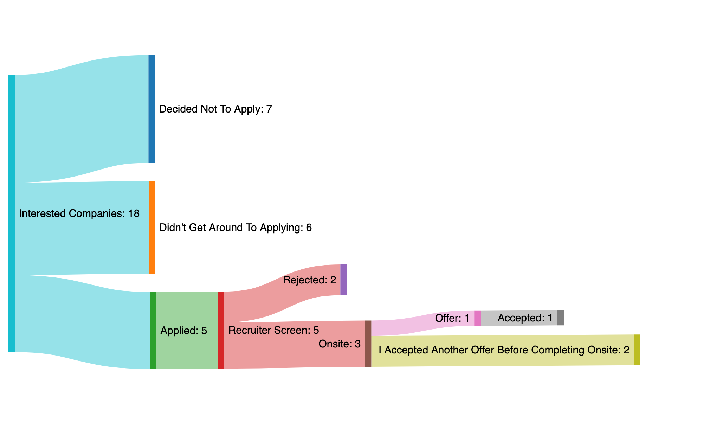

> Note: this post describes a job search that happened in March/April 2022, before any hiring freezes or industry side effects from economic downturn. Your mileage may vary.

Some personal news: After 5 years at Zapier, I've got a new job! As of today, I'm a Senior Software engineer at [Stripe](https://stripe.com/) on their new Sandboxes team.

This was my first job search in quite a while. If you're in the same boat, you may be curious what the water's like out there.[^1] It's also worth mentioning that I'm a straight white male, and my experience getting a job in the software industry (unfortunately) may not be directly transferrable to everyone.

Here's a rough overview of how the process went:

#### Table of Contents

<!-- START doctoc generated TOC please keep comment here to allow auto update -->
<!-- DON'T EDIT THIS SECTION, INSTEAD RE-RUN doctoc TO UPDATE -->

- [Deciding To Leave](#deciding-to-leave)
- [Finding Companies](#finding-companies)
- [Applying](#applying)
- [Interviewing](#interviewing)
  - [Recruiter Screens](#recruiter-screens)
  - [Technical Screens](#technical-screens)
- [Offer & Negotiation](#offer--negotiation)
- [Leaving Your Job](#leaving-your-job)
- [Takeaways](#takeaways)

<!-- END doctoc generated TOC please keep comment here to allow auto update -->

## Deciding To Leave

[Zapier](https://zapier.com/) is and was a great company -- I wouldn't have worked there as long as I had if it wasn't. But, no one stays anywhere forever. As 2022 began, I was getting restless. There was a little bit of <abbr title="Fear of Missing Out">FOMO</abbr> around the "[great resignation](https://en.wikipedia.org/wiki/Great_Resignation)" and the knowledge that staying too long in the same job [hurts long-term earnings](https://www.forbes.com/sites/cameronkeng/2014/06/22/employees-that-stay-in-companies-longer-than-2-years-get-paid-50-less). So, I figured it was about time. Most of the uncertainty from the early days of Covid had subsided, so I felt more comfortable being the new guy somewhere. There was no real rush, but the search had begun.

## Finding Companies

I started by making a list of companies that:

1. had developer-focused products and cared about developer experience (something I was interested in after years on the Developer Platform team)
2. had an interesting product I'd enjoy using and contributing to
3. had either a tiny engineering org or a huge one. I wanted either the freedom of a small startup or the stability of a well-established team
4. supported fully-remote workers (and wouldn't walk that back in the future)
5. was not "[mission](https://world.hey.com/jason/changes-at-basecamp-7f32afc5) [focused](https://blog.coinbase.com/coinbase-is-a-mission-focused-company-af882df8804)" -- it's impossible for a person or company to be "apolitical" and it's a fool's errand to try
6. was not focused on web3/NFT/crypto; even if some people have good intentions, the whole industry feels like a grift

Using those criteria as starting points, I built a list of companies that I had heard cool things about, whose product I use, or who have employed people I trust. That yielded 18 companies. Naturally, I loaded them all into an Airtable. From there, I read engineering blogs, glassdoor reviews, and got input from friends to get a sense of my highest priority companies. Then it was time to apply!

## Applying

The worst kept secret in the startup world is "**a referral is everything**". Though they don't guarantee you a job, a referral _basically_ ensures you get the chance to talk to a human recruiter.

Do anything you can to not go in cold. Even if you don't personally know someone at the company, you can usually get in contact w/ a recruiter, developer advocate, or (if they're small enough) founder and start an informal conversation. People are surprisingly willing to refer you to their company, even if they don't know you well. If you truly don't know and can't find anyone at a company, the folks at [Blind](https://www.teamblind.com/) are usually friendly about giving random referrals. Taking my own advice, all of my applications were sent via a friend or soft (aka "person I occasionally interact with on twitter") contact.

Along with my resume and links to my site & GitHub account, I included a brief (unique) cover letter with each application. Here's an example one:

> Hello there! I'm very interested in working as a [JOB TITLE] on the [TEAM NAME] team. Designing superb developer experiences has been a core part of my job for years now, and I'm excited to bring that to a larger audience. I have a proven track record of engineering mentorship and technical excellence. I'm motivated when my work helps people complete theirs. Sounds like [COMPANY NAME] fits that bill, so I'd love the opportunity to work there. Thank you very much for your time!

Generally, I'd include a brief intro, a sentence about why I'd be good for this role (by referencing specific language in the job posting), any relevant open source / blog work I'd done, and a "thank you". These took 5 minutes tops to write and added a bit of individuality to my application.

During my job search, I applied to 5 companies: 2 tiny, 1 small, 2 large.

## Interviewing

Once those applications were in, it was time to interview! Most companies still follow the standard flow, which is:

1. recruiter screen
2. technical screen
3. "onsite" (many interviews in a row, mix of technical and not; it's virtual right now, but they used to fly you out to the office)
4. offer

### Recruiter Screens

The recruiter screens were straightforward. They're just conversations, where the recruiter wants to get a sense of your personality and general technical experience. They also ask about work history, which you should be able to talk off-the-cuff about.

Interestingly, I was rejected from 2 companies at this stage (both of which were small startups). This took me by surprise, since I didn't think there was much to disqualify me for at this stage. I really only applied to jobs I knew I'd excel at. It's possible they were looking for a candidate with a different skillset, or I didn't communicate my skills and accomplishments well enough.

But, no need to dwell. Their loss!

### Technical Screens

This is where the rubber meets the road and you actually write some code.

The technical interviewing process is [notoriously inaccurate](https://about.gitlab.com/blog/2020/03/19/the-trouble-with-technical-interviews/) for predicting job success. Typically, you're asked to solve a self-contained programming puzzle, or perform a classic CS operation (like reversing a binary tree) that _probably_ doesn't come up much in the actual job.

The common wisdom is to practice (at great length) for the sort of questions you'll be asked; working [LeetCode](https://leetcode.com/) and reading [Cracking the Coding Interview](https://www.crackingthecodinginterview.com/) are typical recommendations. Because I was lucky enough to not _need_ a job right now, I took a different approach: I didn't study at all.

I got it into my head that the right company for me would have an interview that actually tested relevant job skills. It should happen in an actual coding environment, not on a white board. It should test relevant skills (being able to write code) without being esoteric (implementing algorithms I haven't thought about since college). I know that I can successfully do the job of Software Engineer, so any interview worth its salt should see that without me having to do extra prep. I'm also fortunate that years of [solving](https://github.com/xavdid/advent-of-code/tree/main/solutions) [Advent of Code](https://adventofcode.com/) has kept me pretty sharp at grokking and completing coding prompts.

This ended up panning out. I was very impressed with the Stripe technical interviews. I was happy to find that they tested fair things. While I can't go into too much detail, the prompts really did feel like distillations of actual work tasks rather than contrived puzzles. I made HTTP requests, handled JSON responses, restructured data, looked for a bug in an existing codebase, and talked about system design.

Unfortunately, I didn't get a chance to do onsites for the other companies to see how they compared. At this point in the process, timing was working against me. I find it exceedingly tough to get multiple companies to line up their interview processes (but I also don't do this often). By the time I was doing my Stripe onsite, one company had just reached out for a recruiter screen and another had _finally_ scheduled an onsite that they had to push back at the last minute because of extenuating circumstances.[^2]

You can control the timing between companies a bit (for instance, schedule calls for "early next week" instead of "tomorrow"), but ultimately a bird in the hand _is_ more valuable and it's worth moving forward with the most responsive companies while they're still interested.

## Offer & Negotiation

Companies will rarely start with the best deal they're willing to make. It's frustrating, but they expect you to do this little dance with them. If you don't, you're leaving money on the table.

The first, best thing to read on the subject of engineer salary negotiation is Patrick McKenzie's [seminal essay on the subject](https://www.kalzumeus.com/2012/01/23/salary-negotiation/). It's long, but it contextualizes the process and helps you know what to look for.

It's hard to give one-size-fits-all advice on offers, since the experience varies so wildly by company size. Small companies will have much more wiggle room and less of a "standard package". Larger companies typically have salary bands for a given position & level and you can generally only move within them. Obviously higher is better, but they also like to give you room to grow within the band. The company holds all the information at this point, since they know what they're willing to pay you. But, they also have a vested interest in hiring after all of these interviews, so they're almost certainly willing to play ball.

If the company hasn't volunteered a signing bonus, make sure to ask about one. This is usually the most flexible part of the negotiation, since they have a big budget to spend out of.

A big key here is not to lie about anything. You don't need to be totally forthright about everything, but if they ever ask to you prove something (like the numbers of a competing offer) and you can't, that looks really bad.

My negotiation went smoothly. They sent over the offer letter and after a couple of days, I replied with basically "this is great, and if you bumped the salary to $X, I'd sign today". That phrase is music to your recruiter's ears- they really want you to sign, and they'll work with you to make that happen. The recruiter called back saying they [couldn't](https://getyarn.io/yarn-clip/caa8db6b-913c-46f5-8b91-0beed8fd2f9e) take the salary that high, but were willing to do smaller bumps across salary, stock, and signing bonus. I mulled it over and asked how much more they could give me on the signing bonus, which they talked through. I asked for the high end of that range, they agreed, and the rest is history!

## Leaving Your Job

It's common courtesy to give 2 weeks notice before leaving a job. Even if you don't like your job, this is still not a bad idea. Companies are made of people and those people will one day work elsewhere, potentially somewhere you'd like a referral. It's worth a bit of your time not to be known as the person who just dips from a job. Leaving on the best terms you can is generally beneficial, so do it if you can.

I'm also tactfully honest in exit interviews. Don't be cruel, but be constructive and honest within reason. There are some [valid counterpoints](https://jacobian.org/2022/apr/4/exit-interviews-are-a-trap/) to this, but it really depends on your overall relationship with the company you're leaving.

Lastly, before you start your next gig, if you're able, take time off. Dates don't always line up and the lack of paychecks may not be feasible, but it's so rare that we get extended time off. It's an infrequent opportunity and one I wholeheartedly recommend if you're able. I was off nearly a month between jobs, and it was delightful.

## Takeaways

1. Get employee referrals; like it or not, they make a _huge_ difference when getting your foot in the door
2. Include a brief cover "blurb" with your application. Don't worry about formal letter formats or anything, but 4-5 sentences describing why you're perfect for this role can help get them excited about you
3. Be patient! I had it in my head that "hot job market" meant "they'll throw jobs at you, quickly", but most companies still have process, scheduling conflicts, etc. No one answers emails quite as fast as you'd like. Expect the process to take on the order of 1-3 months for most companies. That said, small startups can move much more quickly and big companies can take much longer (I've had friends talk with Google slowly for 6 months before getting an offer)
4. Negotiate! Read [patio11's bible on the subject](https://www.kalzumeus.com/2012/01/23/salary-negotiation/) and internalize its teachings. Worst case, you keep the offer they give you, but there's basically always wiggle room.
5. Take time off (if you can)! It's so rare to be able to have so much time for yourself, so take advantage of it when the opportunity presents itself

Thanks for reading! Hope it was helpful and that you find what you're searching for.

[^1]: again, circa April 2022
[^2]: I was frustrated because I did really want to work there, but given the events that caused the pushback, I totally understood.
