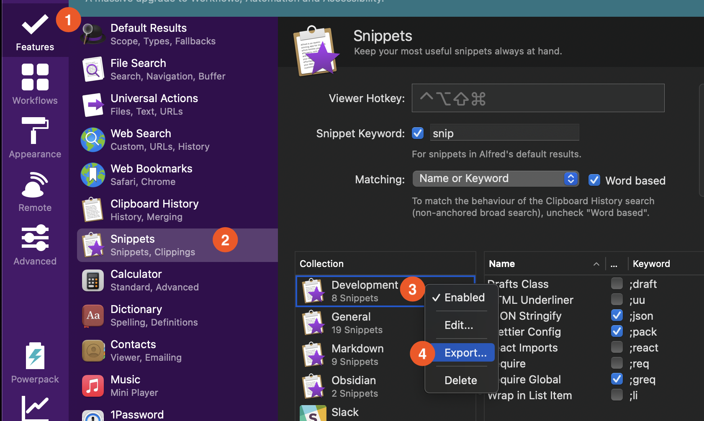
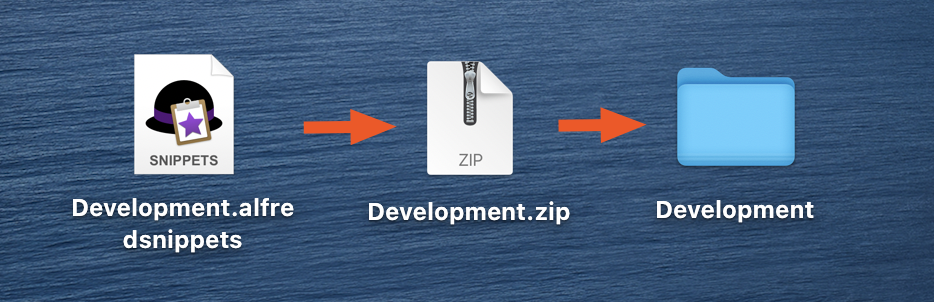
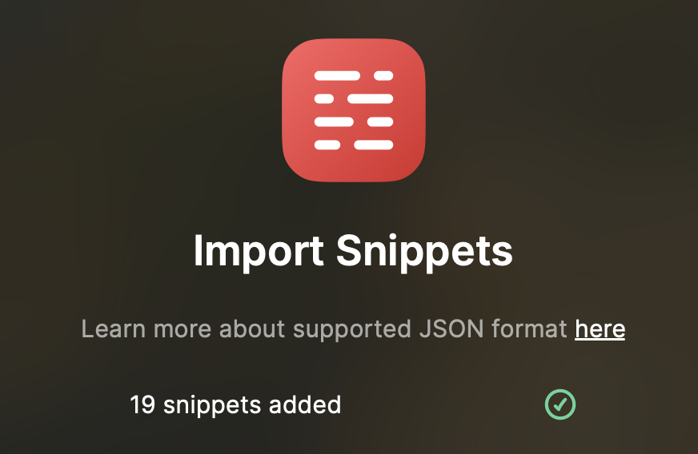

When I was trying out [Raycast](https://www.raycast.com/), the most tedious step was recreating my [Alfred](https://www.alfredapp.com/) snippet library. Luckily, Alfred has an export feature and, with a little word, Raycast can import it! Here's a quick step-by-step.

## 1. Export a Snippet Collection from Alfred



In the Alfred settings, click on:

1. Features
2. Snippets
3. Pick a snippet collection to export; right-click on it
4. hit export
5. Save somewhere convenient (probably your Desktop)

## 2. Rename and Unzip the Export File



Your export created a `<COLLECTION_NAME>.afredsnippets` file. If you try to open it, it'll just re-import into Alfred. Instead, change the extension to `.zip` and then open it as normal. This will give you a folder full of your individual snippets.

Unfortunately, Alfred exports all snippets, not just the ones that are enabled. So, if there are any you don't want in Raycast, go ahead and delete them.

## 3. Merge the JSON files

This is the tricky part! Each JSON file from Alfred has a single snippet that looks like this:

```json
{
  "alfredsnippet": {
    "snippet": "sherlock@gmail.com",
    "uid": "1020A581-F762-42CC-8118-C81391EE5559",
    "name": "Personal Email",
    "keyword": "@@"
  }
}
```

While the Raycast [import format](https://manual.raycast.com/snippets/how-to-import-snippets) expects a list of snippets like this:

```json
[
  {
    "name": "Personal Email",
    "text": "sherlock@gmail.com",
    "keyword": "@@"
  },
  {
    "name": "Home Address",
    "text": "221B Baker St., London"
  },
  {
    "name": "Catchphrase 1",
    "text": "Elementary, my dear Watson",
    "keyword": "!elementary"
  }
]
```

Whenever there's JSON work to be done, it's `jq` to the rescue! Make sure to [install it](https://stedolan.github.io/jq/download/) if you don't have it already.

You can merge your files using the following one-liner (run from inside the directory where your snippets are):

```bash
jq -s 'map(.alfredsnippet | {name, keyword, text: .snippet})' *.json > ../output.json
```

Let's break down what this `jq` filter is doing.

For each Alfred snippet, we need to hoist a few keys out of a sub key. That's straightforward enough:

```bash
cat some_snippet.json | jq '.alfredsnippet | {name, keyword, text: .snippet}'
```

We're using the standard [Object Identifier-Index](https://stedolan.github.io/jq/manual/#ObjectIdentifier-Index:.foo,.foo.bar) to drill down into the `.alfredsnippet` key. Then we use the [Object Construction](https://stedolan.github.io/jq/manual/#ObjectConstruction:{}) syntax to return a new object filled with 3 keys: the original `name` and `keyword` keys, plus `snippet`, but reassigned to a new `text` key. If you're not changing a key's name, you can just specify the key (a convenient shorthand). You can play around with that in the `jq` [playground](https://jqplay.org/s/Re9loYP8lFg).

Now, we have to run that filter, but for all of the JSON files. `jq` makes this easy with the `-s` flag, which `--slurp`s multiple JSON files into a single array that we can send through `jq`. Combine that with the `map` function ([docs](<https://stedolan.github.io/jq/manual/#map(x),map_values(x)>)) and we have a bingo!

You can see `map` and `slurp` in action using this copy of the [playground](https://jqplay.org/s/HyvPEvOQdKN).

## 4. Import Snippet into Raycast



Now for the easy part! Invoke Raycast and run the `Import Snippets` command. Select the `output.json` you generated in step 3 above and you're off to the races!
