_Everything in this article is certified spoiler-free. Read on with reckless abandon!_

Hello my friends! Here we are again for my [third](/blog/post/a-few-of-my-favorite-things/) [annual](/blog/post/a-few-more-favorites/) celebration of my favorite media.

Like most years, 2018 was a year of change. I moved twice (once across the country) with my wonderful partner. Living together has brought changes to the way I consume media: there’s a lot less binging old TV shows on my own, and a lot more videogames played on the TV, so my girlfriend can make helpful comments.

Current events have also left their mark. We started _The Americans_ once we were settled in DC, and gearing up to watch a tense show about Russian agents infiltrating American government strikes a little close to home these days.[^1] This is also my first “favorites” post without a board game section, since they are a hard habit to keep up while moving a lot and working remotely.

What hasn't changed is how much awesome media there is out there. It's my pleasure to produce a list of what made the biggest impact on me this calendar year.

If it's your first time, here's the lowdown. This is a list of the best media I experienced for the first time this year. It might not have been released this year, but it's new to me. It also might not be the objectively best, but it's what I enjoyed the most. You might have a different opinion, and that's great; you can get your own list. Each section will begin with a link to the [Airtable](https://airtable.com/invite/r/7A1YRa26) that I used to track my consumption of that media type. Each table has slightly different columns, but they all use a unified [rating system](blog/post/on-the-rating-of-media/) out of 4 stars for consistency's sake. Check those out if you want to see blurb reviews and everything that didn't make the cut.

I'm known for many things but brevity in writing is not one of them. If you're just curious about my picks, I won't hold it against you. You can [jump to the results](#just-the-list).

For those of you who are still reading, let's get down to it!

<a name="TOC" />

<!-- START doctoc generated TOC please keep comment here to allow auto update -->
<!-- DON'T EDIT THIS SECTION, INSTEAD RE-RUN doctoc TO UPDATE -->

- [Videogames](#videogames)
  - [PC + Console](#pc-console)
  - [Mobile](#mobile)
- [Movies](#movies)
- [Television](#television)
- [Books](#books)
- [Just The List](#just-the-list)

<!-- END doctoc generated TOC please keep comment here to allow auto update -->

## Videogames

By my count, I played [46 games this year](https://airtable.com/shrQ7wFQcJWrsf4Xf) over a total of ~750 hours. Major changes in behavior were mostly driven by getting a PS4 at the end of 2017, which lead to a lot of time with the Kingdom Hearts 1.5 + 2.5 disc. Those were old news though, what's new and good?

### PC + Console

<BlockquoteTitle>
  Winner(s): <b>God of War</b> and <b>Horizon: Zero Dawn</b>
</BlockquoteTitle>

When I took a step back and looked at my full list, there were really only two choices for my games of the year: [_God of War_](https://www.playstation.com/en-us/games/god-of-war-ps4/) and [_Horizon: Zero Dawn_](https://www.playstation.com/en-us/games/horizon-zero-dawn-ps4/). That may feel obvious, as they were both the most widely lauded PS4 exclusives to come out the past couple of years (and rightfully so). I spent a lot of time thinking about which I would pick as my #1 and have chosen to take the cowardly route of "neither". They're both stupendous games in their own right, but each excels in certain areas where the other falters. Playing both of these within a few months of each other allowed me to compile a wordy, nerdy venn diagram of what sets GoW and HZD apart from each other (and from every other game I played this year).[^2]

**The World**

Before these, I hadn't played many (any?) modern open-world games, so I was doubly stunned by _Horizon: Zero Dawn_'s setting; once because it was so beautiful, and again because I'd never seen anything with its breadth or detail before. Each region felt perfectly natural: I wasn't in a manufactured world. I was in a real place where there happened to be a videogame taking place. Vertical space is used very well-- there's a lot of topography and you can climb most of it. To that end, the mechanic of paint/discoloration on climbable elements didn't break immersion, which I was impressed by. There's a set of collectibles that involves summiting high points around the map which was one of my favorite ways to spend time in the game. This is one of the only worlds where I've just stopped in awe to slowly pan the camera and admire the scenery.

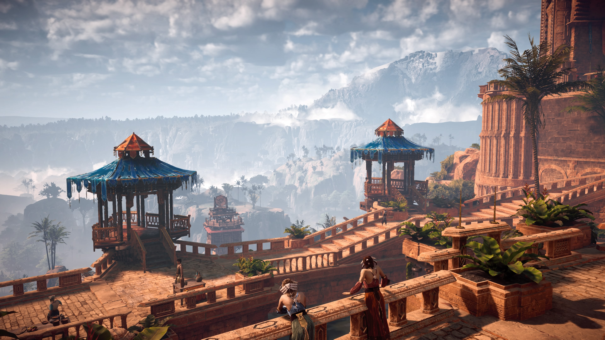
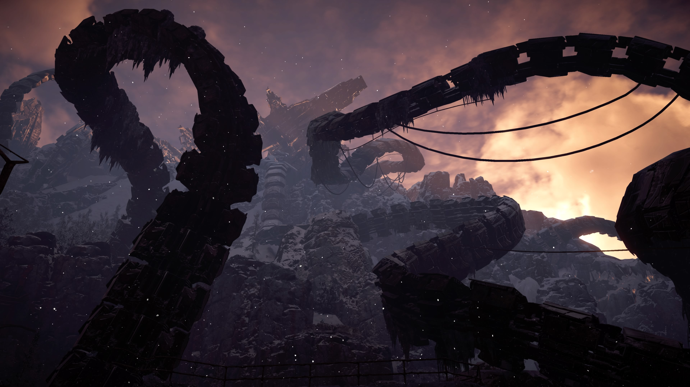

Each of those pictures is a screenshot taken live with the PS4's capture tool. See the [full album](https://imgur.com/a/bbNbC0J).

_God of War_ is also ostensibly open-world, but the player experiences it very differently. While in HZD I often felt compelled to wander and explore, GoW's world felt like a series of pretty rooms connected by pretty hallways. It's a gorgeous setting, but it doesn't feel alive in the same way _Horizon_'s does. Pair that with a map that doesn't really help the player navigate and the result is me mostly sticking to the linear story quests. There are some areas to explore off the beaten path, but they feel inorganic: picturesque dead ends rather than a world I happen to find myself in. All that said, GoW is graphically triumphant game, despite its detail being allocated to the characters rather than the expanse of the world.

**The Story**

Each game sets out with very different storytelling goals. _God of War_ tells a small story. At its core, it is a father and son honoring the final wishes of the most important woman in their lives. Though there are gods and obstacles along the way, it stays true to that goal. Cinematographically, the game is precise: the whole game from opening title to credits rolling is a single unbroken shot. In contrast to the tightness of the main narrative, the side quests (and in fact, the story objectives themselves) are largely mundane fetch quests. They make sense in context, but going to fetch certain gems or magical items "for uhh... reasons" felt a little underwhelming.

There weren't an abundance of side characters, but the few you encounter were portrayed with movie-level acting. The voice, the motion capture, and the delivery are all straight out of Hollywood. It's impossible to understate the nuance Santa Monica Studio was able to capture here. Every interaction, no matter how small, serves the detailed characterization this game perfectly. If you've already played the game (or don't care about spoilers), my friend Lauren goes into much more detail in [their essay](https://memorylinkgames.wordpress.com/2018/07/12/god-of-war-dialogue/) about it.

_Horizon: Zero Dawn_ is grander in scale: it tells of the whole world and how we got here. You travel the world, unravel a mystery, and turn the tide in a war to save the world. There are scores of characters littered throughout the map, each with individual backstories, prejudices, and motivations. Most provide side quests, which had a surprising amount of variation. Though there was a lot of "go to this place and kill the enemies", each had compelling narrative to drive it and typically, some dialogue that affected how the mission played out. I was surprised at how real each minor villager felt. Each was compelling in their own way and I was motivated to help them all.[^3] There were definitely some cheesy moments, but I really enjoyed the scale of the world-building.

Though they took different paths to get there, each game triumphs in its individual style. Neither is definitely better, but GoW is more in line with what society considers "an award winning drama." Both can safely consider narrative a strong suit.

**Combat**

Each game has a lot of fighting and, as with story, each does certain things really well.

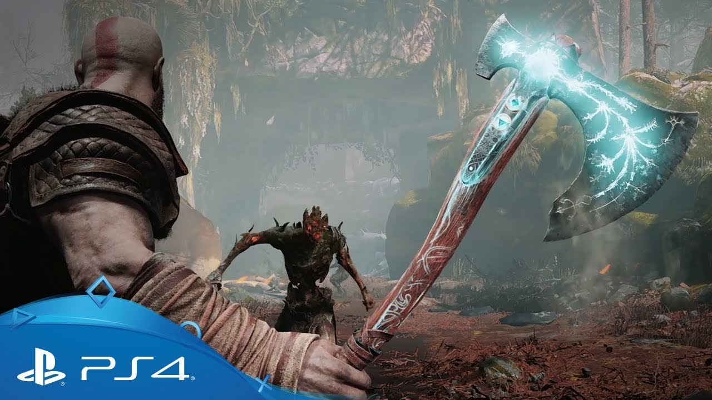

In _God of War_, the weapon of choice is the brand new Leviathan Axe (above). Visually, it's a fairly plain weapon, albeit infused with ice energy. In motion, it feels better than anything else I've ever "held". Santa Monica Studios put a lot of work into making the axe feel powerful and they detail it in this [great video](https://www.youtube.com/watch?v=zpr-EE2In1M). It has a supremely satisfying heft and swing to it. My absolute favorite part of using it is the recall ability. Once thrown (into an enemy, puzzle element, or nearby lake), you can call it back your hand with a _very_ satisfying "zoom" followed by a "thunk".

The enemies you spend your days cleaving are mostly variations of soldier, werewolf, elf, troll, and rock monster. They're cool the first few times you see them, but get repetitive over the course of the game. The combat mechanics themselves are great though. Combos feel good and the skill trees give access to cooler attacks as the game progresses. You feel powerful throughout but are never far from death, which keeps you on your toes (in a good way). There's a lot of depth to which attacks are the most effective and it definitely rewards players who excel at it; there's a very high skill cap.

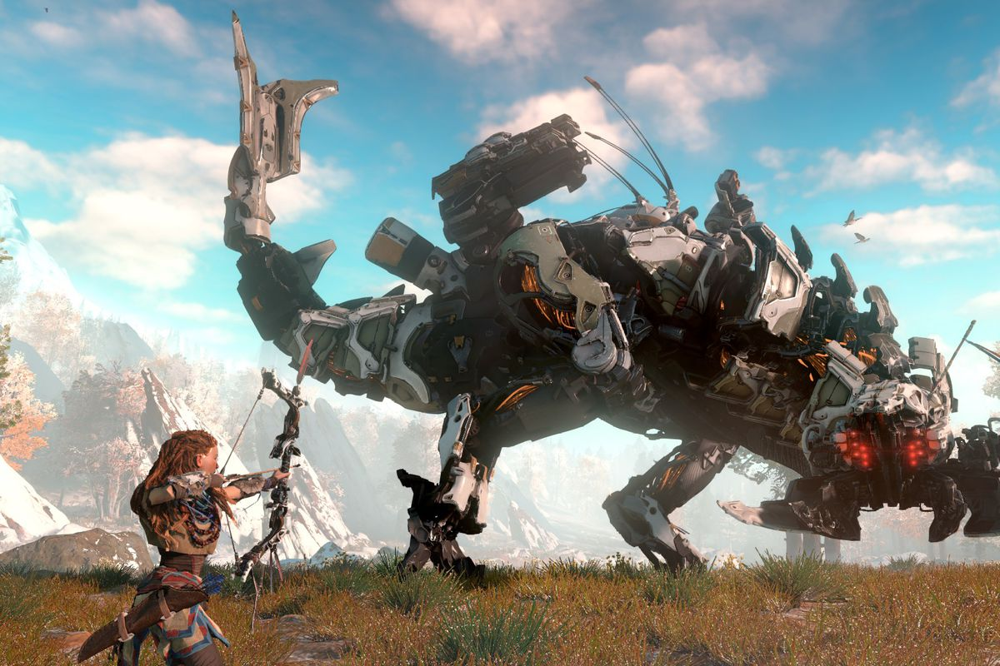

_Horizon: Zero Dawn_ really shines via its enemies. There are 22 species of robot in the base game and they each have their own personality, fighting style, and weaknesses. They're all found naturally in the world, so it's fun to see something that ripped you apart earlier grazing peacefully in the distance. They each react to threats differently and some species are more observant than others. They mostly travel in herds and different species travel together symbiotically. For example, extra-vigilant robots will guard a herd of grazers in exchange for food, a level of detail I was impressed by. I also loved the scale of the bigger monsters- gazing up at some of the bigger offerings really makes you feel like lunch.

As for weapons, there are a number of options. You always have access to your melee spear and can complement it with a few versions of slingshot, bow, and net. This sounds like cool customization in theory, but in practice, I found one bow I liked, put all my good upgrades on it, and stuck with it. Combat itself lacked the depth GoW had, but made up for it in excitement/terror. You're out in the field with wild animals and they won't think twice about ripping you to shreds. You've got tools to fight them, but it's up to you to use those tools effectively. This leads to a lot of organic moments of panicked running, rolling, and shooting that were thrilling every time. Even in the late game, when I had maxed out skill trees and weapon upgrades, I never felt like I was the most dangerous thing around. I liked that. It made the fauna feel that much more realistic and forced you to maintain a healthy respect for everything around you. There were also some optional stealth sections where you can kill bandits. This provided welcome variation to otherwise enjoyable monster combat.

A now, a rapid-fire list of things that needed improving:

- Economics in HZD are pretty meaningless for most of the game. I bought the 3 weapons I wanted and never bought anything else expensive again. There are also a few versions of each, but you have access to the best pretty early so the rest don't matter.
- Flying enemies in HZD, while defeatable, are huge pains in the butt always
- GoW has some cool bonus areas, but they feel a little tacked on. I'm glad they're there and they provide good end-game challenge, but they were clearly added to flesh out the realm-hopping
- I appreciated GoW not doing any hand-holding with regards to its collectibles (Odin's ravens) but the thought of wandering aimlessly looking for them made me want to cry
- Neither game really had bosses, they just had strong versions of regular monsters. This is especially notable for GoW, which comes from a series previously know for its over-the-top fights. That said, it's done a lot of work to distance itself from the original trilogy, so this makes a little sense. It doesn't make up for the lack of bosses, though.

Despite their flaws, these were both phenomenal games. They're each well worth your time.

<BlockquoteTitle>
  Runner(s)-up: <b>Opus Magnum</b> and{" "}
  <b>Shadow Tactics: Blade of the Shogun</b>
</BlockquoteTitle>

Having played a number of [Zachtronics](http://www.zachtronics.com) games, there's a set of tropes that I expect: light story, a thematic solitaire game, and algorithmic puzzles. [_Opus Magnum_](http://www.zachtronics.com/opus-magnum/) acknowledges them, refines them, and excels in every regard. It is the steampunk realization of a visual programming concept that gained popularity with _SpaceChem_. Though the puzzles are the main focus, there's a story that engages without distracting. The music and UI complement the game's themes of science and magic well. More than the code-based games, watching levers and molecules rotate and move is mesmerizing (see below).

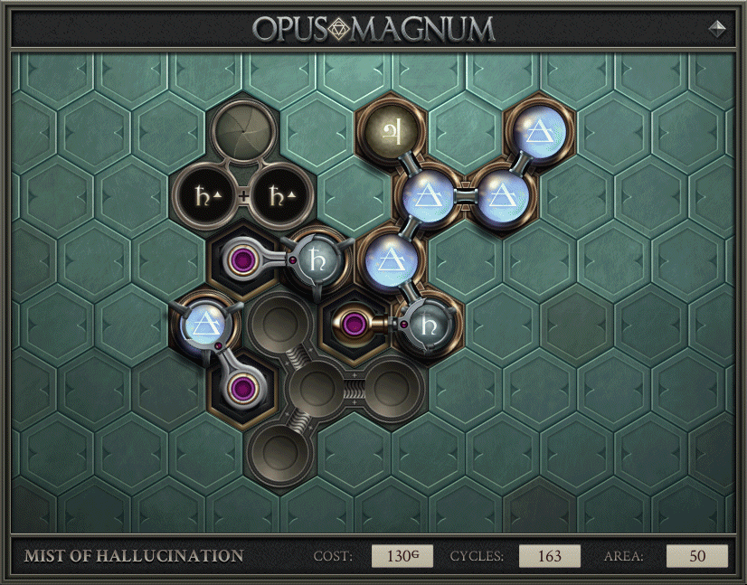

While past Zachtronics games paired increasingly complex puzzles with fixed amount of space, OM allows any valid solution, no matter how inefficient. I really like this choose-your-own difficulty approach. It has something for players of all skill levels without excluding anyone; each player can experience exactly as much challenge as they want.

[_Shadow Tactics: Blade of the Shogun_](http://www.shadow-tactics.com/) was precise in its design. I was impressed by how organic the levels felt. Lots of games tout open-ended levels, but ST really embraces it. There are many paths to an objective and every time I thought I was clever by thinking around a problem, the game supported it appropriately. It also managed its difficulty well. This game was hard, but never felt unfair -- a hard balance to strike. I spent a lot of time saving and reloading key moments and my eventual success was all the more satisfying for it. The real-time controls rewarded adroit performance and the ability to queue up actions for simultaneous execution lead to some incredibly satisfying moments:for example, when 3 of my characters dropped from a roof together, killing a pod of guards before any of them knew what was happening. Lastly, I'd be remiss not to mention the story. Games like this can usually skate by on the strength of their gameplay alone, but I was honestly surprised by the an engrossing narrative that ties the levels and objectives together. Going into _Shadow Tactics_ I wasn't sure quite what to expect, but I'm sure glad I gave it a shot.

**Honorable Mentions** to:

- [_Spider-Man_](https://www.playstation.com/en-us/games/marvels-spider-man-ps4/), for really capturing the essence of the character. I rarely fast-traveled because it was just so enjoyable swinging around. Story was great (and gorgeous) and the combat felt good. 100%ing the game got pretty repetitive (there are only a few types of crimes to stop, and you have to stop a lot of them), but I enjoyed it immensely. I've loved the character of Spider-man as long as I can remember and this game really did him justice. It's a testament to everything I played this year that this is only an honorable mention.
- [_Ori and the Blind Forest_](https://www.orithegame.com/), mostly for its superb use of motion. This is another game where controls feel tight and navigating the world is enjoyable. The art and music are superb and it doesn't overstay its welcome.
- [_Ratchet & Clank (PS4)_](https://www.playstation.com/en-us/games/ratchet-and-clank-ps4/), for another stellar entry that retains the series' action and humor without compromising the core gameplay. There are no districts to liberate nor skins to buy. You explore, collect, power up, and enjoy every minute. The graphics are also astounding - it looks like a Pixar movie.

return to the [table of contents](#TOC)

### Mobile

Though I've got a 3DS, I played it fairly sparingly and when I did, a hilarious amount of my time was spent playing _Fire Emblem: Awakening_.[^4] It had a lot going for it, but all of my top picks were played on an iPad.

<BlockquoteTitle>
  Winner: <b>Gorogoa</b>
</BlockquoteTitle>

[_Gorogoa_](http://gorogoa.com/) is a rare combination of art, beauty, and complexity. I've never played anything quite like it. It's based entirely around 4 panels that can be moved between corners. It plays with perspective really well, where moving items in front of one another causes them to interact in inventive ways. I've taken three tries at describing it more specifically here and failed, so I'll let the trailer speak for itself:

<YoutubeEmbed youtubeId="xtZVVW17oCY" />

I was really impressed by the marriage of art and design. Each puzzle felt natural and precise. Though solutions weren't always obvious, stepping back and considering the scene brought the answer to light. Though it's also available on [Steam](https://store.steampowered.com/app/557600/Gorogoa/), I'm glad I played it on an iPad. The game elements felt wonderfully tactile as you slid them around.

More than anything else, _Gorogoa_ felt fresh and unique and for that, I salute it.

<BlockquoteTitle>
  Runner(s)-Up: <b>Florence</b> and <b>Up Left Out</b>
</BlockquoteTitle>

[_Florence_](http://www.florencegame.com/) doesn't have a ton of "gameplay" in its game, but it is a lot of fun. It a thoughtful story about young love told with a beautiful art style and a delicate soundtrack. Both pieces pair together well. It's a short game (maybe 2 hours), but uses its time really well. I was emotionally invested in the happiness of these two people right away. The intimacy of the story was particularly outstanding in the realm of games, which are usually more exciting or supernatural. _Florence_ doesn't reinvent anything, but it executed its story well and is worth your time.

[_Up Left Out_](http://upleftout.com/) is the second game from developer [Maciej Targoni](https://twitter.com/targaciej) I've picked as a winner. The puzzles were certainly good, but there are two features that really make this a standout experience: the physicality and the sound design. The puzzles center around moving squares and circles around the board and connecting lines to form a circuit. The difficulty curve is smooth and it adds new and expanded versions of the puzzles well. I usually play tablet games muted, but I'm really glad I happened to turn on the sound this time. Despite being bubbly and pastel colored, the elements on the screen have a very tactile feel to them. The sound design contributes to this. You _hear_ a square _thunking_ against a peg when you slide it in a direction it's not supposed to go. There's a really pleasing powered-up and powered-down sound as certain elements turn on and off. The sound, just as much as the visuals, direct the experience in _Up Left Out_, and I am frankly impressed.

**Honorable Mentions** to:

- [_Donut County_](http://www.donutcounty.com/), for taking an interesting premise and expanding on it well. The gameplay itself is simple and largely without challenge. It takes clear inspiration from Katamari Damacy and that's not a bad thing. There were creative tweaks in the second half of the game that expand on a tried-and-true gameplay loop, a welcome adjustment.
- [_Hexcells_](http://www.matthewbrowngames.com/index.html), for being a well crafted puzzler. Much like sudoku and similar logic games, there's zero guessing required to succeed. iOS controls were tight. The flashes of insight leading to solutions were universally satisfying.

return to the [table of contents](#TOC)

## Movies

I saw [74 movies](https://airtable.com/shrzSlNeUQtkN9LPZ) for the first time this year; 39 at home and 35 in the theater. Thanks, ~~Moviepass~~ AMC A-List![^5]

<BlockquoteTitle>
  Winner(s): <b>3 Billboards Outside Ebbing Missouri</b> and <b>Coco</b>
</BlockquoteTitle>

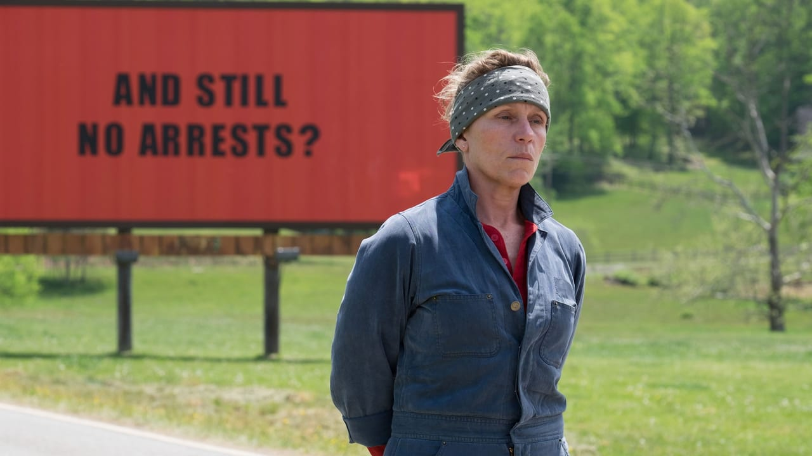

Most movies are lucky enough to have a single great performance among a good cast. [_3 Billboards_](https://www.justwatch.com/us/movie/three-billboards-outside-ebbing-missouri) inexplicably has nothing but great performances and a few absolutely astounding ones. Frances McDormand is absolutely unbelievable in her range; her portrayal of Mildred Hayes moves seamlessly between anger, love, hatred, fear, frustration, contentedness, and everything in between. I've never been happier to see someone win an acting Oscar and it's worth [watching her speech](https://youtu.be/4gU6CpQk6BE?t=2m06s) if you haven't. Her performance is complimented by similarly brilliant ones by Sam Rockwell, Woody Harrelson, and the rest of the cast (though they were merely "great" and not "transcendent").

The story is dark, but poignant, with plenty of laughs along the way. The tone will feel familiar if you've watched any of Martin McDonagh's other movies.[^6]

This movie was timely, of course -- the theme of police action/inaction is especially relevant in today's America. This town in Missouri is presented in totality: both its sense of community and prejudiced tendencies are laid bare to better paint this picture. I never felt like the film held back to make the characters more likable. It felt real, and I applaud it for that.

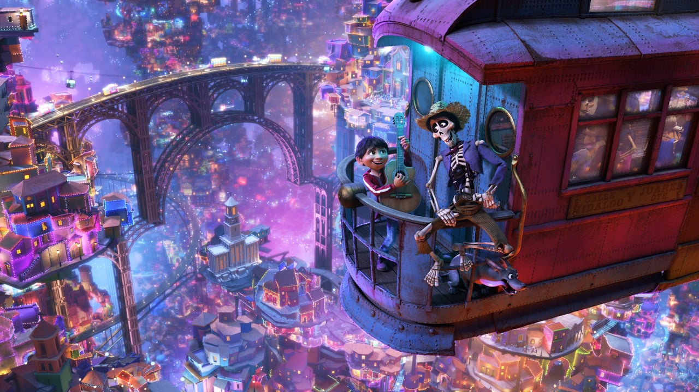

[_Coco_](https://www.justwatch.com/us/movie/coco) utilizes its themes so completely that it's nothing short of a masterpiece. They took a story that was as emotionally impactful as the opening of _Up_ and stretched it into a full length feature about family, death, and love. The breakaway track "Remember Me"[^7] compliments the central challenge of the movie: family members disappear entirely if their living relatives don't continue to celebrate them during the holiday of Día de Muertos. Its musical cues weave throughout the soundtrack and characters, such as the title character "Coco", whose ability to remember has begun to fade in her age. The artistry and detail can't be understated either--the animators use the bright palette of the spirit world and companions (alebrijes) to great effect throughout. _Coco_ delivers a complete and satisfying experience. It is sinister, hopeful, spiteful, loving, and above all, enjoyable throughout.

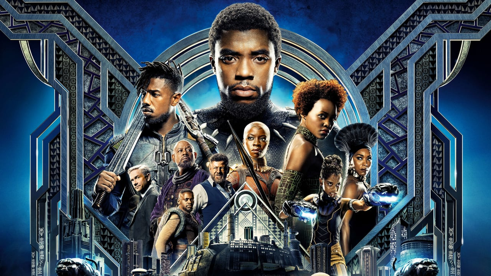

<BlockquoteTitle>
  Runner-Up: <b>Black Panther</b>
</BlockquoteTitle>

My first viewing of [_Black Panther_](https://www.justwatch.com/us/movie/black-panther) suffered from overhype. Early reviewers pitched it as God's gift to cinema. When I saw it and it was "just a movie", my initial impression was more negative than it should have been. Repeated viewings since have helped me identify and appreciate what set it apart from other MCU films: the villain and the art direction.

While the entire cast is great (as per usual in the MCU), Michael B. Jordan's performance blows me away. Killmonger has sympathetic motives and an unwavering belief, making him dangerous and compelling.[^8] His crusade is supported by an outstanding setting. The detail in the world of Wakanda, conveyed through costume, music, and the buildings themselves combine into much more than the sum of their parts. Each of the 5 tribes has a distinct clothing style and the few palaces we see highlight varied styles of interior designers that must work there. While there are some kooky moments, the design of each and every element (right down to the [font](https://creativemarket.com/blog/beyno-black-panther) for location transitions) feels intricate in a satisfying way.

**Honorable Mentions** to:

- [_Tag_](https://www.justwatch.com/us/movie/tag-2018), for being an impressive combination of action, hilarity, and heartfelt. I've got a soft spot for people taking something silly too seriously (see also: _The League_)
- [_Searching_](https://www.justwatch.com/us/movie/searching), for being both gripping and the most visually unique movie I've ever seen
- [_Game Night_](https://www.justwatch.com/us/movie/game-night), for balancing a silly story with good action (take notes, _A Simple Favor_)
- [_A Quiet Place_](https://www.justwatch.com/us/movie/a-quiet-place), for being intense, unsettling, and cinematically beautiful. I can't say that I "enjoyed" it, but I am glad I was dragged to see it.

**Dishonorable Mention** to:

- _Blockers_ for having some very good comedy but ultimately failing on its message of parents understanding their daughters' bodily autonomy. The hardest part is that the characters even consider their position (out loud) and then decide their way is still right.

return to the [table of contents](#TOC)

## Television

All told, I finished [25 seasons of TV](https://airtable.com/shryat9XhhhnljGy2) this year. That also includes live shows that started in 2017, so it's a little misleading. I mostly watched new shows this year (outside of _Breaking Bad_, which you've already heard is good), so all I've got is newly aired excellence.

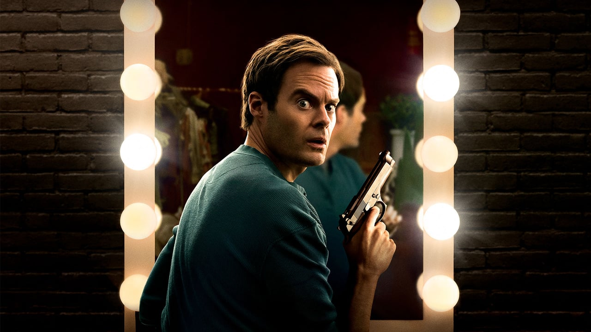

<BlockquoteTitle>
  Winner: <b>Barry</b>
</BlockquoteTitle>

_Barry_ does a really superb job combining two unlike things to great effect; it's the peanut butter & jelly of television. Bill Hader stars as a hitman who wants to leave that violent life behind and strike out as an actor. This is easier said than done. His past life is full of unsavory characters and he finds it increasingly tough to leave it behind. The show strikes an astounding balance between hilarious and dark-as-hell. Meanwhile, the tension escalates beautifully as the FBI investigates suspicious deaths in the area. Compound that with an increasingly involved acting class and you arrive at the first season of _Barry_. Hader's performance is truly award worthy. His ability to oscillate between ruthless killer and nervous actor is truly a sight to behold -- this performance cements his legacy as as an actor who can carry a show. Stephen Root disappears into his character per usual, and Anthony Carrigan as "NoHo Hank" is a personal favorite. This show began with a (literal) bang and I'm excited to see where it goes from here.

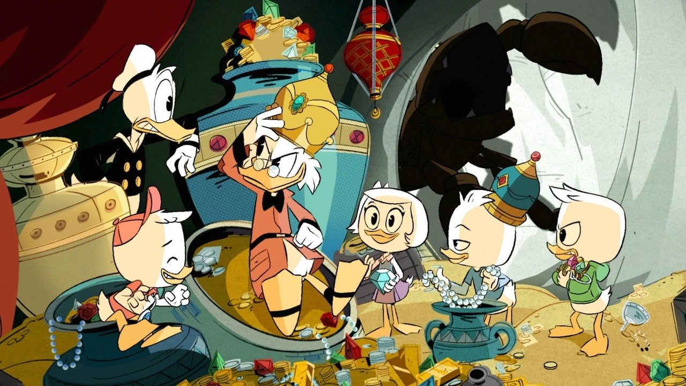

<BlockquoteTitle>
  Runner-Up: <b>Ducktails (2018)</b>
</BlockquoteTitle>

I've always enjoyed cartoons that appeal to all ages, and _Ducktales_ delivers in spades. The episodes are independent enough to stand on their own and there's an overarching plot that rewards viewers who watch them all. The cast is phenomenal. Though I had never watched much of the original, I was sold on the prospect of a remake based on the cast alone. Particular props to the trio that voice the kids (Pudi, Schwartz, and Moynihan) for bringing so much character and individuality to them. There's also a string of great guest stars (Lin-Manuel Miranda and Jim Rash were personal favorites) that keep everything feeling fresh. The theme song is a total ear worm, even when [sung by the cast](https://www.youtube.com/watch?v=zZek9PFMYOw); learn why [here](https://www.youtube.com/watch?v=2lQVG7Gf7I4). The show seamlessly blends weird slapstick comedy, supernatural monsters, and really heartfelt family moments into an experience that appeals to everyone without catering specifically to anyone.

**Honorable Mentions** to:

- _Trial & Error_ (Seasons 1 & 2; cancelled), for having a really charming take on _My Cousin Vinny_ that manages to have its dumb characters be incredibly endearing. This show, reminiscent of _Parks & Rec_, has really nailed small silent comedy moments. Great cast as well; I'll never get tired of Kristin Chenoweth's drawled "law-yer."
- _Big Little Lies_ (Season 1; returning), for telling a tight crime story with a great cast. Visually, it really felt like the nailed the Monterey Bay color scheme.

return to the [table of contents](#TOC)

## Books

This year, I read [9 books](https://airtable.com/shruxgGniiL33dyAN). Definitely fewer than I would like, so I've thought about changes in 2019 I can make to get those numbers up. Before we get to that though, let's look at the best things I read this year.

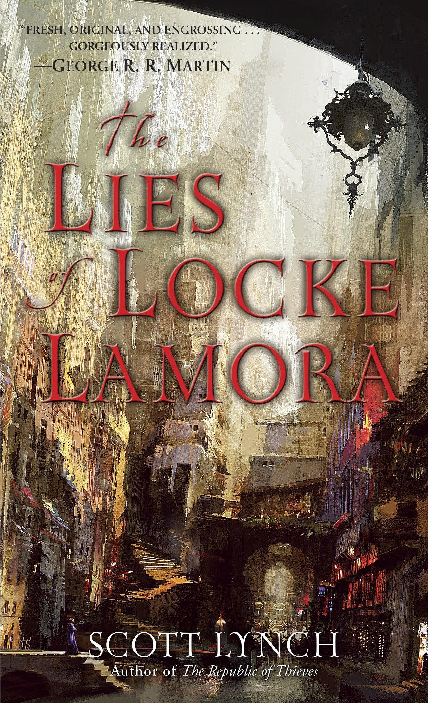

<BlockquoteTitle>
  Winner: <b>The Lies of Locke Lamora</b>
</BlockquoteTitle>

It's no secret - I'm a sucker for heist movies. Scott Lynch's _The Lies of Locke Lamora_ perfects a tried-and-true formula. An ensemble cast, costumes, intrigue, villainous enforcers, twists, and betrayal come together in a supremely satisfying package. Lynch does a great job fleshing out his cast through flashback scenes. He also builds an entire world more naturally than most writers. The gang's plan is well thought out, daring, and believable. My biggest complaint is the total lack of any non-male characters. There are some mentioned and it seems like they'll play a larger role in later books (this will eventually be the first in a 7 book series, though as of time of writing, only the first 3 have been published) (and I've only read the first).[^9] That said, _Lies_ is still worth picking up. I'm already late to the party (it was originally published in 2006), but it's never too late to join the fun.

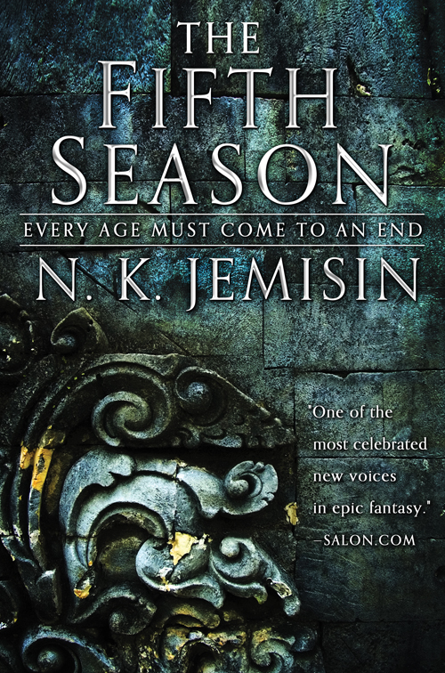

<BlockquoteTitle>
  Runner-Up: <b>The Fifth Season</b>
</BlockquoteTitle>

N.K. Jemisin's _The Fifth Season_ is a rare fantasy story. The world-building is impeccable, happening naturally as we jump between viewpoints. It doesn't stray from tragedy or death, yes comes across as hopeful. The system of magic is well-realized and the story is tightly told. The modern social commentary is impossible to ignore, yet subtle. I never felt beaten over the head with it. I really enjoyed reading a SF/F story by someone other than a straight white man. They write great stories too, but Jemisin's life experiences give a new and unfamiliar (to me) perspective to her characters and the book is the better for it. If you enjoy well-told (and already completed!) trilogies, this is a great one to pick up. I'm excited to see where it goes.[^10]

**Dishonorable Mention** to:

- _Devil in the White City_, for being a book about the architectural history of Chicago sold under the guise of a true-crime thriller. Clearly the author thought history wouldn't sell well enough, so there's this wholly uninspiring detective story shoehorned in. To its credit, the history portion (80% of the book) is pretty interesting, but I nonetheless feel misled.

return to the [table of contents](#TOC)

## Just The List

<!-- prettier-ignore -->
- Videogames
  - PC + Console:
      - Winners:
          - [God of War](https://www.playstation.com/en-us/games/god-of-war-ps4/)
          - [Horizon: Zero Dawn](https://www.playstation.com/en-us/games/horizon-zero-dawn-ps4/)
      - Runners-Up:
          - [Shadow Tactics](http://www.shadow-tactics.com/)
          - [Opus Magnum](http://www.zachtronics.com/opus-magnum/)
      - Honorable Mentions:
          - [Spider-Man](https://www.playstation.com/en-us/games/marvels-spider-man-ps4/)
          - [Ori & the Blind Forest](https://www.orithegame.com/)
          - [Ratchet & Clank](https://www.playstation.com/en-us/games/ratchet-and-clank-ps4/)
  - Mobile
      - Winner:
          - [Gorogoa](http://gorogoa.com/)
      - Runners-Up:
          - [Florence](http://www.florencegame.com/)
          - [Up Left Out](http://upleftout.com/)
      - Honorable Mentions:
          - [Donut County](http://www.donutcounty.com/)
          - [Hexcells](http://www.matthewbrowngames.com/)
- Movies
  - Winners:
      - [3 Billboards](https://www.justwatch.com/us/movie/three-billboards-outside-ebbing-missouri)
      - [Coco](https://www.justwatch.com/us/movie/coco)
  - Runner-Up:
      - [Black Panther](https://www.justwatch.com/us/movie/black-panther)
  - Honorable Mention:
      - [Tag](https://www.justwatch.com/us/movie/tag-2018)
      - [Searching](https://www.justwatch.com/us/movie/searching)
      - [Game Night](https://www.justwatch.com/us/movie/game-night)
      - [A Quiet Place](https://www.justwatch.com/us/movie/a-quiet-place)
  - Dishonorable Mention:
      - Blockers
- Television
  - Winner:
      - [Barry](https://www.justwatch.com/us/tv-show/barry)
  - Runner-Up:
      - [DuckTales](https://www.justwatch.com/us/tv-show/ducktales-2017)
  - Honorable Mentions:
      - [Big Little Lies](https://www.justwatch.com/us/tv-show/big-little-lies)
      - [Trial & Error](https://www.justwatch.com/us/tv-show/trial-and-error)
- Books
  - Winner:
      - Lies of Locke Lamora, by [Scott Lynch](http://www.scottlynch.us/)
  - Runner-Up:
      - The Fifth Season, by [N. K. Jemisin](http://nkjemisin.com/)
  - Dishonorable Mention:
      - Devil in the White City

## Until Next Time

And there it is. Thanks for reading this far! Inexplicably, putting this list together and sharing it with you all is a highlight of my year. In the coming year, I plan to write about how I collect this data (hint, a _whole_ lot of Zapier and [Airtable](https://airtable.com/invite/r/7A1YRa26)), so [stay tuned](/blog/feeds) if you feel like you might find that interesting.

Until then.

---

_This post was edited expertly and patiently by [Vicky Stein](https://vickystein.media/). Images courtesy of [The Movie DB](https://www.themoviedb.org/) or captured directly by me._

[^1]: It was a toss-up between _The Americans_, _Veep_, and _House of Cards_
[^2]: HZD in May, GoW in July
[^3]: Unless they needed help with a bunch of flying enemies. Then they were out of luck in the hero department
[^4]: _Fire Emblem_ was great, but repeated frustration with enemy spawn mechanics soured my experience
[^5]: I saw 123 movies total!
[^6]: _In Bruges_ is another favorite of mine, in case this entire article isn't enough media recs for you
[^7]: Equivalent to Frozen's "Let It Go"
[^8]: Much like the Operative from _Serenity_, another favorite villain
[^9]: You would think I'd have learned my lesson to only start long-running fantasy series once the final book has been announced, but here we are again
[^10]: As of writing, I've finished the second book in the series, which was also good. It was a 2019 book, so you won't see it in this list, but I figured it was worth mentioning
