Welcome, one and all, to the 4th annual look-back at my favorite media, 2019 Edition!

Besides being fun to write, these posts serve me as a convenient way to reflect on important life changes and how they affect my media consumption. For instance, living with my girlfriend (now fiancée(!)) has caused me to binge fewer old TV shows, especially intense dramas, which she's not often in the mood to watch. When it comes to games, it's become more important that those I play either have an engaging story or have puzzles she can collaborate on. Before we were in the van, I had been playing Steam games on the TV almost exclusively, so she could play along; controller support became vital.

My other big news this year was that I was moving into [a van](https://instagram.com/serenitythevan), which altered my media habits significantly. I saw way fewer movies in the theater this year, since it was less convenient on the road. Also, after four months in the van, I left my PS4 at home in favor of a more van-appropriate Switch (though that won't be evident in this year's list, since I didn't start any Switch games until after the new year).[^1]

Outside of the things that happened in my life, 2019 felt like the year of long-running series coming to unsatisfying conclusions. I'll get to those in their respective sections, but going over the list I was struck by how many times that came up.

Anyway.

In case it's your first time reading one of these, a brief overview:

This post covers my favorite media that I watched / played / read this year. I tracked everything in a series of [Airtable](https://airtable.com/) databases and graded everything on my [4 point scale](/blog/2018/06/05/on-the-rating-of-media/). To qualify for the list, media had to be new-to-me in calendar 2019. I aim to steer readers towards my favorite stuff, but I skip over obvious things, even if they would have otherwise qualified (such as The West Wing and Breaking Bad; they're great, but you know that already). Everything here is spoiler-free (insofar as I consider something a spoiler, which I'm fairly strict about).

With that context in mind, strap in and let's get to it!

<h6 id="TOC"></h6>

<!-- START doctoc generated TOC please keep comment here to allow auto update -->
<!-- DON'T EDIT THIS SECTION, INSTEAD RE-RUN doctoc TO UPDATE -->

- [Videogames](#videogames)
- [Movies](#movies)
- [Television](#television)
- [Books](#books)
- [Just the List](#just-the-list)
- [That's all, folks!](#thats-all-folks)

<!-- END doctoc generated TOC please keep comment here to allow auto update -->

## Videogames

I completed 42 games over 612 hours (down from 46 games in 2018). Starting in April, I knew we'd be moving into the van, so my game choices leaned towards things that I wouldn't be able to (easily) play on the road in the last four months of the year-- PS4 and Windows-only games. Consequently, there aren't many mobile games on here, and I've just combined everything into one big category. I'll note which platform I played the game on (though it may be available on others).

> Winner(s): **CrossCode** (PC) and **Return of the Obra Dinn** (PC)

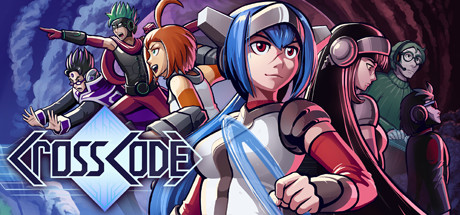

Most games do some things well. Some games do most things well. CrossCode? [_CrossCode_](https://www.cross-code.com/en/home) excels across the board.

The pixel art graphics are delightful. They feel lovingly nostalgic, but there are enough little flourishes that the game feels suitably modern. The combat and leveling systems are also high points. There's a lot of character customization available and it lets you swap freely, adding a lot of strategic depth to fights. The combat is hard, but fair. There's a big emphasis on dodging and blocking, which means my standard "rush at their face" approach took some refining. The controls are precise and fluid, which is important when dealing with the hectic combat. I played it with both a keyboard+mouse and a Steam controller and both approaches felt great (a rarity in games that require as much precision as this one can).

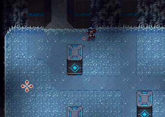

The puzzles were varied and fun. A lot of them were timing based, which took a few tries to perfect. The 4 element system (where you have 4 different types of bullets which each bounce and affect puzzle elements differently) added a ton of complexity and variability to the dungeons. I was impressed; usually games with great combat have decent puzzles (or vice versa). This has greatness in spades. Exploration was another high point. The environments are beautiful and full of nooks and crannies that you can't quite reach. I spent a lot of happy time walking along walls trying to find "how exactly to get up there to find that chest I saw earlier." The world felt large and organic in a really impressive way.

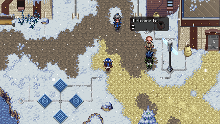

To top it all off, the story is compelling and surprisingly deep. I was curious to see what came next at every stage. Quests were a good mix of exploration and combat and they all had fairly compelling reasoning behind them.[^2] The characters are charming and bring a lot of life to the digital world.

The weakest part of the game is its platforming. The 3D isometric design looks great, but it can be devilish to figure out which platforms are taller than others and where you'll actually land if you jump to the left. Luckily, respawn is instant and without penalty, so the frustration is fairly minimal.

Lastly, I have to applaud the devs for their great demo. It's available both through [Steam](http://store.steampowered.com/app/368340/) and on their site, where you can play it [right in your browser](http://www.cross-code.com/en/start)! This is only possible because the entire game is written in HTML and JS, which is a technical feat in and of itself. The game runs smooth as butter.

All that is to say, CrossCode is a phenomenal game and is well worth your time.

Developer Lucas Pope has an odd knack for creating the best games with the most banal descriptions. In [_Return of the Obra Dinn_](https://obradinn.com/), you're an insurance investigator (albeit one tasked with investigating deaths aboard a cursed(?) ship). More than anything else, this is the most superb and challenging detective game I've ever played. While most puzzles/investigatory games sort of have you on rails, _Obra Dinn_ turns you loose on the ship. You explore a series of freeze-frames depicting the exact moment a crewmember died. It's up to you to deduce who everyone is. Unfortunately, not a lot of people on 19th century boats wore nametags.

The game starts straightforward enough, but really forces you to examine scenes and make logical leaps to fill in all the info. It starts pretty easy, but the level of minutia you're expected to notice ramps up dramatically. When I watched the last vignette, I had only filled in half of the crewmembers. The game implied that I had all the info I needed to fill them _all_ in, which meant it was time to comb back through everyone and make some logical leaps. It was _exhilarating_.

It's also worth mentioning how unique the art style is. The pixel graphics flow superbly and add a lot to the antiquated atmosphere of the game. My biggest gripe is that you can really only play it once. It doesn't overstay its welcome and leaves me desperate for a deductive adventure that's half as good.

> Runner(s)-Up: **Slay the Spire** (PC, Switch) and **Celeste** (PC)

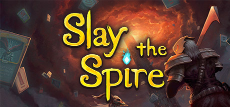

Most collectable card games I've played have been competitive and multiplayer. They're fun, but they're designed around always selling new cards over time.[^3] I had recently quit _Hearthstone_ when a friend I hadn't talked to in ages gifted me a copy of [_Slay the Spire_](https://www.megacrit.com/). Playing it was such a breath of fresh air. I love that it's single-player; you're only ever competing against The Spire and your own bad luck. I also really enjoy the huge card variety that, when paired with a randomly selected set of game-changing relics, ensures every run is uniquely new and challenging. I should also mention that while this game is great on Steam, it's _superb_ on the Switch.[^4] I've played it a lot more (and had more success!) while on the go.

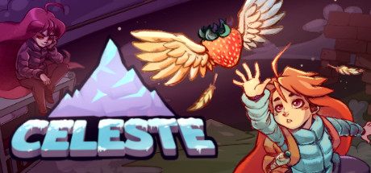

When I wrote about the movie _Coco_ in my [2018 post](https://davidbrownman.com/blog/2019/02/05/my-favorite-media-2018-edition/#movies), I praised how its music, environments, and characters work together to further its theme. [_Celeste_](http://www.celestegame.com/) excels in much the same way: the gameplay, characters, and story all come together to be more than the sum of their parts. I found the story about overcoming self-doubt while summiting a mountain engaging and heartfelt. The gameplay was tough, but fair. Throughout the course of my ~7 hours of playtime, I died 1741 times. Throughout that journey, I was a little frustrated, but more at myself at the game; I was failing it, not the other way around. The controls were tight and the mechanics were numerous, but not superfluous. It's a masterfully designed game.

> Honorable Mentions

- [_Device 6_](http://simogo.com/work/device-6/) (iOS), for its very weird and cool presentation. Not enough games on phones take advantage of being able to easily rotate the device. I also really loved the sound design, which is used to _great_ effect
- [_Detroit: Become Human_](https://www.quanticdream.com/en/detroit-become-human) (PS4), for its jaw-dropping character movement and cinematography. A lot of games find you piloting a character around, but _Detroit_ makes that character's physicality more realistic than anything I've played before. As for the camera, it shifted in a way that brought the scene to life without being intrusive. The story might have been a little heavy-handed, but its open-endedness and technical scope was a delight.
- [_Doom (2016)_](https://bethesda.net/en/game/doom-2016) (PS4), for knowing how to have fun. It's exhilarating to play and doesn't take itself too seriously. It's also got an impressive amount of exploration in its level design for an FPS. I was pleasantly surprised overall.
- [_Outer Wilds_](https://www.mobiusdigitalgames.com/outer-wilds.html) (PS4), for its pure-exploration approach to gameplay. There's not a single enemy to defeat, only the merciless loop of the clock. It's got a fully realized gravity simulation, which is an intriguing inclusion. Much like [The Witness](/blog/2017/02/11/a-few-of-my-favorite-things/#pc-console), the only thing you gain over time is information. There's a lot to explore in this game and playing it is (mostly) very zen.
- [_Final Fantasy XV_](https://finalfantasyxv.square-enix-games.com/) (PS4), for being an enjoyable experience despite glaring design flaws. Combat was weird but cool. The quests were decent. Driving around was fine and random encounters were underwhelming. Having an open world that the player is usually blocked from exploring is a very frustrating choice. Story was all over the place, but ultimately left me inexplicably satisfied, something I have to credit it for. I wouldn't call this a _good_ game, but dang it if I wasn't a little sad to be done with my boys by the end of it.[^5]

Lastly, [_Kindgom Hearts 3_](https://www.kingdomhearts.com/3/us/home/). I played every game in this series (again) to prepare for this release. Let it be honored for its amazing graphics and worlds. The environments are varied and being able to explore locales that look better than the movies they came from was really a treat (Toy Story and Pirates of the Caribbean are standouts here, but there are no slouches). Let it be dishonored for its story, which was genuinely a mess (even by KH standards). Combat was actually pretty good if you can ignore the inclusion of super-powerful "attractions" (that make the game too easy), which are easy enough to avoid while playing. Disney's heavy hand in the production was obvious, but the game still had its high points. It had unreasonable expectations to live up to after 13(!) years and I think ultimately met them.

---

_To see the full list and ratings of everything I played this year, check out [this Airtable](https://airtable.com/shrAUJulDy6P0W28U)_

_return to the [table of contents](#TOC)_ ↩️

## Movies

I saw 52 movies this year, down from from 74 last year. 30 were at home, 22 in the theater. A big factor in that decrease was moving into the van, where we didn't go out to the theater much. That change was also despite having AMC A-list and a theater with free parking a literal 5 minute drive from our apartment in Arlington, VA [^6]. It's a great service and I'm a little bummed that we've been seeing fewer movies on the road. But, we've seen a lot of other great things, so it's all good.

Let's check out my favorite movies of 2019.

> Winner(s): **Knives Out** and **Avengers: Endgame**

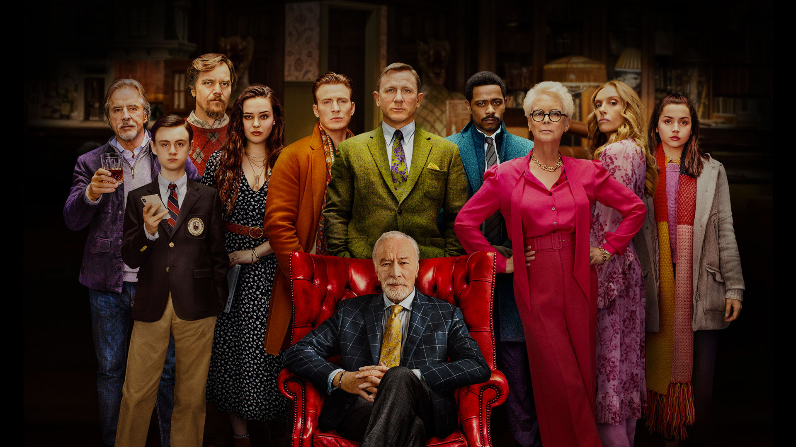

There's a lot to praise about this pensive, twisty whodunit. [_Knives Out's_](https://www.justwatch.com/us/movie/knives-out) ensemble cast is chock full of phenomenal performances. Daniel Craig's hammy southern detective absolutely steals the show, but protagonist Ana de Armas was a standout among a stacked slate.

The plot is a modern take on the classic Agatha Christie whodunit formula; its current relevance was delicious. Though I initially worried the close ties to the zeitgeist of 2019 would alienate future viewers, after some consideration I think it'll age well anyway. In any case, the plot's many layers kept me on my toes in the most delightful way.

Part of the fun of this movie for me was how intricate it was. Director Rian Johnson posted some great behind-the-scenes info while the movie was still in theaters. There was a great (spoiler free) Twitter thread (LINK) about how they shot close-ups of characters wearing reflective eyeglasses. There was also an entire (with spoilers!) [director's commentary](https://knivesout.movie/#commentary) that was designed to be downloaded and listened to while you watched the movie again in the theater. It's wonderful to see innovation like that in the feature film space.

I'm glad that that Rian Johnson had the opportunity to refute the popular maxim, "They don't make 'em like they used to," -- this is as good a murder mystery as there ever was.

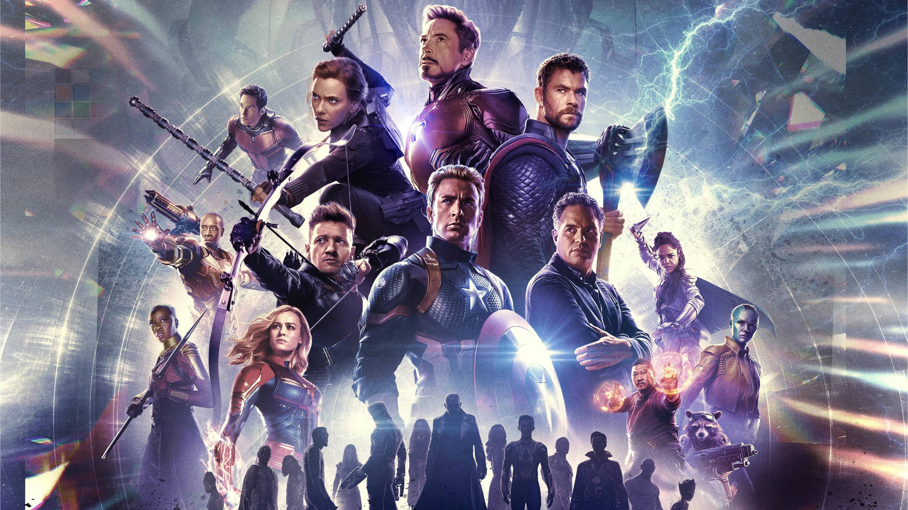

If you've read any of my previous write-ups, it should come as no surprise that a Marvel movie emerges victorious once again. In a year where the conclusions to long-running franchises really dropped the ball, I'm beyond pleased that the Russo Brothers managed to stick this landing with [_Avengers: Endgame_](https://www.justwatch.com/us/movie/avengers-endgame). They took an emotional story that built over 11 years and 22 movies and brought it to a beautiful conclusion. There's an undeniable amount of fan service in this movie (a few choice ensemble poses come to mind), but nothing egregious. I also really appreciated that they didn't spend time introducing anyone - they (rightfully) assume that if you're watching this, you're all caught up. This left them extra time to get to the "good stuff" (much like _Spiderman: Homecoming_ did when they didn't need to kill Uncle Ben again).

Much to Scorsese's presumed chagrin, there's not much new in _Endgame_. We've seen a lot of these movies and know about what to expect. I think the real beauty is how much they've refined and improved the familiar genre. I read a lot of fan reactions online when it first came out and was delighted to see how many different characters and moments resonated with fans. No one loved every minute of it, but there was something that spoke to everyone.

Like most movies, it's not flawless.[^7] I got frustrated with some of their writing choices and who they decided would draw the survival short straw. But, our heroes' ultimate triumph is only possible because of the great films that came before it. I'm excited to see where they take the series and I'm glad they wrapped up this initial section so wonderfully.

> Runner-Up: **The Farewell**

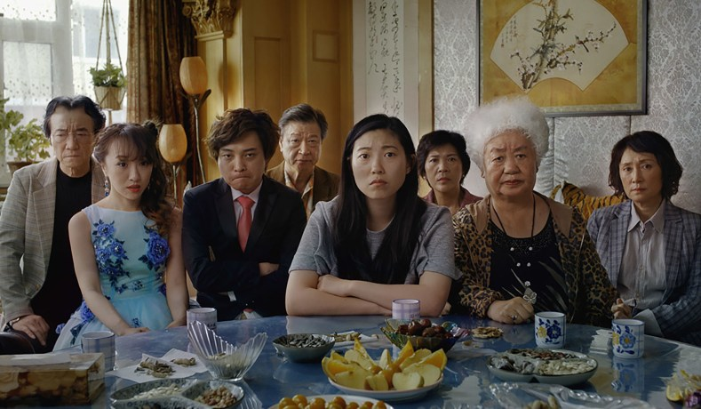

[_The Farewell_](https://www.justwatch.com/us/movie/the-farewell-2019) affected me in a way I didn't expect. The family dynamics at play felt so familiar and relatable. Awkwafina was the best part of _Ocean's 8_ and she carried the show here as well. It straddled the line between hilarious and heartfelt in a really impressive way.

Maybe the most compelling part of the whole movie was that I don't even know what the "right" answer to the central moral question posed by the movie: should you tell someone they're dying of cancer if they could live out their life otherwise peacefully? The US has laws that address this, but apparently China doesn't. The east/west dichotomy is another thing I really dug about this movie: so many movies I watch are super US-centric, so this was a nice change of pace.

**Dishonorable Mention** to:

- _Star Wars Episode IX_, for its sloppy writing and ham-handed re-writing of Episode VIII. You've probably read yourself silly on Star Wars opinions by now, but I'm constantly amazed that someone at Disney didn't sit down and map out where they wanted the sequel trilogy to go before turning the director(s) loose on it. I've got a long list of spoiler-y complaints, but let's leave it at "woof, what a mess."

---

_To see the full list and ratings of all the movies I saw for the first time this year, check out [this Airtable](https://airtable.com/shrQqzIe7e4F8CbOc)_

_return to the [table of contents](#TOC)_ ↩️

## Television

TV is having a serious renaissance right now. There are so many good things to watch and so little time. Somehow, TV takes a bigger time commitment than anything else on this list. Probably because we both have to be sitting down and ready to watch, whereas the rest of these I can mostly do on my own. In any case, I only watched X seasons of TV this year; here are my favorites.

> Winner: **Tuca & Bertie**

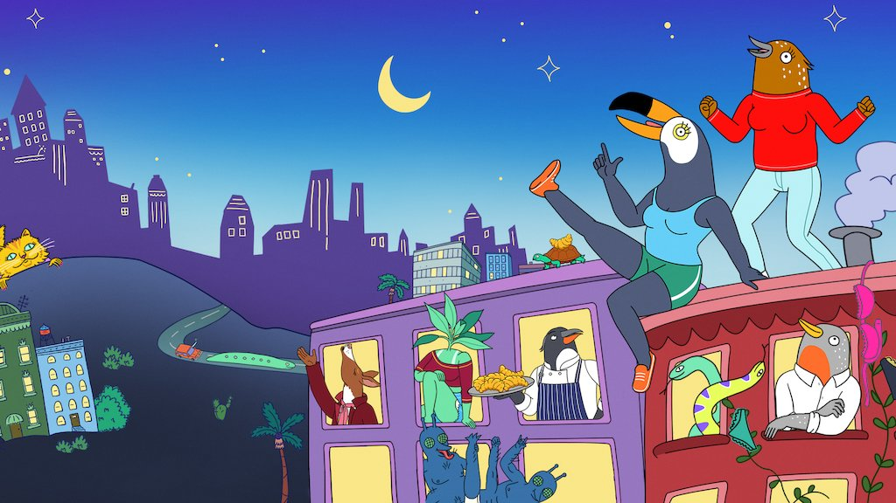

I was apprehensive about [Tuca & Bertie](https://www.justwatch.com/us/tv-show/tuca-and-bertie) series at first. The opening is sort of crass and the animation style is... eccentric. I'm glad I stuck with it though. Under that colorful veneer, Ali Wong and Tiffany Haddish bring to life such stupendous characters. Haddish's Tuca is sort of a menace, but her heart is in the right place. Wong's Bertie is filled with anxiety and a need to excel, character traits we found particularly relatable. Furthermore, the art style and presentation really grow on you as the season progresses. The season is both heartfelt and hilarious throughout.

What really brought this show to the next level was the distinct character growth each of the protagonists go through over the course of X short episodes. They each have realistic interpersonal conflict that they overcome in satisfying ways.

Fun fact: we ended up liking with this so much that I commissioned a friend to draw us and our van as characters from the show as a gift for Vicky (created by the incredible [Meggie Ramm](http://www.meggieramm.com/)):

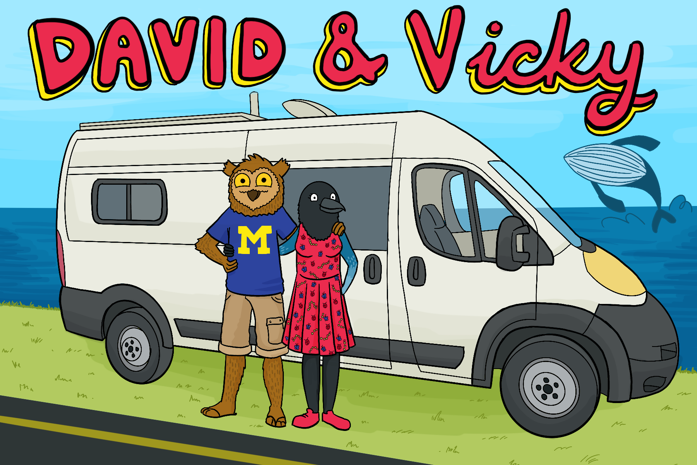

That this show was canceled after a single season will go down as one of the great TV injustices in the world. It had a lot to offer and I hope its creative team finds success in other places. We may have had too little, but at least we got it at all.

> Runner-Up: **The Mandalorian**

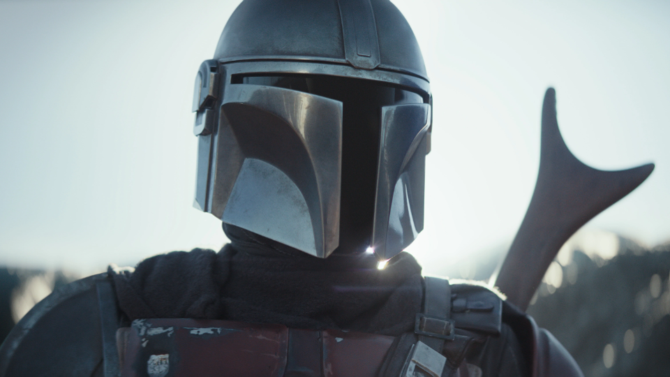

[The Mandolorian](https://disneyplusoriginals.disney.com/show/the-mandalorian) struck a few chords with me. First off, it was presented episodically, where each episode was (mostly) standalone. That was refreshing, since a lot of shows aren't structured that way anymore. Secondly, Baby Yoda. Gifs somehow don't do his cuteness justice. Thirdly, I really like the chill-until-it's-not Western vibe the show had. A couple of episodes were almost reminiscent of _Firefly_, which is about as high an honor as I can confer to a show. Visually, it was superb. Multiple times an episode I remarked "whoa, that was a cool shot." The show as a whole has a pretty good arc that it's no hurry to resolve (and I kind of dig that).

> Honorable Mentions

- [_Silicon Valley_](https://www.justwatch.com/us/tv-show/silicon-valley) (S06) for sticking the landing in its finale. SV has always held a soft spot in my heart. When it first aired, my Silicon Valley engineer friends and I were worried folks outside of California wouldn't find it funny. Gladly, they did. Fun fact: all of the exterior shots from the show were our local neighborhood places. Anyway, over time the quality varied, but they wrapped everything up nicely.
- [_American Gods_](https://www.justwatch.com/us/tv-show/american-gods) (S01) for being the single most gorgeous show I watched this year. The adaptation was good (and had a couple of really standout episodes, namely ep 6 and 7), but the cinematography and art direction were unreal. I haven't watched the second season yet because I heard it took a big dip in quality after the original showrunner, Bryan Fuller, left.

**Dishonorable Mention** to:

- _Game of Thrones_ (S08). You know what you did.

---

_To see the full list and ratings of all the seasons of TV I saw for the first time this year, check out [this Airtable](https://airtable.com/shrAKc1WJQfBu9Xfy)_

_return to the [table of contents](#TOC)_ ↩️

## Books

This year, I read 15 books (up from 9 in 2018) for a total of ~1,583,841 words. Last year I [had mentioned](/blog/2019/02/05/my-favorite-media-2018-edition/#books) that I wanted to read more, so I took a few steps towards making that happen. The biggest source of improvement was my January acquisition of a dedicated e-book reader, the [Kobo Clara HD](https://thewirecutter.com/reviews/amazon-kindle-is-the-best-ebook-reader/#a-non-amazon-option-kobo-clara-hd). I had long been in the "an iPad can read books and so much more" camp, so I never saw the use for a dedicated device. Well, it turns out that sometimes less is more. The fact that the Kobo can basically only read books is a boon if you're an easily-distractible reader (like myself). The screen _really is_ more comfortable to read on. Its small form factor is great for being carried in a pocket and whipped out at a moment's notice (something even my spacious cargo pants can't do with an iPad (yet)).[^8] I've got more to write about the Kobo at another time, but suffice it to say that I'm extremely pleased with my purchase and it's driven a lot of reading this year.

> Winner: **Red Rising**

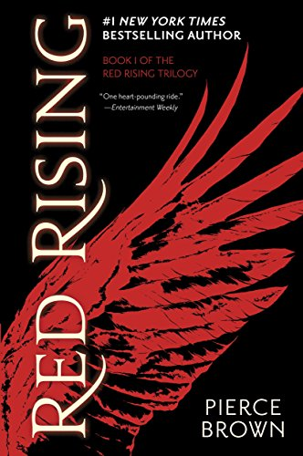

I had this book inexplicably recommended to me by 3 separate people in the course of a week, so I knew I was in for a treat. Pierce Brown's [_Red Rising_](https://piercebrownbooks.com/books#redrising) builds a world at a breakneck pace and breaks necks at an even faster one. The bulk of the story is Ender's Game meets Game of Thrones, which I took to immediately. Brown's writing style is fairly singular in the way the narration captures and furthers the main character's personality. All authors do that to a degree, but everything about this book felt like it contributed to the theme. It had a huge cast of characters that I occasionally had trouble keeping distinct, but I did eventually get there. This was a quick, delightful read.

At the time of writing (Jan 2020), I've finished the second book in the series and it's also great. Really curious to see where it ends up.[^9]

> Runner-up: **The 7½ Deaths of Evelyn Hardcastle**

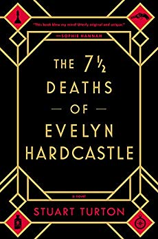

If you've read my previous posts, you'll know that I'm an absolute sucker for any story that incorporates one or more of: time loops, murder mysteries, and multiple viewpoints to the same series of events. Guess what three plot devices Stuart Turton's [_Evelyn Hardcastle_](https://www.goodreads.com/book/show/36337550-the-7-deaths-of-evelyn-hardcastle) employs? Seriously though, I'm grateful to my sister for recommending this to me. It had great twists and turns. The more I learnt about the different characters, the more complete the picture became. I loved how there was a steady drip of information throughout the story, culminating in a very satisfying "here's what happened" that cleared any pending confusion up. I don't always jump on period pieces, but this one was a delight.

> Honorable Mentions

- [_My Sister the Serial Killer_](https://www.penguinrandomhouse.com/books/588860/my-sister-the-serial-killer-by-oyinkan-braithwaite/) by Oyinkan Braithwaite. Part of an effort to branch out my fiction reading and hear more stories by and about people who aren't white dudes. It was fast-paced and gripping. I think my biggest complaint was a lack of character arcs, but it was definitely a breath of fresh air.
- [_The Great Train Robbery_](http://www.michaelcrichton.com/the-great-train-robbery/) by Michael Crichton. A classic heist novel that's (unsurprisingly) a total page turner. There's some 1800's British slang to get through (the inline lookup feature on the Kobo is a lifesaver here), but it's a blast overall.
- [_If on a winter's night a traveler_](https://www.goodreads.com/book/show/374233.If_on_a_Winter_s_Night_a_Traveler) by Italo Calvino. I enjoyed this one mostly for the absurdity of its frame story, but its super post-modern vibe was a bit much for me.

---

_To see the full list and ratings of all the books I read for the first time this year, check out [this Airtable](https://airtable.com/shrcGhPx57JNqwFde)_

_return to the [table of contents](#TOC)_ ↩️

## Just the List

<!-- prettier-ignore -->
* Videogames
    * Winners
        * [CrossCode](https://www.cross-code.com/en/home)
        * [Return of the Obra Dinn](https://obradinn.com/)
    * Runners-Up
        * [Slay the Spire](https://www.megacrit.com/)
        * [Celeste](http://www.celestegame.com/)
    * Honorable Mentions
        * [Device 6](http://simogo.com/work/device-6/)
        * [Detroit: Become Human](https://www.quanticdream.com/en/detroit-become-human)
        * [Doom (2016)](https://bethesda.net/en/game/doom-2016)
        * [Outer Wilds](https://www.mobiusdigitalgames.com/outer-wilds.html)
        * [Final Fantasy XV](https://finalfantasyxv.square-enix-games.com/)
        * [Kingdom Hearts 3](https://www.kingdomhearts.com/3/us/home/) (sort of)
* Movies
    * Winners
        * [Knives Out](https://www.justwatch.com/us/movie/knives-out)
        * [Avengers: Endgame](https://www.justwatch.com/us/movie/avengers-endgame)
    * Runner-Up
        * [The Farewell](https://www.justwatch.com/us/movie/the-farewell-2019)
* Television
    * Winner
        * [Tuca & Bertie](https://www.justwatch.com/us/tv-show/tuca-and-bertie)
    * Runner-Up
        * [The Mandalorian](https://disneyplusoriginals.disney.com/show/the-mandalorian)
    * Honorable Mentions
        * [Silicon Valley](https://www.justwatch.com/us/tv-show/silicon-valley) (S06)
        * [American Gods](https://www.justwatch.com/us/tv-show/american-gods) (S01)
* Books
    * Winner
        * [_Red Rising_](https://piercebrownbooks.com/books#redrising) by Pierce Brown
    * Runner-Up
        * [_The 7½ Deaths of Evelyn Hardcastle_](https://www.goodreads.com/book/show/36337550-the-7-deaths-of-evelyn-hardcastle), by Stuart Turton
    * Honorable Mentions
        * [_My Sister the Serial Killer_](https://www.penguinrandomhouse.com/books/588860/my-sister-the-serial-killer-by-oyinkan-braithwaite/) by Oyinkan Braithwaite
        * [_The Great Train Robbery_](http://www.michaelcrichton.com/the-great-train-robbery/) by Michael Crichton
        * [_If on a winter's night a traveler_](https://www.goodreads.com/book/show/374233.If_on_a_Winter_s_Night_a_Traveler) by Italo Calvino

return to the [table of contents](#TOC)

## That's all, folks!

That'll do it! Thanks a ton for reading this far. I hope 2019 brought you good media and it gets even better in 2020!

_This post was edited expertly and patiently by [Vicky Stein](https://vickystein.media/)._

[^1]: The PS4 was fun in the van, but _very_ power intensive. It also put out a lot of heat, making warn nights nigh unbearable. We had to wait for what we called "PS4 weather", both cold and sunny
[^2]: Nothing's worse than 80 copies of "oh, these monsters have been attacking our town"
[^3]: I've played _Magic: the Gathering_ off and on since middle school and it's fun but it is _expensive_ to keep up with
[^4]: I'm getting the sense that [roguelikes](https://en.wikipedia.org/wiki/Roguelike) really shine there, since it's so easy to pick up for a quick run
[^5]: I actually had to take breaks playing this through the first leg of our van trip because it was too much to drive all day in my car and then settle down in the evening to drive around in my car
[^6]: Fun fact: it was only right turns to get to the theater, so I could get there lickety split in a pinch
[^7]: Kung-Fu Panda excepted, naturally
[^8]: Sincere apologies to the lady-pants-wearers in my life who may not know this joy; it fits well in a purse, bag, or sling as well
[^9]: Maybe the best thing about this series is that the whole thing was done by the time I started, so I've got nothing to wait for. Honestly feels really good and new
