Tuesday started, like most do, with dissatisfaction with my task app. "Surely," I thought, "_surely_ there exists an app that includes all the features I want and none that I don't." I have come to the sad realization that there is no perfect task app.

Many task apps are good and some are great, but nothing will ever be perfect. When an app needs to represent something as unique as a human brain, it comes as little surprise that there's no app that works for everyone. But I don't need an app for _everyone_, really just for me. I've toyed with writing my own, but it turns out that's a _lot_ of work. Instead, I'm going to describe the perfect app that I _would_ write in the selfish hopes that some of the app developers mentioned below might take inspiration for some of these features in their own apps. Let's get to it!

## Features

The ultimate goal for this app is to be able to easily see each task I can do right now and none that I can't. I'll describe each feature that makes this possible, plus showcase apps that do or don't implement each well. Many examples will come from [Things 3](https://culturedcode.com/things/), my current daily driver.

### Complete Tasks via a Checkbox

Starting things off with a simple one: I want a box to press that completes a task. Moving cards laterally into a "done" column isn't nearly as satisfying. Turns out there's no better reward in my lizard brain for tapping a box, getting an animation, and seeing a task disappear.

Many apps have this; Things does a great job:

### Great UI

This is both the single most important feature and the one I'm personally worst at implementing. There are fields of study about creating good UIs [^1], so I won't go into it much here. Suffice it to say that it must be easy to add, move, and organize tasks. There are many little improvements that go a long way here: keyboard shortcuts (especially if customizable), snappy animations, and access to important information without being too dense. As you can imagine, it's a hard line to walk.

Things is head-and-shoulders above all competitors here, and it's not even a contest.

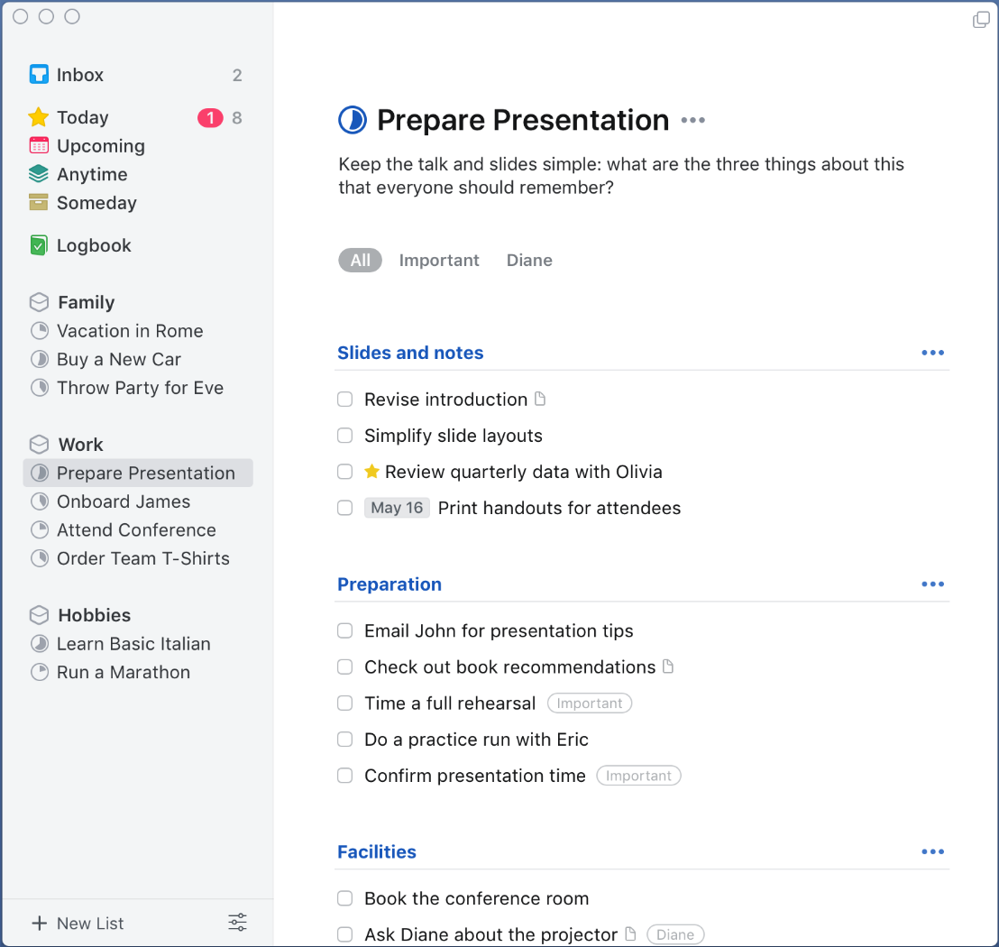

### Start Dates & Times

Start dates are central to my ultimate goal above. If it's something I need to track but can't complete yet (such as renewing my passport), then it gets a start date in the future. Tasks like these would be easy to find when needed, but hidden from default views until their day has come.

Things has a great implementation of this:

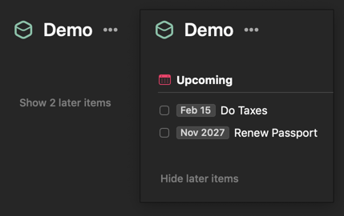

Going a step further, it's important to be able to compliment our future start date with a start time. For instance, "take out the garbage" is a Tuesday task, but can't be done until after dinner. It should be hidden from Tuesday's "Today" view until it's after 8pm. Then it will appear and the app's badge on my phone/watch will update accordingly.

Things falls down a bit here. It's got an "evening" designation for tasks, but you can't currently set a task to be in the evening on a future date. This is likely intentional, keeping Things tied more closely to its [GTD](https://gettingthingsdone.com/) roots. As my goal is to keep as much context out of my brain as possible, having to manually defer some tasks to the evening that should have already been there in the first place is frustrating.

Also, a start date without a time doesn't gel well with staying up past midnight. Because of [the way I track dates](/blog/post/on-the-storing-of-dates/), I wouldn't expect tomorrow's tasks to show up at 12:01am. Functionally, I would probably include a default start time of 5am for all tasks (if one isn't separately provided).

2Do, another old favorite, did this pretty well. The only nitpick was that the App's badge would include "tonight" items before I could work on them.

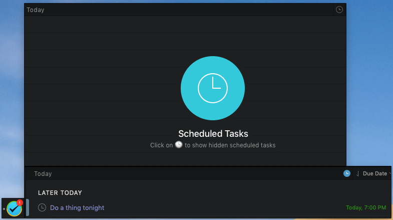

### Deadlines

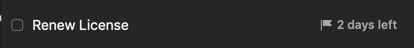

Most tasks I track don't _need_ to be done by any particular date. I typically assign them a day so I'll remember to address them, but if a task slips a day or two, it's not a big deal.

Occasionally, it's very important to express that a task has a deadline, like with a passport renewal. These should be optional, but very visible.

### Dependent Tasks

Of all features listed in this post, this one is the farthest from being commonplace in task apps.

I often find myself needing to represent blocking relationships between tasks. My ideal app would exclude tasks with incomplete blockers from the "available tasks" view (just like tasks with start dates in the future). The task dependency graph could take any shape, but cycles wouldn't be allowed. For example, it's invalid for `A` to be blocked by `B` which is blocked by `A`. It would also be an error to complete a task that has incomplete blockers (instead, mark blockers as complete or sever the relationships between tasks). There would also be a graph view to easily visualize a task tree.

Having this feature really is my white whale. I've thought about it so much that I've created an [open-source toy implementation](https://github.com/xavdid/tasks) for the system I've described. It should work as a jumping off point for any devs interested in adding dependent tasks to their app.

The best (and maybe only) commercial version of this feature is [Task Heat](https://eyen.fr/). It's got a good UI for showing the flow of a project and all of the logic you'd expect is present.

You can easy create blocking associations between tasks by dragging an arrow:

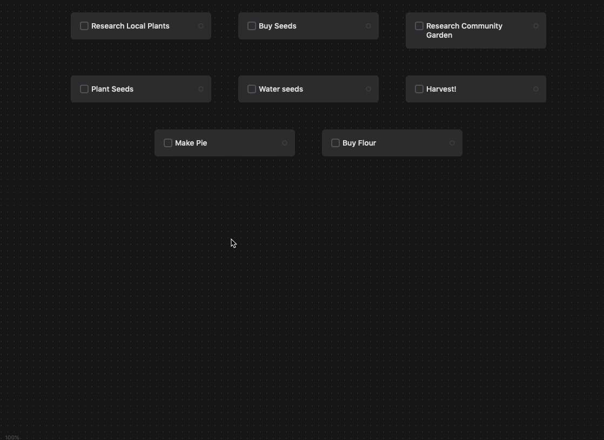

It's got a live-updating view to show available tasks in a project:

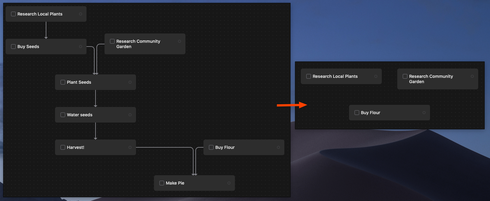

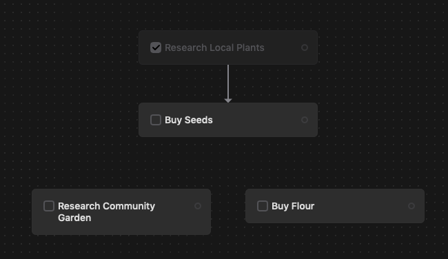

It also throws a warning when you're completing a blocked task, which I find very thoughtful:

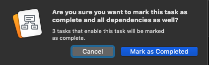

Lastly, it will allow, but visually flag cyclical relationships:

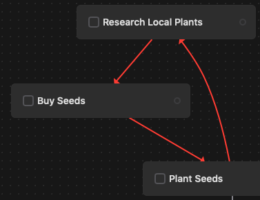

Unfortunately, the rest of the app still needs some time to bake before it's ready for prime time for me, but the fact that this exists at all is promising! [^2]

A few more popular apps (Asana, Amazing Marvin, and Linear, to name a few) have some notion of dependent tasks. Unfortunately, they're just links between tasks without any added functionality. There's no way to filter for unblocked tasks and all tasks are always completable.

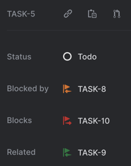

### Repeated Tasks

This is another pretty core feature than can get complex quickly. There are two main types of repetition:

- N days after completion. You'd use this when watering plants, so that you're not asked to water again until a few days have passed
- Every N days/weeks/months/etc. Useful for regularly scheduled tasks, like paying rent

It should be easy to stop repetition after a certain date or number of occurrences.

Once again, Things crushes this:

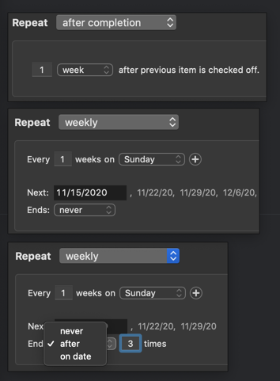

### Web API

Being that I work at an API-based company, this feature shouldn't be much of a surprise. The utility of a read/write API will vary between people, but no one will be sad to have one. Most commonly, I use them to quickly generate tasks from other apps such as email or Slack. More than anything, having an API removes many limits on the way you use an app, so it's a big win.

This is a common feature in commercial task apps today. Todoist, Asana, Trello, etc have great APIs.

Things is a bit of an odd duck here. They've got a superb [on-device API](https://culturedcode.com/things/support/articles/2803573/), but you have to run those commands on your phone or computer.[^3] It can't be accessed, for example, by Zapier. Their solution is _[Mail to Things](https://culturedcode.com/things/blog/2017/12/mail-to-things/)_, where emails sent to a custom address will show up in your Things Inbox. This is a simple stopgap, but lack of support for other Things features (start dates, projects, areas) mean the feature is relegated to simple reminders rather than complex workflows. Given that they can bring _any_ data in from their servers shows that a web API is possible, just not something they've prioritized.

## Neutral Features

### Task Statuses

A mainstay of project management apps (Trello, Jira, etc), where a task can exist in one of many user-defined columns such as `in progress` or `in review`. This typically comes with the trade-off that changing statuses takes multiple actions (click `status`, then click desired status). I really only ever need "todo" and "done" and it needs to be fast and easy to move between those.

Things has `someday` and `canceled` statuses, which do end up being useful occasionally. I use `someday` as a backlog for when I record a task, but have no intention of doing it anytime soon. I could live without this though.

## Detractors

A lot of people like these features, but I don't care about them, so they won't be in my app.

### Team Features

This app is just for me, so I don't need UI space wasted for multi-user features. Common features like comment streams, assigning tasks to others, or any sort of in-app-chat functionality are totally lost on me. Many apps have popups/banners encouraging me to "invite [my] team!", which I also don't need.

### Tagging

This is probably the most contentious thing I'll say in this post - I've never found it useful to tag tasks. All of my tasks already live in an area or project. Further categorization typically soaks up a lot of time and brainpower and leaves me with many tags, each with 1 or 2 tasks. I'd rather keep the app nice and lean. Tags _can_ be good for shoring up missing features (such as a backlog item in absence of the "someday" status), but my app will be perfect and will need no shoring up.

If you find tagging invaluable with how you go about your day, do let me know! I'm always open to a change of heart.

### Priority Levels

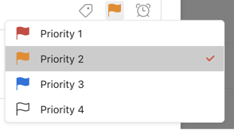

This goes hand-in-hand with tags. Pre-defined priority levels are helpful for balancing tasks against others in a project, they're rarely helpful when looking at collected views. In apps with priorities, I often spend a lot of mental energy trying to define "what exactly priority 3 means to me and how it differs from priority 2". Thus, we'll skip them.

### Stats

I don't need any sort of velocity tracking or score when it comes to productivity. While this is mostly found in team-based project management apps, there are some personal apps that do it as well (Todoist is a prime example). To those that enjoy such features, more power to you. Productivity points are simply not for me.

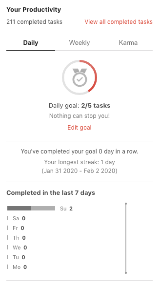

## Apps to Watch

Like I've touched on above, task apps are a crowded field and there are many that do some of the above well. If we've got similar proclivities, here are some apps to keep tabs on:

- [Linear](https://linear.app/) - I really love their attention to detail and focus on speed/ease of use. There are keyboard shortcuts for everything and animations are _fast_. I'm not sure it'll be the one for me, but I'm excited about their rapid progress.
- [Amazing Marvin](https://amazingmarvin.com/) - [_This app has everything_](https://www.youtube.com/watch?v=LAQRtjvtQRo). Their innovative approach is to allow core product features to be toggled, so the experience is very custom. I should like that, but it ends up being a little [_if you stand for for nothing, what'll you fall for?_](https://genius.com/7860874). I prefer opinionated apps (as long as I agree with the opinions).
- [Zenkit](https://zenkit.com/en/suite/) - Great, if cluttered, UI. Also very team focused. Looks to be some good muscle happening though!

If you're hungry for more, there's also [this comically long list of 47 apps](https://www.ntaskmanager.com/blog/best-to-do-list-apps/) that might have something for you.

## So There You Have It

Realistically, my perfect app will never exist. Until then, I'm a happy [Things 3](https://culturedcode.com/things/) customer (who will never stop searching for the perfect app).

If you know of something better, definitely [drop me a line](/contact).

[^1]: And even what constitutes a "good" UI
[^2]: At time of writing, TaskHeat doesn't have repeated tasks, start dates, or most of my other "must have" features.
[^3]: Nevertheless, I've used the local API to great effect when capturing business trips. Data flowed via the following path: Tripit > Zapier > Slack > Shortcuts > Pythonista > Things. But, that's a story for another time.
