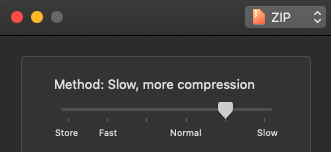
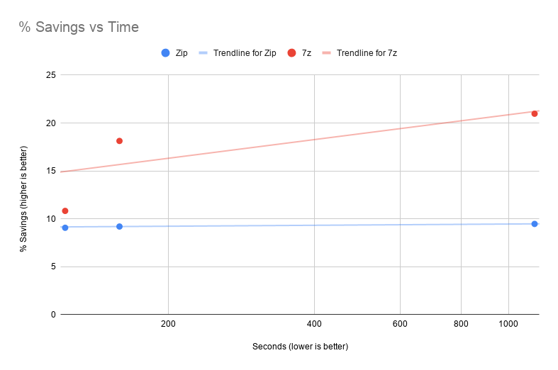

I've long enjoyed [Keka](https://www.keka.io/en/) to handle compression tasks on macOS. It's a [formally open source](https://github.com/aonez/Keka#so-where-is-the-source-code) utility that's great for many common archiving tasks.

When creating an archive, there's a slider I've always been puzzled by. It allows the user to balance speed vs compression size. I've typically left it at the second notch since, if it helps, I'm usually willing to wait to save data space. I have no idea if/how much it actually changes the result, but it made me feel a little better to not be at either extreme.

Recently, I [had occasion](/blog/post/thunderbolts-and-lightning/) to move my entire Plex library to a new computer. While the actual media files are stored on an external hard drive, the Plex library metadata is stored locally. It contains the state of the world in ~14.5k small files. That's a perfectly reasonable amount of data to move across hard drives, but the deeply-nested structure meant the OS was spending a dramatic amount of time finding all the little files. Rather than wait, I could compress the whole thing and move all the files as a single large block.

This task proved a perfect opportunity to actually put that slider through the ringer. My archives were going to be big enough to see a meaningful difference (if there is one). I'm also working with real data, so probably I wouldn't have input that happened to be well (or poorly) suited to compression.[^1]

My method was simple: I'd try two formats (`.zip` and `.7z`) and 3 speeds (`fast`, `regular`, and `slow`). My folder weighed in at 7.39GB. Let's see how we did!

| setting      | size (GB) | time (seconds) | % size savings | seconds / % size savings |
| ------------ | --------- | -------------- | -------------- | ------------------------ |
| 7z, fast     | 6.59      | 334            | 10.83%         | 30.84                    |
| 7z, regular  | 6.05      | 604            | 18.13%         | 33.31                    |
| 7z, slow     | 5.84      | 1138           | 20.97%         | 54.27                    |
| zip, fast    | 6.72      | 123            | 9.07%          | 13.56                    |
| zip, regular | 6.71      | 159            | 9.20%          | 17.28                    |
| zip, slow    | 6.69      | 1131           | 9.47%          | 119.43                   |

The (theoretical) best compressor would be in the top left (low time, big size savings) and the worst would be in the bottom right (it spent all that time and didn't even compress well).

There are a couple of key takeaways:

- for `.zip` files, speed didn't matter. From `fast` to `slow` was a 9x increase in time to save a paltry `30 MB` of space. Unless you are trying to cram every byte, stick to fast.
- For `.7z`, there's a lot more variation in both time and file size. `fast` is twice as slow as the fastest `.zip`, but its space savings were much more significant (especially as you spent more time compressing).

So!

- If small **size** is the absolute most important thing, use **7z, slow**. `7z` at any level will result in a smaller file than `zip`, but at the cost of time.
- If quick **speed** is the most important thing, use **Zip, fast**
- If you want an efficient balance of speed and space savings, **Zip, fast** is still the way to go - it's the fewest seconds per % of size saved

[^1]: In actuality, it depends on the filetype. Things like `mp3` are already compressed, while text files aren't
