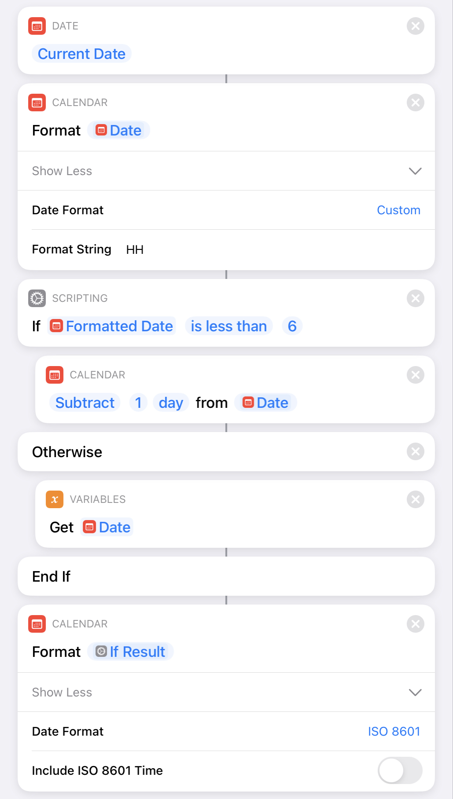
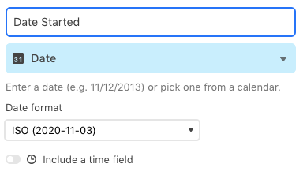

In all of my personal record keeping, I use a slightly unusual method of tracking the date. It never made organizational sense to me that media finished minutes apart (but across an arbitrary boundary) would be recorded on different days. I know that's how dates work, but for tracking and grouping purposes, it's weird. So, a better system was needed.

Instead of storing a full DateTime object (date, time, and timezone), I'm only interested in the unique ISO 8601 date string, like `2020-10-15`. It increments each morning when I wake up.[^1] Keeping dates as a simple string more accurately represents days as I experience them: each one only happens once and there are no time zones.[^2] Storing the date so simply makes it a breeze to group everything that happened on a given day (as I experienced it), such as my daily journal, books I finished, movies I watched, etc.

On the one hand, this method greatly simplifies storage; strings are portable and dependable. My value will read the same wherever I am in the world. If I were in London and a spreadsheet was trying to be "helpful", it might display the timestamp "6pm PDT on Oct 15, 2020" as "1am BST on Oct 16, 2020," meaning any records originally dated on the morning of the 15th are no longer groups with those in the evening. No system will monkey with my strings.

On the other hand, programmatically generating my dates correctly can be tricky. They have to be created using local timezone info[^3] , but I have to strip that information out without converting to any other TZ. In Javascript environments, I've got the following function:

```js
const now = new Date();

// can't use now.toISOString() because that converts to UTC

// if it's after midnight but I probably haven't woken up yet, treat it as yesterday
if (now.getHours() < 6) {
  // this handles dates across months/years correctly!
  now.setDate(now.getDate() - 1);
}

// 1-digit month and day need a leading 0
const paddedNumber = (n) => `0${n}`.slice(-2);

const dateStr = `${now.getFullYear()}-${paddedNumber(
  // js months are the worst and are the only thing here that is 0-indexed
  now.getMonth() + 1
)}-${paddedNumber(now.getDate())}`;
```

I've got a similar function for use in iOS Shortcuts:



Ironically, I _do_ use the Airtable `Date` field since without it I don't get the nice calendar UI for input. But, they read and write these as my simple strings, so everything actually plays together nicely.




I predict my system to continue working really well for my use case until we start needing intergalactic `StarDates`, at which point society is _screwed_.

[^1]: There are some edge cases here if I pull an all-nighter or am on a long, international flight, but I won't bore you with those here
[^2]: Obviously I _experience_ time zones, but since this string captures all the time I'm awake on a given day, it doesn't matter how many hours that encompasses
[^3]: I do exist _somewhere_ after all
