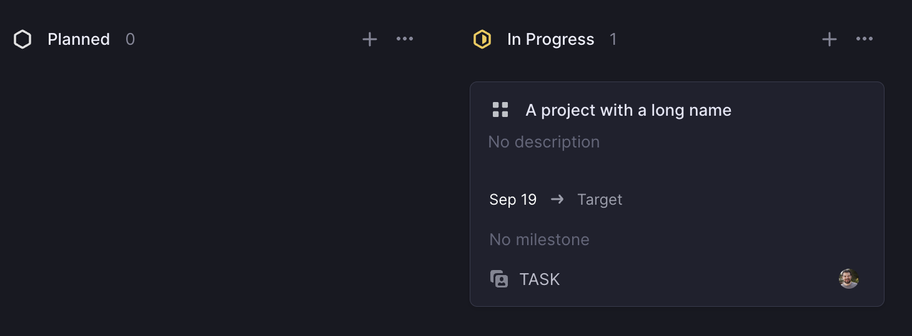
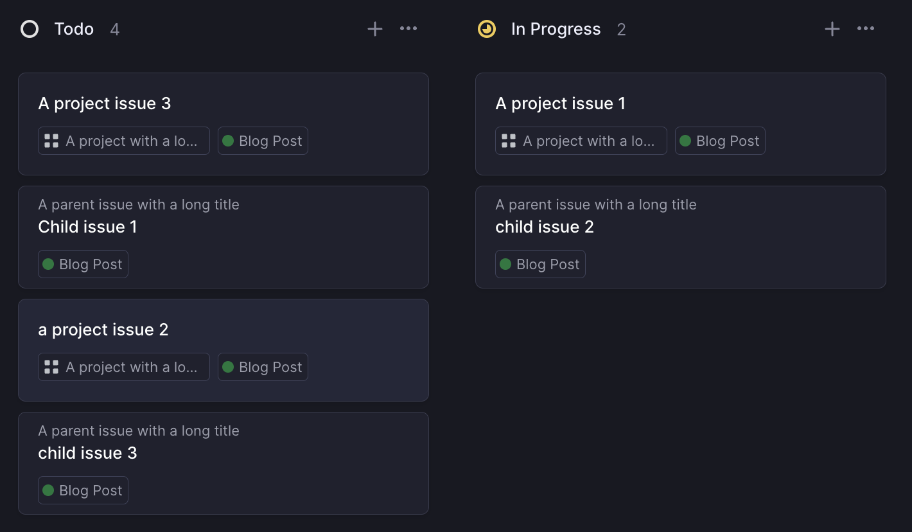
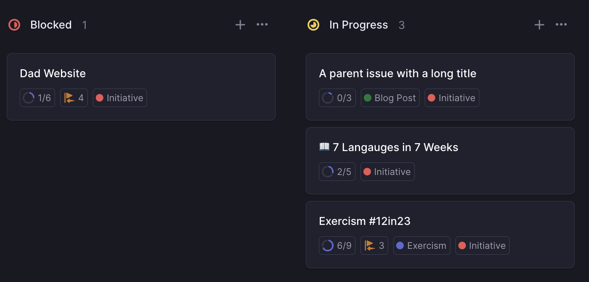
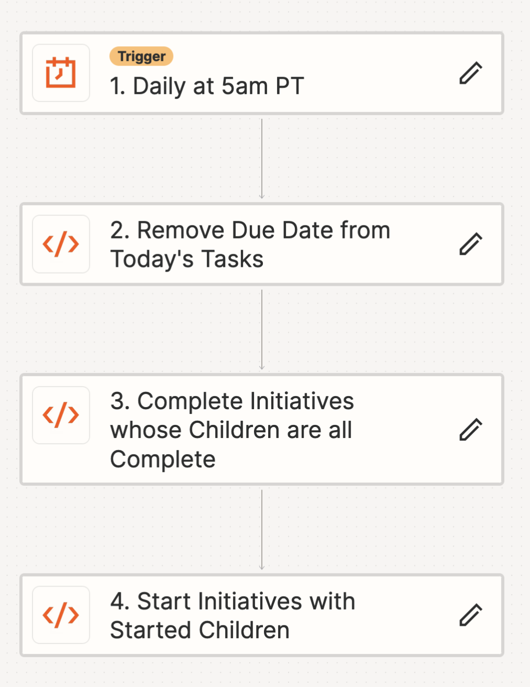
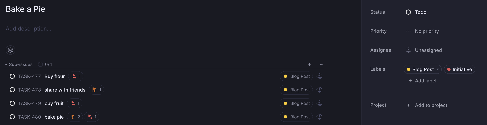
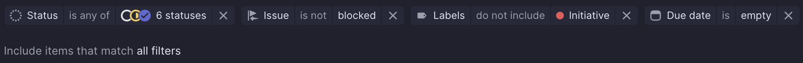
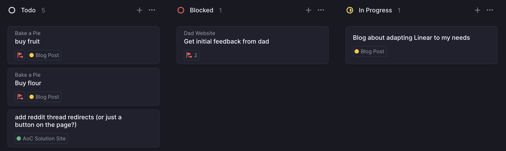
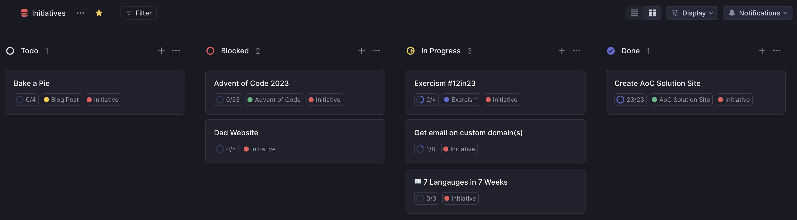
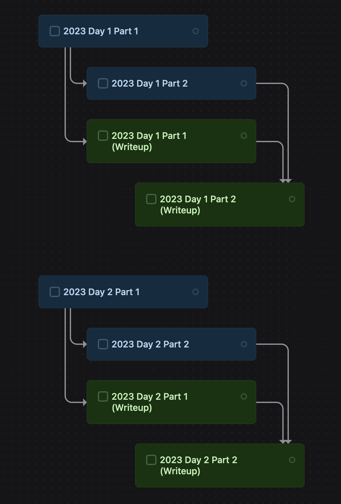
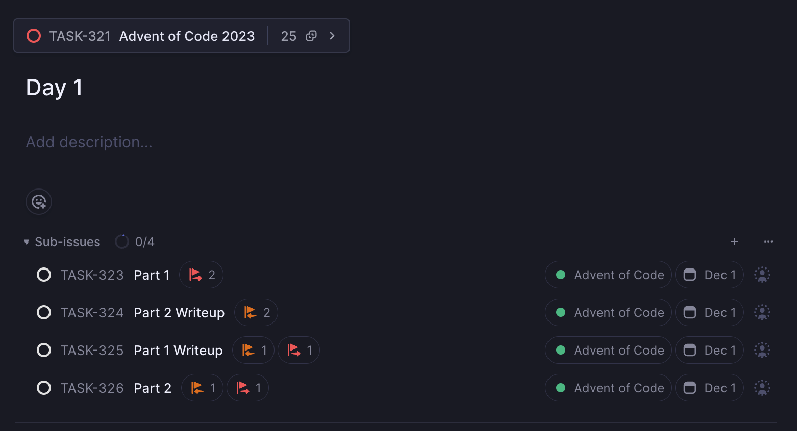

A few years ago, I wrote about [my perfect task app](/blog/post/my-perfect-task-app); think of this post as the sequel.[^1]

In the three years since that post, nobody has built my dream app. Good news though - I've been able to get pretty close via a bit of programming and patience. The lightbulb moment came when I realized I didn't need a single app for everything in my life.

I could (and did) keep using [Things 3](https://culturedcode.com/things/) for personal items. But it isn't geared toward project management in the way I needed as I scaled up the number of [side projects](/blog/tags/projects) I was working on. It doesn't integrate with GitHub and has a big focus on which day a task is getting done (something I mostly don't care about for side projects). Instead I've built a system I'm really happy with using project management darling [Linear](https://linear.app/). It's probably the closest I'll ever get to a perfect setup without building my own from scratch. Let's break it down.

## Overview

In this system, a basic unit of work is a `task`. Each task should have a status, such as `todo`, `in progress`, or `done`. A task probably also has a `codebase` label, which is useful for grouping tasks. I have a label for each of my side projects, such as the [Reddit Archiver](/blog/post/archive-your-reddit-data/), [Universal Test Runner](/blog/post/run-every-test/), or my [Advent of Code solution showcase](/blog/post/building-aoc-showcase/). Tasks can also [block each other](/blog/post/my-perfect-task-app/#dependent-tasks), an important feature when outlining a project. Lastly, tasks can have a "start date", before which time they should be hidden from view.

For efforts that outgrow a single task, such as a big rewrite or migration, tasks can be grouped under a parent task, or `initiative`. Initiatives should have a state that summarizes all of their children. This state should update automatically as children are completed.

I work out of two main views:

1. `Available Tasks`, which shows all unblocked tasks whose start date is missing or passed
2. `Initiatives`, which shows the current status of all initiatives and their completion percentages

Automation wise, tasks are marked "in progress" when I copy their task ID (to use as a branch name) and closed when they show up in a commit or PR on GitHub. I can always find out what I worked on but basically never have to move tasks around manually.

Linear handles tasks, statuses, and labels natively, so I'll focus on describing the features I built myself.

## Start Dates

Linear doesn't have support for start (or "deferred") dates, but I came up with a hacky workaround. Linear _does_ have a native "due date" field, and my side projects basically never have due dates. So, I started setting the due date to my start date. Unfortunately, there's not a good way to build a filter for `due_date == null OR due_date <= today()` in the UI.[^2] Instead, I set up filters to only show tasks with no due date at all. If I could clear a task's due date _on_ the date, then they would "appear" on the day they were "due", effectively functioning as a start date. Thanks to Linear's expressive API, I could write a little Python script that runs daily (on Zapier, naturally). It finds all tasks "due" today and clears their due date:

```py
from datetime import date

LINEAR_TOKEN = "lin_api_1234"

# it's ok that this is raw utc, since it runs early in the morning CA time
today_utc = str(date.today())

load_tasks_response = requests.post(
    url="https://api.linear.app/graphql",
    headers={
        "Content-Type": "application/json",
        "Authorization": LINEAR_TOKEN,
    },
    json={
        "query": """
                query DueToday($filter: IssueFilter) {
                    issues(filter: $filter) {
                        nodes {
                            id
                            title
                            dueDate
                        }
                    }
                }""",
        "variables": {"filter": {"dueDate": {"eq": today_utc}}},
    },
)
load_tasks_response.raise_for_status()

tasks = load_tasks_response.json()["data"]["issues"]["nodes"]
ids = [t["id"] for t in tasks]

if ids:
    clear_dates_response = requests.post(
        url="https://api.linear.app/graphql",
        headers={
            "Content-Type": "application/json",
            "Authorization": LINEAR_TOKEN,
        },
        json={
            "query": """
                mutation ClearDueDate($change: IssueUpdateInput!, $ids: [UUID!]!) {
                    issueBatchUpdate(input: $change, ids: $ids) {
                        issues {
                            title
                            dueDate
                            id
                        }
                        success
                    }
                }
                """,
            "variables": {"change": {"dueDate": None}, "ids": ids},
        },
    )
    clear_dates_response.raise_for_status()

return {
    "success": True,
    "num_updated": len(tasks),
    "updated": [t["title"] for t in tasks],
}
```

> Note: it's **usually bad form to put API keys directly into a Zapier code step** (since zap inputs aren't encrypted the same way authentication information is) but it's a risk I'm willing to take with my Linear data.

The above runs daily at 5am PT, which is well before I'm awake. Part 1 in the bag!

## Initiatives

Though Linear has a first-party notion of a "[project](https://linear.app/docs/projects)", I find that their implementation is pretty far from what I need. Their focus is (understandably) centered on many contributors working together to provide updates, deadlines, etc. I need a project to show:

1. the initiative name (if any) on each child issue
2. all initiatives and a summary of the progress on each (preferably as a `done / total` percentage or a visual indicator)

Unfortunately, the project view for Linear's UI at the time of writing basically doesn't meet my needs at all:



The issues view is similarly unhelpful if using Linear's "projects":



Instead, the solution here is to track initiatives as a Linear issue and individual tasks as subissues, and skip "projects" all together. This makes for a much more useful initiatives view:



The big thing that this approach lacks is any built-in automation. Luckily, I know the tool for the job.

### Automation

Auto-starting and -stopping initiatives works a lot like my due date removal above. Once a day, my zap finds unfinished initiatives for whom every child is completed and marks them as complete. The code is straightforward:

```py
LINEAR_TOKEN = "lin_api_1234"

load_tasks_response = requests.post(
    url="https://api.linear.app/graphql",
    headers={
        "Content-Type": "application/json",
        "Authorization": LINEAR_TOKEN,
    },
    json={
        "query": """
            query StartedInitiatives($filter: IssueFilter) {
                issues(filter: $filter) {
                    nodes {
                        title
                        id
                    }
                }
            }""",
        "variables": {
            "filter": {
                # tasks labeled "Initiative"
                "labels": {"name": {"eq": "Initiative"}},
                # which are not completed
                "state": {"type": {"neq": "completed"}},
                # and have children
                "children": {
                    # all of whom
                    "every": {
                        "state": {
                            "type": {
                                # are done or wontfix
                                "in": [
                                    "completed",
                                    "canceled",
                                ]
                            }
                        }
                    }
                },
            }
        },
    },
)
load_tasks_response.raise_for_status()

tasks = load_tasks_response.json()["data"]["issues"]["nodes"]
ids = [t["id"] for t in tasks]


if ids:
    clear_dates_response = requests.post(
        url="https://api.linear.app/graphql",
        headers={
            "Content-Type": "application/json",
            "Authorization": LINEAR_TOKEN,
        },
        json={
            "query": """
                mutation ClearDueDate($change: IssueUpdateInput!, $ids: [UUID!]!) {
                    issueBatchUpdate(input: $change, ids: $ids) {
                        issues {
                            title
                            dueDate
                            id
                        }
                        success
                    }
                }
                """,
            "variables": {
                # move to Done
                "change": {"stateId": "82556382-4e80-41ef-8ebf-396360f52dc6"},
                "ids": ids,
            },
        },
    )
    clear_dates_response.raise_for_status()

return {
    "success": True,
    "num_updated": len(tasks),
    "updated": [t["title"] for t in tasks],
}
```

I do the same thing for initiatives with any started children. It's identical to the above, but the `filter` is as follows:

```py
{
    "filter": {
        # tasks labeled "Initiative"
        "labels": {"name": {"eq": "Initiative"}},
        # which are not started
        "state": {"type": {"in": ["unstarted", "backlog"]}},
        # and have children
        "children": {
            # some of whom
            "some": {
                "state": {
                    "type": {
                        # are started or done
                        "in": [
                            "started",
                            "completed",
                        ]
                    }
                }
            }
        },
    }
}
```

Put those all together and you have the finished zap:



## Dependent Tasks

The last piece of the puzzle is [dependent tasks](/blog/post/my-perfect-task-app/#dependent-tasks). Since I originally wrote about them, Linear has added support for filtering out tasks which are blocked. That's huge, because getting the filter right is a big piece of the utility for me. Unfortunately, there's no way to see tasks in a nice tree shape (like [TaskHeat](https://eyen.fr/taskheat/), which still does this better than any other app), but I'll take what I can get.

### Building a Tree

Actually building a complex task tree in Linear was still pretty cumbersome. You can select tasks and then mark them all as blocking or blocked by another chosen task. It's not bad for adding a couple of relationships, but my initiatives usually have 10+ tasks and form an interconnected tree. Rather than fight the Linear UI, I created my own input method using Linear's API.

I wrote a [little CLI](https://github.com/xavdid/linear-task-tree) to let me quickly create a bunch of interconnected tasks. It also gave me an excuse to try out [Bun](https://github.com/oven-sh/bun/) (which I was pretty impressed with!). It starts by getting the initiative name and codebase, then loops to get task names and blocking information. Each task can be blocked by any number of previous tasks. See it in action:


Which produces the following well-formed tasks:



With my tasks and their dependencies now entered the way I wanted, I needed the final piece: custom views of my unfinished work.

## Views

Like I mentioned above, I work out of two views: one that shows me my currently available tasks, and one that summarizes the state of my higher level initiatives. I used Linear's built in support for [custom views](https://linear.app/docs/custom-views).

The most important is `Available Tasks`, which has the following filters:



1. Status is any of: `todo` / `blocked` / `in progress` / `done`
2. Issue is not blocked
3. Not labeled `Initiative`
4. Due date is empty
5. Child issues are included (because _many_ issues I want to find are child issues)

This shows me all issues I can currently work on (or that are recently finished). As I complete issues (or time passes), new issues appear in the `todo` column, which is perfect. This is where I spend most of my time.



Secondly is my `Initiatives` view. There's actually not much to it- it's just tasks which have the label `Initiative` and are not child tasks.



It also does exactly what I need - I have a summary of the status of each project, plus its completion percentage. I don't use it as often, but it's useful for getting a bird's eye view.

## Advent of Code

One more thing. It should come as no surprise that this approach also lends itself well to tracking my work solving Advent of Code (and [writing up solutions](https://advent-of-code.xavd.id/)). It also leans heavily on dependent tasks and ends up forming a non-trivial shape:



Luckily for me, the structure is well-defined ahead of time. So, I could write a script to pre-populate an entire season's worth of AoC tasks (which is also in [the repo I linked above](https://github.com/xavdid/linear-task-tree/blob/main/src/aoc.ts)). It creates a root initiative with 25 sub-initiatives, each of which has the necessary 4 steps:



I also have a special copy of my zap which clears due dates - it runs every day in December at 9pm PT and makes available that day's tasks that are labeled `Advent of Code`. I considered having day 1's writeup block day 2's implementation (etc.), but I occasionally skip days and I want the system to correctly model the fact that I can work on anything from a previous day. I'm pumped to give the process a go in just over a month!

## Wrapping Up

Despite my litany of [very specific needs](/blog/post/my-perfect-task-app), this Linear workflow has managed to be exactly what I've always wanted from a project management tool. They also won me over with their exquisite UI, powerful API, and dedication to keyboard shortcuts.[^3] Truly, kudos to the Linear team.

I'm excited to see what this helps me create and I hope you are too. Stay tuned!

[^1]: aka "2 Perfect 2 Task App"
[^2]: yet; there's API support for it
[^3]: The two apps I use here both go hard in UI and keyboard shortcuts; it turns out that's something I prioritize highly.
