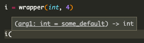

> This post assumes a general understanding of common Python structures, but most everything else will be explained.

I've always been fascinated by Python's `dataclasses` module. It provides a wrapper that dynamically adds methods to a class based on its type annotations. Coming from the Typescript world (where type annotations are compiled away), being able to make runtime changes based on type information was intriguing.

After reading through [the surprisingly-approachable implementation](https://github.com/python/cpython/blob/acac6c71ff370413374c6aca1df808c426e8a30c/Lib/dataclasses.py), I thought it would be fun to write about the techniques it uses and walk through a simple implementation. Let's get to it!

## What We're Building

[Let's start with the ending](https://youtu.be/WKauiG9TRRs?t=7): what code should our code generate? While the actual `dataclass` implementation has a bunch of code that handles inheritance and obscure methods, our toy implementation can be much simpler. All we want is an `__init__` function that takes, as arguments, each of the properties we want to store.

So if we write:

```py
@custom_dataclass
class Pet:
    name: str
    age: int
    sound: str = 'woof'
```

it should generate the following:

```py
class Pet:
    def __init__(self, name: str, age: int, sound: str = "woof"):
        self.name = name
        self.age = age
        self.sound = sound
```

It may not look like much, but the techniques used to generate that `__init__` method also power the rest of the `dataclass` methods. Keep that `Pet` in mind - it'll be our example throughout this post.

## How We Build It

Getting from point A to B above takes a few, generally unrelated Python techniques, so they'll each get their own sections. After that, we'll put them all together and, voila!

### Starting With a Test

Knowing exactly how our code should behave is an important step to actually writing it. Our code should do 3 main things:

1. Create an `__init__` function on a decorated class (with the correct type hints)
2. Add properties to that class during `__init__`
3. Handle defaults correctly (optional, but allowed)

Here's a simple test that covers those three areas:

```py
from typing import get_type_hints
from unittest import TestCase, main

from custom_dataclass import custom_dataclass


class TestCustomDataclass(TestCase):
    def test_functionality(self):
        @custom_dataclass
        class Pet:
            name: str
            age: int
            sound: str = "woof"

        # check that the __init__ function was
        # created and has the right types
        self.assertTrue(hasattr(Pet, "__init__"))
        self.assertEqual(
            get_type_hints(Pet.__init__),
            {"age": int, "name": str, "sound": str},
        )

        # check that properties were assigned
        # and that the default works
        fido = Pet("fido", 3)
        self.assertEqual(fido.name, "fido")
        self.assertEqual(fido.age, 3)
        self.assertEqual(fido.sound, "woof")

        # check that the default can be overridden
        rover = Pet("rover", 5, "bark")
        self.assertEqual(rover.name, "rover")
        self.assertEqual(rover.age, 5)
        self.assertEqual(rover.sound, "bark")


if __name__ == "__main__":
    main()
```

Save that test in a `tests.py` file. Next to it, create an empty `custom_dataclass.py`. Unsurprisingly, `python tests.py` blows up spectacularly; we haven't written anything yet. Let's fix that!

Our "main" function will be `custom_dataclass`, which takes a `class` object doesn't something to it, and returns it:

```py
def custom_dataclass(cls):
    # ???
    return cls
```

Replacing that `???` takes a few steps, starting with...

### Type Introspection

The first thing we need to do is read the properties defined on the class. In the `Pet` example above, this is `name`, `age`, and `sound`. Each has a type and one of them has a default.

At runtime, type information lives on the `.__annotations__` attribute. It's a dict mapping the variable name to the type. Values will either be `type` objects (like `<class 'int'>`) or values from the `typing` package (such as `typing.List[int]`). By iterating over that `dict`, we can build a list of fields that our dataclass will have. Let's store that field definition in a simple class:

```py
class Field:
    def __init__(self, name: str, type_: type) -> None:
        self.name = name
        self.type_ = type_
```

> Python style tip: if you want to call a variable the same name as a [reserved word](https://realpython.com/lessons/reserved-keywords/), the [official style guide](https://www.python.org/dev/peps/pep-0008/#function-and-method-arguments) recommends adding a trailing underscore to the name. That's why `type_` is named as such above. As with any good [guideline](https://www.youtube.com/watch?v=jl0hMfqNQ-g), exceptions are made for common alternatives (such as `cls` below).

We can wrap our field-building logic in a simple function:

```py
def get_fields(cls):
    annotations = getattr(cls, "__annotations__", {})

    fields = []
    for name, type_ in annotations.items():
        fields.append(Field(name, type_))

    return fields
```

This is a good start, but it's missing one of our promised features: defaults. When a class annotation is assigned a value, it's accessible on the class itself. So, we can look at the class itself to see if the field should have a default:

```py
default = getattr(cls, name, None)
```

This works in theory, but there's a bug: how do we differentiate between a value defaulting to `None` and a value without a default?

Situations like this are exactly what [sentinel objects](https://python-patterns.guide/python/sentinel-object/#sentinel-objects) are for! Because Python can create globally unique objects, we can always determine if we're seeing a pre-defined object. Here's the updated code:

```py{1,6,8-10,15-16}
MISSING = object()

class Field:
    def __init__(self, name: str, type_: type, default) -> None:
        ...
        self.default = default

    @property
    def has_default(self) -> bool:
        return self.default is not MISSING

def get_fields(cis):
    ...
    for name, type_ in annotations.items():
        default = getattr(cls, name, MISSING)
        fields.append(Field(name, type_, default))
    ...
```

One last thing! These default values will eventually be plugged into a function. As such, we don't want to allow users to pass in mutable defaults (because they get reused across calls). Our `get_fields` is the perfect place for that check:

```py{5-8}
def get_fields(cis):
    ...
    for name, type_ in annotations.items():
        default = getattr(cls, name, MISSING)
        if isinstance(default, (list, dict, set)):
            raise ValueError(
                f"Don't use mutable type {type(default)} as a default for field {name}"
            )
        ...
    ...
```

Now we've got an ordered array of `Field` objects, which hold all the details we'll need to build the text of the `__init__` function. Let's add a call in our main function and move on:

```py{3}
def custom_dataclass(cls):
    ...
    fields = get_fields(cls)
    ...
```

### Writing a Dynamic Function

In this section, we need to build a string that's a valid python function declaration. It should be called `__init__` and should list all of our fields as arguments. Let's start with the easiest part

```py
init_fn = 'def __init__(self, ???)'
```

We also basically know what should replace the `???`. For each field, we need:

- the name
- the type annotation
- a default, if it exists

By adding a method to our `Field` class, this can be done fairly cleanly:

```py{3-5}
class Field:
    ...
    @property
    def init_arg(self) -> str:
        return f'{self.name}: {self.type}{f"={self.default}" if self.has_default else ""}'
```

It looks like it _should_ work, doesn't it? Unfortunately the stringification of objects isn't necessarily valid Python:

```py
print(f'name: {str} = {"cool"}') # "name: <class 'str'> = cool"
```

`<class` isn't how we declare classes and our `cool` lost its quotes; not cool at all.

Because we can reliably stringify variable names, we should use variables in place of any Python objects. Then we can build an outer function that we'll call with the actual Python values. The wrapper returns a valid `__init__` function string.

To ensure we have consistent variable names, we should add some helpers to our `Field` class. We can then tweak our our `init_arg` function to call them and we're good to go!

```py{5,7-9,11-13}
class Field:
    ...
    @property
    def init_arg(self) -> str:
        return f'{self.name}: {self.type_name}{f"={self.default_name}" if self.has_default else ""}'

    @property
    def default_name(self) -> str:
        return f"_dflt_{self.name}"

    @property
    def type_name(self) -> str:
        return f"_type_{self.name}"
```

This gives us a bulletproof function declaration:

```py
def custom_dataclass(cls):
    fields = get_fields(cls)

    init_fn_def = f"def __init__(self, {', '.join(f. init_arg for f in fields)}):"
    # "def __init__(self, name: _type_name, age: _type_age, sound: _type_sound = _dflt_sound):"
```

The last thing in this section is the body of the function. For each property, we need to assign it to `self`. Let's add one more helper method:

```py{3-5, 9}
class Field:
    ...
    @property
    def assginment(self) -> str:
        return f"self.{self.name} = {self.name}"

def custom_dataclass(cls):
    ...
    assignments = "\n".join([f" {f.assginment}" for f in fields]) or ' pass'
```

Note the leading space in `" {f.assginment}"`. Because we're now inside a function, we have to indent our code. We also handle the case where there are no properties at all by adding `pass` to the body. If we print our `init_fn` and `assignments`, we get:

```py
def __init__(self, name: _type_name, age: _type_age, sound: _type_sound = _dflt_sound):
    self.name = name
    self.age = age
    self.sound = sound
```

Looks perfect! Now we have to actually fill it with values. If we wanted to write a function to return a function by hand, it would look something like:

```py
def wrapper(some_type, some_default):
    def inner_func(arg1: some_type = some_default):
        return arg1
    return inner_func

init_fn = wrapper(int, 4)
```

Type hints in the editor confirm the function works as expected:



We want to use that same logic to write a `wrapper` function for our dataclass. Its args should be all the defaults and types that `__init__` expects. Let's work backwards for a sec.

When we call this `wrapper`, we'll need to use the actual values (`int`, `3`, etc). Those currently live in our `fields` list, but there's a better way to store them. Since the types will be eventually referenced by their `type_name`, we can store them that way in a `dict`:

```py{3-7}
def custom_dataclass(cls):
    ...
    locals_ = {}
    for field in fields:
        locals_[field.type_name] = field.type_
        if field.has_default:
            locals_[field.default_name] = field.default
    ...
```

Now we have al our types an defaults in one place. Even better, they're stored under the keys that `__init__` already knows to use. It looks like this:

```py
{
    '_type_name': <class 'str'>,
    '_type_age': <class 'int'>,
    '_type_sound': <class 'str'>,
    '_dflt_sound': 'woof'
}
```

All that remains is to generate the wrapper string that returns the `__init__` string we made before:

```py{3-8}
def custom_dataclass(cls):
    ...
    wrapper_fn = "\n".join([
        f"def wrapper({', '.join(locals_.keys())}):",
        f" def __init__(self, {', '.join(init_args)}):",
        "\n".join([f"  {f.assginment}" for f in fields]) or "  pass",
        " return __init__",
    ])
    ...
```

which produces:

```py
def wrapper(_type_name, _type_age, _type_sound, _dflt_sound):
 def __init__(self, name: _type_name, age: _type_age, sound: _type_sound=_dflt_sound):
  self.name = name
  self.age = age
  self.sound = sound
 return __init__
```

Note the specific leading spaces as we get further into the functions: `def wrapper` has none, `def __init__` has one and `{f.assignment` has two. It's up to us to tell Python how these functions are nested.

Next, we want to actually run that string as Python code.

### Executing a Dynamic Function

The notion of telling Python to execute a string might seem a little odd. But, that actually what Python _always_ does. `python my_file.py` basically says "get a string from that file and run it". We're doing that same thing, but we built our string from scratch instead of writing it in a file.

Ultimately, we want to be able to write the line `init_fn = wrapper(...)` in our `custom_dataclass` function. To do that, we have to turn our string into an actual callable function. We're most of the way there: it's already got the `def` keyword that tells Python it should define a function. How do we bridge the gap between a string an our actual Python code? The `exec` function to the rescue!

Just like its name suggests, the function `exec`utes code. There's a slight hitch though - [the docs](https://docs.python.org/3.9/library/functions.html#exec) indicate that `exec` returns `None`. Where does our function go when it's evaluated?

It goes the same place that any Python declarations go: into the `✨namespace✨`. Whenever a piece of Python code runs, it maintains a `dict` of all the variables that have been declared. Each function (including the root `__main__`) maintains its own list. That why you can repeat variable names in separate functions without them overwriting each other. In addition to a string, the `exec` function can take a `dict` that it'll use as a namespace (and modify as needed):

```py{3-5}
def custom_dataclass(cls):
    ...
    namespace = {}
    exec(wrapper_fn, None, namespace)
    print(namespace) # {'wrapper': <function wrapper at 0x10673dee0>}
```

That `0x...` is a memory address, where Python has stored our newly created function. Now all that's left is to call it:

```py{5}
def custom_dataclass(cls):
    ...
    namespace = {}
    exec(wrapper_fn, None, namespace)
    init_fn = namespace['wrapper']()
    # TypeError: wrapper() missing 4 required positional arguments:
    #   '_type_name', '_type_age', '_type_sound', and '_dflt_sound'
```

Despite being an error, that exactly what we want to see! We're (correctly) being told that we haven't provided the args our function expects. Luckily, we've already got the arguments in `locals_`. Because Python lets us use a dictionary for function args [^1] , we can call `wrapper` with our `locals_` dictionary:

```py{3}
def custom_dataclass(cls):
    ...
    init_fn = namespace["wrapper"](**locals_)
    # <function wrapper.<locals>.__init__ at 0x1035f0f70>
```

### Setting an Attribute

The final step is also the easiest. Now that we've got a live function, we addd it to the class and return the whole thing. Our entire function (after a little re-organizing) is as follows:

```py{26}
def custom_dataclass(cls):
    fields = get_fields(cls)
    locals_ = {}
    init_args = []

    for field in fields:
        locals_[field.type_name] = field.type_

        init_args.append(field.init_arg)
        if field.has_default:
            locals_[field.default_name] = field.default

    wrapper_fn = "\n".join(
        [
            f"def wrapper({', '.join(locals_.keys())}):",
            f" def __init__(self, {', '.join(init_args)}):",
            "\n".join([f"  {f.assginment}" for f in fields]) or "  pass",
            " return __init__",
        ]
    )

    namespace = {}

    exec(wrapper_fn, None, namespace)
    init_fn = namespace["wrapper"](**locals_)
    setattr(cls, "__init__", init_fn)

    return cls
```

## Tada!

We've got basic functionality working and our test should now pass, so I think this is a good place to stop. The actual implementation does a lot more work, but is also much more complex, internally. We didn't have worry about inheritance, for instance. If you're curious to learn more, I've linked a bunch of great resources below. Thanks for reading!

## Further Resources

- [The complete code](https://github.com/xavdid/custom_dataclass) from this post, including a more extensive test suite.
- [the Python docs](https://docs.python.org/3.9/library/dataclasses.html#dataclasses.dataclass) for the package, which cover some neat features we didn't touch on here
- [The original PEP](https://www.python.org/dev/peps/pep-0557/) that proposed dataclasses. It explains a lot of the rationale behind them. It's a very approachable read.
- [The actual implementation](https://github.com/python/cpython/blob/acac6c71ff370413374c6aca1df808c426e8a30c/Lib/dataclasses.py), which handles many more edge cases and adds more functions. In particular, you should recognize parts of the `_process_class` function and `_get_field`.
- [This video](https://www.youtube.com/watch?v=T-TwcmT6Rcw) from the author of the `dataclass` package, who talks a lot about the rationale and implementation.

[^1]: Arguments _can_ be specified as positional-only, but this works for everything else.
