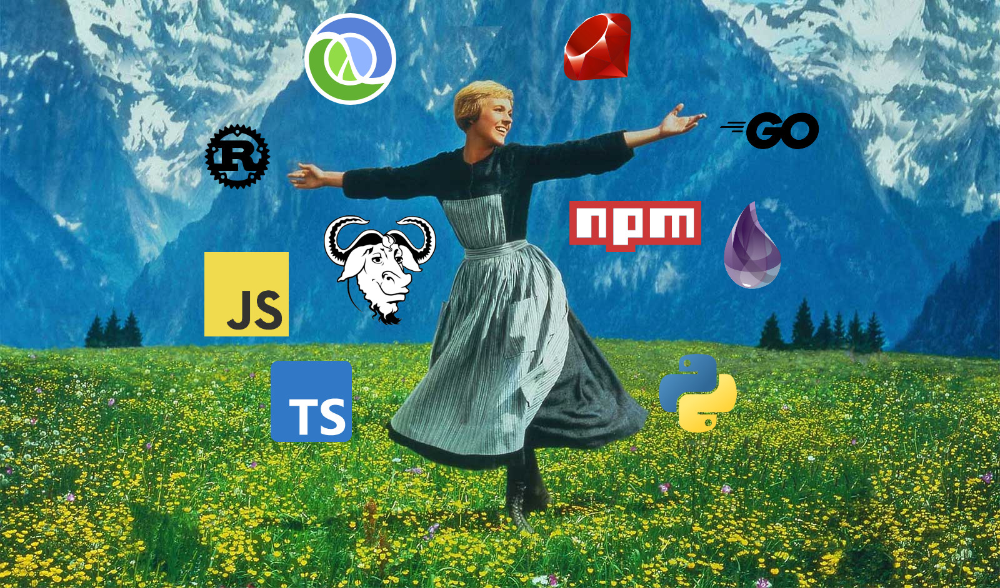

The secret to producing working code quickly is failing fast. That means running a suite of useful tests as often as you can. The faster you can complete the "tweak code -> run tests" loop, the more you're going to get done. If you're only working in one language, you develop a lot of muscle memory for running that language's tests. But if you switch between many languages, you might struggle with remembering the right command while you're in the zone. Sure, if you've just run your tests, you can press `up + enter`, but woe be unto you if you've done anything else in that shell and forgotten about it.[^1]

It's not as if retyping test commands for different languages is a make-or-break burden, but it adds up. I took inspiration from formatters like [Prettier](https://prettier.io/) which streamline the code writing process. Every detail I don't have to think about while coding frees up brain space for more important things. That's what my new project, the Universal Test Runner, is for: reducing toil in the write-test-repeat loop.

## How It Started

My first approach to a universal test runner was [a little bash function](https://github.com/xavdid/dotfiles/blob/6bd5f56b1f9ad2dcef9f8b72413d30779b378aef/node/aliases.zsh#L45-L73) I wrote years ago. It tries to run the correct test command based on the files in my current directory:

```shell
function t() {
  if [ -f spec/test.rb ];then
    ruby spec/test.rb "$@"
  elif [ -f package.json ];then
    if [ -f package-lock.json ];then
      npm run test "$@"
    else
      yarn test "$@"
    fi
  # see https://stackoverflow.com/a/41508466/1825390
  elif [[ -n *_test.go(#qN) ]];then
    go test "$@"
  else
    echo "Can't guess testing method, do it yourself"
  fi
}
```

This worked well for the first few languages I added, but (like [most bash code](https://mastodon.social/@xavdid/110609096501695453)) it eventually became unwieldy. Bash's `if` statements are quirky, and I had to look up how to add a new branch every time. `if` statements are supposed to be easy. I couldn't keep living like this.

This issue came to a head when I started [Exercism](https://exercism.org)'s [12 in 23 challenge](https://exercism.org/challenges/12in23), where I'd kick the tires on a new language each month for a year. Each language brought a new test command (and one I had no muscle memory for). I loved the idea of an extremely simple way to run a test suite, but if I was going to add 13 more languages, I needed to graduate from this big, ugly, and expanding function.

## How It's Going

Enter: the [Universal Test Runner](https://github.com/xavdid/universal-test-runner). Press `t` and your tests will be run in any project. See it in action in the [demo repo](https://github.com/xavdid/test-runner-demo/):


I had a few design goals when I was putting the Universal Test Runner together:

1. Speed: `t` has to be fast. Enabling a lighting-fast feedback loop is paramount, so this tool should minimize costly operations. The list of local files is only read once and any files read (or parsed from JSON) are cached. In the simplest cases, a test method can be chosen after a single `ls` call without any further file I/O, which feels very snappy.
2. Permeability: `t` should pass all flags through to the underlying test command. Because there's no way to know every flag you might supply to a test command, `t` can't keep any flags for itself.
3. Simplicity: `t` should Just Work. Though it's tempting to add lots of configuration, I wanted to focus on the simplicity of the experience: press `t`, run tests, end of story. Instead of adding any flags to `t`, I ended up shipping an entirely separate program to provide version and [debugging information](https://github.com/xavdid/universal-test-runner#debugging) about `t`.

It took a bit of iteration, but I landed on an architecture I'm really happy with. Adding new languages is a breeze now and I've actually got some test coverage.

```py
pytest = Matcher.basic_builder("pytest", ".pytest_cache", "pytest")
npm = Matcher.js_builder("npm", "package-lock.json")
yarn = Matcher.js_builder("yarn", "yarn.lock")
rust = Matcher.basic_builder("rust", "Cargo.toml", "cargo test")

ALL_MATCHERS = [
    pytest,
    npm,
    yarn,
    rust,
    ...
]

def find_test_command(context):
    for i, matcher in enumerate(ALL_MATCHERS):
        if matcher.matches(context):
            return [*matcher.command, *context.args]

    context.debug("no matching test handler)
    return []
```

Best of all, while writing the Universal Test Runner, I could iterate quickly on the project itself because the test runner could run its own tests pretty early in the process.

## A Wider Audience

When I thought the project was ready for actual users, I [posted to the Exercism forum](https://forum.exercism.org/t/introducing-the-universal-test-runner/6228). Reception was warm and Exercism's CEO Jeremy Walker offered to host the codebase in their GitHub org for increased exposure. I loved the idea of my design being available to many more users, so I agreed to reimplement my core functionality as a new `test` command in Exercim's Go CLI. It would compliment my standalone project and we could cater the Go version to Exercism's specific needs.

Although the new `test` command needed to support 65+ languages, the Exercism version was smaller in scope than the test runner itself; each language had a single specific way to run its tests. Each language could hardcode its test command instead of guessing the right approach like I did before.

```go
var TestConfigurations = map[string]TestConfiguration{
  "python": {
    Command: "python3 -m pytest -o markers=task {{test_files}}",
  },
  "javascript": {
    Command: "npm run test",
  },
  "typescript": {
    Command: "yarn test",
  },
  "rust": {
    Command: "cargo test --",
  },
  // ...
}

func runTest(args []string) error {
  track, err := getTrack()
  if err != nil {
    return err
  }

  testConf, ok := TestConfigurations[track]

  if !ok {
    return fmt.Errorf("track \"%s\" not yet supported", track)
  }

  cmdParts := strings.Split(testConf.command, " ")

  // pass args/flags to this command down to the test handler
  if len(args) > 0 {
    cmdParts = append(cmdParts, args...)
  }

  fmt.Printf("Running tests via `%s`\n\n", strings.Join(cmdParts, " "))
  exerciseTestCmd := exec.Command(cmdParts[0], cmdParts[1:]...)
  // ...
}
```

After a month of work, my [PR was merged](https://github.com/exercism/cli/pull/1092) and version `3.2.0` of the Exercism CLI was released!

The last step was updating the Universal Test Runner itself to call `exercism test` when run from an Exercism exercise directory, which ended up being [a 2-line change](https://github.com/xavdid/universal-test-runner/pull/5/files#diff-ede1d44e4f5a1e5629d0033799060d1394c9450c5e38b37ef17ad460aeed2979).

## Running It for Yourself

This project also gave me an excuse to learn how to write [my own Homebrew tap](https://github.com/xavdid/homebrew-projects/blob/main/Formula/universal-test-runner.rb), making it easier than ever for users to install my work:

```shell
brew install xavdid/projects/universal-test-runner
```

As a Python package, the Universal Test Runner is also available via [pipx](https://pypa.github.io/pipx/):

```shell
pipx install universal-test-runner
```

## What's Next

At this point, I consider the Universal Test Runner to be feature complete. The core functionality works great and it has the software architecture and user experience that I want. It's also got a manual escape hatch - you can always use a [justfile](https://github.com/casey/just) to forego any matching and specify your chosen test command manually.

The biggest area of ongoing improvement will be expanding the [supported languages](https://github.com/xavdid/universal-test-runner#supported-languages). I started with the languages I use the most, but my eventual goal is that the runner supports every language under the sun. If I'm missing your favorite tooling, feel free to [open an issue](https://github.com/xavdid/universal-test-runner/issues) or submit a PR.

Happy testing!

[^1]: I've got an alias to `git add .` and `git commit -m "some message"` all in one go, so I've made rogue commits while trying to run tests more than a couple of times.
