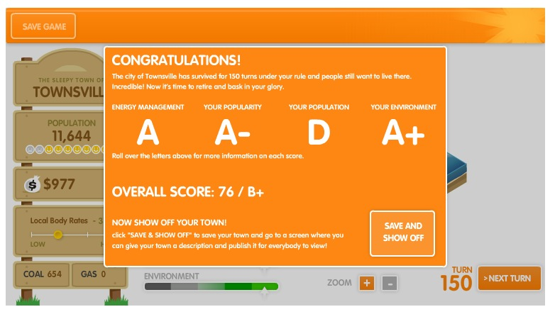

People play many sorts of games for many sorts of reasons, but they all share one very important quality: games are pretending to be something else. It doesn't matter if you play _Call of Duty_ or [_The Bible Game_](http://en.wikipedia.org/wiki/The_Bible_Game), the point of the software is to manipulate people or events that aren't real. (p. 427) There are a lot of design choices associated with the creation of games, particularly those that simulate something else explicitly.[^1] Sometimes this goes smoothly and creates a good playing experience. Other times (like in the case of _ElectroCity_), it goes rather less well.

As with many sim games before it, [_ElectroCity_](http://www.electrocity.co.nz/) instructs the player to manage the development of a small town into (ideally, I think) a bigger one. The game's main mechanic revolves around the cost/benefit of developing plots of land in a certain fashion and making sure you're producing more energy than you consume. For example, you can build a coal mine (cheap, effective, pollutive), but it intrudes on the tranquility of the campground that you built next door. You decide which bothers you more, then continue expansion accordingly. In chapter 27 of Salen/Zimmerman's _Rules of Play_, they describe in depth the markings of a good simulation game and the associated pitfalls.

Games are meant to be an abstraction, so the more complicated the game's systems are, the slower the game is to play. [^2] (p. 440) The game does a good job of saying "Ok, click here and in X turns, you'll have a new structure". It's also very clear what stats each structure affects (coal mines are +2 coal but -1 tourism/turn). There's also a goods market that has changing prices for coal and gas each turn (allowing you to profit off of smart purchases).

The game's primary conflict is an economic (and therefore optimization) one. You want to get the most people/money with the least economic impact, so the player has choices to make. Unfortunately, the UI feels very cramped and unintuitive, which makes playing it unnecessarily hard. [^3] Furthermore, though each structure has pros and cons, they're not quantitative. So, I'm not sure if my "a little expensive, but low output" wind farm is effective enough to rationalize the lowered over a "very pricey, but has TONS of energy" nuclear plant. Also, in the case of the nuclear plant, it said there was fallout and that townsfolk would be unhappy about this, but didn't indicate a way to appease them (besides, I guess, finding alternative energy sources).

Overall the game abstracts some of the details well and _does_ force the player into (what seem to be) realistic energy development choices. It was clearly designed with good intentions, but some of the execution falls flat (particularly in the clear numbers and UI). I'm not generally a fan of sim games, but if you are… well, you could do better than _ElectroCity_. Check out [Reus](http://store.steampowered.com/app/222730/) instead, if that's your thing.

[^1]: That is, simulation games. _CoD_ doesn't say "hey, you're going to give instructions to this soldier so he can optimize his life duration on this battlefield", it says "you are this guy, shoot them without getting shot". This is contrasted with games like _The Sims_ where you create fake people that simulate real lives.
[^2]: In some cases, this is the desired effect. Too much slowness and the game becomes very tedious to play. Luckily, _ElectroCity_ doesn't make you manage the overtime salary for the construction workers while they're building, which would be way too much micro management.
[^3]: The game generates in a small window and it takes 2 or 3 clicks to see the stats that a structure gives. Additionally, there doesn't seem to be place where you could see your net tourism and resources per turn. In my experience, I noticed that I wasn't making as much money per turn anymore because (apparently) some of my new buildings had upkeep costs.
