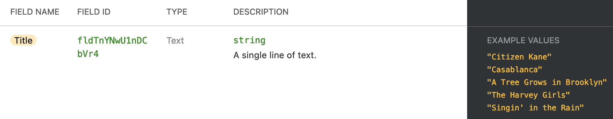
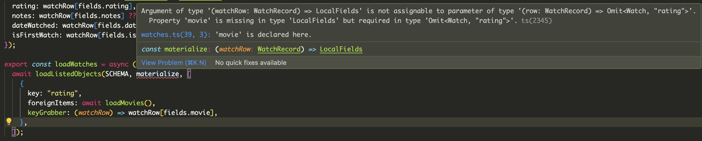
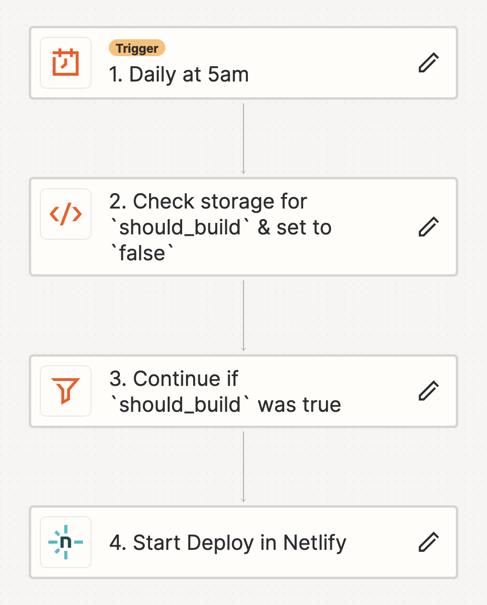

Since 2017, I've used [Airtable](https://airtable.com/) to write micro reviews of media I've read, watched, and played. It's also a useful way to track on what platform(s) I own a game (which can [get confusing](/blog/post/gaming-on-a-budget/) as the collection grows). This effort culminates in my [yearly media review](/blog/tags/yearly-review), where I publicly showcase my favorites from those lists.

My broad experience means friends often come to me for further recommendations. I've always been able to link to all my reviews in Airtable, but its shared views are far from perfect.[^1] There wasn't going to be a perfect solution until I built one myself... so I did. Introducing:

<h3 style="text-align: center; padding-bottom: 1rem; padding-top: 0;">
	<b>
    	<Link href="https://david.reviews/">david.reviews</Link>
	</b>
</h3>

This project began, as many do, with a domain name that was too good to pass up. It was my [second static site project](https://xavd.id/blog/post/building-aoc-showcase/) in as many months and, like before, I wanted to talk through the process and tooling.

## Make it Work

While most apps store data in a database, everything I've written lives in Airtable. Well good news, Airtable _is_ a database (albeit a non-traditional one). Much like an SQL database, all my data is organized into tables and columns, making it a good fit for application development. Unlike a SQL database, all your queries have to go through Airtable's [web API](https://airtable.com/developers/web/api/introduction), the output of which lacks the type and column guarantees you'd get for free with an [ORM](https://en.wikipedia.org/wiki/Object%E2%80%93relational_mapping) in other setups. So naturally, I wrote a Typescript ORM for Airtable.

My main goal was to have strongly typed data I could use throughout the project. I'd need code to load Airtable columns and other code to translate that into a usable TS representation. I'd also be re-writing this code across 8 tables, so being able to quickly add new configurations was important. I'm pleased with how it turned out; let's walk through the implementation of the `watches` and `movies` tables.

First, we have the type that represents a table:

```ts
type AirtableBase = {
  baseId: `app${string}`;
  tableName: string;
  viewId: `viw${string}`;
  fields: Record<string, `fld${string}`>;
};
```

I'm taking advantage of [template literal types](https://www.typescriptlang.org/docs/handbook/2/template-literal-types.html) to require that the Airtable IDs I'm pasting in have the right format; this is useful for catching errors before runtime.

The interactive API docs make the field ids easy to find:



Which lets me actually define the table:

```ts
const SCHEMA = {
  baseId: "appctKQDyHbyqNJOY",
  viewId: "viwEn5Vs4zVmEHvSH",
  tableName: "Movies",
  fields: {
    title: "fldTnYNwU1nDCbVr4",
    tmdbId: "fld08lT0KsDWPAusk",
    posterPath: "fldRZ4cnbzJNVVoHq",
    yearReleased: "fldjlzKYb5BNa56LN",
    numWatches: "fldjw4L2x9amvkPoC",
    averageScore: "fldEFOtQZiXwUxDRf",
    collections: "fldQHNpHO95v5XR2d",
  },
} as const satisfies AirtableBase;
```

This makes use of the `satisfies` operator ([docs](https://www.typescriptlang.org/docs/handbook/release-notes/typescript-4-9.html#the-satisfies-operator)). It allows me to ensure `SCHEMA` is assignable to `AirtableBase` without losing the exact key and value information I get from a constant object; see [this playground](https://www.typescriptlang.org/play?#code/C4TwDgpgBAgglgJ2AQwEYBsICFkGdoC8UA3gFBRSp4QCSAJgFxQAGyYYAJMbsAnAHYBzAL7MA3OSgoMEAHLIAthCY8+QiRQBucCAHd6TZtt1dVAkeMkAzHejq4mAJQgBjAPYI6AHjNCANCxWdqa85qIAfBLCEqQA9LFQABYQCBAButB0EDb80MDJUuCZAK5qglBZLujICMjAcG78AajFwFAZlOhuulDIusggUAJ0cNp0xcjoUADWEIMCVm5QVghuClIFzM7unsyk7vw8UPxu2x50NPyLOPhM8EhomDeEJJJU+AZQAORsYACMACYAMxfPySaSYeRKJhfXSJOoQTQpUGSbR6T5fYwAFgArAA2FEUGwQOwOV4UCjIGFBOgAdgAHABOL6SCjxDZwXBQHapFzAdCDKzIODoLmaSZwOh1Br8VmUGEARwyCBZFGEpHVcQSAAFgLgALQQAAekD5hoQqwQUH1lFaAWYLmYQ1w-C+bWQUHF6Ely1sdAAhKQTmdPJdrtQAHTE0kRlykLVDQ7ACDIOjpaAuZD8KDFfAsXDS3DE3BO4BLeFIqBuUrc5CzXr8OhQFNtOBtMtufaNI6885htzPKBEMgUd60RjfX6AkFgigQuSKZTfOEIpEq2eenT6CeYuC6XEEjfR+xMEcUqnfGkM5ly9n5Tncjy8-mC4Wiz0SqX1Rpy1CK5WqlA6rCFABb1EWOhcvc87PPGd6JA+PKuC+zYWh4uABLgAguNADpOpyrptFkOQQAGpC9qGVwDpGx64LGQA) to see why that's cool.

That schema definition in hand, we can write a generic data loader:

```ts
const loadRecords = async <T>({
  baseId,
  tableName,
  fields,
  viewId,
}: AirtableBase): Promise<Array<{ recordId: string } & T>> => {
  const rawRecords = await client
    .base(baseId)
    .table(tableName)
    .select({
      view: viewId,
      fields: [...Object.values(fields)],
      returnFieldsByFieldId: true,
    })
    .all();

  return rawRecords.map((record) => ({
    recordId: record.id,
    ...record.fields,
  })) as Array<{ recordId: string } & T>;
};
```

Which returns an object with the exact set of field ids that I specified, hoisted to the top-level:

```json
{
  "recordId": "recRDBRObFgTrO8tP",
  "fldTnYNwU1nDCbVr4": "Clue",
  "fld08lT0KsDWPAusk": "15196",
  "fldRZ4cnbzJNVVoHq": "/aRxbYOYHS8T73nzR8hsLousoplR.jpg",
  "fldjlzKYb5BNa56LN": 1985,
  "fldjw4L2x9amvkPoC": 6,
  "fldEFOtQZiXwUxDRf": 4,
  "fldQHNpHO95v5XR2d": ["🎃 Halloween"]
}
```

That response isn't especially useful on its own, but it's not hard to define a `MovieRecords` type for it. We'll need to map the type of each column to its respective TS type, which we do like so:

```ts
const fields = SCHEMA.fields;

type FieldIds = (typeof fields)[keyof typeof fields];
//   ^? "fldTnYNwU1nDCbVr4" | "fldjw4L2x9amvkPoC" | "fld08lT0KsDWPAusk" | ...

type NonStringFields = {
  [fields.yearReleased]: number;
  [fields.numWatches]: number;
  [fields.averageScore]: number;
  [fields.collections]?: string[];
};

type StringFields = {
  [fieldId in Exclude<FieldIds, keyof NonStringFields>]: string;
};

type MovieRecord = StringFields & NonStringFields;
```

The big trick here is turning `fields` into a union of [string literal types](https://www.typescriptlang.org/docs/handbook/2/everyday-types.html#literal-types). This bridges the gap between runtime and the type system - the only valid field ids are the ones we're actually fetching from Airtable (and they're kept in sync automatically). The result is a very accurate description of the JSON we got back from Airtable:

```ts
const records = await loadRecords<MovieRecord>(schema);
//	^? {
//  	fldTnYNwU1nDCbVr4: string; // title
//  	fld08lT0KsDWPAusk: string; // tmdbId
//  	fldRZ4cnbzJNVVoHq: string; // posterPath
//  	fldjlzKYb5BNa56LN: number; // yearReleased
//  	fldjw4L2x9amvkPoC: number; // numWatches
//  	fldEFOtQZiXwUxDRf: number; // averageScore
//  	fldQHNpHO95v5XR2d?: string[]; // collections
//	};
```

The last setup step is to create a more ergonomic `Movie` type to actually use in pages, plus a way to convert from `MovieRecord` to a `Movie`:

```ts
type Movie = {
  title: string;
  tmdbId: string;
  posterUrl: string;
  yearReleased: number;
  numWatches: number;
  averageScore: number;
  collections?: Array<{
    fullName: string;
    emoji: string;
  }>;
};

const materialize = (movieRow: MovieRecord): Movie => {
  const item: Movie = {
    title: movieRow[fields.title],
    tmdbId: movieRow[fields.tmdbId],
    posterUrl: `https://image.tmdb.org/t/p/w300${movieRow[fields.posterPath]}`,
    yearReleased: movieRow[fields.yearReleased],
    numWatches: movieRow[fields.numWatches],
    averageScore: movieRow[fields.averageScore],
    collections: movieRow[fields.collections]?.map((c) => ({
      fullName: c,
      emoji: c.split(" ")[0],
    })),
  };

  return item;
};
```

We're mostly just copying fields, but TS ensures the types line up; if we set `yearReleased` to `movieRow[fields.title]`, we'd (correctly) get an error.

Now that we have typed everything from Airtable to application code, we can write a generic `loadAllObjects` function:

```ts
const loadObjectsInMap = async <RecordType, MaterializedType>(
  schema: AirtableBase,
  materializer: (row: RecordType) => MaterializedType
): Promise<Record<string, MaterializedType>> => {
  const records = await loadRecords(schema);
  return Object.fromEntries(
    records.map((record) => [record.recordId, materializer(record)])
  );
};
```

It loads all records, materializes them, and returns a map of the Airtable record id to the object:

```ts
{
  recRDBRObFgTrO8tP: {
	title: "Clue",
	tmdbId: "15196",
	posterPath: "/aRxbYOYHS8T73nzR8hsLousoplR.jpg",
	yearReleased: 1985,
	numWatches: 6,
	averageScore: 4,
	collections: ["🎃 Halloween"]
  }
  // ...
}
```

This leaves us with a very clean calling interface:

```ts
const loadMovies = async () =>
  await loadObjectsInMap<MovieRecord, Movie>(SCHEMA, materialize);
```

Being able to find a materialized object by its record id is vital because of this next part, which is what really sent me down the rabbit hole:

### Resolving Foreign Keys

Each `Watch` record has a pointer to the record of its corresponding movie. So, to get a fully materialized `Watch`, we need to be able to find its `Movie`. This requires some new type code to differentiate "local" fields from foreign key ids.

Most of the `Watch` code is analogous to `Movie`, but we define local and foreign keys separately:

```ts
type LocalFields = {
  rating: number;
  notes: string;
  dateWatched: string;
  isFirstWatch: boolean;
};

type ForeignKeyFields = {
  movie: Movie;
};

type Watch = LocalFields & ForeignKeyFields;
```

Also, the `materialize` function only deals with local fields:

```ts
const materialize = (watchRow: WatchRecord): LocalFields => ({
  // ...
});
```

Actually resolving the foreign keys is the job of the second loader function. While the first handled loading records by id, this one represents a list of events (watches of movies). It takes an extra argument not found before, `foreignKeyRelationships`:

```ts
const loadListedObjects = async <
  RecordType,
  MaterializedType,
  ForeignKeys extends keyof MaterializedType
>(
  schema: AirtableBase,
  materializer: (row: RecordType) => Omit<MaterializedType, ForeignKeys>,
  foreignKeyRelationships: Array<{
    key: ForeignKeys;
    foreignItems: Record<string, MaterializedType[ForeignKeys]>;
    keyGrabber: (row: RecordType) => string[];
    condense?: boolean;
  }>
): Promise<MaterializedType[]> => {
  // ...
};
```

We're doing some fairly advanced generics here, but the juice is worth the squeeze. TS can validate, based on the return type of the materializer, which object keys are the foreign keys. Helpfully, it throws an error if you try to declare that foreign keys live in a local field:



You can play with this behavior in [the TypeScript playground](https://www.typescriptlang.org/play?#code/C4TwDgpgBAgglgJ2AQwEYBsICFkGdoC8UA3gFBRSp4QCSAJgFxQAGyYYAJMbsAnAHYBzAL7MA3OSgoMEAHLIAthCY8+QiRQBucCAHd6TZtt1dVAkeMkAzHejq4mAJQgBjAPYI6AHjNCANCxWdqa85qIAfBLCEqTu-DxQAMoAwgASAKIAsjBQRGQUVPgGUABEbGAuwADSAIoAIiCpqCAAjrIAUgDyAJolfpLaesUlxm6aAFoAHJkAjN1gjsCCYABiiX2S0pjySkwlAOrIwC4AFhC4GxQ2EHYOJJIUdEcQh8dnjKVBdCftulWajgAajNJm4AB4ATghwEuFCgcFwK0QPFepz2XzAiTBMAAChCFGBdAAGOoAdkBADZYRQEEdzOi7DMAExEhAAVxWgNSk1wCnQABYsNSoPw3MBzgy6KlkjjMo52ghOp04OMwS5kMKFGMdJKTjAWgArfg0ZBYRwQolghAzWHCfrCKB4KBxBK4Om4a64WCILbYagSF3AKDXW65JJpLIwAB0IfsMVAkCgSJudHoXqIAAoExA3FZg7Z7ABKADaAGsICBc1JwDm87HcABdCTZqCyNz8RKhITJ0N5STF+tR2nAcwNpj8NkKVAQBAaKADgu4KMIpEIFFHU5jqBEqAAHygMznC5TS61gy3xd8gib-cHovFjYA-Cou4Ios2a0lXz37GH8vPY3oeF+CgdI1XQNk6AgLwfzTAJy0rPM2w7b9F3CLcr3fUgW1RE5nHcTww07NRBB-L0ADJW3bYjzDI+NP0ybVCHuChgAUOhUGKTDNjgYBMBfEi5xACBkAQZxMGoD4JynGc52QTQZ2QQQIESAjlBFSdp1nSRpNwiUNJk7SKDANweBnABVBB0AE8wsOwz8ABk3HVdAyL-SRh3pAytLne99O4x5nj0j4AvhRFkWAXCmFQNw3Ak-gsJbFYPAgOBBH4KoKzcvsKDPHUoEYwYsIgMETKQatE1wsMnJctzKOShBUvSzKQDo0hYnbBIFGePhkHQOAAC9mIzXQNzwtxdCYXD8I8OhCyYGq+uy8IoAzf9PKEJhRreRwJuPW4hzpIQG36Cg-LubbTl23R9vsKNzobKBH0fUpYSecVgq2sbrtupd3peMaIDoE7JBXCKoqgS7xpuwcwbXSKxseghkYPe1CxiEqyqDQMoHQNxkDoByEXFOhOlQA1XGAdNHVwEB+BcKAvEkGbPAAFRrU6Cp6uA+sGoH2cgTmGqajKKy9ErxX4X8EKrTJud5oa6AFiB+nCDNJFwU4IG6ph4CQNBMBwfBOe68Vev6oaECYDMEAmpxXFm5XC1yFbOgUXivDls2eYt-mOaTFK0tFkBcHCTmrED5qK3EulOpOOAwDuGAEFpEAvH-CgEKYYWg5a3A5yuSPjXFBQ7hZ7wrwCL2Zx9vmlZrYsc6jkOG0iB4oAQgBxWlUC063bcmqBy6dl2oCvYsbzhZ12yg+IIGfShYviudhDD0h5qgHFbfd-BPfl3368gCeVoIFb-xxxqCPse2r+Viewwn9qKAv842XQIMiEv2bTzYDMbYdzwztT4sThDjXi2swymxrgrGc-8r7oyfnCCOCBVo4wznCBCnMp7IJFjQEuuAsEYIrN3NAWlCHPxnhAOehCHRVhwbnaONxY7xHjonZ26CKHxCDFYUsaYwxdx7lpOBs0EFTwoHAPMGYeFpijJgIQwATjsPblPAA9CoqAAABKmABaTGlNdEpw8FAbRUAaDOmQCBAQUEwRSHjl6XQvETjBiLh3MWyi4TgIUGWCsSMoBQPNnzcuaYpG8PsAEeh6U8HawIa4kAAQ4iz3wKIsRwh26pKno1YAbIECWJLivZ2Tpq4BMVnfG8HkIBZJyVARquA37ADsqQTGHhsadSDHjAmelqZ4DpgzDMG8t5uB3tBXCx8XaSGQKNXiuN8aE2JkDMmFNKi4AzCkDI2QAj+NrkNAIxZ24cNiXsc6wpC6NSDlE0uTBiAOidOXHwr4q5MTXmI2JJDe4zmtlDa6QCVqfL2oOPKEAQZTztJIBsCCgA). It's not perfect, but it's better than nothing!

After our types are in order, the [actual implementation](https://github.com/xavdid/david.reviews/blob/1fbfe06920258ab10fe145c64fe77bfb4eb144a6/src/airtable/data/common.ts#L143-L169) is pretty basic; we get the list of foreign key(s), look them up in the reference map, and return the whole thing. Our calling signature gives it everything we need:

```ts
const loadWatches = async (): Promise<Watch[]> =>
  await loadListedObjects(SCHEMA, materialize, [
    {
      // the key on the output `Watch` that has foreign objects(s)
      key: "movie",
      // our big lookup map
      foreignItems: await loadMovies(),
      // how we get the fkIds from the raw row.
      // Could just pass `fields.movie`, but this gives better validation
      keyGrabber: (watchRow) => watchRow[fields.movie],
    },
  ]);
```

I was incredibly proud when I got this far and everything basically worked! From there, it was just a few more features:

- I had to allow mapped objects to have their own foreign keys, so I got to do that big generic twice
- I had to ensure I had _all_ reference records loaded, even if I wasn't loading all listed records (else fk resolution would fail).
- A record could have multiple foreign key relationships (books can have a series _and_ author(s)), so I had to ensure multiple lookups worked

All those bridges were crossed and boom! I've got an Airtable ORM. If I do more projects on Airtable, it's not unlikely that I'll spin it out into its own package, but I can't imagine this is something that'll see widespread adoption. Nonetheless, I had a blast building it. It wasn't something I was even sure I could do when I started. Of course, the project was far from over.

## Make it Fast

Loading data was working great, but development speed began to crawl when I fetched the full table (instead of a single page). To speed that up, I wrote an extremely simple cache layer that stored post-materialization JSON for each table. This is also vital for the build process, since I don't want to re-fetch everything when doing individual pages after indexes.

Anyway, now that I could load nice data, I needed to actually show it to people. Because of the size of the larger pages (certainly not Big Data, but MBs of HTML), I wanted to pre-compute as much as possible, since everything was known at build time. If you think that sounds like a job for a static site builder, you'd be correct!

I turned once again to Astro, which I've quickly come to enjoy. I could load data into pages and generate HTML at build time. In fact only a single page on the site ships any JS at all (the search LINK TKTK page, because of its interactivity). This should make all the pages feel _quite_ snappy. If that's not the case, please [get in touch](/contact) - I've got a few more levers I can pull.[^2]

## Make it Pretty

[Last time we talked](/blog/post/building-aoc-showcase/#styles), I had passed on Tailwind in favor of a turn-key styling solution. But, I noted that:

> my UI was so simple that [Tailwind] felt like overkill. ... [I]t's something I'll keep in mind for future projects with more complex UI requirements.

and wouldn't you believe it, this is a project with a more complex UI! Literally all styles on this site are tailwind and I'm happy with the result. From my limited experimentation, it's great at making verbose things simple. The following CSS:

```css
a {
  color: blue;
}

a:hover {
  text-decoration-color: red;
}

@media (prefers-color-scheme: dark) {
  a {
    color: white;
  }

  a:hover {
    text-decoration-color: pink;
  }
}
```

can be written with just a couple of HTML classes (split here for clarity):

```
<a class="
  text-blue-500
  dark:text-white
  hover:decoration-red-500
  dark:hover:decoration-pink-500
">some link</a>
```

Not only are there fewer characters, I don't have to remember (or repeat) the `@media (prefers-color-scheme: dark)` directive. This goes doubly for having to decide on breakpoints and do the `min-width` dance (Tailwind just needs the `md:` or `lg:` prefix to show things on medium or large screens).

All that said, I'm a little concerned with the maintainability of it all. Besides the fact that it requires a build step (hurting long-term maintainability), reading long lists of strings is decidedly harder than syntax-highlighted and formatted CSS code. But, its ease of use allowed me to iterate quickly on this project, which rocked. The [docs](https://tailwindcss.com/docs/installation) and DX are pretty good (especially the autocomplete), so we'll see where it goes.

The other big part of making the site beautiful is the sharing image. My [sister](https://www.karenbrownman.com/) very patiently put together a custom social media header which you'll hopefully be seeing much more of soon!


## Set it Free

This site is deployed on [Netlify](https://www.netlify.com/), a perennial preference of mine. For most of the development process, I wasn't sure how long builds would take. As a result, I wasn't sure how often I should trigger a re-build of the site (to pick up the latest reviews).

I'm happy to report that based on the work above in [make it fast](#make-it-fast), a clean build on Netlify's runner takes ~ 60 seconds. With 300 free build minutes per month, I could comfortably just build daily. But, a lot of those builds wouldn't pick up any new data (unless I had finished something that day). In the interest of not wasting their resources, I wanted to only build when needed.

To do this, I set up a [zap](https://zapier.com/) that runs daily at 5am. It checks a boolean value in Storage by Zapier to see if it should build, sets it to `false`, and proceeds if it read `true` initially:



Here's the coolest part: you can read (and write!) Storage by Zapier data from anywhere, which makes it an extremely versatile tool for controlling zaps programmatically.

In each of my Airtable bases (games, movies, books), I added an automation with a "new record in view" trigger and the following script action:

```js
await fetch("https://store.zapier.com/api/records?secret=UUID-HERE", {
  method: "POST",
  body: JSON.stringify({
    should_build: true,
  }),
});
```

This way, each base will self-report if I've finished that media type. If any do, a build will kick off the next time the zap runs. Each day will build at-most-once, so watching 3 movies doesn't trigger 3 builds. This approach ensures I'll never run out of free minutes in a month.

## That's a Wrap

All told, this site came together in just over a month of dedicated evenings-and-weekends work. Most of that was spent on setting up the many versions of pages (all books, each book, each author and their books, etc) plus a few days of yak shaving for the ORM.

I've still got some plans for "someday" features, but for now I'm looking forward to this being a "set it and forget it" project. I'll be able to continue my existing automation-heavy Airtable workflows and the site will rebuild and redeploy in the background as needed. Plus, the lack of a server means I don't have to worry about security or regular updates- the perfect platform for something I don't want to babysit.

I think that's everything! I had a blast making this site and am looking forward to these micro-reviews finding a wider audience. Thanks for reading!

[^1]: For instance, filtering doesn't work on mobile
[^2]: Namely, not having the "all movies" view be the default. Start with the most recent N and load more on request
