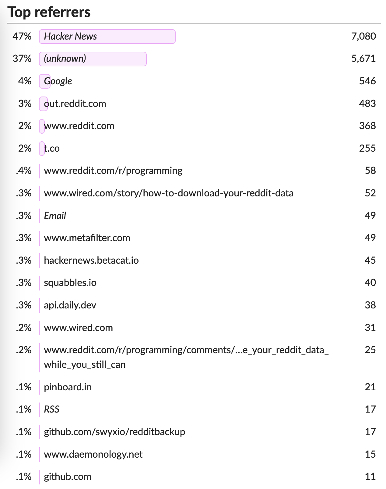

A few weeks ago, [my last blog post](/blog/post/archive-your-reddit-data/) about archiving your Reddit data hit the top of HN (a popular tech forum). This was a first for me; before it happened, I had basically no idea what to expect from “going (mildly) viral”. Not that I'm any sort of expert now,[^1] but I wanted to share some metrics I found useful or fun, and things I learned from having so many eyes on my site.

## Writing the Post

Let's set the stage. I'd been trying to be less of a perfectionist about blog posts. l wanted to maintain the high bar I'd set for myself, but write posts more quickly and with less agonizing over little details and phrasing.[^2] So, I knocked out a mostly-there draft Thursday night while we watched TV. I figured that, like most of my posts, some friends and family would see it. I was going to timebox my efforts and Just Post It. It went live ~11pm Thursday night.

Now, a bit of important context. I wrote this post when I did for two reasons:

- I had been working hard on a Reddit archiving tool and I wanted folks to see/use it
- That day, the developer of beloved third party Reddit app Apollo had [announced](https://old.reddit.com/r/apolloapp/comments/144f6xm/apollo_will_close_down_on_june_30th_reddits/) he was shutting down the app (to much uproar and upset)

I had actually posted my archival project [the week before](https://news.ycombinator.com/item?id=36062256) as a "Show HN" to exactly zero fanfare. But the landscape had changed. Where people were nervous about the future of Reddit before, now they were P-I-S-T: pissed. I figured I wouldn’t have a better opportunity to get my project out there.

## Going Live

I woke up Friday and ~~tooted~~ [posted about it on Mastodon](https://mastodon.social/@xavdid/110515041839938330) to start getting the word out. Then, I messaged my writer friend Justin and pitched him on the idea. Lastly, I posted the blog to HN, (once again) not really expecting much from any of it. It was now 9am.

Suddenly, HN comment replies start rolling in. My post was, as the kids say, "doing numbers" on HN and hit #1 before long:

Plus, Justin's editor at Wired was interested in covering the whole thing, so he had a lot of questions for me. In between answering those, I picked up some GitHub issues and my [first external PR](https://github.com/xavdid/reddit-user-to-sqlite/pull/3) (adding support for older Python versions). I was frantically answering, responding, merging, and releasing. It was 10:15am.

Why did I need to do this frantically, you may wonder? Because this very Friday was the start of my bachelor weekend in Tahoe. My friends were arriving at our house, ready to hop in the car and start a 4 hour road trip. This was a great time to be glued to my computer. Luckily, I have the most gracious and understanding friends in the world. This was also about the time when I started getting messages from friends and acquaintances who happened on my post organically, which was great. It's like running into someone you know unexpectedly out in public: it's just fun.

Anyway, there we were -- driving into the mountains while I occasionally replied to (largely very supportive) comments on my phone, trying to be a good steward of my work. I left my computer at home (I'm not a monster) so if anything really needed fixing or attention, it would just have to wait.

The site is pre-rendered by [Gatsby](https://www.gatsbyjs.com/) and served statically by [Netlify](https://www.netlify.com/), so I figured it wasn't going to fall over. Even so, I had no idea if it _was_ going to stay up and I'd be [left with an unexpected bill](https://nitter.net/monicalent/status/1542076759675396097) (something I had heard of happening before with unexpected traffic). I have a limited amount of (free) bandwidth each month (100GB) and I had absolutely no clue how much a pageload costs against my allotment. At this point, it didn't really matter because there wasn't anything I could do about it anyway. I unplugged for the weekend to celebrate with friends.

Justin's article went up the following Wednesday. He did a nice job; you can read [the full thing on Wired](https://www.wired.com/story/how-to-download-your-reddit-data/). This was the cherry on top, bringing me the minor prestige of being Covered by The Press. My manager would see it while browsing Wired, which was pretty cool.

## The Numbers

When I got back from the trip, I finally had a chance to sit down and look at my metrics. I have basic, privacy-focused analytics (powered by [GoatCounter](https://www.goatcounter.com/)) that tell me how many hits each page gets, what sites the users came from, and how big their screen is. If you squint, you can see when the post started gaining traction:

All told, about 10k people hit my site across the weekend (and another 4k in the month since it went up). I saw similar (albeit smaller) bumps across other pages as people checked out my homepage, blog, etc. Far and away the top referrer was HN, but I also had traffic from many sites (some of which I hadn't heard of):

This was probably my favorite thing to dig into. The big sites are there, but I was surprised at the number of little sites I'd never heard of. It was gratifying to see my little post find its way across the web.

Bandwidth wise, the site did great. I ended up using about 10% of my allotment, meaning I'd have to be serving a LOT more traffic in a month before I'll ever outgrow the free tier. While I'll never say never, it's not something I anticipate anytime soon.

Github and PyPI metrics were also good. At time of writing, the project has 199 stars making it my second mostly highly-starred project of all time. Depending on how accurate this [PyPI metrics site](https://pypistats.org/packages/reddit-user-to-sqlite) is, I had about 1k downloads that weekend, which I feel like is a great bar to hit.

Though I had fallen in rank by the end of the day (having submitted first thing in the morning), my post has been immortalized on June 9th's [HN front page](https://news.ycombinator.com/front?day=2023-06-09) with 495 points and 382 comments.

## Lessons Learned

Anyway, a couple of lessons learned:

1. Static sites rock. They're fast, cheap to run, and mostly don't get [hugged to death](https://en.wikipedia.org/wiki/Slashdot_effect) (as long as someone else is hosting it). [^3]
2. You really never know what's going to do numbers, even if you think you do. Also, it'll probably happen at the least opportune time, because of course it will.
3. Writing a post about a project is better than just posting a link to GitHub. A little story gives you space to explain yourself in a way that a README doesn't.

I don't think anything like this will happen to me again anytime soon (unless my [yearly media reviews](/blog/tags/yearly-review) REALLY take off), but I _do_ think I’ll write more medium-sized posts when I release projects. It's a good way to kick them off and make it easy to see what I've been cooking up.

Until next time!

[^1]: I am, after all, 1-for-many on posts getting much attention
[^2]: This post, for the curious, has not gone nearly as smoothly so far
[^3]: As long as someone else is worried about keeping them up, which is easier to do with the magic of CDNs
