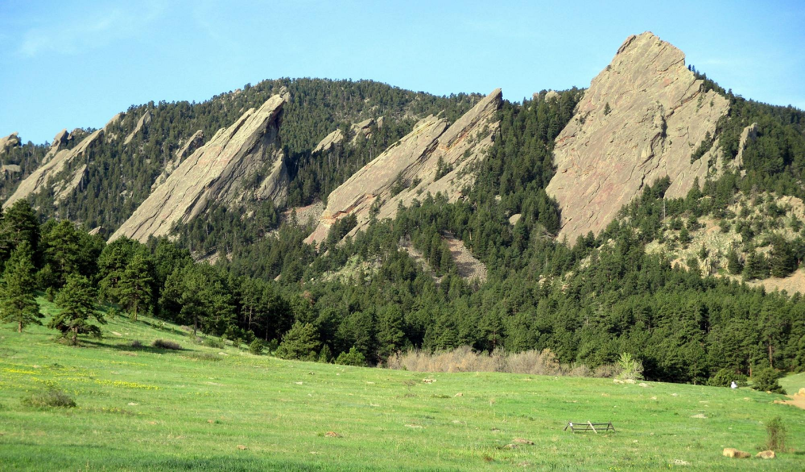

My hometown of Boulder has become a popular travel destination. Friends often ask me about things to do there, so I've put together a quick travel guide I can link to. Welcome! You're going to have a great time.

## Things To Know

### Altitude

- Boulder is nested at _5,430_ ft, more than a mile above sea level.
- You'll be winded more easily for the first few days you're there if you're not used to it.
- Alcohol will hit you harder and more quickly than you're used to, so pace yourself if you're drinking.
- Some people experience "altitude sickness", which brings headaches, nausea, and fatigue; it's not a fun way to spend a vacation. Luckily, it's easily counteracted if you **drink lots of water** (3-4 liters / day is recommended; basically 4 [Nalgene bottles](https://nalgene.com/product/32oz-wide-mouth-bottle/) worth). Better to be safe than sorry!
- You're closer to the sun, so bring a hat and/or sunscreen. Sunburns happen quickly.

### Weather

- Snow is possible most of the year; June, July, and August are the only snow-less months.
- Summer has a lot of brief afternoon thunderstorms.
- Otherwise, it's mostly between 40 and 80 degrees (sometimes on the same day). Layers are your friend.

## Boulder's Downtown

[Pearl Street Mall](https://www.google.com/maps/place/Pearl+Street+Mall/@40.018351,-105.2786591,15z/data=!4m2!3m1!1s0x0:0x9f7044c164fb917a?sa=X&ved=2ahUKEwigwP_14r_5AhWDK0QIHTHSAS4Q_BJ6BQiAARAF) tops many Boulder tourism lists, and for good reason. It's a outdoor pedestrian mall w/ lots of shopping & food. Nice pocket parks as well, all in the heart of downtown. Most of these recs focus on that area.

### Food

- [Pizza Colore](https://www.google.com/maps/place/Pizza+Colore/@40.018143,-105.2799327,17z/data=!3m1!4b1!4m5!3m4!1s0x876bec2883c1fc8f:0xeb5aa2217b4a5f39!8m2!3d40.018143!4d-105.277744) - cheap and good thin-crust (NY style?) pizza by the slice. Great for a quick lunch.
- [Lindsay's Deli](https://www.google.com/maps/place/Lindsay's+Boulder+Deli+@+Haagen+Dazs/@40.0178203,-105.2799552,21z/data=!4m12!1m6!3m5!1s0x876bec2883c1fc8f:0xeb5aa2217b4a5f39!2sPizza+Colore!8m2!3d40.018143!4d-105.277744!3m4!1s0x876bec21330d781d:0x624dd36b040a380c!8m2!3d40.0177102!4d-105.2801945) - great locally-run deli (inside the Häagen-Dazs).
- [Illegal Pete's](https://www.google.com/maps/place/Illegal+Pete's+-+Pearl/@40.0191113,-105.2752855,18.76z/data=!4m12!1m6!3m5!1s0x876bec2883c1fc8f:0xeb5aa2217b4a5f39!2sPizza+Colore!8m2!3d40.018143!4d-105.277744!3m4!1s0x876bec28f46c3873:0x2cc96c4dfb865178!8m2!3d40.0188174!4d-105.2763118) - beloved local burrito place.

### Stores

- [Boulder Bookstore](https://www.google.com/maps/place/Boulder+Book+Store/@40.0179778,-105.279724,18.61z/data=!4m5!3m4!1s0x876bedeed9f5d4b9:0x884e5a2257b27f7d!8m2!3d40.0180203!4d-105.2811613) is a great local bookstore. I like it because it's got lots of funny hallways and stairwells; everything's really crammed in there.
- [Liberty Puzzles](https://goo.gl/maps/1W3HtjsXQQeBFmdr5) - purveyor of fine wooden, laser-cut jigsaw puzzles.
- [Into the Wind](https://www.google.com/maps/place/Into+The+Wind/@40.0184271,-105.2782007,18.63z/data=!4m12!1m6!3m5!1s0x876bec2883c1fc8f:0xeb5aa2217b4a5f39!2sPizza+Colore!8m2!3d40.018143!4d-105.277744!3m4!1s0x876bec288ecc9e35:0x9ba044951f5e2901!8m2!3d40.0183737!4d-105.2769714) - a fun, kite-centric toy store. Worth a quick stop because it's pretty!

### Outdoors

If you're in the mood for walking, there are a few great options:

- Nestled under Boulder's most recognizable landmark (The Flatiron Range), [Chautauqua Park](https://www.google.com/maps/place/Chautauqua+Park/@40.0046514,-105.2849258,16.36z/data=!4m5!3m4!1s0x876bec4712c4dfc1:0x761597124a9e2eab!8m2!3d39.9991996!4d-105.2814996) has beautiful hiking trails throughout.
- Boulder Creek runs across the whole town and has a great paved walking path that follows it. It stays cool on hot days because of the water. If you're downtown, you can pick up the trail at the [library](https://www.google.com/maps/place/Boulder+Public+Library+-+Main+Library/@40.014848,-105.2803637,17.18z/data=!4m5!3m4!1s0x876bec24450a23db:0x42456b7dc1862448!8m2!3d40.013952!4d-105.281769) and take it east as far as [Scott Carpenter Park](https://www.google.com/maps/place/Scott+Carpenter+Park/@40.0111012,-105.2589959,15.95z/data=!4m5!3m4!1s0x876bedcf78916ba5:0x1d4e20b0486c7c12!8m2!3d40.0118014!4d-105.2548561), named for a local astronaut!
- Walk around CU's campus! It's very pretty, with lots of red roofs and big quads. There's cheap (or maybe free?) bowling in the [UMC](https://www.google.com/maps/place/University+Memorial+Center/@40.0073383,-105.2724242,18.23z/data=!3m1!5s0x876bec3406089e33:0xe42fc40970095b10!4m12!1m6!3m5!1s0x0:0xdd12e4ee972058a4!2sGlacier+Homemade+Ice+Cream!8m2!3d40.031544!4d-105.2589889!3m4!1s0x876bec3404709d15:0x4edb4fe9469ca825!8m2!3d40.006295!4d-105.2719745) (aka student center).
- Farther north (15 min drive), [Wonderland Lake](https://www.google.com/maps/place/Wonderland+Lake+Park/@40.04897,-105.2895359,15.23z/data=!4m12!1m6!3m5!1s0x0:0xdd12e4ee972058a4!2sGlacier+Homemade+Ice+Cream!8m2!3d40.031544!4d-105.2589889!3m4!1s0x876beee827028e17:0x4ba10785a3ccd15e!8m2!3d40.0485278!4d-105.2901148) is a very pretty area right under the foothills with lots of trails. It's flatter than Chautauqua.
- About a 45 min drive away is Estes Park, CO, home to [Rocky Mountain National Park](https://www.nps.gov/romo/index.htm). That's its own whole post, but it's worth a visit if you have a car and some time. Note that park entry via car is under a [timed-entry permit system](https://www.nps.gov/romo/planyourvisit/timed-entry-permit-system.htm) during the summer, but you can still bus / hike into the park. Estes is also a very cute town.

### More Food

Other great food that's not downtown:

- [Moe's Bagels](https://www.google.com/maps/place/Moe's+Broadway+Bagel/@40.025006,-105.2929413,15z/data=!4m9!1m2!2m1!1smoe's+broadway+bagel!3m5!1s0x876bee64b55ff3c7:0xfbd0688839c8711e!8m2!3d40.025006!4d-105.2809819!15sChRtb2UncyBicm9hZHdheSBiYWdlbCIDiAEBWhYiFG1vZSdzIGJyb2Fkd2F5IGJhZ2VskgEKYmFnZWxfc2hvcA) - some of the nation's best bagels.
- [Glacier Ice Cream](https://www.google.com/maps/place/Glacier+Homemade+Ice+Cream/@40.031544,-105.259007,15z/data=!4m5!3m4!1s0x0:0xdd12e4ee972058a4!8m2!3d40.031544!4d-105.2589889) - best ice cream, maybe in the world?
- [the Sink](https://www.google.com/maps/place/The+Sink/@40.0080089,-105.2764471,17.1z/data=!4m12!1m6!3m5!1s0x0:0xdd12e4ee972058a4!2sGlacier+Homemade+Ice+Cream!8m2!3d40.031544!4d-105.2589889!3m4!1s0x876bec308cb735e5:0x2135acc02ab02791!8m2!3d40.0085812!4d-105.2764048), a long-running dive bar / pizza place right near the university campus. Honestly the pizza's only ok, but the vibe is great and [Obama went there once](https://www.thesink.com/blog-press/president-obama-at-the-sink).
- [Good Times](https://www.google.com/maps/place/Good+Times+Burgers+%26+Frozen+Custard/@40.022695,-105.2615301,18.84z/data=!4m5!3m4!1s0x876bedd5e6b2b7a5:0x21051605efb95e4d!8m2!3d40.0224969!4d-105.260876) - Fast food known for their well-seasoned "Wild Fries" and their Frozen Custard.

## The Grid System

This section isn't really important to your trip, but the town is so walkable that it's useful to be able to get your bearings anywhere you are. Luckily, Boulder is a very easy town to navigate! It (mostly) follows a grid system:

- The **mountains are to the west**; you can basically always see them.
- North/south streets are numbered, starting w/ 1st street on the west side and counting up as you go east.
  - Most interesting stuff is between ~ 9th and 30th streets.
  - The big N/S thoroughfares are Broadway (which is numerically 12th street, though it's not called that), 19th, and 28th streets.
- East/west streets follow a few patterns depending on where you are in town.
  - The southern part of the heart of Boulder is Baseline (which is also the 40th parallel - it's exactly at 40°N! There's [a fun little plaque](https://www.google.com/maps/place/Baseline%2F40th+Parallel+Memorial+Survey+Marker/@40.0000977,-105.2614035,15z/data=!4m2!3m1!1s0x0:0xbaaf96dbc1d0ed0a?sa=X&ved=2ahUKEwidiuaI1Jv-AhXakYkEHQOBB20Q_BJ6BAhcEAg) if you're into that sort of thing).
  - North from there is Arapahoe St and Canyon Blvd, which are mostly just Big.
  - Then you have "downtown trees" (Walnut, Pine, Mapleton, Spruce) + Pearl Street (see above).
  - Then it's mostly alphabetical, from south -> north. You go from Alpine all the way to Yarmouth.

## Enjoy!

Enjoy your trip! If you do anything great in Boulder and think I should add it to this list, do let me know!
