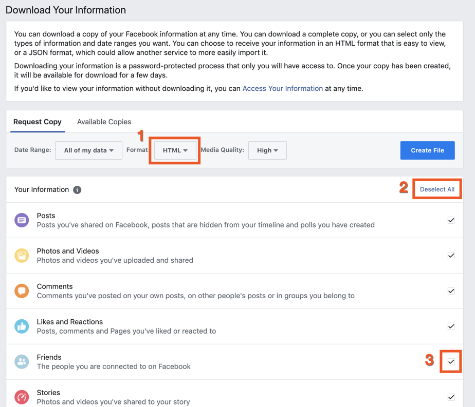
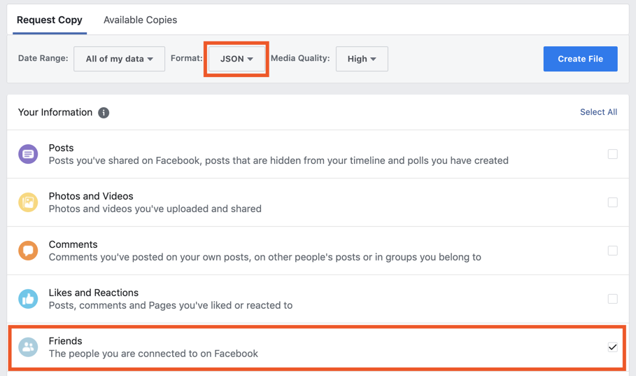
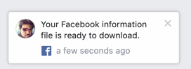
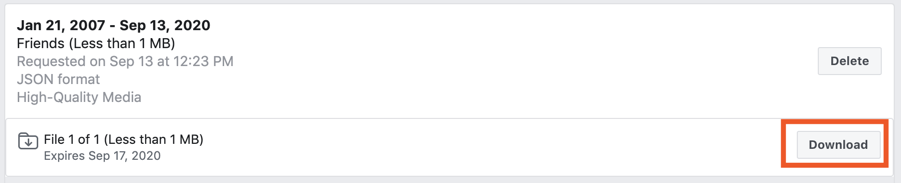
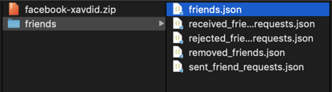
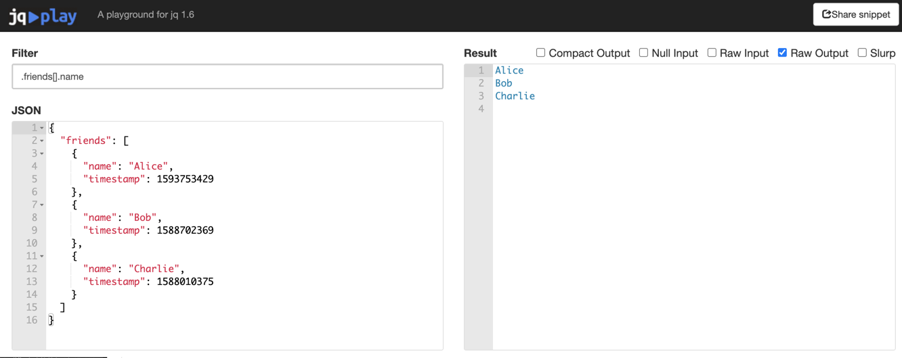
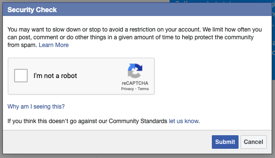

Last week, I posted the following on Facebook:

> US friends: It's always said that our generation "doesn't vote", which boggles my mind. It's a hugely important part of living in this country.

> I can't make sure everyone votes, but I _can_ do my part to make sure my Facebook friends do. I've exported my entire friend list and will be reaching out to each and every one of you in the coming week to double check your voter registration status (and help you get registered if you're not). There's no shaming involved with this, just friends checking up on friends.

For the past week or so, I've been sending messages almost non-stop to everyone on my Facebook friend list.[^1] It's been a pretty big task, but immensely rewarding.

It's been slow going, but with the right tools in hand, it's been a manageable endeavor. I wanted to write up those instructions so you too can make sure, at the very least, all of your friends are able to vote.

## Getting Your Friend List

Thanks to GDPR, Facebook makes it easy to export data about your account. This step is best done on a computer, since you'll be downloading big text files (but it's probably possible on mobile too). It'll work on Windows or Mac

First, head to the [Download Your Information](https://www.facebook.com/dyi) page (while you're logged in). This is the screen you should see, plus the 3 buttons you need to press:



You want the following settings:

1. `JSON` format
2. Check only the `Friends` box. You can "Deselect All", then check only the box you want

Now it should look like this:



Press `Create File` and hang tight! You'll get an email and a FB notification when it's done. Mine took about a minute, but yours could take longer if you've got more friends.





## Organizing Data

Your file will probably download as `facebook-<USERNAME>.zip`. Once you've unzipped it (you computer should do this automatically if you double click the file), you should have a new folder called `friends`.



If you're comfortable with the command line, you can use `jq` there (which needs to be [installed](https://stedolan.github.io/jq/download/) first) and run
`<path/to/friends.json | jq -r '.friends[].name' | pbcopy`. If you've done that, then [skip ahead](#reaching-out).

Otherwise, ignore this and read on!

Open the file called `friends.json` in any simple text program, such as `TextEdit` on macOS or `Notepad` on Windows. It should be structured like this (but much longer, and with real names):

```json
{
  "friends": [
    {
      "name": "Alice",
      "timestamp": 1593753429
    },
    {
      "name": "Bob",
      "timestamp": 1588702369
    },
    {
      "name": "Charlie",
      "timestamp": 1588010375
    }
  ]
}
```

Select all the text, then copy.

Next, head to this page: https://jqplay.org/s/TxISq6huaK

`jq` is a tool to help process and format `json` data (such as the friend data you have on your clipboard!). If you went to the link above, the settings and data should be pre-filled, like this:



The important things are the filter value (`.friends[].name`) and `Raw Output` being checked. If that looks right, paste your big JSON into the left pane. You should see all your friends' names on the right **without quotes** (like in the screenshot above). Click in the right pane, select all, and copy again.

## Reaching Out

Now you've got a big list of all your friends' names. You need a way to keep track of conversations you've had, plus easily see who you need to follow up with. For situations like this, Airtable is my go to tool (though a spreadsheet tool will also work).

I've got a template of my setup [on Airtable Universe](https://airtable.com/universe/expJUjb4xPHgQPKjK/voting-roll-call), which you can start using right away. You can also just peruse it to get inspiration for your own setup.

Once you've got that ready, paste your friends names into the first column of your sheet. Select `Expand the Table` if it asks. From there, you're off to the races!

When reaching out, I used the following blurb:

> Hey there [NAME]! [Some Nice Greeting].

> If you've got a sec, I'd love to get a few pieces of information from you.

> 1. Are you registered to vote?
> 2. If so, what state are you registered in?
> 3. Are you interested in learning more about becoming a poll worker to help keep voting lines short?
> 4. If you don't mind telling me, who do you plan to vote for for president?

> I'm collecting this as a personal checkup to make sure all my FB friends are registered and informed, no it won't go anywhere and it's for nothing official.

> Thanks!

I've had great results from that.

If folks where interested in poll work, I sent them this link: `https://www.powerthepolls.org`. If they were interested in doing more, but couldn't/didn't need to do poll work (some states have primarily mail-in voting, so poll work is less vital there), then I pitched them on helping to mobilize voters in swing states following the instructions here: `https://votesaveamerica.com/adopt-a-state/`.

If you're primarily using FB messenger, sending too many messages in too short a time will get you a nice rate-limit message:



You won't get in trouble, but that does mean it's time to take a break. Find folks on your list you can text instead or be done for the evening.

Voting won't solve everything, but it certainly won't make anything worse. With any luck, the 2020 election will be one of real change; we could sure use it.

[^1]: Say what you will about Facebook (and I'll probably agree with you), but it's been an invaluable tool for getting in touch with friends I haven't talked to recently; no replacement for that yet
