<FinishWhatWeStarted current="12-games-for-2-players" />

In 2022, there was board game-related friction in our house.

We've had this great stack of games on the shelf (some of them brand new!) but hardly ever played them. The root issue was that I love learning new games while my wife Vicky preferred to play a few games many times. As a result, we mostly didn't play our board games at all.

After expressing this frustration, we arrived at a compromise: we'd make a big list of games we wanted to play, but we'd play them 5 times each. This way we weren't constantly learning new games, but we'd still get to play a nice variety. It was Vicky's Christmas gift to me: **The Game Plan**.

She hand-painted a grid to track the 12 games on our list and who won. It sat proudly on our mantle where we'd update each week when we sat down to play, just the two of us.

We started strong, but over time, life got in the way. We got busy, married, pulled into family drama, and more. We lost momentum and the scoreboard sat on our mantle, largely ignored.

But as [previously discussed](/blog/post/finishing-what-we-started/), 2025 was the year of **finishing what we started**! And the Game Plan was a natural beneficiary of this effort. So in March, we started making a concerted effort to play the remaining games. And we did it!

Now that we've finished, I wanted to briefly review each of the 12 games we played. Some played better at 2 players than others, but they were each fun in their own right!

> Each row shows who won (based on color) and in which order we played each game (number). Multi-colored stickers are ties.

## Arboretum

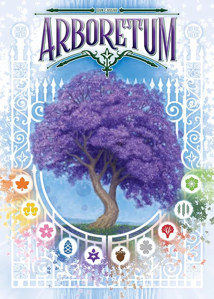

[Arboretum](https://boardgamegeek.com/boardgame/140934/arboretum) is centered around building runs of tree cards but only scoring them if you've got the most points of that tree still in your hand. It's a surprisingly cutthroat game for two players. The gameplay is simple and there's decent fun player interaction and plenty of trash talking. Travels well, too.

**Rating overall**: 4/4. Trees, grids, and dramatic reveals!

**Rating for 2 players**: 3/4. Also I recommend discarding 3-5 cards face down before the game starts. This will prevent either player from having perfect information at the end of the game and add a little variance to the outcomes.

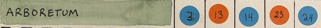

## Caper: Europe

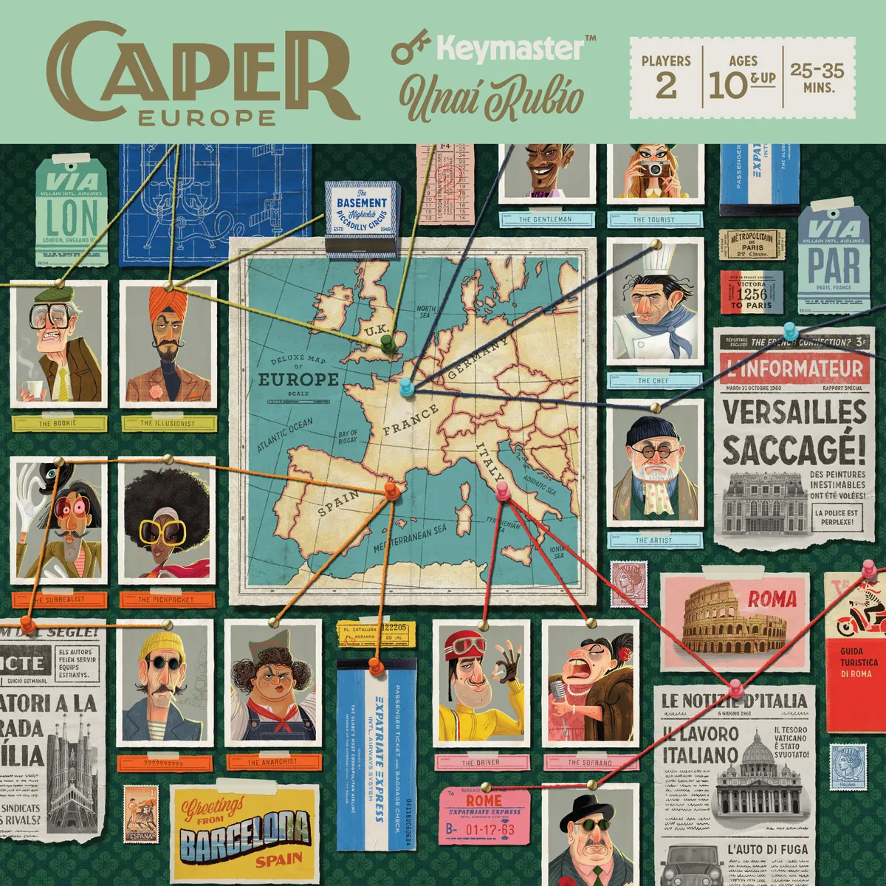

[Caper: Europe](https://boardgamegeek.com/boardgame/328565/caper-europe) has some of the best components of any game on this list. It's an elegant tug-of-war where you get to choose where and how you allocate resources. Everything is set on a backdrop of 70s era spies and European cities, so every inch of it is packed with flavor. There's a ton of replayability too, since you only use 1 of the 4 included cities for each game.

More than most of these games, it benefits from many plays with the same pair of people. Once you have a good working understanding of what cards are out there, the matches get pretty competitive.

**Rating overall**: 4/4. Tense, thrilling, beautiful!

**Rating for 2 players**: N/A, it's a 2-player-only game.

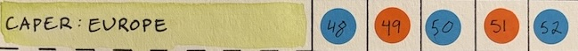

## Fugitive

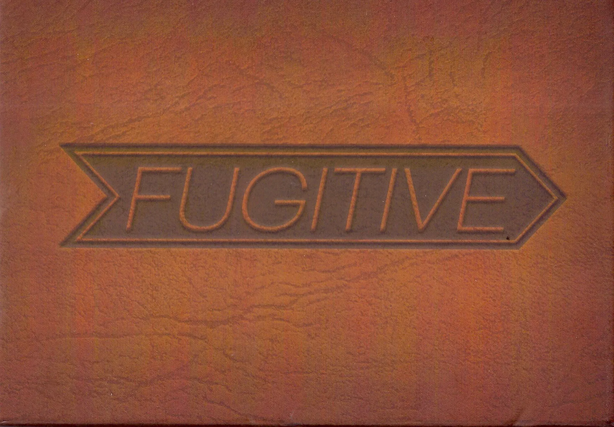

[Fugitive](https://boardgamegeek.com/boardgame/197443/fugitive) is another spy-themed romp designed for 2 players. It's asymmetric, with one player assuming the role of the eponymous fugitive trying to escape justice. The other is the marshall, hot on their trail. The fugitive plays cards to represent their hideouts while the marshall draws cards to eliminate places the fugitive can be hiding.

Every game played out like an exciting chase scene in a movie and nearly always came down to the wire. There's a lot of latitude for tricking and bluffing each other, which was always fun.

**Rating overall**: 4/4. Exciting, devious, satisfying!

**Rating for 2 players**: N/A, it's a 2-player-only game.

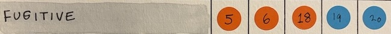

## Mechanica

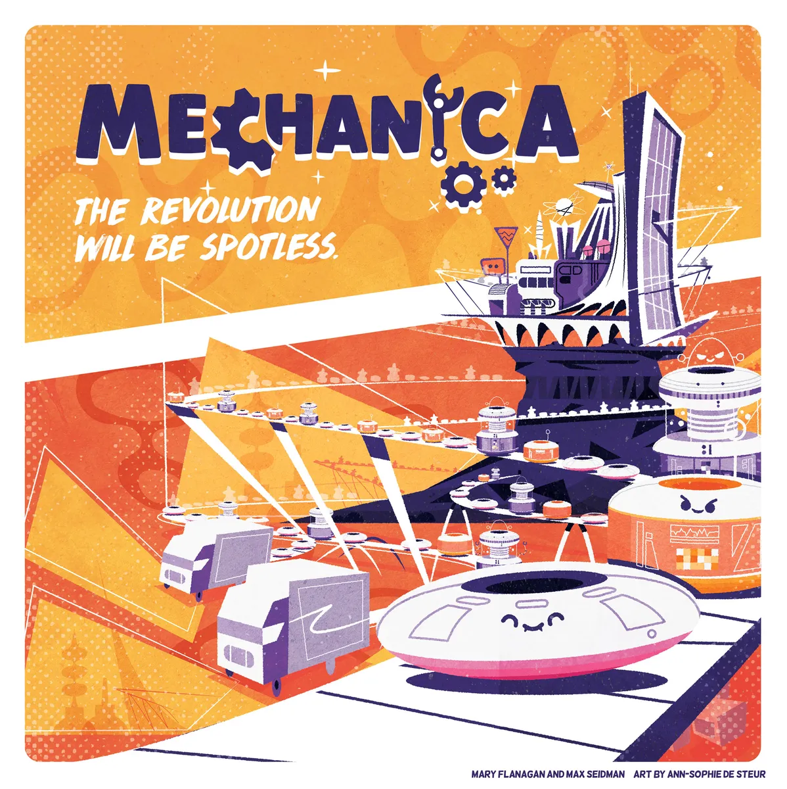

[Mechanica](https://boardgamegeek.com/boardgame/268493/mechanica) is produced by our friends at [Resonym](https://resonym.com/). It's a factory building game (my favorite) with a unique twist: all items are bought from a large, rotating shop in the middle of the box. Once purchased and installed, you'll run your factory every round to produce bots, which you can sell for resources to build buildings to produce bots which are produced when you run your factory, which you can sell for... you get the idea.

**Rating overall**: 3/4. Running your factory is a fairly error-prone activity. There's a good mix of buildings though and you can get some pretty cool setups. Play with the Inventions expansion if you can; it adds some asymmetry that really improves the game.

**Rating for 2 players**: 3/4. The advanced production buildings give all other players resources when used, which feels a little too punishing with only two players. Also everyone feels a little resource starved to start, since there are fewer buildings coming through the store.

## Parks

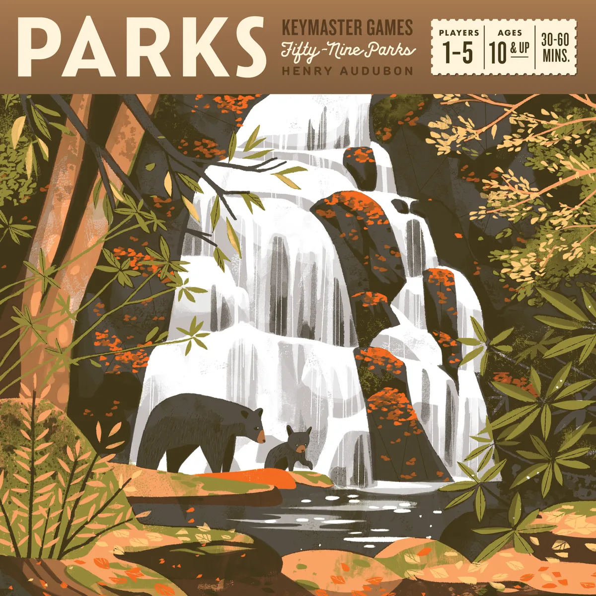

[Parks](https://boardgamegeek.com/boardgame/266524/parks) is a beautiful game about visiting the US's many national parks and enjoying the local sights. There's an extensive equipment system which helps each play feel unique. It's both leisurely and brutally competitive as you're fighting over the same resources and spaces. It continues to be one of our favorites.

**Rating overall**: 4/4. Beautifully designed and easy to pick up. Highly recommend the [Nightfall expansion](https://boardgamegeek.com/boardgameexpansion/298729/parks-nightfall), which adds a lot of strategic depth in the form of new mechanics and locations.

**Rating for 2 players**: 3/4. You get a lot of turns which leads to some powerful combos. But, you're basically forced to fight over a camera that gives you a big discount on points, a mechanic that doesn't seem to be designed for two players. It forces one (or both) to fight for it at all times, even if they don't want to. Otherwise plays great though, I just like it more at 3+.

## Quacks of Quedlinburg

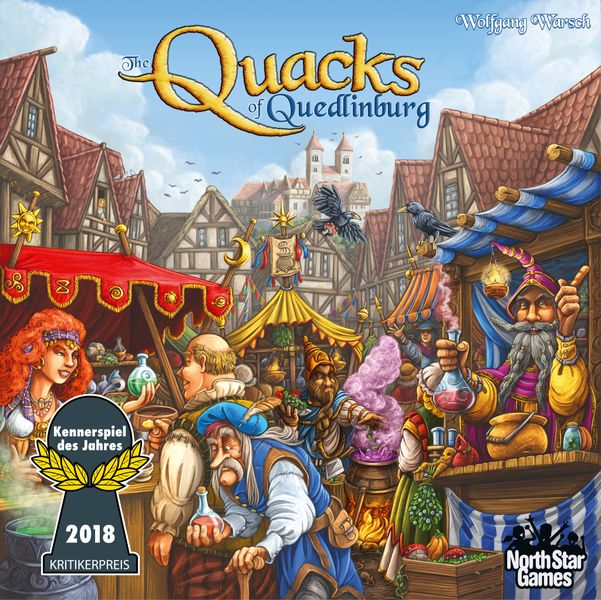

[Quacks of Quedlinburg](https://boardgamegeek.com/boardgame/244521/quacks) (since re-released as "Quacks") is an addictive push-your-luck bag-building game. Each round, you draw tokens out of your bag, busting if your value of white tokens exceeds 7. You can buy tokens between rounds to both dilute your bag and bring new opportunities for points. Buying things and drawing them later was always exciting.

I also loved the repeatability. Each color of token has multiple rules you can use (or make your own!) so there're nearly infinite combinations to play with.

**Rating overall**: 4/4. Heavy on randomness, but a lot of fun to build your bag. Leads to some exciting moments where you need just the right thing. Splurge for the [GeekUp Bit Set](https://boardgamegeekstore.com/products/geekup-bit-set-quacks-of-quedlinburg) if you like the game, which makes it a much more pleasantly tactile experience.

**Rating for 2 players**: 2/4. Maybe it's because I was inexplicably awful at this game, but it never felt like I was able to catch up when I was behind. As long as Vicky never busted and I did at all, she'd win the game handily. The built in catch-up mechanics didn't seem to help much. Also, the black tiles (which are compared against your neighbor) are less fun with only two players, since it's a zero-sum mechanic.

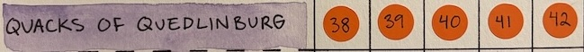

## Retrograde

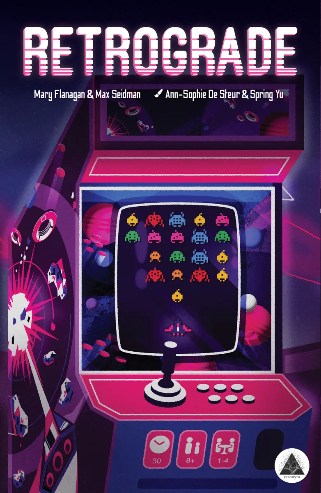

Another [Resonym](https://resonym.com/) title, [Retrograde](https://boardgamegeek.com/boardgame/351651/retrograde) is a roll-and-write game that evokes Space Invaders & Galaga. Each round you roll your dice as fast as you can, only stopping when you're satisfied with which aliens you'll be able to scratch off. You can get powers that make dice easier to manage, which adds some good variance between plays.

**Rating overall**: 3/4. Fun concept and good player interaction (since you're fighting over cards from the shop). You can build some pretty good combos too, which was fun.

**Rating for 2 players**: 3/4. Still fun, but it's pretty punishing that the faster-rolling player can end the round for the other one (since, if you're the last player rolling, you only get 3 rolls and then you're done).

## Sherlock Holmes: Consulting Detective

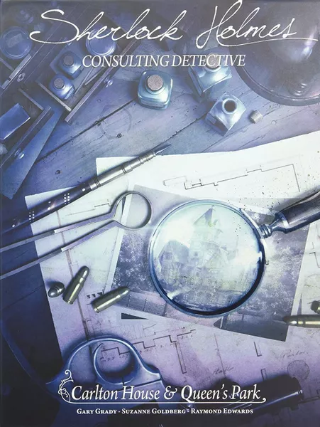

[Sherlock Holmes](https://boardgamegeek.com/boardgame/223931/sherlock-holmes-consulting-detective-carlton-house) is a reading-heavy game that puts you in competition against the titular sleuth. The gameplay is sort of of a technical marvel. You're given the setup for a mystery and set loose on a map of London. Upon visiting one of the hundreds of locations, you read unique dialogue that fills in clues or points you to other people / locations. There's a lot of player agency to choose who you want to talk to and what leads you want to pursue.

That said, this is the only game we decided not to finish. It's a great idea, but it felt tedious to play. It's a lot of reading and pretty easy to get stuck if you don't interpret a vague clue correctly. There are also a lot of typos in the books, some of which can impact gameplay (like using the wrong name for a character).

Also the scoring system really rubbed Vicky the wrong way. Technically you score points by how many leads you had to follow to solve the mystery and there's a "par" set by ~~Sherlock~~ the developers. On the one hand, encouraging logical leaps and critical thinking is the point. But, it also feels like it punishes you for exploring the well-realized world, since each conversation counts against your final point total. We could have just ignored the scoring, but we weren't enjoying ourselves enough to bother.

**Rating overall**: 2/4. Wanted to like it a lot more than we did.

**Rating for 2 players**: N/A, it plays ~the same at all player counts.

## That Time You Killed Me

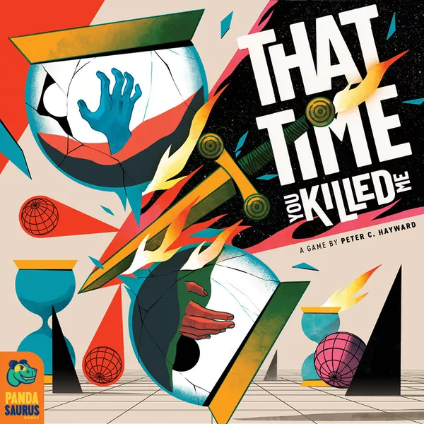

[That Time You Killed Me](https://boardgamegeek.com/boardgame/344258/that-time-you-killed-me) is a time-traveling spin on pawns-only chess played across 3 boards (representing past, present, and future timelines). Pieces can teleport backwards and forwards in time in the hopes of trapping opponent pawns in paradoxes, removing them from the board.

The basic premise is fun, but it also comes with 4 modules that can be mixed and matched. Each one plays into the time travel theme nicely, like being able to plant seeds that grow into trees which can then be pushed around or knocked over onto unsuspecting victims. It's rules also do a great job delivering on its theme, mixing a lot of humor into its explanations.

But, it turns out Vicky hates Chess and chess-like games, so after bullying her through our requisite 5 games, we ended up giving this one away. I liked it though!

**Rating overall**: 4/4. Strategic, silly, and modular.

**Rating for 2 players**: N/A, it's a 2-player-only game.

## The Search for Planet X

We always describe [The Search for Planet X](https://boardgamegeek.com/boardgame/279537/the-search-for-planet-x) as "competitive space sudoku" and it's one of our favorite games. It's played on a pie chart with 12 segments; each holds exactly 1 celestial object. To end the game, someone must use logic and deduction to find Planet X. You take turns acquiring information from an app about how many of a specific object are in a range and get bonus points if you publicly log correct guesses before anyone else.

I don't love the reliance on an app, but the game plays very smoothly and is almost always anyone's game. Lots of individually-set difficulty options too, which makes it easy to play with less experienced players without overwhelming them.

**Rating overall**: 4/4. Thinky, flavorful, and competitive.

**Rating for 2 players**: It's a little cutthroat because every action is zero-sum, but it plays very smoothly otherwise.

## Watergate

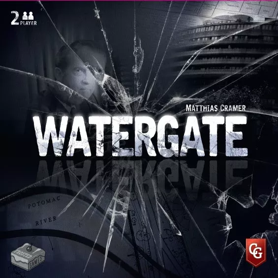

The other asymmetric 2-player game on this list, [Watergate](https://boardgamegeek.com/boardgame/274364/watergate) pits the corrupt Nixon administration against the journalists working to uncover his (alleged) crimes. Each round is a tug of war over evidence tokens, political momentum, and the next round's initiative. Each card can be played once for a powerful effect or saved for later if you settle for moving a single token instead. Burn through your deck too fast and you'll be left at disadvantage, so every move must be carefully considered.

The whole thing is a blast and it's probably my favorite game of the bunch. Its theme is beautifully well-realized and every card has actual historical context about the person or event depicted. Building your web of evidence or narrowly escaping with your job (only to declare that you're "not a crook", naturally) never fails to excite.

**Rating overall**: 4/4. Thrilling, stressful, historically political.

**Rating for 2 players**: N/A, it's a 2-player-only game.

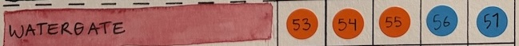

## Wingspan

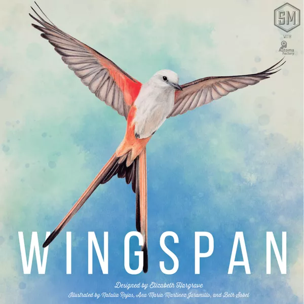

We were old hat at [Wingspan](https://boardgamegeek.com/boardgame/266192/wingspan), but hadn't ever played the Oceania expansion that we'd gotten ages ago. We get into a loop where we'll get an expansion, but not remember how to play the game. So we'll play the base game a couple of times to refresh at which point I'm ready to move on and we still haven't played the expansion. Rinse and repeat. Anyway.

The Oceania expansion was great! It added a wild resource and a new player board which makes the game a little more forgiving. There are also fun new powers and end of game goals to work towards. Historically Vicky usually wins Wingspan, but with the expansion it was much more even. I'm not sure what changed, but I'm all for it.

Vicky mostly loves this game for the bird art, but also because it accidentally taught me real bird facts. Thanks to a lifetime of playing Magic, I'm pretty good at remembering what cards do. I caught her off guard when I knew that a Brown-headed cowbird laid its eggs in other birds' nests (since that's how it works in the game).

**Rating overall**: 4/4. Educational, pleasant, gorgeous.

**Rating for 2 players**: It plays about the same, but the mechanics that reward players for second place (end of round goals, nectar counts) lose some of their luster when the other player only has to get on the board to score a full half of the points.

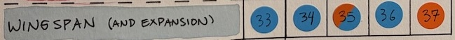

## And the winner is...

David! But only barely.

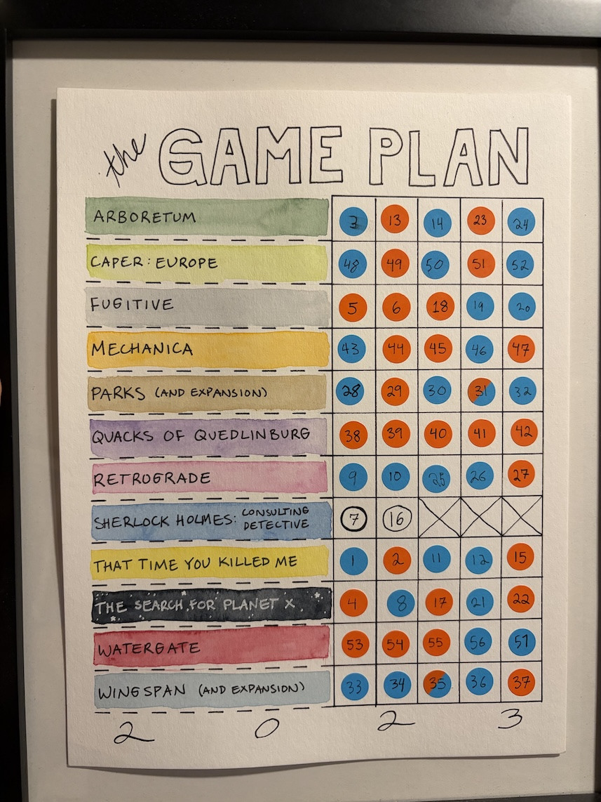

In the end, it was 27 wins to 26 (since we tied twice), so it really did all come down to our final play (Watergate). We played it with a small audience of friends and family who cheered and gasped at all the right moments.

But ultimately, winning wasn't the point. The point was to unplug a bit and play games together. So by that metric, we're all winners.

As for what's next, we've discovered that Vicky prefers cooperative games to competitive ones. We're not doing another Game Plan (for now, at least), but we're planning on picking up some co-op games for us and friends and focusing more on those. We'll see how it goes!
