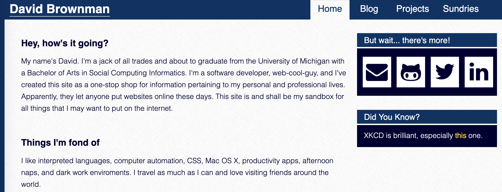
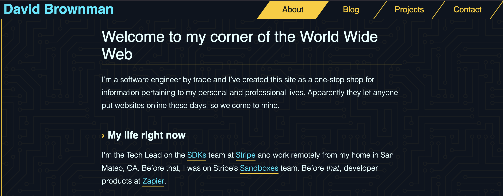
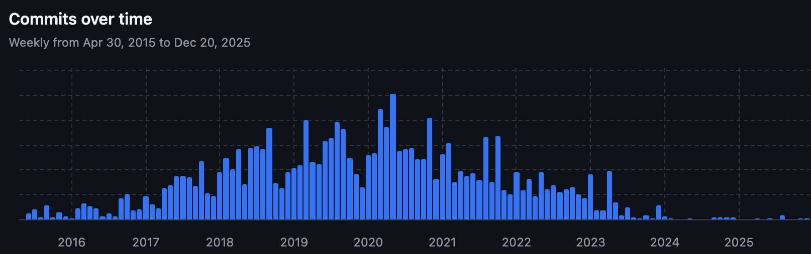

<FinishWhatWeStarted current="another-site-rewrite" />

Since its inception in March 2013, my website (formerly known as davidbrownman.com) has gone through a few major revisions. It was time for another.

## Background

Its very [first version](https://github.com/xavdid/website/tree/7f058650e1444ffa460653d7f700db2952e8d419) was a single HTML file with a bit of CSS written by my friend [Evan Hahn](https://evanhahn.com/). It had a little splash of (off-brand [Michigan](https://umich.edu/)) color when hovering the buttons:


Before long, I added jQuery so I could make the buttons [draggable](https://jqueryui.com/draggable/), which seemed like absolute magic at the time.

### Ruby time

In early 2014, I [launched](https://github.com/xavdid/website/commit/c0b3f60c59ac9402b8932a4ef2bd5ea267a4279b) a redesigned site built with [Middleman](https://middlemanapp.com/), a Ruby-based static site generator. It let me use the [Haml](https://haml.info/) and [Sass](https://sass-lang.com/) skills I picked up at my last internship. I also enlisted the help of a friend to help me with some professional-looking web design. You can still see that version of the site in the [wayback machine](https://web.archive.org/web/20141123105455/http://davidbrownman.com/).



There was a blog at this point, but the actual posts lived on tumblr. They were mirrored onto the site during the build step. They wouldn't move to markdown until 2016, which I [wrote about at the time](/blog/post/the-great-migration/).

That worked well for years, but come 2020 and I couldn't build my site anymore. I had stepped away from the Ruby ecosystem and wasn't able to debug the issue. Rather than spend even more time fixing the Ruby install, it was time for a rewrite.

### From Ruby to JS

I decided to port the site to [Gatsby](https://www.gatsbyjs.com/) a JavaScript-based generator that was popular at the time. I was doing a lot more JS at the time, so I was more comfortable with that tooling. As an added bonus, it used JSX and React to generate markup, which I was very familiar with. I also redesigned the site again, leaning into a Tron-inspired look (and once again styled with Sass):



Gatsby itself was interesting tech. I loved how fast the resulting site felt thanks to the way it pre-loaded pages you hovered a link. It also handled images well, shrinking them during the build step to maximize speed for users.

But it was also complicated. For example, you had to use GraphQL to retrieve data (like blog posts) when writing pages, a bit of technology I've never been crazy about. And a featureful site needed a lot of plugins, dramatically increasing the surface area of the code that needed maintaining.

### End of the line

In February 2023, [Netlify acquired Gatsby](https://www.netlify.com/press/netlify-acquires-gatsby-inc-to-accelerate-adoption-of-composable-web-architectures/). If you look closely at Gatsby's commit graph, you might be able to spot when it happened:



While it's possible for software projects to be "complete", Gatsby wasn't. The web is a constantly evolving place and you really want to be built on something that evolves with it. The writing was on the wall for the longevity of the library and it was only a matter of time before it went the way of my Middleman install.

### What's next?

That October, I decided to [create](https://github.com/xavdid/advent-of-code/pull/2) a dedicated [Advent of Code blog](https://advent-of-code.xavd.id/). After shopping around for static site generators, I decided to power it using [Astro](https://astro.build/), another JS-based static site generator, but with a focus on modern tooling, minimal configuration, and generating plain HTML.

And wowza! Stuff just worked, plugins were available but far from required, and it was under active development. It was easy to turn markdown into nice templated pages with theming and custom components. They've really nailed the ergonomics of every important operation, providing unparalleled developer experience and TypeScript support.

A week later, I'd [use Astro again](https://github.com/xavdid/david.reviews/commit/776fedef2f4982293cc868fbbf707c2ffe3d3789) for a much larger project: building my [review site](https://david.reviews/). Once again, it was a delight to use, letting me iterate quickly and focus on the stuff I care about, not fighting the framework. I continued to maintain both those sites for years without incidence, just productive bliss.

In the meantime, my personal site was still written with Gatsby. To its credit, everything has worked flawlessly in the intervening years, even without Gatsby updates. But I'd definitely been avoiding adding features to the site because I considered the code base to be in maintenance mode.

This is my home on the web and I want to be excited to work on it. I could have kept putting it off, but enough was enough. In the spirit of **finishing what I started**, I embarked on a rewrite using, you guessed it, Astro.

## What we did

My main goal, unlike previous rewrites, was to ship a drop-in replacement. This is its own sort of challenge, since making a new thing work exactly like an old one across frameworks requires some finagling. And, as with all my sites, I want them to be as markdown-forward as possible. Simple operations (like blog posts or new pages) should require no configuration once set up. Astro's [content collections](https://docs.astro.build/en/guides/content-collections/) let me define a schema for Markdown frontmatter, ensuring every page has all the properties the rest of the site expects. This helps prevent surprises in production.

Structurally, it was going to look a lot like `david.reviews`. There's a few static pages (home, contact, projects) and a big pile of generated ones (blog posts, posts by tag, etc), nearly all written in Markdown. The similarity meant I could crib from myself and avoid reinventing the wheel when I needed to remember exactly how I got a feature to work.

To get started, I read the Astro [docs](https://docs.astro.build/en/guides/migrate-to-astro/from-gatsby/) describing this exact migration.

### Migrated components

The first major task was to get the site rendering using Astro, no matter how broken the details were. I spent a decent amount of time figuring out the minimum amount of work I needed to get _something_ working again.

It turned into a bit of a [function coloring](https://journal.stuffwithstuff.com/2015/02/01/what-color-is-your-function/) problem, since any time a layout hit a JSX component (which I had defined in in `.js` files; not sure how that ever worked), it would crash. So I started converting all of those components to native `.astro` files, starting with layout-related items (which appeared on, and crashed, every page).

### New icons

The next issue was my [Font Awesome](https://fontawesome.com/) icons. They were the hip thing back in 2014 when I started using them and were fairly standard in 2020 when I rigged them up in React, but (in my opinion) they've since been supplanted by simpler, icon packs that give you purse SVGs. So I yanked all those out and swapped to [Lucide icons](https://lucide.dev/) instead. It took a bit of elbow grease to get them styled the same way, but it wasn't anything a few common style properties couldn't fix.

### Custom components in Markdown

The last big hurdle was rendering custom components in my Markdown content. Astro's [MDX integration](https://mdxjs.com/) is good, but some of the more nitty-gritty configuration can be a little under-documented. Luckily, I had solved basically this exact problem before when I [added articles](https://github.com/xavdid/david.reviews/pull/1) to my review site.

The key is to render your markdown with a map of components. [Certain keys](https://mdxjs.com/table-of-components/) can be used to replace built-in HTML tags. The rest are made available in that MDX without additional imports, which helps keep blog posts clean:

```astro
---
// RenderedMarkdown.astro

import { render } from "astro:content";

import Link from "./Link.astro";
import InlineCode from "./InlineCode.astro";
import YoutubeEmbed from "./YoutubeEmbed.astro";
// ...

type Props = {
  renderable: Parameters<typeof render>[0];
};

const { renderable } = Astro.props;
const { Content } = await render(renderable);
---

<Content
  components={{
    // these will be used in place of the generic
    a: Link,
    code: InlineCode,
    // any other components here can be used in all mdx without imports
    // also add these in eslintrc
    YoutubeEmbed,
  }}
/>
```

This file has a little extra layer of abstraction because I have multiple markdown-based content collections. This component lets me register all the extra components in a single place.

### Other improvements

While the main goal was for everything to match the old site exactly, I made a couple of small fixes. My favorite is a pattern I also used on the review site: a helper to load all posts in development, but only the published ones in a production build.

I used to have a `draft: true` frontmatter property to stop posts from showing up in the blog list and RSS feeds. But remembering to add that line and respect it in every place I interacted with blog content was tricky. I accidentally published (or neglected to publish) posts more than a couple of times. So I took another page from the review site and powered everything off the `datePublished` property. If it's missing, then the post must be a draft!

And to make sure that list is consistent across the whole site, I use a helper instead of Astro's `getCollection('blog')` directly:

```ts
// util.ts

import { type CollectionEntry, getCollection } from "astro:content";

export const sortableDateValue = (d?: string): number =>
  (d ? new Date(d) : new Date()).valueOf();

// https://docs.astro.build/en/guides/environment-variables/#default-environment-variables
export const isProdBuild = import.meta.env.PROD;

// https://docs.astro.build/en/guides/content-collections/#filtering-collection-queries
// everything in dev, published only in prod
export const getPublishedPosts = async (): Promise<
  Array<CollectionEntry<"blog"> & { permalink: string }>
> =>
  (
    await getCollection("blog", ({ data: { datePublished } }) =>
      isProdBuild ? datePublished : true,
    )
  ).toSorted(
    (a, b) =>
      sortableDateValue(b.data.datePublished) -
      sortableDateValue(a.data.datePublished),
  );
```

Now, anywhere I interact with blog content, I use `getPublishedPosts()` and it always supplies the exact correct list, no matter the environment.

---

Overall, the project took about a month from start to finish. It would have gone faster, but I was limited time to work on it (for reasons that will become obvious soon).

[The PR](https://github.com/xavdid/website/pull/163) merged on December 20th and, after a couple of small fixes, worked flawlessly. Most content pages didn't need any edits outside updating their imports and I managed to reuse almost all of my CSS.

## We haven't won yet

The code is in pretty good shape, save one thing: everything is _still_ styled with Sass. It works well enough, but its global scope and years of little tweaks have made it hard to maintain effectively. And in 2025, many of Sass' features are now available in modern CSS natively, so I need it a lot less than I did when I wrote it in 2020. Additionally, Astro [scopes all styles](https://docs.astro.build/en/guides/styling/) at the component level, so global styles are sort of an anti-pattern in the first place.

At some point in here, I'll migrate everything to [Tailwind](https://tailwindcss.com/). I know, I know, it's another framework. But it's simple, fast, and fits the way I think about styling things. I don't feel like I'm too abstracted from the CSS either, since I'm using that knowledge to write the Tailwind classes in the first place. And I just love how easy it makes styling things conditionally. In Sass, you need:

```scss
// before
@mixin desktop {
  @media (min-width: 1124px) {
    @content;
  }
}

// elsewhere
.something {
  width: 100%;

  @include desktop {
    width: 75%;
  }
}
```

While in Tailwind, it's as simple as `w-full lg:w-3/4`. Dark mode specific styles are similarly easy, not requiring me to remember (or lets be real, find then copy then paste) `@media (prefers-color-scheme: dark)`. Tailwind lets me do what I know, but easier and faster.

Also, my [littlefoot](https://littlefoot.js.org/)-powered footnotes aren't working anymore. I'm not sure what the difference is, but my styles weren't taking. I liked them being inline, but I was ready to get this project wrapped and they weren't worth holding it up over.

Lastly, there's no guarantee that Astro lasts forever. One day they could close up shop and I'll be right back where I started. It'll probably be worse than before too, since a lot of those `.astro` files use framework-specific tooling that isn't especially portable. Heck, the whole file uses a custom parser. That'll be a big pain to move.

But until that day comes, I've been extremely happy with Astro and its ecosystem. I'm looking forward to many happy years.

---

_**edit** (January 2026)_: It was just announced that Astro has been [acquired by Cloudflare](https://www.cloudflare.com/press/press-releases/2026/cloudflare-acquires-astro-to-accelerate-the-future-of-high-performance-web-development/), so my timing was impeccable. Hopefully this acquisition goes better than the last one! Otherwise I'll see you in a few years.
