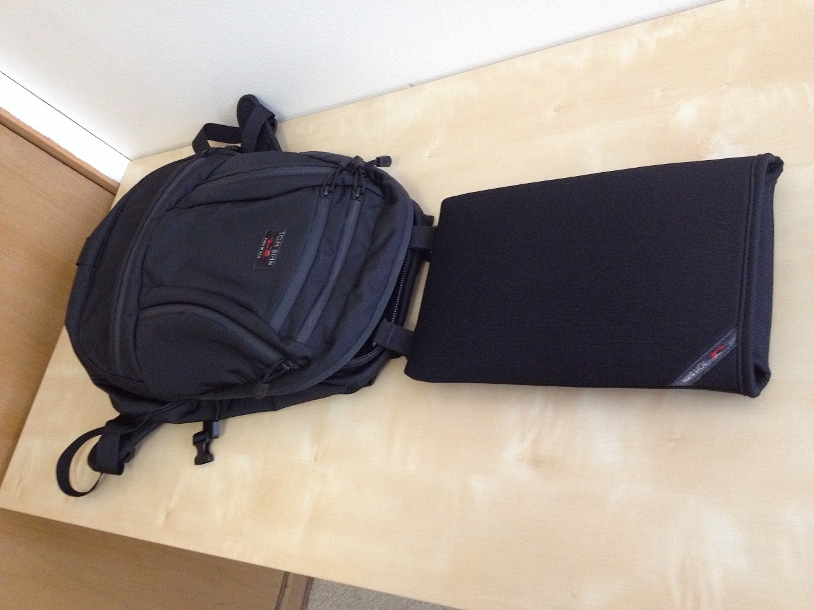
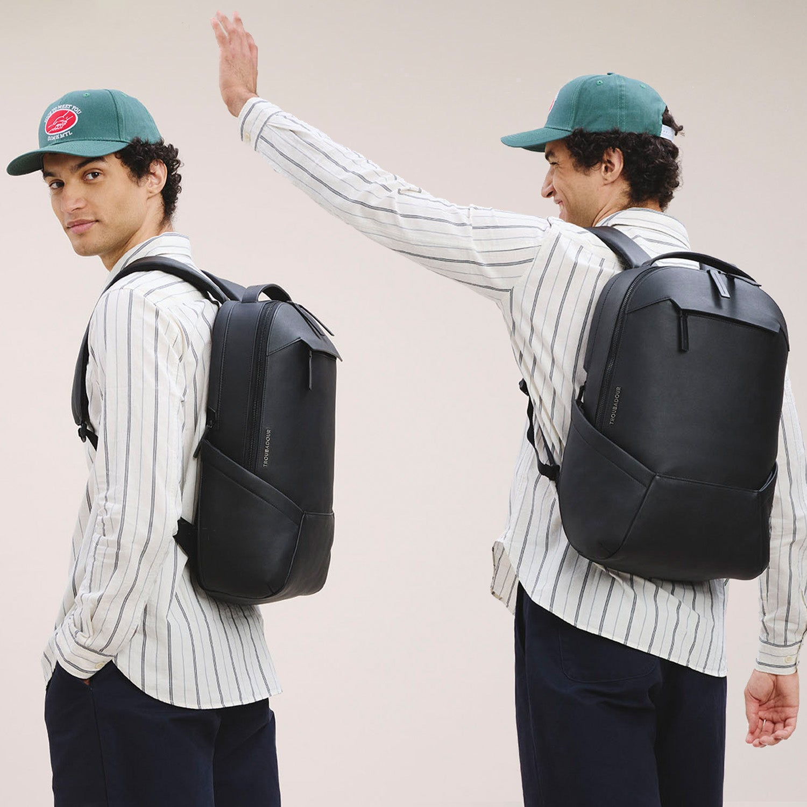
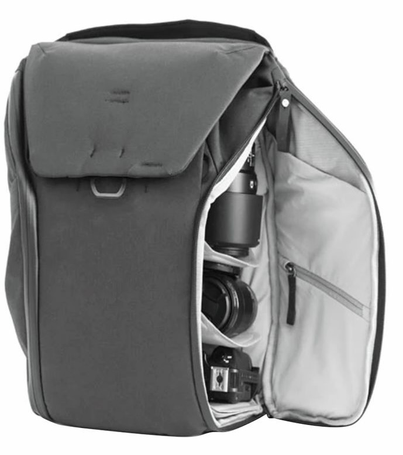
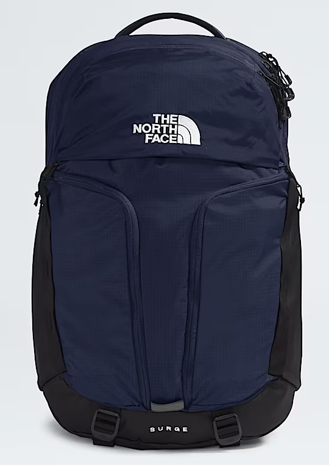
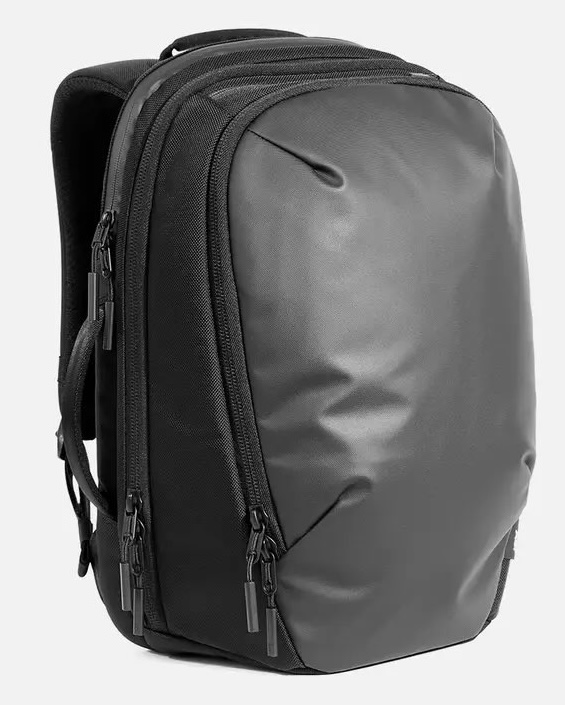
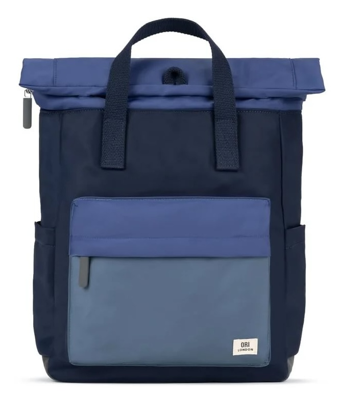
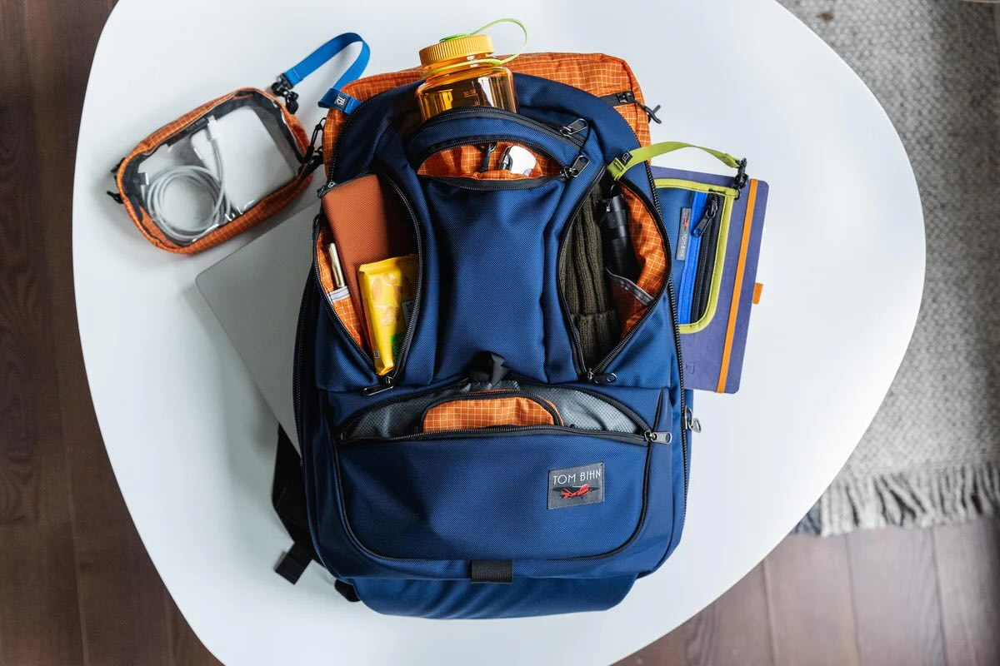
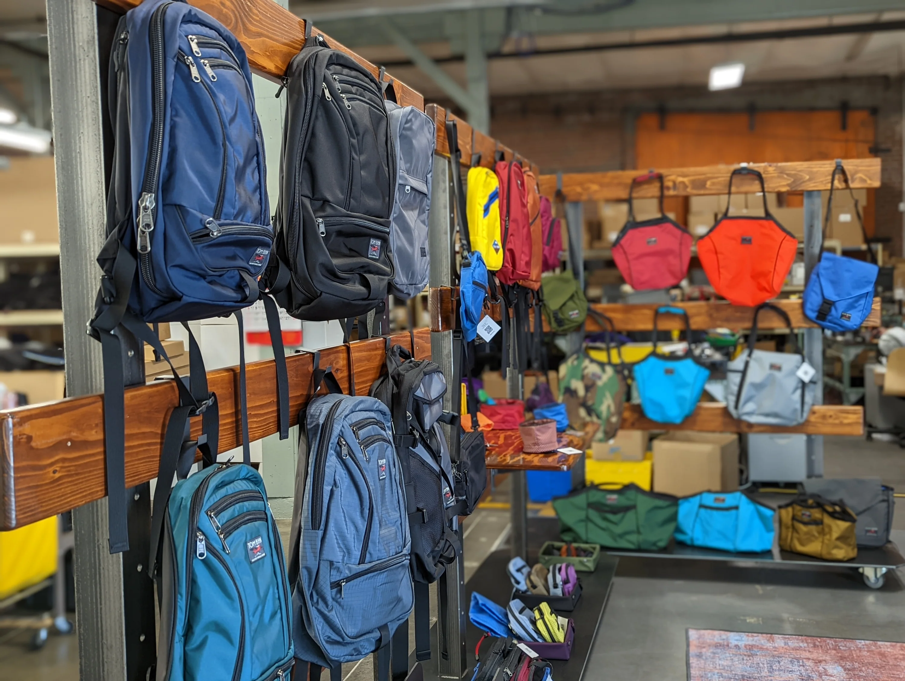
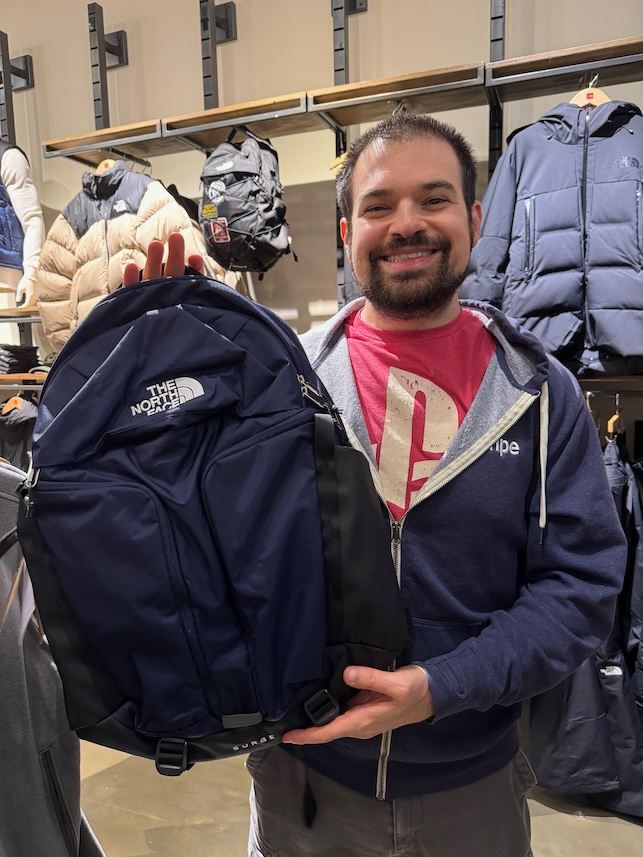

<FinishWhatWeStarted current="backpack-quest" />

My backpack is a vital part of my everyday life. It goes with me everywhere: the office, the city, vacations, hikes, you name it. Since 2015, I've rocked a Tom Bihn [Synapse 25](https://www.tombihn.com/products/synapse-25), which is a superb bit of gear. But over the years, my needs have shifted enough that I've been looking for a new daily driver. It's still a great bag so it hasn't been an urgent search, but I've been slowly scoping out new options.

I say slowly because I've been idly researching packs and making occasional detours to see them in person since at least July 2024. My wife Vicky thought it was a fun side quest at first, but as I've lingered in more and more stores across countless errands and vacations, her patience has started to wear thin. But I use my backpack all the time and keep it for ages, so I didn't want to rush into something!

Because so much of backpack satisfaction comes from the way it fits, seeing my options in person was a necessity. But many of these packs are only sold in niche stores which may not be convenient to get to. Rather than plan outings just for that, I wanted to see them when we were otherwise in the neighborhood, which dragged out the whole process... hence the years-long quest to try on as many packs as possible and maybe, eventually, actually get something.

But as you can guess by the theme of this post, the quest has concluded! It took 7 stores in 5 cities, but we got there. Here's how it went.

## What's not working

Like I said, the Synapse 25 rocks. It's extraordinarily comfortable on my frame, has good weight management, and plenty of thoughtfully designed pockets. But, I've never loved the laptop sleeve.

Back in the bad old days before TSA pre-check, I had to remove my laptop from my backpack when going through security. I could pull it all the way out, but that risked losing or forgetting it. At the time, Tom Bihn had a novel solution to this problem: a laptop sleeve that could be removed from the bag, but stay attached via some little straps:

This was a great idea in theory! It could go through the belt but stay in its sleeve and be attached to a much larger object. But in practice, it was more trouble than it was worth. For one, I got PreCheck a couple of years after getting the bag, so I've rarely had to pull my laptop out. And, when I _have_ needed to pull it out, TSA agents are almost always confused by the setup. They'll insist the laptop still has to come out and go in its own bin or will pick up the backpack, not realizing the laptop is attached. So then I've got a laptop dangling precariously by little straps which is always nerve wracking.

Outside the airport, the zippered sleeve has always been a tight fit for my 15" (and now 16") laptops. Also I don't usually zip the sleeve when it's in the backpack, so it'll occasionally come _really_ unzipped, which is annoying. Plus, because the whole thing clipped in via fabric rails (so it can slide out), there's space behind between the sleeve and my back. If something gets caught back there, it gets really uncomfortable quickly.

Given that I mostly have a backpack to carry a laptop, the laptop sleeve being the bag's weak point has never been ideal. Hence, backpack quest!

## Requirements

To be the one for me, a backpack needed as many of these as possible. In roughly descending order of importance (with the first two being deal breakers), a backpack needed:

- to fit comfortably on my back
- a protective, suspended, integrated laptop sleeve that comfortably fits a 16" MBP
- a tablet sleeve
- a good admin compartment w/ a mix of pocket sizes
- a stash pocket accessible from the outside
- not too many extra straps (& no webbing)
- no roll-down or fold-over closures
- removable (or no) sternum & hip straps
- an ebook sleeve
- a separate laptop compartment from main pocket
- a rolling luggage passthrough

How hard could it be, right?

## The contenders

### Troubadour Apex

The [Troubadour Apex](https://www.troubadourgoods.com/products/apex-backpack?variant=47851803902184) was (and currently still is) the [Wirecutter selection](https://www.nytimes.com/wirecutter/reviews/our-favorite-laptop-backpacks/) for a laptop backpack. It's fancier looking than I'd usually go for, but I tend to trust their recommendations.

Their bag finder said it was available to see in Palo Alto, but the store had weird opening hours so I never made the trip down there. I finally had a chance to see it during an NYC trip in Nov. 2024. First we popped by an Equinox, but they didn't have one in. We finally found one at ONS Clothing in [Nolita](https://en.wikipedia.org/wiki/Nolita), which my entire family was kind enough to visit with me.

I liked the interior pocket organization, but actually getting in and out of the bag was annoying because of the exterior trim and opening shape. Also, the straps pinched my neck when there was weight in the bag (an important thing to check!). So, the Apex was eliminated from contention.

### Peak Design Everyday Backpack

One of Peak Design's most popular models, the [Everyday Backpack](https://www.peakdesign.com/products/everyday-backpack?Size=30L&Color=Black) offered a lot of customizability and a roomy interior.

We saw this one at the [B&H flagship store](https://www.bhphotovideo.com/c/find/shared/nycSuperStore.jsp) on that same New York trip. They describe the store as "part retail landmark, part tech playground" and it's an apt description. It's a huge space full of every gadget you'd like to see, plus the staff are super helpful and there are conveyer belts strung across the ceiling moving products around. It was a cool outing!

I liked the fit of the bag and it felt good while weighed down. It also has an exterior buckle w/ magnets that felt great to use. But, it's primarily designed as a camera bag, with a huge interior that I could use inserts to design however I wanted. In theory that means I could build whatever shape(s) I wanted for my interior organization, but it also was designed for much larger gear than I usually carry (like multiple camera lenses). I also wasn't crazy about the fold-down top. It would work as a fallback, but wasn't going to be my primary choice.

### North Face Surge

In February 2025, I tagged along to an errand at the local REI. While I wouldn't expect the outdoor-focused backpacks REI carries to have a laptop sleeve, I was pleasantly surprised at their selection. There were a variety of brands there, many of which fit my basic requirements.

My favorite of the bunch was the [North Face Surge](https://www.thenorthface.com/en-us/p/bags-and-gear/backpacks/mens-backpacks-298772/surge-backpack-NF0A52SG?color=53Z&size=OS), which was one of the larger models and one that lacked exterior webbing. I also liked its separated laptop compartment, roomy main compartment, and ample exterior organization. But it had a non-removable sternum strap and cinch straps on the bottom, which felt like they'd be unwieldy. Nevertheless, it was in the running.

### AER Tech Pack 3

AER is an SF-based company that makes high-end tech bags. I've got their [city sling](https://www.packhacker.com/travel-gear/aer/city-sling/) and have always been impressed with the build quality, so a visit to their store was on my list.

In March, we were walking through London's [Soho](https://en.wikipedia.org/wiki/Soho) district in March when we stumbled across an AER store! Vicky was especially galled that we were spending time on an international vacation to visit a store that's also 30 min from our house, but at least we didn't have to park in SF. She was _extra_ peeved when I went back to the store to double check and take more pictures, but I think she's since forgiven me.

It was tough to differentiate between the various designs and trim levels, but the [Tech Pack 3](https://aersf.com/collections/backpacks/products/tech-pack-3?country=US) was the most promising option. It had good compartments and nice padding, plus a good build quality. But it had odd "J"-shaped openings for its compartments (the zipper is taller on one side than the other), a carry handle that was set pretty far back, and an appearance I _really_ didn't care for. But none of these were really dealbreakers, so it stays on the table.

### ORI Canfield

The following July, we were in Half Moon Bay's [Fengari](https://fengari.net/) while Vicky looked at yarn. While she was shopping, the [ORI Canfield](https://orilondon.com/collections/canfield-backpacks/products/canfield-b-indigo-tonal-recycled-nylon) caught my eye.

It was beautifully put together and the large zippers moved smoothly. A great laptop sleeve and tons of pockets, too. But I don't love the roll top and the shoulder straps weren't well padded. I liked seeing it, but it wasn't going to beat out the competition.

### Make one from scratch...?

As the quest wore on, Vicky suggested making something from scratch. In addition to her many other skills, she's a whiz with a sewing machine, so I'm confident she could pull it off. Plus Tom MacWright just did [something similar](https://macwright.com/2025/09/27/porteur-bag-2), so it's possible.

But, this approach requires designing a backpack, which I'm not sure I could do well. Plus it's the most labor intensive option by far and probably not any cheaper than buying one (since we'd need a lot of fabric & foam, plus hardware). It would be an option in theory, but it was plan C.

### Tom Bihn Synick

I'd been so happy with my Synapse, it was only natural to want to see their updated model, the [Synick](https://www.tombihn.com/collections/all-tom-bihn-stuff/products/synik-30). They kept a lot of the exterior design I liked and updated the laptop handling, so this seemed very promising.

They're a pretty small company and their bags are only available online... unless you happen to be in Seattle and have a chance to visit their [Seattle factory & showroom](https://www.tombihn.com/blogs/main/re-opening-the-tom-bihn-showroom). Which is exactly what we did in October 2025 during a vacation we didn't (mostly) plan around seeing this backpack.

As expected, the build quality was superb. There's a larger interior pocket than before and they've redone the laptop sleeve. Now it's a zippered mesh pocket on the back wall of the bag complete with a side zipper to allow for easier access. They've also added an internal frame so it stands better on its own.

But, my laptop was a tight fit. Doubly so for the side entrance, which only let the laptop through at specific angles and after a bit of shoving. Plus the mesh wasn't especially protective, holding the laptop in place more than cushioning it. I wasn't about to re-commit to something that wasn't perfect for my laptop. So unfortunately, the Synik wasn't for me.

While we were at the Seattle store, they were kind enough to give us a tour of the factory floor! After seeing so many backpacks, it was awesome to see how they were actually assembled. Well worth doing if you're in the area.

## And the winner is...

The **North Face Surge**!

After paying one extra visit to an outdoor store in Seattle's [University Village](https://uvillage.com/) mall for a final check, I made my decision. It's got the exact right mix of features, design, comfort, and protection for my needs. Reestablishing where everything should go took a little time, but it's been smooth sailing since.

And naturally, I bought it at my local REI.
