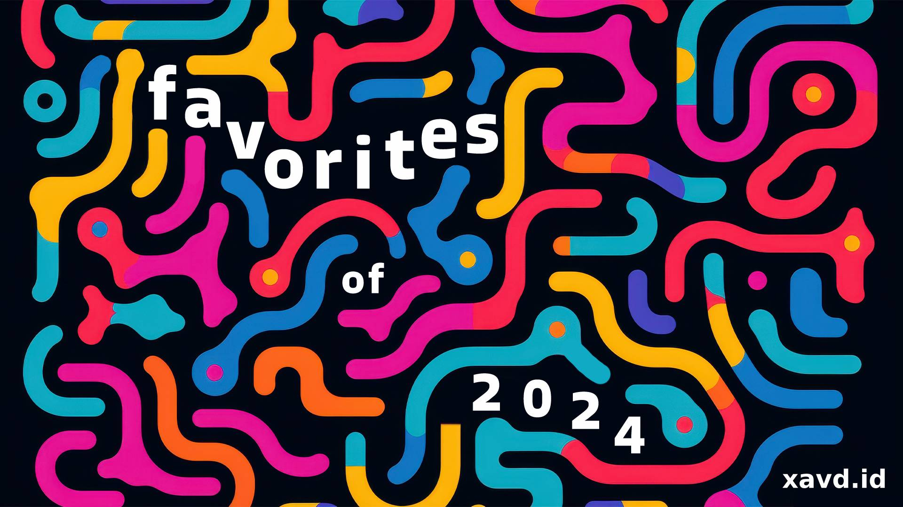

Welcome to my 9th annual "favorite media of the year" extravaganza! It’s unique in a sea of similar roundups because anything that I've played / watched / read for the first time in the calendar year 2024 is eligible (regardless of when it was released). As a result, my picks won't necessarily be dominated by the same titles that have swept similar best-of lists this year. I track all my media throughout the year in service of this post; it's the one people tell me they look forward to every year and it's consistently the project I'm proudest of.

Speaking of proud, this was the first full year I ran my dedicated review site, [david.reviews](https://david.reviews/) and I'm super pleased with the result. I've enjoyed being part of the "slow" media -- not worrying about _content_ or _metrics_, just sharing what I love with the world. I also launched an [articles section](https://david.reviews/articles/) on the site in October, showcasing long-form reviews in addition to the shorter ones I started out with.

Since going live, I've written ~~3~~ 4 (I took a pause on this post to [write a 4th](https://david.reviews/articles/the-roottrees-are-dead-review/)!) longer game reviews. Even more exciting, 3 of those were "professional" engagements, written using free review keys provided by the developer/publisher. My goal in writing long-form articles was to be established enough to earn these review keys, so I'm feeling really good about this direction. That said, playing games and writing about them with deadlines and expectations is definitely different than just playing for fun. I’ll be careful not to turn it into an accidental second job going forward.

Anyway, let's get to the good stuff. Like previous years, I'll be highlighting the media I _enjoyed_ the most from this year. I make no claim these items are objectively the best, but everything on my list surprised and/or delighted me in memorable ways. Riding shotgun once again is the ever-talented [Vicky](https://vickystein.media/), my editor/wife extraordinaire, who helps turn my mental heap of engines and cabooses into organized trains of thought.

Here we go!

---

Table of Contents

{/* START doctoc generated TOC please keep comment here to allow auto update */}
{/* DON'T EDIT THIS SECTION, INSTEAD RE-RUN doctoc TO UPDATE */}

- [Videogames](#videogames)
- [Movies](#movies)
- [TV Shows](#tv-shows)
- [Books](#books)
- [Updates To Previous Picks](#updates-to-previous-picks)
- [Just the List](#just-the-list)
- [Ta Ta For Now](#ta-ta-for-now)

{/* END doctoc generated TOC please keep comment here to allow auto update */}

## Videogames

Of these categories, gaming continues to be my main hobby. This year, I played 69 games/DLCs totaling 694 hours (both up from 67/651 last year). No big changes in my gaming setup this year, though I did upgrade my [Playstation Plus](https://www.playstation.com/en-us/ps-plus/) subscription from the "essential" tier (a couple of free games each month) to "extra" (a GamePass-like catalogue of games) in February because of a coupon.

Having 2 subscription services plus 3 consoles and a PC meant I felt stretched pretty thin. I liked being able to try games risk-free and I _did_ get a lot of value from them -- about half of the games below were from those subscriptions. But any time I was playing a game on one service, I felt like my subscription to the other was going to waste. To that end, I'm making two changes during 2025:

- Buying 0 new games
- Letting my PS+ and GamePass subscriptions lapse (in February and May respectively)

As a result, I'm hoping to have the bandwidth to play and appreciate everything I've already got. I'll miss being able to play the new hot indie (or [Indy](https://en.wikipedia.org/wiki/Indiana_Jones_and_the_Great_Circle)) game without shelling out for it, but I think this is best for me in the short term.

We'll see how those changes affect next year's list. Until then, here are my favorite things I played this year!

### Chants of Sennaar

_Chants of Sennaar_ is an elegantly designed puzzle game about translating unfamiliar glyphs in a Babel-inspired tower. You start with simple words corresponding to things you can see like "open" and "closed". Before long, you're grappling with more abstract concepts, like "love" and "death".

_Sennaar_ really shines when it takes its core mechanic (decoding languages) and applies it to novel puzzle shapes. For example, one area has you mixing alchemy ingredients, a task that depends on correctly translating the elements in the instructions. Other puzzles require being able to translate _between_ languages, a task you can only do if you've done your earlier work correctly.

<YoutubeEmbed youtubeId="__hzPH3tcvA" />

As something of a linguistics nerd myself, I loved how (true to life) the culture of each floor shaped its language and revealed its prejudices and priorities. For example, the people of one floor call themselves "devotees," while another floor refers to the "devotees" instead as "fanatics".

The mark of a great puzzle game is that nothing feels _easy_. Puzzles should always feel challenging, but achievable. _Sennaar_'s buttery smooth difficulty curve did just that. As soon as we had a handle on things, we'd hit a new sentence that forced us to re-examine what we (thought we) knew. The whole game came together in a satisfying adventure that left us hungry for more.

_[Chants of Sennaar](https://www.rundisc.io/chants-of-sennaar/) is available on PC & consoles. I'd recommend a platform you can use a real keyboard with; there's a lot of typing. You can also read my [original review](https://david.reviews/games/chants-of-sennaar/)._

---

### Animal Well

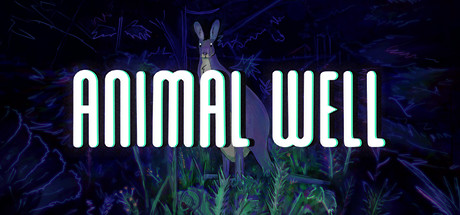

While it may seem like a standard [Metroidvania](https://david.reviews/games/genres/metroidvania/) / platformer on the surface, there's much more to _Animal Well_ than meets the eye. What it lacks in combat it makes up for in just _oodles_ of puzzles. Every square inch of its dense, interconnected map is chock-full of secrets. Some require only some light platforming, while others are the reward at the end of a trail of interconnected clues.

Its distinct blend of [CRT](https://en.wikipedia.org/wiki/Cathode-ray_tube) vibes and fluid pixel art make it easy to hide paths and items in plain sight. Throughout our journey, we were constantly re-evaluating everything we'd seen so far. What used to be meaningless graffiti later became the key to a puzzle we weren't even aware existed at the time. Normally I find backtracking across a map frustrating, but the constant stream of discoveries kept it fun throughout.

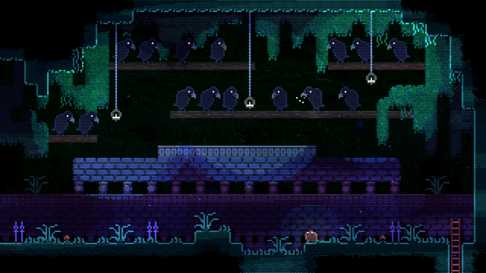

_Animal Well_ did a great job training us to solve its puzzles. For example, certain patterns in vines and walls become obvious once you know what you're looking for, so nothing felt unfairly hidden by the end. That being said, we did end up using a guide for the last ~10 eggs. Some of those suckers are _really_ tricky to find. There are even deeper layers of puzzles we didn't even get to (despite earning every achievement).

I also appreciated the fact that though the overall vibe is a little spooky, it's not _actually_ a scary game. That's good for wimps like me.

_[Animal Well](https://www.animalwell.net/) is available on PC & consoles. You can also read my [original review](https://david.reviews/games/animal-well/)._

---

### The Last of Us Part II

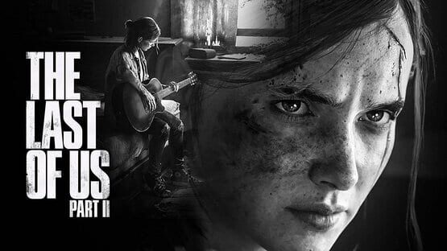

_The Last of Us Part II_ improves on its predecessor in every way. While I enjoyed the TV adaptation of _The Last of Us_ immensely, I was let down by [a recent replay](https://david.reviews/games/the-last-of-us/) of the original game. The story was as superb as I remembered, but the gameplay felt repetitive and dated.[^1] I had never gotten around to playing the divisive sequel and, since the second season of the TV show is imminent, I figured this was the time.

_TLoU2_ manages to extend and expand the story of the first game while improving on every aspect of the zombie-killing gameplay. It's still a lot of stealth and shooting, but all the details are enhanced. Despite there being few enemy types, they feel _real_ and react to the environment exactly like you'd expect. The moment-to-moment gameplay is more engaging, and the whole thing flows better. Furthermore, developer _Naughty Dog_ has continued their commitment to accessibility and gone to [great lengths](https://www.playstation.com/en-us/games/the-last-of-us-part-ii/accessibility/) to ensure everyone can enjoy the game, no matter their skill level.

> note: this video, much like the game, is pretty graphic

<YoutubeEmbed youtubeId="O6MdexNSy3o" />

The enemy AI is wildly impressive. The human characters know each other and all enemies hunt down the source of any sounds you make (like they should). The storytelling also improved, which I wouldn't have thought was possible -- characters are three-dimensional in a way that no other studio has pulled off. Their world feels weathered and lived in as you explore it. Every inch of this game has a staggering amount of detail and care applied to it and it really shows. While I think I still like the first game's story better in isolation, there's no denying part 2 stands tall.

At the end of my Part 1 review, I mentioned that I wouldn't begrudge anyone who watched season 1 of the show instead of playing the game. For Part 2, I couldn't be happier to give the opposite guidance; **play this game**.

_[The Last of Us Part II](https://www.playstation.com/en-us/games/the-last-of-us-part-ii-remastered/) is available now on Playstation and [on PC](https://store.steampowered.com/app/2531310/The_Last_of_Us_Part_II_Remastered/) on April 3rd. The remastered version is a worthwhile upgrade over the original. You can also read my [original review](https://david.reviews/games/the-last-of-us-part-ii/)._

---

### Runner(s) Up

#### Cassette Beasts

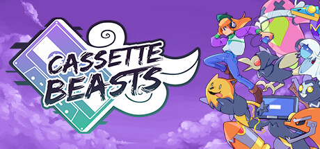

_Cassette Beasts_ feels like if the Pokémon games I loved as a kid kept growing and innovating instead of resting on their laurels. This game stands apart from other "monster collecting" games with its approachable yet wildly customizable battle system and a commitment to charming 90s mixtape culture.

<YoutubeEmbed youtubeId="_OLST_Fw5Ms" />

Every bit of the Pokémon formula is well-refined:

- Battles are exclusively 2v2 and the ability to equip 8 abilities makes for a lot of strategic depth
- Experimenting with new builds is painless thanks to being able to add and remove moves from beasts without penalty.
- The world is large, with tons of secrets to find.
- Gradually unlocked traversal abilities keep exploration exciting.
- There's an actual story with actual emotional stakes, not a Saturday morning cartoon of a plot.

_Cassette Beasts_ does a lot right and very little wrong. More than anything, it captures the parts of Pokémon that I loved the most. More please!

_[Cassette Beasts](https://www.cassettebeasts.com/) is available on PC, Switch, and Xbox. You can also read my [original review](https://david.reviews/games/cassette-beasts/)._

---

#### Cuphead

I don't play a lot of super-tough games (because I usually feel like they're frustrating and unfair), but I'm glad I took a chance on _Cuphead_. It's a small, focused, "[bullet hell](https://en.wikipedia.org/wiki/Bullet_hell)" style game with beautiful 1920s-style animation and music.

<YoutubeEmbed youtubeId="NN-9SQXoi50" />

There are no regular enemies or exploration, just ~20 boss fights. The developer eschewed complicated control schemes and gear setups, so your only actions are move, jump, and shoot. That's important because it leaves more brain power available for the actual fight. Each boss has a series of attacks you need to learn to avoid before you can beat them.

What really sold _Cuphead_ as a favorite this year was the satisfaction that I got from finally beating each boss. While my repeated mistakes definitely tested my patience, the rush of finally nailing a tricky sequence after many failed tries was more exhilarating than I expected. There's also a co-op mode that I didn't try, since this isn't the sort of game my editor goes for.

Now I'm wondering if I should finally take a crack at some of the other classically hard games on my shelf that I've been too intimidated to play...

_[Cuphead](https://cupheadgame.com/) is available on computers and consoles. You can also read my [original review](https://david.reviews/games/cuphead/)._

---

#### Marvel's Midnight Suns

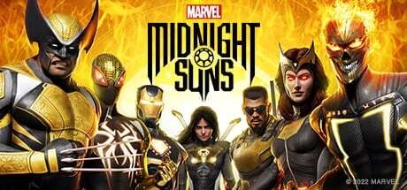

Despite my Marvel fatigue, Midnight Suns felt fresh. It's a hodge-podge of genres that make it hard to describe, but that’s also what makes it so unique.

<YoutubeEmbed youtubeId="SXmBUDIMvJQ" />

At its core, _Midnight Suns_ is a tactical (like [XCOM](https://david.reviews/games/xcom-enemy-unknown/)) deck-building game (like [Thronebreaker](https://david.reviews/games/thronebreaker-the-witcher-tales/)) with battles like [Slay the Spire](https://david.reviews/games/slay-the-spire/) and inter-mission dialogue / exploration like [Fire Emblem: 3 Houses](https://david.reviews/games/fire-emblem-three-houses/).

One of the best aspects of the game was the emphasis on positioning during battles. Because enemies take damage when they're knocked into each other (or environmental hazards), launching your attacks from beneficial directions is key to success. Boss battles were also a highlight. Most enemies are generic henchmen, but there's a small cast of recognizable Marvel villains who bring unique challenges to their fights to help those climactic moments stand out.

Besides battles, I loved tuning, upgrading, and improving each character's deck. As someone whose favorite part of [Magic](https://en.wikipedia.org/wiki/Magic:_The_Gathering) was collecting and organizing decks of cards, this part really spoke to me.

I know it sounds like a lot, but implausibly, the whole thing _works_. Its large cast is unshackled from the baggage of the MCU, giving them some space to breathe.[^2]

For sort of understandable reasons, I think _Midnight Suns_ didn't do well commercially. It's too bad, because (despite its Marvel pedigree) it felt remarkably original. Eric Switzer writing for thegamer.com [captured](https://www.thegamer.com/marvels-midnight-suns-trial-dlc-poor-sales-tactics/) my feelings well: "I Will Never Forgive Gamers If They Let Marvel's Midnight Suns Fail".

_[Marvel's Midnight Suns](https://midnightsuns.2k.com/) is available on PC, Playstation, and XBox. You can also read my [original review](https://david.reviews/games/marvels-midnight-suns/)._

---

### Honorable Mention(s)

- _[Shovel Knight: King of Cards](https://www.yachtclubgames.com/games/shovel-knight-king-of-cards)_, for being probably my favorite of the Shovel Knight campaigns. The story is the silliest and it was fun to play as a character with some bulk. I also loved the surprisingly involved sidequest card game.
- _[Tactical Breach Wizards](https://store.steampowered.com/app/1043810/Tactical_Breach_Wizards/?curator_clanid=45203122)_, for not forgetting to have fun. I wrote about this in [much more detail](https://david.reviews/articles/tactical-breach-wizards-review/) but _TBW_'s commitment to letting me throw dudes out windows never got old.
- _[Plucky Squire](https://thepluckysquire.com/)_, for its outstanding visual design. I wanted a little more from the gameplay, but the storybook setup was a treat.
- _[PowerWash Simulator](https://powerwash-simulator.square-enix-games.com/)_, for being the best "podcast game" I've ever played. Listening to podcasts while playing isn't something I had tried much before. But after nearly 40 hours of _PWS_, I might just be a convert. Its simple and satisfying gameplay (cleaning objects) is engaging, but not so demanding that I can't concentrate on someone talking at me. It helped me run through the entire [Family Trips](https://pod.link/1693673771) back catalogue (which I also recommend).
- _[Lil Gator Game](https://www.playtonicgames.com/game/lil-gator-game/)_, for distilling down the best parts of Breath of the Wild. It kept the good things (free climbing, rewarding you with stamina), mostly removed the combat, and fixed the inventory management. Meanwhile, it added fun new abilities and a strong dash of charming storytelling a la [A Short Hike](https://david.reviews/games/a-short-hike/).
- _[The Looker](https://www.subcreationstudio.com/the-looker)_, for being fun while perfectly parodying what is, by all rights, a pretty good game (previous honoree [The Witness](https://david.reviews/games/the-witness/)). It doesn't pull any punches about the Witness' style of story (if you can call it that) or its [somewhat notorious creator](https://en.wikipedia.org/wiki/Jonathan_Blow#Public_image).

<MediaYearLink items="games" verbed="played" year="2024" />

  {/* prettier-ignore */}
  <em>You can also [see this list](https://store.steampowered.com/curator/45203122-david.reviews/list/140256) on my Steam curator page (which you should follow!)</em>

## Movies

I only watched 104 movies total this year, 52 of which were first-time watches; just 2 of them were in a movie theater. It was definitely a down year for my movie watching overall -- we did a lot more TV and games. Good news though: a weaker field means it's anyone's ~~game~~ movie!

### Ruthless People

After listening to the audiobook memoir for writing team [ZAZ](https://en.wikipedia.org/wiki/Zucker,_Abrahams_and_Zucker)'s _Airplane!_, I was excited to watch another of their more narrative films: 1986's _Ruthless People_. Its packed cast (Danny DeVito! Bette Midler! The film debut of Bill Pullman!) weaves its way through a truly sinister comedy of errors. This movie has everything: blackmail, mistaken identity, kidnapping, ransom, and more.

If that's all it was, it would be a great movie. But it secures a win in this category by going a step further. Buried in this comedy is some oddly touching writing about self worth, relationships, and some interesting introspection on class in 1980s LA. Its more serious notes never detract from the comedy. I was surprised I hadn't heard of this before now. Do yourself a favor and seek it out!

_[Ruthless People](https://www.justwatch.com/us/movie/ruthless-people) is available for purchase. You can also read my [original review](https://david.reviews/movies/ruthless-people-1986/)._

---

### My Old Ass

_My Old Ass_ does a lot with a little. It's a small (and mostly young!) cast and has a brisk 89 minute runtime. No stunts, no CGI sequences, but real humans on camera telling a short, bittersweet coming-of-age story about love. I guess it's also technically sci-fi? It stars Maisy Stella who can, inexplicably, communicate with her future self (Aubrey Plaza). We watch the two of them bond and explore this unusual relationship. The dialogue is tight and funny, with plenty of oblique jokes about what the future holds.

I liked the pacing – the old and young versions have time to get to know each other (in contrast to many movies where a character talks to another version of themselves, when it's usually frantic and time-limited). Director Megan Park got a great performance out of Plaza especially, who breaks out of the sardonic characters she's known for. Much like [Yesterday](https://david.reviews/movies/yesterday-2019/), it doesn't concern itself too closely with like, explaining exactly why/how this cross-time communication has happened. Instead they focus on the emotional journey of the characters, which I found a perfectly reasonable tradeoff.

_[My Old Ass](https://www.justwatch.com/us/movie/my-old-ass) is streaming on Prime video and is available for purchase. You can also read my [original review](https://david.reviews/movies/my-old-ass-2024/)._

---

### Runner(s) Up

#### The Menu

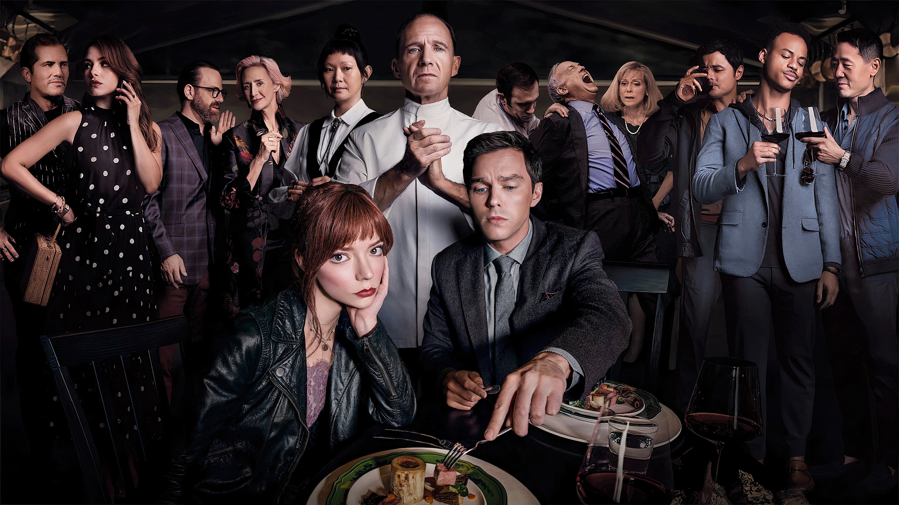

I like my comedies how I like my coffee: dark.[^3] Ralph Fiennes and Anya Taylor-Joy lead an impressive ensemble in this unsettling comedy about class hierarchy. It plumbed the depths of our devotion to craft and what we're willing to do to each other to attain it. Thematically it actually felt a lot like a [darker ratatouille](https://www.youtube.com/watch?v=eigqujpiIPI). No, _darker_.

_[The Menu](https://www.justwatch.com/us/movie/the-menu-2022) is available for purchase. You can also read my [original review](https://david.reviews/movies/the-menu-2022/)._

---

### Honorable Mentions

- _[Wicked](https://www.justwatch.com/us/movie/wicked-2021-0)_, for making a Broadway musical feel larger than life. Nobody films spectacle better than John M. Chu!
- _[Rivals: Ohio State vs. Michigan](https://www.imdb.com/title/tt22937658/)_, for being a fun/informative look at the nature of rivalries and the history of [The Game](https://en.wikipedia.org/wiki/Michigan%E2%80%93Ohio_State_football_rivalry). The editing is great and the whole thing is narrated by the inimitable J. K. Simmons, who is an excellent voice for the story (even if he roots for the wrong team). Was a great watch during one of the best Michigan Football years in a while.[^4]
- _[Deadpool & Wolverine](https://www.justwatch.com/us/movie/deadpool-3)_, for being _fun_. Though my Marvel fatigue has set in, _D&W_ felt a little more like the "good old days" with a movie that had genuine heart. Deadpool as a character usually grates on me, but this felt like a love letter to the franchise and I really enjoyed it for that.
- _[Knock at the Cabin](https://www.justwatch.com/us/movie/knock-at-the-cabin)_, for gluing me to my seat. I loved the combination of world-ending stakes combined with what is functionally a [bottle episode](https://en.wikipedia.org/wiki/Bottle_episode), with all the characters in one room. There are great performances out of Bautista and now-Tony winner Jonathan Groff, plus the whole thing is a tight 100 minutes. It's a nice, focused outing.

<MediaYearLink items="movies" verbed="watched" year="2024" />

## TV Shows

In 2024, I finished 39 new seasons of TV spanning 420 episodes (approx. 207 hours worth); all slightly up from last year. Most of that increase was driven by a _lot_ of Taskmaster, which has been our go-to comfort show. We'll catch up eventually, but we're not binging it too much.

### Shrinking

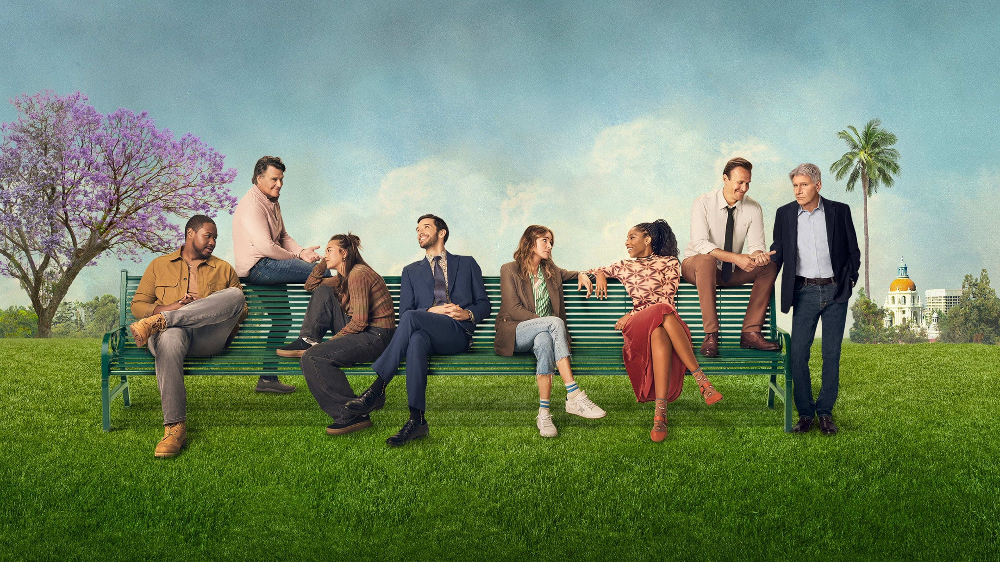

A devastating comedy about the emotional fallout after the death of a wife doesn't sound like it'd be an uproarious good time, but it works?? I'm not sure how Bill Lawrence (of _Scrubs_ and _Ted Lasso_ fame) manages to keep pulling it off, but he sure does. _Shrinking_ oscillates between joy and despair with frightening ease. They're not afraid to show the whole of a character. The casting is great across the board, but I feel like Jason Segel, Jessica Williams, and Harrison Ford all really punched above their weight.

Much like _Cougar Town_ before this, Lawrence & co peddle the ultimate adult fantasy: a stable, supportive, snappy friend group who are always in each other's business. It's a vibe that reminds me of college, where most of my friends were in the same square mile: I miss it dearly. At least I get to live vicariously through this gang instead.

I ran through both seasons this year (catching up on the first and watching the second as it aired) and I'm hungry for more. Just such a pleasant / heartbreaking rollercoaster of a show.

_[Shrinking](https://tv.apple.com/us/show/shrinking/umc.cmc.apzybj6eqf6pzccd97kev7bs) is available on Apple TV+_

---

### Runner(s) Up

#### A Man on the Inside

Mike Shur & co have done it again! Ted Danson's outing as a spy infiltrating an assisted living facility manages to be both hysterical and heartfelt. It deals with some unusual themes in American TV: aging gracefully, child/parent relationships in their later years, and loneliness. It also takes place in San Francisco without portraying the whole city as tech central. Once again it's just the City By The Bay that I remember from shows like _Monk_, which is charming. Stephanie Beatriz has a killer supporting role, too. _Editor's note: We love her._

_[A Man on the Inside](https://www.netflix.com/title/81677257) is available on Netflix._

---

#### Blue Eye Samurai

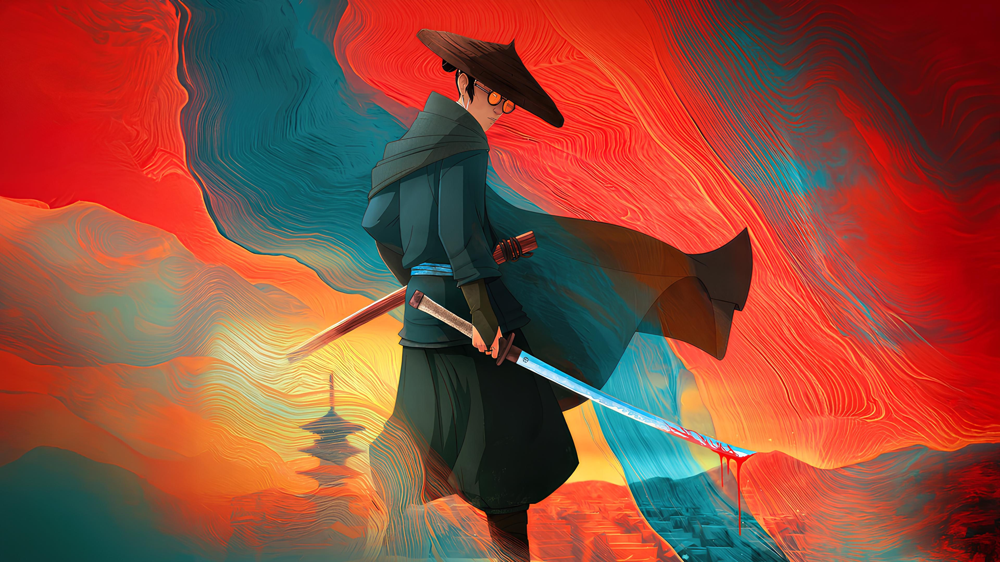

I don't watch much anime, but I was drawn into Blue Eyed Samurai's mix of beauty and brutality. It follows Mizu, a female samurai undercover as a man in [Edo](https://en.wikipedia.org/wiki/Edo_period) Japan. She's hunting down the last 4 white men left in the country after the borders were closed. It eschews many anime tropes in favor of a more grounded presentation like you'd find in a typical HBO show. But there's still space for a fun sidekick, some political intrigue, and some extremely cool fight sequences. It gets pretty intense, so proceed with caution.

_[Blue Eye Samurai](https://www.netflix.com/title/81144203) is available on Netflix._

---

### Honorable Mention(s)

- [Scott Pilgrim Takes Off](https://www.justwatch.com/us/tv-show/scott-pilgrim-the-anime), for being a delightful love letter to the original comics & movie. It's a semi-sequel-sort-of that hits all the right notes. It's also wild that they got the entire movie cast back, since it's my go to example when talking mentioning "I can't believe they got all those people in one movie together".
- _[The Bear](https://www.justwatch.com/us/tv-show/the-bear) S2, episodes 6 & 7_, for being 60 straight minutes of pure, uncut family stress followed by a beautiful moment of growth for a character you weren't sure had it in them. The show had its ups and downs, but this pair of episodes will go down in television history as an all-time experience.
- _[Dark Matter](https://tv.apple.com/us/show/dark-matter/umc.cmc.4luj45vtqpmjsvb6sc2675oeg)_, for being a chilling adaptation of one of my favorite books from [2020](/blog/post/favorite-media-2020/#dark-matter). The book's author ([Blake Crouch](https://david.reviews/books/authors/blake-crouch/), frequently mentioned in these awards) wrote the adaptation too, so it's no surprise it was great.
- _[Star Trek: Lower Decks](https://www.justwatch.com/us/tv-show/star-trek-lower-decks)_, for sticking the landing after 5 great seasons. Its characters grew and the writers weren't afraid to enact lasting change upon them!

<AirtableLinkAndReturn
  items="shows"
  verbed="watched"
  year="2024"
  link="https://airtable.com/appgycccClQwN0zHz/shrSLYhARjv5tZyfc"
/>

## Books

I finished 16 new books this year (plus 2 re-reads, which aren't eligible for awards). That's about consistent from last year, but was bolstered by a _lot_ of reading on our belated honeymoon. Nothing beats a book on the beach and an empty afternoon.

The rest of the year, I do a few pages in bed before I fall asleep, which is not a particularly efficient way to consume literature. I'll probably try to carve out some more intentional reading time going forward, since I _do_ like it. Plus I've finally reached podcasts-backlog-zero, so I'll be doing more audiobooks (but for real this time).

### Death's End

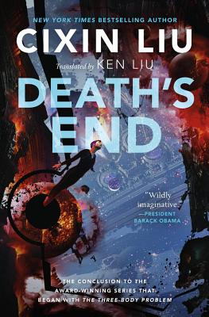

Cixin Liu's _Three Body Problem_ trilogy is highly regarded in the sci-fi community, but I didn't really appreciate why until now. The first book was too slow for my tastes, the second picked up steam (enough to earn it an honorable mention [last year](/blog/post/favorite-media-2023/#honorable-mentions-3)), and the third was totally engrossing. All of these wild concepts he spent two books setting up finally get their payoffs across all of time and space. The book jumps forward in time a number of times, so we really get to see how everything plays out for the large cast. The prose and characters never really got better, but I loved the journey.

It's sort of tough to recommend you read the conclusion of a trilogy, but it's worth the effort! That said, if you're interested but not willing to commit to the books (and I don't really blame you!) it's been adapted a few times. I liked the Netflix version (which covers book 1 and part of book 2, with more on the way). I've also heard good things about the Chinese adaptation, [Three-Body](https://en.wikipedia.org/wiki/Three-Body), which seems to just cover the first book.

---

### First Lie Wins

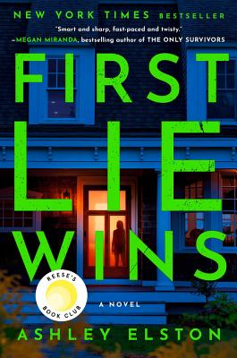

Thrillers always describe themselves as "page turners", but Ashley Elston's _First Lie Wins_ really earns that description. It follows Evie Porter who, it turns out, doesn't exist. She's a woman who's worked hard to escape her past, forging a new identity for each of her information-gathering missions before disappearing off to the next one. When her past starts to catch up to her (with deadly consequences) she's got to figure out who she can trust. This was one of my aforementioned honeymoon books and I tore through it. I loved the amount of detail we get around her espionage, and the snippets of her past she doles out to the reader.

---

### Runner(s) Up

#### The Tainted Cup

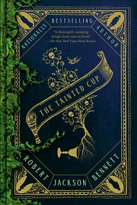

Author Robert Jackson Bennett is no stranger to this award, having won it [last year](/blog/post/favorite-media-2023/#foundryside) too. _The Tainted Cup_ is a slick combination of Sherlock Holmes crossed with [Pacific Rim](https://david.reviews/movies/pacific-rim-2013/). Din(ios) Kol is an engraver, a person augmented to be able to record and recall information perfectly. When trees start bursting violently and mysteriously from people's chests, Din is paired up with renowned investigator and all-around weirdo Anagosa Dolabra to solve the case. Along the way, Din learns more about the empire he's only seen bits of, comes into his own as an investigator, and works to ensure his closely held secrets won't come to light.

There's a lot of great fantasy worldbuilding at play, and the society Bennett came up with always felt original. The worst thing about it is how many new terms and concepts it throws at you with basically no context. But, if you don't mind gleaning a _lot_ from context clues, it's a really fun read. A glossary up front would have gone a long way, but it was engrossing nonetheless.

---

#### Tomorrow, and Tomorrow, and Tomorrow

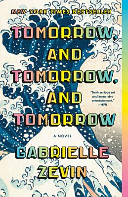

_Tomorrow, and Tomorrow, and Tomorrow_ is Gabrielle Zevin's touching story about love and loss following a pair of young game designers throughout their lives. Neither of them are particularly likable, but they're flawed and interesting. The book does a great job showcasing all the sorts of love people can have for each other: romantic, professional, lustful, platonic, and more. It's also unusually well informed about the nitty-gritty of the games industry. Hilarious and sad and heartfelt and intense and good. Not the sort of thing I usually read, but I'm glad I did!

---

### Honorable Mention(s)

- _Dark Deeds_, the third (and [final](http://www.mikebrooks.co.uk/2019/06/im-signed-by-orbit/)?) book of Mike Brooks' _Keiko_ trilogy, for breaking free of its heavy Firefly inspiration to do its own heist/spy thing. The whole series is good, but this was my favorite.
- _Orconomics_, by J. Zachary Pike, for managing to both parody and exemplify the fantasy genre. It's economics meets D&D and it’s terrific popcorn fantasy.

<MediaYearLink items="books" verbed="read" year="2024" />

## Updates To Previous Picks

- _The Case of the Golden Idol_ has a sequel out: [Rise of the Golden Idol](https://david.reviews/games/the-rise-of-the-golden-idol/). It's more of the same, but a worthy sequel. There's DLC coming this year too!
- _Factorio_'s [Space Age](https://store.steampowered.com/app/645390/Factorio_Space_Age/) DLC released! I haven't had a chance to dive in yet, but I've heard good things.
- _Knives Out_'s third installment, _Wake Up Dead Man_ has wrapped filming and is releasing in 2025 on Netflix!
- _[Chained Echoes](https://david.reviews/games/chained-echoes/)_ is getting [paid DLC](https://store.steampowered.com/app/3350260/Chained_Echoes_Ashes_of_Elrant/) this summer.
- Benjamin Stevenson has released two sequels to _[Everyone in My Family Has Killed Someone](https://david.reviews/books/everyone-in-my-family-has-killed-someone/)_: one set on a train and another Christmas-y one. I liked the former and am saving the latter for holiday 2025.
- _Only Murders in the Building_'s 4th season was also good!

## Just the List

Click to expand

<ul className="tight-list">

- Games
  - [Chants of Sennaar](https://www.rundisc.io/chants-of-sennaar/)
  - [Animal Well](https://www.animalwell.net/)
  - [The Last of Us Part II](https://www.playstation.com/en-us/games/the-last-of-us-part-ii-remastered/)
  - Runner(s) Up:
    - [Cassette Beasts](https://www.cassettebeasts.com/)
    - [Cuphead](https://cupheadgame.com/)
  - Honorable Mention(s):
    - [Shovel Knight: King of Cards](https://www.yachtclubgames.com/games/shovel-knight-king-of-cards)
    - [Tactical Breach Wizards](https://store.steampowered.com/app/1043810/Tactical_Breach_Wizards/?curator_clanid=45203122)
    - [Plucky Squire](https://thepluckysquire.com/)
    - [PowerWash Simulator](https://powerwash-simulator.square-enix-games.com/)
    - [Lil Gator Game](https://www.playtonicgames.com/game/lil-gator-game/)
    - [The Looker](https://www.subcreationstudio.com/the-looker)
- Movies
  - [Ruthless People](https://www.justwatch.com/us/movie/ruthless-people)
  - [My Old Ass](https://www.justwatch.com/us/movie/my-old-ass)
  - Runner(s) Up:
    - [The Menu](https://www.justwatch.com/us/movie/the-menu-2022)
  - Honorable Mention(s):
    - [Wicked](https://www.justwatch.com/us/movie/wicked-2021-0)
    - [Rivals: Ohio State vs. Michigan](https://www.imdb.com/title/tt22937658/)
    - [Deadpool & Wolverine](https://www.justwatch.com/us/movie/deadpool-3)
    - [Knock at the Cabin](https://www.justwatch.com/us/movie/knock-at-the-cabin)
- TV
  - [Shrinking](https://tv.apple.com/us/show/shrinking/umc.cmc.apzybj6eqf6pzccd97kev7bs)
  - Runner(s) Up:
    - [A Man on the Inside](https://www.netflix.com/title/81677257)
    - [Blue Eye Samurai](https://www.netflix.com/title/81144203)
  - Honorable Mention(s):
    - [Scott Pilgrim Takes Off](https://www.justwatch.com/us/tv-show/scott-pilgrim-the-anime)
    - [The Bear](https://www.justwatch.com/us/tv-show/the-bear) S2, episodes 6 & 7
    - [Dark Matter](https://tv.apple.com/us/show/dark-matter/umc.cmc.4luj45vtqpmjsvb6sc2675oeg)
    - [Star Trek: Lower Decks](https://www.justwatch.com/us/tv-show/star-trek-lower-decks)
- Books
  - [Death's End](https://us.macmillan.com/books/9780765386632/deathsend/) by Cixin Liu
  - [First Lie Wins](https://ashleyelston.com/books/first-lie-wins/) by Ashley Elston
  - Runner(s) Up:
    - [The Tainted Cup](https://www.penguinrandomhouse.com/books/648051/the-tainted-cup-by-robert-jackson-bennett/) by Robert Jackson Bennett
    - [Tomorrow, and Tomorrow, and Tomorrow](https://gabriellezevin.com/tomorrowx3/) by Gabrielle Zevin
  - Honorable Mention(s):
    - [Dark Deeds](https://www.simonandschuster.com/books/Dark-Deeds/Mike-Brooks/Keiko/9781534405448) by Mike Brooks
    - [Orconomics](https://jzacharypike.com/pages/orconomics) by J. Zachary Pike

</ul>

## Ta Ta For Now

And there we have it! It's been a blast compiling this, per usual. In these weird times, let's continue to fill our spare time with things we enjoy.

Thanks as always to [Vicky](https://vickystein.media/) for her strengthy[^5] editing and to my sister [Karen](https://www.karenbrownman.com/) for putting together a lovely header image even while globetrotting.

If you're interested in reading my little reviews throughout the year, I've been posting them to my [personal mastodon account](https://mastodon.social/@xavdid), the a dedicated [bluesky account](https://bsky.app/profile/david.reviews), and (where applicable) my [Steam curator](https://store.steampowered.com/curator/45203122-david.reviews/). While I like the idea that everyone will subscribe to [my RSS feeds](https://david.reviews/feeds/), I'm also pragmatic about meeting readers where they are.

As always, If you've got recommendations for me, don't hesitate to [reach out](/contact).

[^1]: Note that I played the PS4 version which was a remaster of the PS3 original. There was also a full PS5 remaster dubbed "Part 1", but I wasn't about to shell out $70 for a game I already owned.

[^2]: Though, some of the performances come across like they've captured the MCU actors' [stunt doubles](https://youtu.be/iwV61t_Tec8?t=23).

[^3]: is what I would say if I liked coffee, anyway

[^4]: An ok record for the 2024 season, but also a national championship last January and an unexpected win over eventual champions OSU in November!

[^5]: A word that she knows isn't real, but wanted to include anyway
