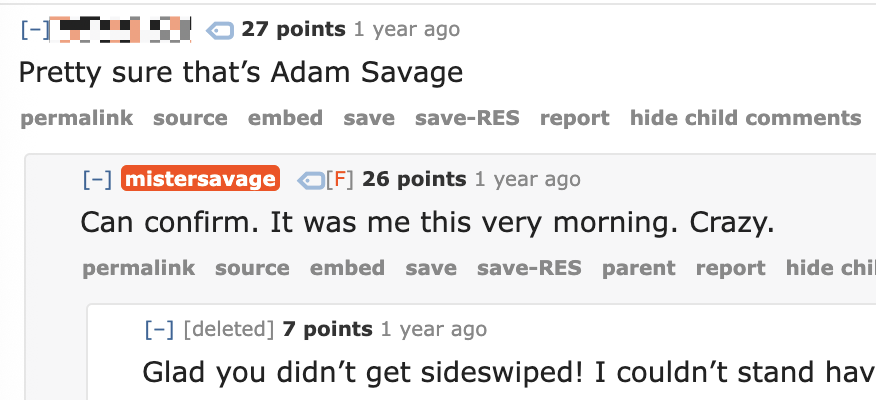
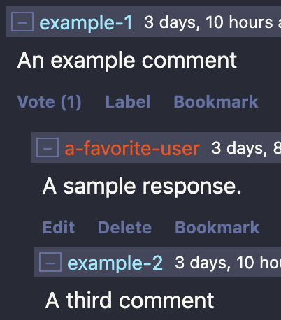

The most underrated Reddit feature is the ability to mark an account as a "friend". There's no approval or notification or anything. You just hit a button and their username will light up any time you come across one of their posts or comments:



Recognizing users is the difference between attending a party where you don't know anyone and bumping your friends in a crowd. It goes a long way to making a site feel like a _community_, not just a bunch of people talking at each other.

It's a simple feature and I'm always surprised other online communities like [Lobsters](https://lobste.rs/) and [Tildes](https://tildes.net/) haven't cribbed it. And, with the recent announcement that Tildes was [officially in maintenance mode](https://tildes.net/~tildes.official/1vjt/any_significant_changes_to_tildes_are_extremely_unlikely), it was time to implement this myself. In a world that feels increasingly inauthentic, making human connections online is feels more important than ever.

## User styles to the rescue!

There's a class of browser extension that let you apply custom CSS to any website (originating with [Stylish](<https://en.wikipedia.org/wiki/Stylish_(software)>), but there are lots of options today; I prefer [Stylus](<https://en.wikipedia.org/wiki/Stylus_(browser_extension)>)). If we wrote styles that targeted links to the profile of any user we wanted to follow, then we could highlight them everywhere they appear on each site.

So, I made a tool for exactly that! It's called **[rolodex](https://github.com/xavdid/rolodex)**. It's a little CLI tha reads a `toml` file full of usernames:

```toml
# tildes.toml
users = [
  { username = "a-favorite-user" },
  # ...
]
```

and generates all the CSS needed to highlight when that user authors something:

```css
/* THIS IS A GENERATED FILE */
/* Any manual changes will be overwritten */

.comment-header > a.link-user[href$="/a-favorite-user"],
.topic-info-source > a.link-user[href$="/a-favorite-user"],
.topic-full-byline > a.link-user[href$="/a-favorite-user"] {
  color: #ff4500;
}
```

Once you paste the file into Stylus, that user is highlighted as you browse:



Right now, it works with [Tildes](https://tildes.net/) and [Lobsters](https://lobste.rs/), but I'll likely add HN support as well.

## Build your own

This project started as a way to track these users lists for myself, but I realized pretty early that I wanted to separate my personal user list from the code responsible for processing it. To that end, I've also got a template repo with starter `toml` files and a a little wrapper script to install the CLI, run the build, & copy the results: **[xavdid/rolodex-template](https://github.com/xavdid/rolodex-template)**

## We haven't won yet

While slightly cumbersome process is better than than nothing, it does have some drawbacks:

- changing highlighted users means editing a local file, running a script, and uploading the result. That's cumbersome at best and many users won't bother at all
- there are limited syncing options
- mobile support isn't great
- reddit builds you a feed for all the pots / comments by users you follow. That doesn't happen with pure CSS

Nothing beats a native implementation, so if you're building / maintaining a social network, please consider adding following as a feature!
