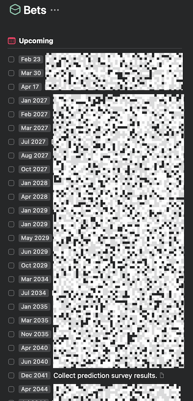

After the [arrival of our daughter Beatrice](/blog/post/first-day-of-the-rest-of-my-life), we've been talking a lot about the world she's entering. There's a lot of change happening quickly and it's hard to know what everything will look like next week, much less in the years to come.

The question we kept coming back to is **whether or not baby Bea will ever learn to drive**. Will it be standard rite of passage, like it is for American 16 year olds today? Or will it be seen as a quaint skill, totally obviated by self-driving cars and public transit? I honestly have no idea. 16 years is a long time and anything can happen.

Lucky for me, I love big bets (and I cannot lie). I regularly set myself reminders for 10+ years in the future to see how something turned out. I've got a ton of them stashed away in [Things](https://culturedcode.com/things/):

So we decided to combine this love of very long time horizons with our questions about our baby's life; **a survey was born**! We're looking for predictions about the world of 2041.

The survey is short, interesting, an covers a variety of topics I'm interested in. Each question is designed to be measured objectively. In 16 years, I'll check the answers and we'll see who the best predictor was!

The survey can be found here:

<BigLink href="https://xavdid.fillout.com/predictions" />

Hit us with your best estimates and boldest predictions!
